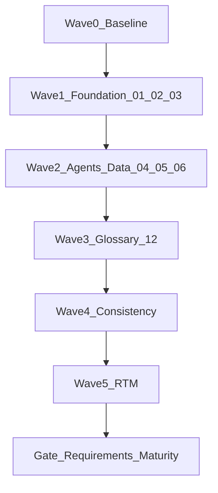

# Agentic Development Plan — Requirements Maturity Phase

**Project:** Project Aegis (cmano-clone) — near-future military simulation  
**Phase:** Requirements Maturity  
**Date:** June 4, 2026  
**Approval Status:** Approved for execution — sprint program [production/milestones/post-mvp-requirements-program.md](production/milestones/post-mvp-requirements-program.md) (Sprints 11–15, 2026-06-04)

## Objective

Close remaining gaps in the **20** requirement documents under `Game-Requirements/requirements/`, align cross-document references, and refresh the requirements traceability matrix (RTM). Do **not** bulk re-write docs that are already mature unless a consistency pass finds contradictions.

**Prerequisite artifacts:**

- [docs/architecture/requirements-traceability.md](docs/architecture/requirements-traceability.md)
- [docs/superpowers/specs/](docs/superpowers/specs/) (locked decisions for 02–04, 06)
- [production/agentic/pi-plan-completion-2026-06-04.md](production/agentic/pi-plan-completion-2026-06-04.md) (parallel implementation program — **COMPLETE**; reuse its execution model for docs only)

**Follow-on (out of scope for this phase):** GDD authoring for requirements 01–12 via `/map-systems` and `/design-system` per RTM gap notes.

---

## Current-State Snapshot (June 4, 2026)

Audit of `Game-Requirements/requirements/*.md`:

| Tier | Count | Files |
|------|-------|-------|
| Fully expanded | 13 | 07–11, 13–20 |
| Partial (missing sections / weak cross-links) | 5 | 02–06 |
| Stub / minimal | 2 | 01, 12 |

**In scope for this phase:** 01, 02–06, 12 (7 files).

**Non-goals:**

- Do not re-expand 07–11 or 13–20 unless the consistency pass reports BLOCKER conflicts
- Do not implement code in this phase (documentation only)
- Do not start GDD authoring for 01–12 in this phase

---

## Global Rules for All Agents

Adapted from [pi-todos-impl-plan.md](.claude/docs/agentic/pi-todos-impl-plan.md) for documentation work.

| Rule | Application |
|------|-------------|
| **User approval before Write/Edit** | Show draft summary; ask: *May I write this to `[filepath]`?* |
| **Hindsight recall first** | `.\tools\hindsight\Invoke-Hindsight.ps1 -Operation recall -BankId dev-cmano-clone -Query "requirements doc [NN] prior decisions"` |
| **Hindsight retain on wave complete** | Coordinator retains `[OUTCOME:]` summary of locked decisions and open items |
| **GitNexus** | Only when editing **Implementation Mapping** sections that cite code symbols (docs 13, 17). Before changing a symbol name: `gitnexus_impact({ target: "<symbol>", direction: "upstream" })`. If HIGH/CRITICAL, stop and report. Handoff: `gitnexus_detect_changes()` when mappings were touched |
| **No parallel edits on one file** | One agent owns one file per wave; see [coordination-rules](.claude/docs/coordination-rules.md) |
| **Handoff format** | Each agent reports: files touched, decisions locked, open items, downstream dependencies |

---

## Agent Workstreams (Studio Roster)

Replace ad-hoc sub-agents with named studio agents and **non-overlapping file ownership**.

| Workstream | Studio agent(s) | Owned files | Primary skills |
|------------|-----------------|-------------|----------------|
| **Coordinator** | `producer` | Plan status, wave scheduling, final merge review | User approvals; adapted consistency pass |
| **Foundation design** | `game-designer`, `systems-designer` | `01-Project-Overview.md`, `02-Core-Gameplay-Loop.md`, `03-Simulation-Modes.md` | `/design-review`; link locked specs in `docs/superpowers/specs/` |
| **Delegation & agents** | `gameplay-mechanics-analyst`, `ai-programmer` | `04-Agent-Delegation.md`, `05-Dynamic-Systems-Agent.md` | `/design-review`; resolve open questions in 05 |
| **Data & architecture** | `database-intelligence-lead`, `c-sharp-architect` | `06-Database-Intelligence.md` | Cross-link 09–10, 13–18 catalog usage |
| **Domain vocabulary** | `military-research-specialist`, `writer` | `12-Terms-Glossary.md` | Harvest terms from 09–20; no orphan definitions |
| **Consistency & traceability** | `requirements-analyst`, `qa-lead` | `docs/architecture/requirements-traceability.md`; cross-doc index | Requirements consistency pass (Wave 4); RTM update (Wave 5) |

**Support (not primary owners):** `military-research-specialist` reviews 09–10 references during consistency only — those docs are already expanded.

**Parallelism:** Spawn independent workstreams in parallel within a wave. Use **waves**, not “all 20 files at once.”

---

## Standard Document Formats

### Template A — Strategic / agentic (docs 01–08)

Each edited file in this cluster should include (or explicitly defer via **Resolved Design Decisions**):

- **Purpose**
- **Vision**
- **Functional Requirements** (detailed)
- **Non-Functional Requirements**
- **Technical Considerations**
- **Agentic Capabilities**
- **Future Extensibility**
- **Open Questions / Decisions Needed** — *or* **Resolved Design Decisions** pointing to [docs/superpowers/specs/](docs/superpowers/specs/) when locked

### Template B — CMO simulation slice (docs 11, 13–20)

These docs use:

- CMO basis / manual references
- **CMO Parity Requirements** tables with **P0 / P1 / P2**
- Acceptance criteria, phased delivery, traceability to `cmo-manual-traceability.md`

**Do not** delete CMO parity tables or force Template A sections where they duplicate inline MCP / traceability content.

### Required metadata (every edited file)

```markdown
**Last Updated:** YYYY-MM-DD
**Related:** NN, NN, …
**Status:** Draft | Ready for design review | Locked
```

---

## Per-File Gap Checklist

### 01 — Project Overview (`01-Project-Overview.md`, ~53 lines, stub)

**Owner:** Coordinator + Foundation design (Wave 1)

Add Template A sections:

- `## Functional Requirements` — high-level capability list referencing docs 02–20 by ID
- `## Non-Functional Requirements` — determinism, replay, headless execution, clean-room discipline, performance targets
- `## Technical Considerations` — Unity 6.3 + headless .NET split ([ADR-010](docs/architecture/adr-010-headless-first-command-driven-ui.md)), data layer pointer to 06
- `## Agentic Capabilities` — dev workflow + in-game delegation (pointers to 04, 07, 08)
- `## Future Extensibility` — post-MVP theaters, multiplayer, mission editor
- `## Open Questions / Decisions Needed` — only genuinely open charter items
- **Related requirements** index table (all 20 docs)

### 02 — Core Gameplay Loop (`02-Core-Gameplay-Loop.md`, partial)

**Owner:** Foundation design (Wave 1)

- Add explicit `## Functional Requirements` (extract/refactor from 5-phase narrative)
- Add `## Technical Considerations` and `## Future Extensibility`
- Cross-link **13–20** where loop phases touch doctrine, sensors, engagement, C2 UI
- Keep **Resolved Design Decisions** — do not reopen without user approval
- Locked spec: [2026-05-30-core-gameplay-loop-decisions-design.md](docs/superpowers/specs/2026-05-30-core-gameplay-loop-decisions-design.md)

### 03 — Simulation Modes (`03-Simulation-Modes.md`, partial)

**Owner:** Foundation design (Wave 1)

- Add `## Open Questions / Decisions Needed` **or** stub: *All decisions locked — see Resolved Design Decisions*
- Verify alignment with [2026-05-30-simulation-modes-decisions-design.md](docs/superpowers/specs/2026-05-30-simulation-modes-decisions-design.md)
- Add inbound refs from 13, 19, 20 (EMCON, comms, C2 time compression)

### 04 — Agent Delegation (`04-Agent-Delegation.md`, partial)

**Owner:** Delegation & agents (Wave 2)

- Same Open Questions / Resolved stub pattern as 03
- Verify alignment with [2026-05-30-agent-delegation-decisions-design.md](docs/superpowers/specs/2026-05-30-agent-delegation-decisions-design.md)
- Cross-link 13, 14, 17, 19, 20 where delegation, RoE, order log, comms blind, and C2 overlays intersect

### 05 — Dynamic Systems Agent (`05-Dynamic-Systems-Agent.md`, partial)

**Owner:** Delegation & agents (Wave 2)

- Resolve **3 open questions** (confidence threshold, run cadence, public speculative feed) → **Resolved Design Decisions** or **DEFERRED** with rationale
- Expand thin functional bullets with acceptance-style criteria
- Cross-link 06, 09, 10

### 06 — Database Intelligence (`06-Database-Intelligence.md`, partial)

**Owner:** Data & architecture (Wave 2)

- Open Questions / Resolved stub (mirror 03–04)
- TL-gated branch language aligned with [2026-05-30-database-intelligence-p0-design.md](docs/superpowers/specs/2026-05-30-database-intelligence-p0-design.md)
- Cross-link catalog usage in 15, 16, 18

### 12 — Terms Glossary (`12-Terms-Glossary.md`, stub)

**Owner:** Domain vocabulary (Wave 3 — **after** Waves 1–2)

- Add **Last Updated**
- Add terms from 13–20 (EMCON, WRA, contact lifecycle, `FireAbortReason`, order log, etc.)
- Rule: every term links to authoritative source doc; no orphan definitions

---

## Execution Waves



| Wave | Parallel workstreams | Gate before next wave |
|------|----------------------|------------------------|
| **0 — Baseline** | Coordinator: confirm audit table in this plan; user approves scope | User approval |
| **1 — Foundation** | Foundation design: 02, 03; Coordinator: 01 | `/design-review` on 01–03 drafts |
| **2 — Agents & data** | Delegation: 04, 05; Data: 06 | No contradictions vs superpowers specs 02–04, 06 |
| **3 — Glossary** | Domain vocabulary: 12 | Every new term has source doc link |
| **4 — Consistency** | Consistency & traceability: all 20 docs | Conflict report: 0 BLOCKER; CONCERNS documented |
| **5 — Traceability** | Update RTM | Rows for 01–12 with FULL / PARTIAL / STUB; bridges to 13–20 |

### Requirements consistency pass (Wave 4)

Lightweight pass — **not** full `/consistency-check` (that targets GDDs + entity registry).

Output: `docs/reports/requirements-consistency-YYYY-MM-DD.md`

Checklist:

1. Doc ID references resolve (no broken “doc NN” pointers)
2. Shared enums/policies match across 02, 03, 04, 13 (e.g. `personalityEditPolicy`, EMCON inheritance)
3. P0 claims in 13–20 are not contradicted by 02–06 scope boundaries
4. Locked superpowers specs are cited wherever Resolved Decisions claim alignment
5. Glossary terms match usage in source docs

---

## Quality Gates and Deliverables

| Gate | Skill / artifact | Pass criteria |
|------|------------------|---------------|
| Per-doc review | `/design-review` on each edited 01–06, 12 | APPROVED or NEEDS REVISION with tracked fixes |
| Cross-doc | `docs/reports/requirements-consistency-YYYY-MM-DD.md` | No BLOCKER conflicts |
| Traceability | [requirements-traceability.md](docs/architecture/requirements-traceability.md) | Rows for 01–12: FULL / PARTIAL / STUB; links to 13–20 where bridged |
| Memory | Hindsight `retain` on `dev-cmano-clone` | `[OUTCOME:]` summary of locked decisions |

**Final deliverable bundle when phase completes:**

1. Updated requirement files: 01, 02–06, 12
2. Requirements consistency report
3. RTM refresh for docs 01–12
4. This plan: **Approval Status: Complete** with completion date

---

## Cross-Document Dependency Hub

Foundation and delegation docs are upstream of the simulation slice:

- **02** → 03, 04, 11, 13; **03** → 02; **04** → 08, 13, 14, 17, 19, 20
- **06** → 09, 10, 15, 16, 18; **07–08** → 04, 06, 11, 17, 20
- **11** references 01–10; **12** vocabulary layer for 09–10, 13–20
- **13–20** share CMO parity pattern; hub sim docs: **04**, **06**, **11**, **17**

---

## Retired From Previous Plan (May 28)

Do not restore:

- Objective to “expand all 10 requirements” in parallel
- Generic sub-agents only owning 02–10 (09–10 already expanded; 11–20 exist)
- Technical Architecture Agent as sole owner of 08 and 10
- Domain Research Agent as primary author of 09–10
- Blanket “all agents work in parallel” without wave dependencies
- Single template for all documents (ignores Template B for 11, 13–20)

---

## Execution Instructions (Tone and Depth)

- Match depth and tone of fully expanded docs (07–08, 13–15) in the same cluster
- Preserve military simulation realism and clean-room discipline (doc 01)
- Emphasize agentic development synergy (Unity + C# + Cursor/Claude + GitNexus + Hindsight)
- Cite locked superpowers specs instead of re-debating settled decisions
- Record deferred items explicitly rather than leaving silent gaps
