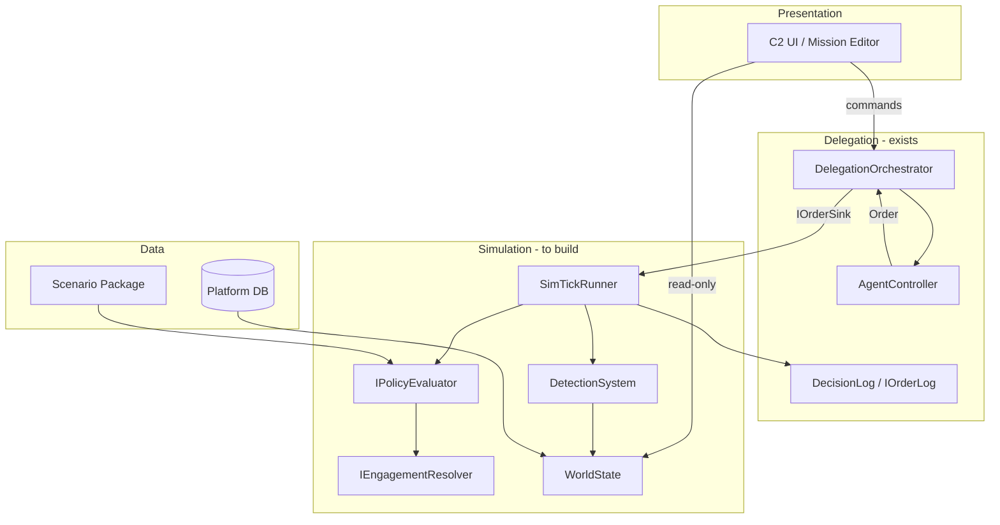

# Project Aegis — Master Architecture

> **Status:** Living draft — **Release hold** (post-S93 / post-gauntlet; adequate for Release engineering; Launch **not** cleared)  
> **Last Updated:** 2026-07-15  
> **Stage:** **Release** (`production/stage.txt`) — Launch not advanced  
> **Closed through:** S81–S88 SE + ME P2 + PE complete; S89–S95 Release continuity through gauntlet productization  
> **Verification floor:** suite **≥1638/0f**; Baltic hash **`17144800277401907079`** (immutable unless golden ADR)  
> **Architecture authority:** [architecture-review-post-s93-2026-07-14.md](architecture-review-post-s93-2026-07-14.md) (verdict **CONCERNS** for Launch only); re-matrix [architecture-re-matrix-post-s93-s96-2026-07-15.md](architecture-re-matrix-post-s93-s96-2026-07-15.md)  
> **Engine:** Unity 6.3 LTS (6000.3.14f1) + C# / .NET 8 + DOTS/ECS — [Unity VERSION](../engine-reference/unity/VERSION.md), [.NET / Learn](../engine-reference/dotnet/README.md)  
> **GitNexus repo:** `cmano-clone` (~**25,311** symbols / **48,462** edges @ recent index `257d9e9`; re-analyze @ HEAD if stale)

## Purpose

Translate approved requirements and GDDs into a **modular, deterministic, agent-aware** technical blueprint. This document defines assembly boundaries, tick ordering, and integration contracts—especially between the **future simulation core** and the **existing delegation layer** (`ProjectAegis.Delegation`).

## Post-S93 / Gauntlet architecture state (S96)

| Item | State |
|------|-------|
| Editors (SE / ME P2 / PE) | **Complete** (headless-first; PNG/Unity Editor pack deferred) |
| Gauntlet / oracle QA | **Oracle fail-closed landed** (Track A); suite floor **≥1638/0f** |
| Release hold | **Cleared for Release engineering** — do **not** claim Launch readiness |
| Post-S93 review | [architecture-review-post-s93-2026-07-14.md](architecture-review-post-s93-2026-07-14.md) — verdict **CONCERNS** for **Launch only** |
| Layer re-matrix (S96) | [architecture-re-matrix-post-s93-s96-2026-07-15.md](architecture-re-matrix-post-s93-s96-2026-07-15.md) |
| CRITICAL hub playbook | [`production/agentic/critical-hub-merge-playbook-2026-07-14.md`](../../production/agentic/critical-hub-merge-playbook-2026-07-14.md) |

**CRITICAL hubs (upstream, GitNexus impact summary):**

| Symbol | Upstream | Constraint |
|--------|----------|------------|
| `ScenarioDocumentEditor` | **233** CRITICAL | Single authoring hub — impact first; prefer CLI/authoring seams |
| `CatalogWriteGate` | **186** CRITICAL | **Extend-only** — no rewrite |
| `DelegationBridge` | **142** CRITICAL | **ZERO hotpath** touch |
| `PatrolCandidateEngagePolicy` | **111** CRITICAL | Engage doctrine seam |
| `BalticReplayHarness` | **62** CRITICAL | Replay + gauntlet consumers; read/test/verify first |

Determinism hash **`17144800277401907079`** remains the production Baltic golden unless explicitly golden-updated with ADR. Stage stays **Release**; Launch commercial surface is out of scope for this document refresh.

## Executive Summary

| Layer | Assembly | Responsibility |
|-------|----------|----------------|
| **Data** | `ProjectAegis.Data` | Platform DB, scenario packages, policy templates |
| **Simulation** | `ProjectAegis.Sim` | World state, sensors, engage, logistics, policy eval (pure C#) |
| **Delegation** | `ProjectAegis.Delegation` | Controllers, autonomy, decision pipeline, decision log (exists) |
| **Bridge** | `ProjectAegis.Delegation.UnityAdapter` | `ISimWorldSnapshot`, `IOrderSink`, tick glue (exists) |
| **Presentation** | `ProjectAegis.Unity` | Rendering, C2 UI, editor surfaces |

**Rule:** Simulation logic never references UnityEngine. UI never mutates sim state except via commands.

## System Context Diagram



## Fixed Timestep Tick Pipeline

Deterministic order for interactive and headless modes (same code path):

| Step | System | Output |
|------|--------|--------|
| 1 | Ingest player/MCP commands | Command queue |
| 2 | Apply mission timeline / events | Mission state |
| 3 | Movement & kinematics (coarse) | Positions |
| 4 | **Detection tick** (sorted emitter-target pairs) | Contact changes |
| 5 | Build `ObservedState` / `ISimWorldSnapshot` | Per-side picture |
| 6 | **Delegation tick** (`DelegationOrchestrator.Tick`) | `Order` list |
| 7 | **Policy evaluate** each order/intent | Allow / FireAbortReason |
| 8 | **Engagement resolve** legal fires | Launches, damage |
| 9 | Logistics (fuel, magazine) | Readiness |
| 10 | **Append order log** | Immutable entries |
| 11 | Optional UI snapshot | View models |

Steps 6–7 today are collapsed in Delegation; **split policy into Sim** when `ProjectAegis.Sim` lands (see ADR-002).

## Key Interfaces

### `ISimWorldSnapshot` (exists — extend)

Read-only battlespace view for controllers: contacts, own units, mission hints, comms degradation flags.

### `IPolicyEvaluator` (new — Sim)

```csharp
PolicyVerdict Evaluate(in PolicyContext ctx, in ActionRequest request);
// PolicyContext carries PolicySnapshot + effective policy
// Returns Allow | Deny(FireAbortReason) | Defer
```

**Migration:** `IRoeFilter` becomes adapter over `IPolicyEvaluator` for backward compatibility until tests migrate (GitNexus **HIGH** on `IRoeFilter`).

### `IEngagementResolver` (new — Sim)

Single entry for manual, agent, and mission-auto engage (doc 14).

### `IOrderLog` (evolve from `DecisionLog`)

Union of: `DecisionRecord`, `PolicyDenial`, `Engagement`, `ContactChange`, `PolicyUpdate`, `PlayerOrder`.

Append-only; `simTick` + `sequenceId` ordering (doc 17).

### `IOrderSink` (exists)

`OrderDispatcher` applies orders to Unity/sim entities.

## Layer Rules

1. **No Unity in Sim or Delegation core** assemblies.  
2. **Seeded RNG** only via `SeededRng` / `DeterministicHash` patterns (DET-001).  
3. **No `DateTime.Now`** or unordered `Dictionary` iteration in hot paths.  
4. **MCP tools** call application services, not MonoBehaviours directly.  
5. Run `npx gitnexus impact --repo cmano-clone` before changing public API on `DelegationOrchestrator`, `IRoeFilter`, `DecisionLog`.

## Technical Requirements Baseline (partial)

Extracted from requirements **13–20** + GDD `policy-roe-emcon-wra.md` | **34** TRs tracked at MVP

| Req ID | System | Requirement | Owner module |
|--------|--------|-------------|--------------|
| TR-policy-001..006 | Policy | Inheritance, snapshot, abort reasons | Sim.Policy |
| TR-engage-001..004 | Engagement | Unified pipeline, DLZ | Sim.Engage |
| TR-sensor-001..003 | Sensors | Contact FSM, deterministic detect | Sim.Sensors |
| TR-log-001..003 | Order log | Schema, replay hash | Delegation → Sim.Log |
| TR-ui-001..002 | C2 UI | Panels, delegation overlay | Unity.UI |

Full matrix: expand as each GDD is approved (`/create-architecture` continuation).

## GitNexus Code Intelligence (2026-05-29)

| Symbol | Upstream risk | Notes |
|--------|---------------|-------|
| `IRoeFilter` | **HIGH** | PassthroughRoeFilter, AutonomyGate, Orchestrator, Bridge, ReplayGoldenTests |
| `DelegationOrchestrator` | **MEDIUM** | Bridge, all orchestration tests |
| `DecisionLog` | **LOW** | Extend for order log schema |

**Processes:** `RunTick → ApplyOrder`, `ConfigureSimulationMode → AgentController`, `Tick → PerceivedState`.

**Indexed (2026-05-29 reanalyze):** `ProjectAegis.Sim` — `SimTickRunner`, `IPolicyEvaluator`, `SeededRng` (no upstream callers yet). `IRoeFilter` remains **HIGH** until orchestrator migrates.

## ADR Index

| ADR | Title | Status |
|-----|-------|--------|
| [ADR-001](adr-001-sim-assembly-boundary.md) | Simulation vs Delegation assembly boundary | **Accepted** |
| [ADR-002](adr-002-policy-evaluator.md) | IPolicyEvaluator replaces IRoeFilter | **Accepted** |
| [ADR-003](adr-003-order-log-schema.md) | Unified order log schema | **Accepted** |
| [ADR-004](adr-004-tick-pipeline-order.md) | Deterministic tick pipeline ordering | **Accepted** |
| [ADR-005](adr-005-dots-sim-core.md) | DOTS/ECS for world state | **Accepted** |
| [ADR-006](adr-006-data-layer-boundary.md) | ProjectAegis.Data boundary, snapshots, write gate | **Accepted** |
| [ADR-007](adr-007-c2-map-presentation.md) | C2 map presentation (phased globe) | **Accepted** |
| [ADR-008](adr-008-mission-editor-validation-engine.md) | Mission editor deterministic validation | **Accepted** |
| [ADR-009](adr-009-combat-domain-validators.md) | Combat domain validators & damage order | **Accepted** (S26-09 stubs) |
| [ADR-010](adr-010-headless-first-command-driven-ui.md) | Headless-first command-driven UI | **Accepted** |

## Engine Note

`/setup-engine` should pin Unity version under `docs/engine-reference/unity/` before implementation. Architecture assumes DOTS/Burst for sensor/engage hot paths per doc 08.

## Traceability

- Requirements: `Game-Requirements/Game-Requirements-Index.md`  
- Systems: `design/gdd/systems-index.md`  
- Impact: `docs/requirements/impact-sim-c2-requirements-2026-05-29.md`  
- Delegation spec: `docs/superpowers/specs/2026-05-28-agent-delegation-framework-design.md`

## Next Steps

1. ~~Accept ADR-001..005~~ — done 2026-05-29.  
2. ~~Scaffold `ProjectAegis.Sim`~~ — done.  
3. ~~Wire `DelegationOrchestrator` → `IPolicyEvaluator`~~ — done ([wiring note](wiring-delegation-sim-2026-05-29.md)).  
4. Implement detection tick in `ProjectAegis.Sim.Sensors` per sensor GDD.
