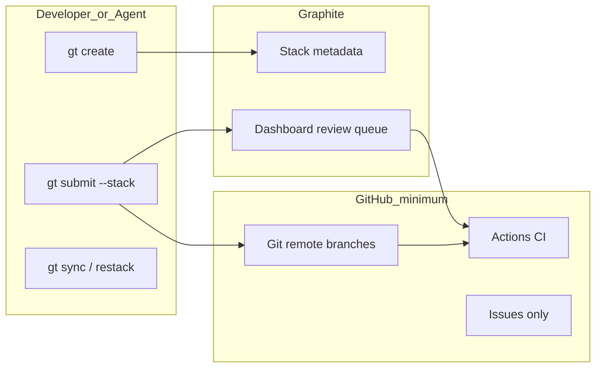
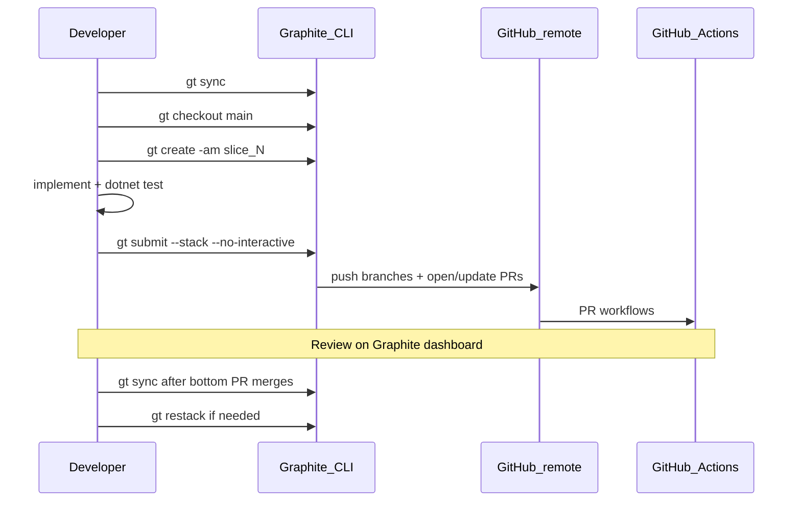

# Graphite-as-GitHub-Substitute — Project Aegis

> **Status:** Canonical workflow (2026-06-12)  
> **Trunk:** `main` (see [`.graphite_repo_config`](../../.graphite_repo_config))  
> **Supersedes:** scattered submit instructions in older Graphite runbooks (see [Deprecated paths](#deprecated-paths))

## Purpose and scope

This repo uses **Graphite as the primary interface** for branch creation, stacked PRs, sync, restack, and review. **GitHub is minimized** to infrastructure only:

| Keep on GitHub | Use Graphite instead |
|----------------|----------------------|
| Git remote (`origin`) | — |
| GitHub Actions CI | Graphite CI optimizer (skips redundant stack runs) |
| Secrets (`GRAPHITE_CI_OPTIMIZER_TOKEN`, Unity license, etc.) | — |
| Issues, Dependabot | — |
| Branch protection settings (UI) | Graphite-compatible rules (see [CI and branch protection](#ci-and-branch-protection)) |
| **Create/update PRs** | `gt submit` / `gt submit --stack` |
| **Stack branch parenting** | `gt create`, `gt checkout`, `gt create --insert` |
| **Push stack branches** | `gt submit --stack` (not raw `git push origin …`) |
| **Sync with trunk** | `gt sync`, `gt restack` |
| **Review queue / merge order** | [Graphite dashboard](https://app.graphite.com) |
| **Stale approvals on rebase** | [graphite-dismiss-stale-approvals.yml](../../.github/workflows/graphite-dismiss-stale-approvals.yml) — **not** GitHub’s built-in dismiss-on-push |



---

## Prerequisites

1. **Graphite CLI** — `gt --version` (install from [Graphite docs](https://graphite.com/docs/cli-quick-start))
2. **Graphite account** linked to this GitHub repo at [app.graphite.com](https://app.graphite.com)
3. **Git** configured with access to `origin` (GitHub)
4. **.NET SDK 8.0.400** for local gates before submit

---

## One-time setup checklist

- [ ] Install / verify CLI: `gt --version`
- [ ] Authenticate: open https://app.graphite.com/activate → complete flow → `gt auth`
- [ ] Confirm repo trunk (already initialized):

  ```powershell
  gt log short
  # Expect trunk: main per .graphite_repo_config
  ```

- [ ] **GitHub repo settings** (manual, one-time):
  - **Disable** “Dismiss stale pull request approvals when new commits are pushed” on `main`
  - **Enable** required checks when tier allows: `build_test` (.NET CI) + `build` (Graphite CI)
  - See [ci-and-branch-protection.md](./ci-and-branch-protection.md)
- [ ] Confirm GitHub Actions secret `GRAPHITE_CI_OPTIMIZER_TOKEN` (Graphite CI skip optimizer)
- [ ] Delete stale stack branches per [Appendix: active stack backlog](#appendix-active-stack-backlog) before starting new stacks
- [ ] Read Cursor skills: `graphite-fundamentals`, `graphite-repo-bootstrap`, `graphite-submit-sync`, `graphite-restack-recovery` (`~/.cursor/skills/`)

**Re-auth when submit fails with invalid token:** refresh at https://app.graphite.com/activate, then `gt auth`.

**Do not run `gt init --reset`** without explicit human approval — it untracks all Graphite-managed branches.

---

## Command substitution table

| Task | Avoid (GitHub-native) | Use (Graphite-first) |
|------|----------------------|----------------------|
| Start feature from trunk | `git checkout -b feat/x` | `gt checkout main` then `gt create -am "feat(scope): …"` |
| Stack next slice | manual parent + `gh pr create --base parent` | `gt create -am "…"` (auto-parents to current branch) |
| Insert mid-stack slice | rebase + retarget PRs | `gt create --insert -am "…"` |
| Publish / update PRs | `git push -u origin BR && gh pr create` | `gt submit` or `gt ss --no-interactive` |
| Integrate trunk | `git pull origin main` on each branch | `gt sync` |
| Fix after trunk moves | manual rebase each branch | `gt restack` → `gt add .` → `gt continue` |
| Squash cleanup locally | `git rebase -i` | `gt fold` (when appropriate) |
| Inspect stack | `gh pr list` | `gt log short` + Graphite dashboard |
| Merge stack | merge PRs out of order | Merge **bottom PR first**; Graphite rebases dependents |
| Read CI status | — | `gh pr checks` OK (read-only) |
| Read PR diff | — | `gh pr diff` OK for agents; authors prefer Graphite UI |

### Hard rules (humans and agents)

- **Never** `gh pr create`, `gh pr merge`, or `git push origin <stack-branch>` for Graphite-tracked work unless Graphite is unavailable **and** the user explicitly approves fallback.
- **Always** prefer `gt submit` over raw `git push` when [`.graphite_repo_config`](../../.graphite_repo_config) exists.
- **Always** run GitNexus `detect_changes` before submit (see [AGENTS.md](../../AGENTS.md)).

---

## Stack authoring playbook

### Branch naming

Use `stack/<domain>/<slice>` (examples: `stack/data/schema`, `stack/sim/engage-log`).

### Slice size

- One logical story or ADR slice per branch
- Each slice should pass `dotnet test ProjectAegis.sln` independently where possible
- Prefer 3–7 stacked PRs over one large PR

### File ownership

Avoid parallel PRs touching the same paths. Current ownership (extend in backlog doc when adding stacks):

| Path | Owner stack |
|------|-------------|
| `src/ProjectAegis.Delegation.UnityAdapter/**` | delegation / unity stacks |
| `unity/ProjectAegis/**` | delegation / unity stacks |
| `src/ProjectAegis.Delegation/Orchestration/SimulationSession.cs` | sim engage stacks |
| `src/ProjectAegis.Sim/Engage/**` | sim engage stacks |
| `src/ProjectAegis.Data/**` | data stacks |
| `design/gdd/*.md` | design stacks (parallel 1-PR from `main` OK) |

### Bootstrap a new stack from `main`

```powershell
git checkout main
git pull
gt sync
gt checkout main
gt create -am "feat(area): first slice [ID-1]" stack/area/slice-one
# implement, test, commit (gt create stages/commits per your gt workflow)
gt create -am "feat(area): second slice [ID-2]" stack/area/slice-two
# repeat for additional slices
gt checkout stack/area/slice-one
gt submit --stack --no-interactive
```

---

## Ship playbook



### Per-slice gate (Project Aegis)

```powershell
dotnet build ProjectAegis.sln -c Release
dotnet test ProjectAegis.sln -c Release -v minimal
dotnet test src/ProjectAegis.Delegation.UnityAdapter.Tests/ProjectAegis.Delegation.UnityAdapter.Tests.csproj -c Release --filter PlayModeSmokeHarnessTests
npx gitnexus detect_changes --repo cmano-clone
```

Or: `.\tools\verify-ci-local.ps1`

### Submit commands

| Goal | Command |
|------|---------|
| Current branch PR only | `gt submit --no-interactive` |
| Whole stack | `gt submit --stack --no-interactive` (`gt ss`) |
| Update PR bodies only | `gt ss -u` |
| After conflict fix | `gt sync && gt restack && gt ss` |

### Merge order

1. Review on [Graphite dashboard](https://app.graphite.com) (primary)
2. Merge **bottom-of-stack** PR first
3. Graphite rebases dependent PRs; re-run checks if needed
4. After merge to `main`: `gt sync` to prune merged branches

---

## CI and branch protection

Full detail: [ci-and-branch-protection.md](./ci-and-branch-protection.md)

Summary:

- **`.NET CI`** runs on every PR (blocking)
- **`Graphite CI`** may skip redundant runs via optimizer; still configure as required check when branch protection is available
- **`Post-Merge CI (Graphite)`** on `main` push — dotnet + replay golden tests
- **Do not** enable GitHub “Dismiss stale approvals on push” — use [graphite-dismiss-stale-approvals.yml](../../.github/workflows/graphite-dismiss-stale-approvals.yml)

Private-repo branch protection API may return 403 — track [issue #37](https://github.com/drgaciw/cmano-clone/issues/37).

---

## Recovery (restack conflicts)

When `gt sync`, `gt restack`, or `gt modify` stops on conflicts:

1. Resolve conflict markers in the working tree
2. `gt add .`
3. `gt continue` (or `gt continue -a` per CLI prompt)
4. If abandoning: `gt abort`

Full repair after stack is sane:

```powershell
gt sync && gt restack && gt submit --stack --no-interactive
```

See [Graphite restack docs](https://graphite.com/docs/restack-branches). Cursor skill: `graphite-restack-recovery`.

If stack metadata is corrupt, capture `gt log short` / `gt log long` and escalate — avoid `gt init --reset` without approval.

---

## Agent and Cursor integration

### Agent routing

| Task | Subagent / skill |
|------|------------------|
| Plan multi-slice stack | `graphite-stack-author`, `graphite-team-orchestrator` |
| Ship stack | `graphite-stack-ship`, skill `graphite-submit-sync` |
| Conflict repair | `graphite-stack-surgeon`, skill `graphite-restack-recovery` |
| Code safety | GitNexus impact + detect_changes ([AGENTS.md](../../AGENTS.md)) |

### Agent stack template

```text
1. gt sync && gt checkout main
2. gt create -am "feat(area): slice description [ID]"
3. Implement story; run dotnet test + gitnexus detect_changes
4. Repeat gt create for next slice
5. gt checkout <bottom-branch>
6. gt submit --stack --no-interactive
7. Do NOT gh pr create or git push stack branches manually
```

### Read-only GitHub CLI (allowed)

- `gh pr checks`, `gh pr view`, `gh pr diff` — CI triage and review
- `gh issue …` — issue tracking (Graphite has no issue tracker)

---

## Troubleshooting

| Symptom | Fix |
|---------|-----|
| Invalid / expired Graphite token | https://app.graphite.com/activate → `gt auth` |
| `gt submit` validation fails | `gt log short`; fix stack shape; see Recovery |
| Graphite CI `optimize_ci` fails | Check `GRAPHITE_CI_OPTIMIZER_TOKEN`; .NET CI still runs |
| Graphite org billing / 403 on dismiss workflow | See [pr-69-ci-triage](../production/qa/pr-69-ci-triage-2026-06-04.md) |
| Branch protection API 403 | Manual UI setup; [issue #37](https://github.com/drgaciw/cmano-clone/issues/37) |
| Stale local stack re-submitted | See backlog “Do not gt submit”; delete stale branches |

---

## Deprecated paths

These remain for **historical topology and slice IDs** only. **Commands and workflow live in this document.**

| Document | Role |
|----------|------|
| [graphite-stack-delegation-2026-05-30.md](./graphite-stack-delegation-2026-05-30.md) | Historical DELEG-1…10 stack (COMPLETE) |
| [graphite-stack-backlog-2026-06.md](./graphite-stack-backlog-2026-06.md) | Living backlog appendix (stacks, ownership, changelog) |
| [2026-05-30-database-intelligence-graphite-stack.md](../superpowers/plans/2026-05-30-database-intelligence-graphite-stack.md) | DATA-0…5 slice-specific runbook |

---

## Appendix: active stack backlog

Slim view — full changelog in [graphite-stack-backlog-2026-06.md](./graphite-stack-backlog-2026-06.md).

### Completed (do not re-submit)

| Stack | Branches | Status |
|-------|----------|--------|
| A — Delegation | `stack/delegation/*` | **COMPLETE** on `main` — delete stale branches |
| B — Sim engage | `stack/sim/engage-*` | **Merged** #14–#15 |
| C — Unity | `stack/unity/playmode-smoke` | **Merged** #16 |
| Baltic / sensor / milsim-c1 | various `stack/*` | See backlog changelog |

### Open / next

| Stack | Branch / ID | Notes |
|-------|-------------|-------|
| F — Platform DB | `stack/data/basepd`, DATA-2 | DATA-1 on `main`; see DATA runbook |
| Design | `design/logistics-gdd`, DES-1 | Parallel 1-PR from `main` OK |
| Production | PROD-2 stories | Not started |

### Stale branch hygiene

**Do not** `gt submit` stacks marked stale in the backlog. Before new work:

```powershell
git fetch --prune
git branch -a | Select-String "stack/delegation"
# Delete local + remote only after confirming main has the feature
git branch -D stack/delegation/sim-core   # example
git push origin --delete stack/delegation/sim-core
```

---

## Verification checklist (adoption complete)

- [x] `gt log short` shows stack on `main` (verified 2026-06-12)
- [x] Test slice created via `gt create` on `stack/docs/graphite-substitute-plan`
- [ ] `gt auth` / `gt sync` — **blocked:** token expired; refresh at https://app.graphite.com/activate then `gt auth -t <token>`
- [ ] `gt submit --no-interactive` on test slice — run after re-auth
- [ ] Graphite CI + .NET CI pass on submitted PR — run after re-auth
- [x] Agent docs reference this file ([AGENTS.md](../../AGENTS.md), [CLAUDE.md](../../CLAUDE.md))
- [x] Stale `stack/delegation/*` branches absent locally and on `origin` (verified 2026-06-12)
- [x] Linked from [ci-and-branch-protection.md](./ci-and-branch-protection.md)

### Adoption log

| Date | Action | Result |
|------|--------|--------|
| 2026-06-12 | Canonical doc + cross-links + agent rules | Committed on `stack/docs/graphite-substitute-plan` |
| 2026-06-12 | `gt create` smoke slice | PASS |
| 2026-06-12 | `gt sync` / `gt submit` | FAIL — expired Graphite token (human re-auth required) |
| 2026-06-12 | Stale stack branch audit | PASS — no `stack/*` remotes; delegation cleanup already done 2026-06-02 |

**After re-auth:**

```powershell
gt auth -t YOUR_TOKEN_FROM_APP_GRAPHITE_COM_ACTIVATE
gt sync
gt checkout stack/docs/graphite-substitute-plan
gt submit --no-interactive
```

---

## Related links

- [Graphite CLI quick start](https://graphite.com/docs/cli-quick-start)
- [Stacking and CI](https://graphite.com/docs/stacking-and-ci)
- [GitHub configuration guidelines (Graphite)](https://graphite.com/docs/github-configuration-guidelines)
- [ci-and-branch-protection.md](./ci-and-branch-protection.md)
