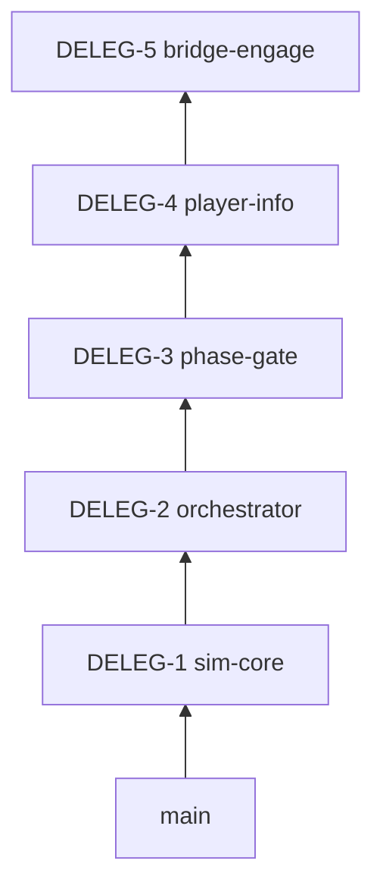

# Stack Plan: Delegation → Sim wiring (Cursor agents)

**Source branch:** `cursor/microsoft-learn-mcp-integration`  
**TR-ID / ADR:** Req 04, ADR-002/003/004  
**Excluded from this stack:** Graphite workflow (`114de0b`), MCP docs (`88acb75`), research dump (`831474f`), team scaffolding (`1861672`)

| # | Branch | PR title | Scope | Reviewer hint |
|---|--------|----------|-------|---------------|
| 1 | `stack/delegation/sim-core` | feat(sim): policy, engage MVP, scenario JSON [DELEG-1] | `ProjectAegis.Sim*`, `data/scenarios`, ADR 001–004, `global.json`, `ProjectAegis.sln` | c-sharp-architect, determinism-engineer |
| 2 | `stack/delegation/orchestrator` | feat(delegation): ROE adapter, session, order log union [DELEG-2] | `ProjectAegis.Delegation*`, wiring doc | c-sharp-engineer |
| 3 | `stack/delegation/phase-gate` | feat(delegation): planning/execution phase gate [DELEG-3] | Phase gate, loop policy, session phase tests | c-sharp-reviewer |
| 4 | `stack/delegation/player-info` | feat(delegation): player info filter [DELEG-4] | `PlayerInfoFilter`, req 03 alignment | gameplay-programmer |
| 5 | `stack/delegation/bridge-engage` | feat(delegation): bridge MVP engage wiring [DELEG-5] | `UnityAdapter*`, `unity/ProjectAegis`, engage tools | unity-specialist |



**Submit (after `gt auth`):**

```powershell
gt checkout stack/delegation/sim-core
gt submit --stack --no-interactive
```

**Headless gate per slice:** `dotnet test ProjectAegis.sln`
