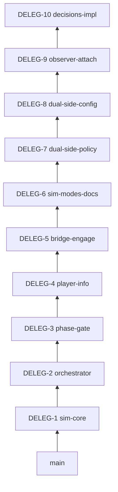

# Stack Plan: Delegation → Sim wiring (Cursor agents)

**Source branch:** `cursor/microsoft-learn-mcp-integration`  
**TR-ID / ADR:** Req 04, ADR-002/003/004  
**Excluded from this stack:** Graphite workflow (`114de0b`), MCP docs (`88acb75`), research dump (`831474f`), team scaffolding (`1861672`)

| # | Branch | PR title | Scope | Reviewer hint |
|---|--------|----------|-------|---------------|
| 1 | `stack/delegation/sim-core` | feat(sim): policy, engage MVP, scenario JSON [DELEG-1] | `ProjectAegis.Sim*`, `data/scenarios`, ADR 001–004, `global.json`, `ProjectAegis.sln` | c-sharp-architect, determinism-engineer |
| 2 | `stack/delegation/orchestrator` | feat(delegation): ROE adapter, session, order log union [DELEG-2] | `ProjectAegis.Delegation*`, wiring doc | c-sharp-engineer |
| 3 | `stack/delegation/phase-gate` | feat(delegation): planning/execution phase gate [DELEG-3] | Phase gate, loop policy, session phase tests | c-sharp-reviewer |
| 4 | `stack/delegation/player-info` | feat(delegation): player info filter [DELEG-4] | `PlayerInfoFilter`, req 03 alignment | gameplay-programmer |
| 5 | `stack/delegation/bridge-engage` | feat(delegation): bridge MVP engage wiring [DELEG-5] | `UnityAdapter*`, `unity/ProjectAegis`, engage tools | unity-specialist |
| 6 | `stack/delegation/sim-modes-docs` | docs(delegation): simulation modes decisions [DELEG-6] | req 03, superpowers spec/plan | producer |
| 7 | `stack/delegation/dual-side-policy` | feat(sim): allowDualSideControl scenario policy [DELEG-7] | `ScenarioPolicyProfile`, JSON loader | c-sharp-engineer |
| 8 | `stack/delegation/dual-side-config` | feat(delegation): dual-side Mixed configure [DELEG-8] | `SimulationModeConfigurator` | c-sharp-reviewer |
| 9 | `stack/delegation/observer-attach` | feat(delegation): AttachReplayViewer session [DELEG-9] | orchestrator + bridge guard | gameplay-programmer |
| 10 | `05-30-feat_delegation_req04_*` / rename → `stack/delegation/decisions-impl` | feat(delegation): req04 detach log, trust emit, attention [DELEG-10] | order log events, `TrustSignalEmitter`, personality budgets, override tests | c-sharp-engineer, determinism-engineer |



**Submit (after `gt auth`):**

```powershell
gt checkout stack/delegation/sim-core
gt submit --stack --no-interactive
```

**DELEG-10 review focus (Cursor agents):**
- `TryTakeDirectControl` / `TryReleaseDirectControl` on orchestrator + bridge (parent: DELEG-9)
- Order log: `ControllerChange`, `GroupMemberDetach`, `GroupMemberRejoin`
- `TrustSignalEmitter.EmitFromSession` — emit-only, no hot-path mutation
- `PersonalityCatalog.ResolveAttentionBudget` — Swarm +25%, EW −10%

**Headless gate per slice:** `dotnet test ProjectAegis.sln`
