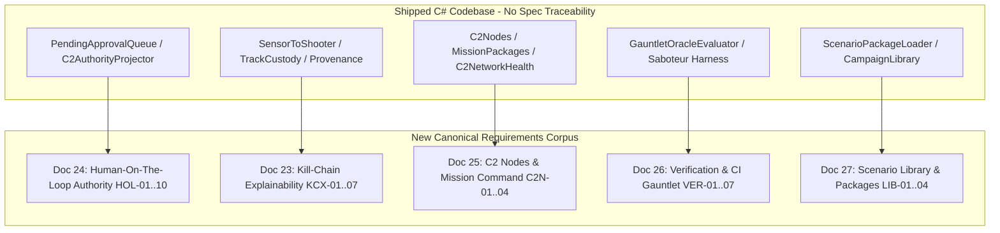
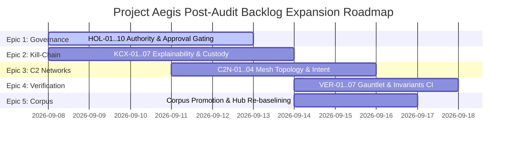

# Adversarial Requirements Review & Backlog Expansion Plan
> **Project Aegis (`cmano-clone`) — Conductor Multi-Agent Orchestration Report**  
> **Date:** 2026-09-04 · **Stage:** Release (Not Launch) · **Target Branch:** `feat/unity-mcp-grok-workflow`  
> **Orchestrator:** Project Manager & Agentic Orchestration Lead  
> **Authority Documents:** [AGENTS.md](../../AGENTS.md), [00-Master-Index.md](../../00-Master-Index.md), [future-sprint-roadmap-07142026.md](future-sprint-roadmap-07142026.md), [linear-parallel-dispatch-playbook.md](../../production/agentic/linear-parallel-dispatch-playbook.md)

---

## 1. Executive Summary & Conductor Orchestration Architecture

### 1.1 Program Context & Orchestration Charter
Project Aegis is a complex, high-fidelity naval/air warfare simulator implemented in C# and Unity 6.3 LTS (headless-first architecture), currently operating at **Sprint 122** (milestone H9: Slice A C2 Visual Bind + Unity-MCP Evidence). 

As Project Manager and Agentic Orchestration Expert, an adversarial review was conducted across the 22 core requirements, recent 2026-09-02 audit findings, architectural decision records (ADR-001 through ADR-026), and the active codebase. The objective was to uncover contradictions, unverified governance claims, specification blind spots, and untracked tech debt, translating these findings into an actionable, prioritized backlog expansion plan for **Notion** (design & architecture) and **Linear** (delivery state & parallel dispatch).

```
                     ┌──────────────────────────────────────────────────────────┐
                     │          Conductor Agentic Orchestration Lead            │
                     │   (Sprint Planning, Invariants, Surface-Disjoint Waves)   │
                     └────────────┬─────────────┬─────────────┬─────────────────┘
                                  │             │             │
            ┌─────────────────────┘             │             └─────────────────────┐
            ▼                                   ▼                                   ▼
┌───────────────────────┐           ┌───────────────────────┐           ┌───────────────────────┐
│ GitNexus Code Auditor │           │ Requirements Adversary│           │   Backlog Architect   │
│ • Graph: 38k nodes    │           │ • Corpus vs Code Drift│           │ • Linear (DRG-*) Sync │
│ • Critical Hub Audits │           │ • Governance Bypasses │           │ • Notion Hub Schemas  │
│ • Blast Radius Checks │           │ • Missing Docs 23-27  │           │ • Surface Matrix/ACs  │
└───────────────────────┘           └───────────────────────┘           └───────────────────────┘
```

### 1.2 Multi-Agent Conductor Execution Model
To maximize parallelism without race conditions or merge conflicts, execution was distributed across specialized subagent tracks operating under the strict **`Surface`** isolation rule:
1. **Track 1 (GitNexus Code Auditor)**: Audited ground truth using GitNexus graph topology (37,995 nodes, 75,773 edges, 300 execution flows), verifying critical hubs (`ScenarioDocumentEditor`, `CatalogWriteGate`, `DelegationBridge`, `PatrolCandidateEngagePolicy`, `BalticReplayHarness`), policy gates, and projection pipelines.
2. **Track 2 (Requirements Adversary)**: Stress-tested `Game-Requirements/` (docs 01–22) against trunk commits, challenging governance integrity, simulation fidelity boundaries, salvo mathematics, and unowned failure modes.
3. **Track 3 (Linear & Notion Backlog Architect)**: Mapped all discovered gaps into structured, file-disjoint Epics and User Stories following the tripartite rule: **Design in Notion, Status in Linear, Files in Git**.

### 1.3 High-Level Audit Verdict: CONCERNS (Remediable)
While headless simulation and projection engineering have advanced rapidly (reaching 1,924 passing unit/contract tests), documentation and tracking have severely diverged:
- **~700 commits** landed since the last requirements tracker baseline (2026-07-09).
- **71 of 80** recent Linear issue IDs (DRG-179 through DRG-230) have had zero traceability back to formal requirement documents.
- Five major capability families (Explainable Kill Chains, Human-On-The-Loop Authority, C2 Node Networks, QA Gauntlet Verification, and Scenario/Campaign Libraries) were fully shipped in code with **zero owning requirements** in docs 01–22.
- Test floor invariants are stated inconsistently across five conflicting generations (≥1204, ≥1232, ≥1599, ≥1638, and measured 1924).

---

## 2. GitNexus Deep-Code Intelligence & Blast Radius Analysis

### 2.1 Knowledge Graph Health & Metrics
- **Current Commit**: `30f6c97966534640e2ca22b14b4cd5c0a13f33e1` (`feat/unity-mcp-grok-workflow`)
- **Indexed Entities**: 5,282 files, 37,995 nodes, 75,773 edges, 883 communities, 300 execution processes.
- **Provider**: LadybugDB / LadybugDB-FTS.

### 2.2 Critical Hub Watchlist & Invariant Enforcement

| Critical Symbol | In-Degree / Impact | Risk Classification | Architectural Invariant | Audit Status & Blast Radius Finding |
|---|---|---|---|---|
| [`ScenarioDocumentEditor`](file:///home/username01/projects/active/cmano-clone/cmano-clone/src/ProjectAegis.Data/Scenario/ScenarioDocumentEditor.cs) | **233** | **CRITICAL** | Authoring Seam Only | Stable. High blast radius across CLI and scenario loading. Must remain isolated from simulation tick loops. |
| [`CatalogWriteGate`](file:///home/username01/projects/active/cmano-clone/cmano-clone/src/ProjectAegis.Data/Catalog/CatalogWriteGate.cs) | **186** | **CRITICAL** | **EXTEND-ONLY** | Verified intact. Audit finding A-02 (`balanceCritical` check) was resolved by ADR-024 (descope) rather than mutating write paths. |
| [`DelegationBridge`](file:///home/username01/projects/active/cmano-clone/cmano-clone/src/ProjectAegis.Delegation/Bridge/DelegationBridge.cs) | **142** | **CRITICAL** | **ZERO HOTPATH EDITS** | Verified untouched. S122 C2 UI bind routes exclusively through `DelegationBridgeHost` and decoupled presentation presenters. |
| [`PatrolCandidateEngagePolicy`](file:///home/username01/projects/active/cmano-clone/cmano-clone/src/ProjectAegis.Sim/Policy/PatrolCandidateEngagePolicy.cs) | **111** | **CRITICAL** | Doctrine Seam Isolation | Verified stable. Lower bound for `IPolicyEvaluator` fan-out. |
| [`BalticReplayHarness`](file:///home/username01/projects/active/cmano-clone/cmano-clone/src/ProjectAegis.Delegation.UnityAdapter/Baltic/BalticReplayHarness.cs) | **62** | **CRITICAL** | Determinism Ground Truth | Replay golden suite 6/6 green; hash `17144800277401907079` immutable across 18 reference paths. |

### 2.3 Code Ground Truth vs Requirements Specification
Detailed code analysis across `src/ProjectAegis.Delegation`, `src/ProjectAegis.Sim`, and `src/ProjectAegis.Data` revealed five critical divergences:

```
[Requirement Spec Claim]                                 [Actual Code State]
Doc 04: "Lethal autonomy requires opt-in per phase" ───► AutonomyGate.Evaluate() executes immediately if ROE permits fire (ADR-023 descope)
Doc 06/21: "balanceCritical writes require gate"    ───► CatalogWriteGate has record-count threshold (>10), no balanceCritical column (ADR-024)
Doc 10: "TL-5 platforms require BLACK_PROJECT_MODE" ───► SpeculativeEngageGate evaluates TL and black-project independently (ADR-025)
Doc 22: "US/NATO swarm platforms expose CEC"        ───► CecCapable flag on CatalogSwarmPlatform; no nationality logic in Sim (ADR-026)
Doc 14: "Abort reason catalog has 28 reasons"       ───► abort_reason_manifest.json v1 has 31 codes; EngagementAbortReason has 28 members
```

1. **`AutonomyGate` vs HOL-04**:
   - `ProjectAegis.Delegation.Orchestration.AutonomyGate.cs` returns `ExecuteNow` for `SemiAutonomous` and `FullAutonomous` immediately once ROE permits fire.
   - The claimed `engage.lethalAutonomyOptIn` phase-gate does not exist in `src/`. ADR-023 properly formalizes this as de-scoped for v1.0, but requirements doc 04 was never updated.
2. **`PendingApprovalQueue` (DRG-66) & `EscalationGateProjection` (DRG-228)**:
   - Shipped in `ProjectAegis.Delegation/Orchestration/PendingApprovalQueue.cs` as a pure, single-threaded session buffer.
   - Integrates with `C2AuthorityProjector` (DRG-209) to evaluate `HoldFire`, `WeaponsTight`, and `HigherHq` approval states without mutating order logs. Completely unrepresented in docs 01–22.
3. **Targetability & Sensor-to-Shooter Chains (DRG-207, DRG-219, DRG-222)**:
   - `SensorToShooterProjection` evaluates a strict 4-link chain: `Sensor` → `Track` → `Targetability` → `EligibleShooter`.
   - `TrackCustodyProjection` tracks `Held` vs `Dropped` states across `DefaultStaleThresholdTicks` (30) and `DefaultDropThresholdTicks` (120). Missing from docs 14 and 15.
4. **C2 Nodes, Mission Packages & Network Health (DRG-213, DRG-214, DRG-229)**:
   - `C2NetworkHealthProjector` evaluates mesh topology into `Healthy`, `Degraded`, or `Partitioned` states with canonical fingerprinting (`C2NetworkHealthFingerprint`).
   - `MissionIntentProjection` projects commander guidance and capability gap fallbacks. Unrepresented in docs 19 and 20.
5. **Abort Manifest Synchronization**:
   - `abort_reason_manifest.json` defines 31 canonical codes; `EngagementAbortReason.cs` contains 28 enum values. Roslyn analyzer or CI code-generation is required to prevent enum drift.

---

## 3. Adversarial Review of Requirements Corpus

### 3.1 Governance & Safety Illusions
- **Contradiction A-01 (Autonomy Opt-In Void)**: Requirement 04 asserted that autonomous lethal engagements require human opt-in per mission phase. Code review shows that if a scenario assigns `FullAutonomous`, units fire autonomously without any mission-phase check. If an operator assumes safety stops exist, weapons release occurs unexpectedly.
  - *Adversarial Risk*: High. Creates an illusion of safety and human supervisory control.
  - *Remediation*: Approve ADR-023, amend doc 04, and implement explicit UI warning banners whenever an autonomous doctrine profile is assigned without approval constraints.
- **Contradiction A-03 (Black Project Mode Leak)**: Requirement 10 asserted that Level 5 technology requires `BLACK_PROJECT_MODE`. In code, `ScenarioSpeculativeSettings(blackProjectMode: false, maxTechnologyLevel: 5)` is valid, allowing TL-5 assets to spawn in standard scenarios.
  - *Adversarial Risk*: Medium. Breaks scenario authoring constraints and balance assumptions.
  - *Remediation*: Introduce a `ScenarioValidationEngine` rule blocking TL-5 assets when `blackProjectMode` is disabled (or adopt ADR-025 per-platform semantics).

### 3.2 Invariant Contradictions & Arithmetic Ambiguity
- **Contradiction C-02 (Test Floor Tower of Babel)**:
  - `tools/buildkite/dotnet-ci.sh`: ≥1204
  - `00-Master-Index.md`: ≥1232 / 18
  - `implementation-tracker.md`: ≥1599
  - `AGENTS.md` / Sprint 107: ≥1638 / ≥20
  - Actual measured suite size: **1,924 / 21**
  - *Adversarial Risk*: Stale CI scripts or local developers using old floors can introduce regressions that drop hundreds of tests without failing CI.
- **Contradiction D-02 (Time Acceleration Disconnect)**:
  - `SimClock.MaxAccelerationFactor` is hard-coded to **256x**.
  - Requirement 02 claims acceleration bands up to 1800x, while requirement 03 and certain UI specs state 120x or 30x.
  - *Adversarial Risk*: Sim tick stability breaks down at high acceleration factors; UI and replay scrubbers desynchronize.
- **Contradiction D-12 (Max Salvo Budget Ambiguity)**:
  - `PolicyEvaluator.cs` and `ResolvedUnitPolicy` define `DefaultMaxSalvo = 8`.
  - Requirements 13 and 14 fail to specify whether this is a **per-firing trigger limit** or a **cumulative engagement budget**, leading to inconsistent ammunition depletion in multi-target combat.

### 3.3 The "Shipped Without Spec" Void
Between 2026-07-09 and 2026-09-02, engineering produced comprehensive, battle-tested subsystems that have no formal parent requirement in docs 01–22. Five draft requirements have been authored in `Game-Requirements/drafts/` to seal this void:



---

## 4. Notion & Linear Backlog Architecture

### 4.1 The Tripartite Principle
As established in `linear-parallel-dispatch-playbook.md`:
> **Design in Notion, status in Linear, files in Git.** Linear issues reference specs; they never duplicate them.

### 4.2 The `Surface` Safety Predicate for Maximum Parallelism
To enable concurrent multi-agent execution without merge collisions:
- **`Surface` Rule**: Every Linear issue carries an explicit `Surface:` line in its description defining the files and symbols it will touch.
- **Concurrency Invariant**: **Never dispatch two issues whose `Surface` values intersect.**
- **Local vs Cloud Routing**:
  - Headless C# domain logic, projections, tests, and documentation: **Cloud Agent / Parallel Worktrees**.
  - Unity Editor scene edits, UXML/USS visual modifications, and Play Mode screenshot captures: **Local / Serial Unity-MCP Lane** (pinned `:8080`).

### 4.3 Notion Aegis Hub Schema Upgrades
The Notion workspace currently mirrors Git documents but lacks an operational Work Items database. We specify the following schema for the **User Stories & Product Backlog** database in Notion:

```
Database: [DB-STORIES] Aegis Product Backlog
├── Title (title)                       # e.g., "S123-01: Lethal Autonomy Phase Opt-In Gate"
├── Linear Key (text)                   # e.g., "DRG-255"
├── Epic (relation -> DB-EPICS)         # Two-way relation to Epics
├── Status (status)                     # Backlog, Ready for Dev, In Progress, In Review, Done
├── Priority (select)                   # Urgent, High, Medium, Low
├── MoSCoW (select)                     # Must Have, Should Have, Could Have, Won't Have
├── Story Points (number)               # Fibonacci: 1, 2, 3, 5, 8
├── Est Agent-Days (number)             # 0.5, 1.0, 1.5, 2.0
├── Requirements Anchor (relation)      # Two-way relation to [DB-REQUIREMENTS] (Docs 01-27)
├── Architecture ADR (relation)         # Two-way relation to [DB-ADRS] (ADR-001..026)
├── Surface Boundary (text)             # Disjoint paths e.g. "src/ProjectAegis.Delegation/Roe/*"
├── Assigned Agent/Skill (select)       # WT-A /c-sharp-engineer, /team-unity, /team-qa
└── Git Branch (text)                   # Graphite stack branch name
```

---

## 5. Actionable Backlog Expansion Plan (Epics & Stories)

### 5.1 Epic Roadmap Overview



| Epic Key | Title | Owning Requirement | Milestone | Target Stage | Total SP |
|---|---|---|---|---|---|
| **H9-EP01** | Human-On-The-Loop Governance & Escalation Gating | Doc 24 (`HOL`) / Doc 04 | H9 / C2 Architecture | Release | 15 SP |
| **H9-EP02** | Kill-Chain Explainability, Track Custody & Targetability | Doc 23 (`KCX`) / Docs 14, 15 | H9 / C2 Architecture | Release | 18 SP |
| **H9-EP03** | C2 Network Mesh Topology & Mission Command Intent | Doc 25 (`C2N`) / Docs 19, 20 | H9 / C2 Architecture | Release | 13 SP |
| **H9-EP04** | Verification Engine, Test Invariants & CI Gauntlet | Doc 26 (`VER`) / Doc 07 | Quality & Release Ops | Release | 12 SP |
| **H9-EP05** | Requirements Corpus Promotion & Hub Re-baselining | Docs 01–27 | Studio Governance | Release | 8 SP |

---

### 5.2 Detailed User Story Specifications

#### Epic 1: Human-On-The-Loop Governance & Escalation Gating (`HOL`)

```
================================================================================
STORY ID: S123-01 / DRG-255
TITLE: Lethal Autonomy Phase Opt-In Policy & AutonomyGate Hardening
================================================================================
Priority: Must Have (P0) | Points: 5 SP | Estimate: 1.5 Agent-Days
Requirement Anchor: HOL-04 (Doc 24), Doc 04 | ADR: ADR-023
Notion Relation: [DB-STORIES] -> [DB-REQUIREMENTS: Doc 24, Doc 04]
Assigned Agent / Skill: WT-A /c-sharp-engineer + /c-sharp-test-engineer
Surface:
  src/ProjectAegis.Delegation/Orchestration/AutonomyGate.cs
  src/ProjectAegis.Delegation.Tests/Roe/AutonomyGateTests.cs
  src/ProjectAegis.Sim/Policy/ScenarioPolicy.cs

USER STORY:
As a naval force commander,
I want the simulation to prevent autonomous lethal fire during sensitive mission phases unless I have explicitly toggled phase lethal authorization,
So that autonomous assets do not cause catastrophic escalation or violate ROE transitions.

ACCEPTANCE CRITERIA (Gherkin):
Given a unit operating under AutonomyLevel.FullAutonomous or SemiAutonomous,
When a lethal fire order is evaluated during a mission phase where LethalAutonomyOptIn is false,
Then AutonomyGate.Evaluate MUST return GateResult(ExecuteNow: false, QueueForApproval: true, Rejected: false)
And the order MUST be enqueued to PendingApprovalQueue with reason code "LethalAutonomyPhaseHold".

Given a unit operating under AutonomyLevel.FullAutonomous,
When a lethal fire order is evaluated during a mission phase where LethalAutonomyOptIn is true and ROE is WeaponsFree,
Then AutonomyGate.Evaluate MUST return GateResult(ExecuteNow: true, QueueForApproval: false, Rejected: false).

TECHNICAL IMPLEMENTATION & SEAMS:
- Add `bool LethalAutonomyOptIn` to `ScenarioPhasePolicy` / `MissionPhaseSettings`.
- Extend `AutonomyGate.Evaluate(AutonomyLevel autonomy, Order order, bool playerApproved, bool phaseOptIn)`.
- Preserve pure-function semantics outside the simulation tick hotpath.

GITNEXUS BLAST RADIUS & INVARIANTS:
- Upstream callers: `AgentController`, `DelegationOrchestrator`.
- Invariant: ZERO touch to `DelegationBridge.cs`.
- Test suite addition: 6 unit tests in `AutonomyGateTests.cs`.
================================================================================
```

```
================================================================================
STORY ID: S123-02 / DRG-256
TITLE: Advisory Escalation Gate Ledger & Operator Approval Ingestion
================================================================================
Priority: Must Have (P0) | Points: 5 SP | Estimate: 1.0 Agent-Days
Requirement Anchor: HOL-02, HOL-03 (Doc 24) | Linear: DRG-228, DRG-66
Notion Relation: [DB-STORIES] -> [DB-REQUIREMENTS: Doc 24, Doc 20]
Assigned Agent / Skill: WT-B /c-sharp-engineer + /team-ui
Surface:
  src/ProjectAegis.Delegation/EscalationGate/EscalationGateProjection.cs
  src/ProjectAegis.Delegation/Orchestration/PendingApprovalQueue.cs
  unity/ProjectAegis/Assets/Scripts/Runtime/PendingApprovalPanelHost.cs

USER STORY:
As a C2 watch officer,
I want the pending approval queue to project structured escalation rows (HoldFire, WeaponsTight, HigherHq) with required approval levels,
So that I can quickly review, countermand, or authorize gated lethal orders without UI desynchronization.

ACCEPTANCE CRITERIA (Gherkin):
Given orders enqueued in PendingApprovalQueue awaiting player decision,
When EscalationGateProjection.Project() is invoked,
Then it MUST return deterministic EscalationGateRow items sorted ordinally by ContactOrOrderId
And each row MUST declare RequiredApproval (None, Operator, WeaponsRelease) and canonical ReasonCode.

Given a pending order with ID "ORD-42" in PendingApprovalQueue,
When the operator calls TryApprove("ORD-42"),
Then "ORD-42" MUST be transferred to the approved buffer and returned on the next DrainApproved() tick
And subsequent calls to TryApprove("ORD-42") MUST return false (idempotent).

TECHNICAL IMPLEMENTATION & SEAMS:
- Connect `PendingApprovalPanelHost` to `EscalationGateProjection`.
- Provide zero-allocation apply state projection for UI Toolkit list binding.
- Ensure headless test contract covers queue drain and rejection cycles.
================================================================================
```

```
================================================================================
STORY ID: S123-03 / DRG-257
TITLE: Agent C2 Propose-Lane Strict Non-Mutation Enforcement
================================================================================
Priority: Should Have (P1) | Points: 5 SP | Estimate: 1.0 Agent-Days
Requirement Anchor: HOL-01, HOL-05 (Doc 24), Doc 07 | Linear: DRG-196
Notion Relation: [DB-STORIES] -> [DB-REQUIREMENTS: Doc 24, Doc 07]
Assigned Agent / Skill: WT-C /c-sharp-engineer + /security-engineer
Surface:
  src/ProjectAegis.Delegation/Skills/SkillEnvelopeValidator.cs
  src/ProjectAegis.Delegation.Tests/Skills/SkillEnvelopeValidatorTests.cs

USER STORY:
As an AI co-pilot integration developer,
I want agent skills operating in the PROPOSE lane to be strictly forbidden from mutating simulation order logs or claiming implied weapons authorization,
So that third-party AI models or advisory agents cannot execute lethal actions without deterministic player promotion.

ACCEPTANCE CRITERIA (Gherkin):
Given a skill invocation envelope with Lane = SkillLane.Propose,
When validated by SkillEnvelopeValidator,
Then AuthorityBasis.EngagementAuthorizationImplied MUST be false
And any attempt to submit an order directly to IOrderLog MUST throw a LaneViolationException.

Given an expired proposal whose simTick exceeds ttlTicks (default 30),
When processed by the proposal registry,
Then the proposal MUST be discarded automatically without appending to DecisionLog or order logs.

TECHNICAL IMPLEMENTATION & SEAMS:
- Enforce schema validation against `skill-envelope.schema.json`.
- Add test cases verifying rejection of malformed or unauthorized proposal envelopes.
================================================================================
```

---

#### Epic 2: Kill-Chain Explainability, Track Custody & Targetability (`KCX`)

```
================================================================================
STORY ID: S124-01 / DRG-258
TITLE: 4-Link Sensor-to-Shooter Break Cause Explainability Surface
================================================================================
Priority: Must Have (P0) | Points: 5 SP | Estimate: 1.5 Agent-Days
Requirement Anchor: KCX-01, KCX-05 (Doc 23) | Linear: DRG-207, DRG-181
Notion Relation: [DB-STORIES] -> [DB-REQUIREMENTS: Doc 23, Doc 20]
Assigned Agent / Skill: WT-A /c-sharp-engineer + /team-unity
Surface:
  src/ProjectAegis.Delegation/SensorToShooter/SensorToShooterProjection.cs
  src/ProjectAegis.Delegation/SensorToShooter/SensorToShooterApplyState.cs
  unity/ProjectAegis/Assets/Scripts/Runtime/SensorToShooterPanelHost.cs

USER STORY:
As a combat systems operator,
I want to select any contact and immediately inspect the 4-link kill chain (Sensor, Track, Targetability, EligibleShooter),
So that if weapons release is unavailable, the UI explicitly highlights the primary break cause (e.g. LostSensor, DegradedTrack, NoFireControl, OutOfEnvelope).

ACCEPTANCE CRITERIA (Gherkin):
Given an active tactical contact,
When SensorToShooterProjection.Project() evaluates the contact,
Then it MUST return an ordered chain of 4 links: Sensor, Track, Targetability, and EligibleShooter
And if any link is broken, PrimaryBreakCause MUST equal the break cause of the first failing link in sequence.

Given a contact with unbroken sensor detection and track custody, but no assigned fire-control radar,
When the chain is projected,
Then Link[Targetability].IsLinked MUST be false
And PrimaryBreakCause MUST be SensorToShooterBreakCause.NoFireControl.

TECHNICAL IMPLEMENTATION & SEAMS:
- Integrate `SensorToShooterApplyState` into `SensorToShooterPanelHost`.
- Bind UI Toolkit labels: `chain-status-badge`, `break-cause-label`, `link-sensor`, `link-track`, `link-targetability`, `link-shooter`.
- Capture Play Mode screenshots via Unity-MCP `:8080`.
================================================================================
```

```
================================================================================
STORY ID: S124-02 / DRG-259
TITLE: Track Custody Staleness Divisor & Degradation Ledger
================================================================================
Priority: Must Have (P0) | Points: 5 SP | Estimate: 1.0 Agent-Days
Requirement Anchor: KCX-03 (Doc 23), Doc 15 | Linear: DRG-222
Notion Relation: [DB-STORIES] -> [DB-REQUIREMENTS: Doc 23, Doc 15]
Assigned Agent / Skill: WT-B /c-sharp-engineer + /c-sharp-test-engineer
Surface:
  src/ProjectAegis.Delegation/TrackCustody/TrackCustodyProjection.cs
  src/ProjectAegis.Delegation/Projection/KillChainContactStateProjection.cs
  src/ProjectAegis.Delegation.Tests/TrackCustody/TrackCustodyProjectionTests.cs

USER STORY:
As an electronic warfare officer,
I want track custody staleness to accelerate deterministically when communication links degrade or EW jamming is active,
So that target tracks transition to Stale and Lost states in accordance with realistic datalink degradation models.

ACCEPTANCE CRITERIA (Gherkin):
Given a contact without fresh sensor updates for 31 ticks (DefaultStaleThresholdTicks = 30),
When TrackCustodyProjection.Project() is evaluated,
Then TrackCustodyState MUST transition to Dropped with TrackCustodyCause.Stale.

Given a comms-degraded scenario where CommsTrackStaleness divisor is 2.0,
When sensor updates cease for 16 ticks,
Then the contact MUST transition to Stale and drop targetability within 16 ticks instead of 30.

TECHNICAL IMPLEMENTATION & SEAMS:
- Implement pure folding over `CommsStateSnapshot` and `LinkStatusOverride`.
- Generate ordered `TrackCustodyLedgerEntry` transitions for replay verification.
================================================================================
```

```
================================================================================
STORY ID: S124-03 / DRG-260
TITLE: Targetability Accept Projection & Fire-Control Verification
================================================================================
Priority: Should Have (P1) | Points: 5 SP | Estimate: 1.0 Agent-Days
Requirement Anchor: KCX-04, KCX-07 (Doc 23) | Linear: DRG-219, DRG-226
Notion Relation: [DB-STORIES] -> [DB-REQUIREMENTS: Doc 23, Doc 14]
Assigned Agent / Skill: WT-C /c-sharp-engineer
Surface:
  src/ProjectAegis.Delegation/TargetabilityAccept/TargetabilityAcceptProjection.cs
  src/ProjectAegis.Delegation/EngageNextAction/EngageNextActionProjection.cs

USER STORY:
As a tactical action officer,
I want withheld target engagements to project deterministic corrective next-actions (ReloadRearm vs AwaitingApproval vs OutOfRange),
So that operators and autonomous planners know exactly what tactical remedy is required to achieve firing feasibility.

ACCEPTANCE CRITERIA (Gherkin):
Given a target contact withheld due to empty magazines (Winchester/NoAmmo),
When EngageNextActionProjection.Project() is evaluated,
Then NextActionCode MUST be EngageNextActionCodes.ReloadRearm
And IsFireOrder MUST be false.

Given a target contact withheld due to WeaponsTight ROE,
When EngageNextActionProjection.Project() is evaluated,
Then NextActionCode MUST be EngageNextActionCodes.Approval
And RequiredAuthority MUST be RequiredApproval.Operator.
================================================================================
```

---

#### Epic 3: C2 Network Mesh Topology & Mission Command Intent (`C2N`)

```
================================================================================
STORY ID: S125-01 / DRG-261
TITLE: C2 Network Mesh Partition & Health Snapshot Visualizer
================================================================================
Priority: Must Have (P0) | Points: 5 SP | Estimate: 1.5 Agent-Days
Requirement Anchor: C2N-01, C2N-02 (Doc 25), Doc 19 | Linear: DRG-214, DRG-190
Notion Relation: [DB-STORIES] -> [DB-REQUIREMENTS: Doc 25, Doc 20]
Assigned Agent / Skill: WT-A /c-sharp-engineer + /team-ui
Surface:
  src/ProjectAegis.Delegation/C2Network/C2NetworkHealthProjector.cs
  src/ProjectAegis.Delegation/Projection/C2TopBarApplyState.cs
  unity/ProjectAegis/Assets/UI/TopBar/C2TopBarPanel.uxml

USER STORY:
As a force communications commander,
I want the C2 top bar to project real-time network health (Healthy, Degraded, Partitioned) and identify isolated units,
So that I can immediately detect when task groups lose datalink mesh connectivity or suffer cyber/EW partition.

ACCEPTANCE CRITERIA (Gherkin):
Given friendly platforms in a fully connected mesh,
When C2NetworkHealthProjector.Project() is evaluated,
Then NetworkHealthLevel MUST be Healthy and PartitionedUnits count MUST be 0.

Given link failure between node A and all relay platforms,
When evaluated,
Then NetworkHealthLevel MUST be Partitioned, node A MUST be in PartitionedUnits,
And C2NetworkHealthFingerprint MUST produce a deterministic hash matching the partition state.

TECHNICAL IMPLEMENTATION & SEAMS:
- Feed `C2TopBarApplyState` with `C2NetworkHealthLevel`.
- Style visual indicators: green for Healthy, amber for Degraded, blinking red for Partitioned.
- Maintain zero-touch invariant on `DelegationBridge.cs`.
================================================================================
```

```
================================================================================
STORY ID: S125-02 / DRG-262
TITLE: Mission Command Intent Fallback & Capability Gap Gating
================================================================================
Priority: Should Have (P1) | Points: 5 SP | Estimate: 1.0 Agent-Days
Requirement Anchor: C2N-03, C2N-04 (Doc 25), Doc 04 | Linear: DRG-223, DRG-229
Notion Relation: [DB-STORIES] -> [DB-REQUIREMENTS: Doc 25, Doc 04]
Assigned Agent / Skill: WT-B /c-sharp-engineer
Surface:
  src/ProjectAegis.Delegation/TaskGroupCoord/TaskGroupCoordProjection.cs
  src/ProjectAegis.Delegation/MissionIntent/MissionIntentProjection.cs

USER STORY:
As an autonomous task-group commander detached from higher HQ,
I want to evaluate capability gaps (e.g. lost targeting radar or air-defense escort) against commander intent,
So that detached units can autonomously execute fallback postures (e.g. RTB, EMCON Alpha, or defensive regroup) without stalling.

ACCEPTANCE CRITERIA (Gherkin):
Given a task group where the sole air-search radar platform is destroyed,
When TaskGroupCoordProjection.Project() is evaluated,
Then it MUST record TaskGroupCoordGapCode.MissingAreaAirRadar.

Given an active capability gap and detached comms status,
When MissionIntentProjection.Project() is evaluated,
Then it MUST project deterministic MissionIntentRetaskAdvice (e.g. FallbackPosture = DefensiveRegroup).
================================================================================
```

---

#### Epic 4: Verification Engine, Test Invariants & CI Gauntlet (`VER`)

```
================================================================================
STORY ID: S126-01 / DRG-263
TITLE: Single-Source Test Floor Invariant Synchronization (AGENTS.md)
================================================================================
Priority: Must Have (P0) | Points: 3 SP | Estimate: 0.5 Agent-Days
Requirement Anchor: VER-06 (Doc 26), Doc 01 | Linear: DRG-235
Notion Relation: [DB-STORIES] -> [DB-REQUIREMENTS: Doc 26, Doc 01]
Assigned Agent / Skill: WT-A /c-sharp-devops-engineer
Surface:
  AGENTS.md
  00-Master-Index.md
  Game-Requirements/implementation-tracker.md
  tools/buildkite/dotnet-ci.sh
  tools/verify-ci-local.ps1

USER STORY:
As a release engineer,
I want all documentation, CI scripts, and IDE guides to reference a single canonical test floor authority (AGENTS.md §Invariants),
So that CI runs fail closed if tests drop below the current measured floor (≥1924 / 0 failed).

ACCEPTANCE CRITERIA (Gherkin):
Given CI scripts and developer verification tools,
When executing `dotnet-ci.sh` or `verify-ci-local.ps1`,
Then the test execution gate MUST enforce floor >= 1924 / 0 failed
And all secondary documentation files MUST cite AGENTS.md rather than declaring divergent hard-coded test floors.
================================================================================
```

```
================================================================================
STORY ID: S126-02 / DRG-264
TITLE: Abort Reason Manifest Codegen & Roslyn Analyzer Enforcement
================================================================================
Priority: Must Have (P0) | Points: 5 SP | Estimate: 1.0 Agent-Days
Requirement Anchor: VER-05 (Doc 26), KCX-07, Doc 14 | Linear: DRG-236
Notion Relation: [DB-STORIES] -> [DB-REQUIREMENTS: Doc 26, Doc 14]
Assigned Agent / Skill: WT-B /c-sharp-architect + /tools-programmer
Surface:
  data/manifests/abort_reason_manifest.json
  src/ProjectAegis.Sim/Policy/EngagementAbortReason.cs
  src/ProjectAegis.Data.Tests/AbortReasonManifestTests.cs

USER STORY:
As a core engine programmer,
I want `EngagementAbortReason` in C# to be validated or generated from `abort_reason_manifest.json`,
So that discrepancies between catalog manifests and compiled code enums are caught at build time.

ACCEPTANCE CRITERIA (Gherkin):
Given `abort_reason_manifest.json` containing 31 abort reason definitions,
When unit test `AbortReasonManifestTests.VerifyCodeParity()` executes,
Then every manifest code MUST match an `EngagementAbortReason` enum member
And any unmapped code or numeric discrepancy MUST fail the test suite with an actionable diff message.
================================================================================
```

```
================================================================================
STORY ID: S126-03 / DRG-265
TITLE: Fail-Closed Gauntlet Oracle Integration for C2 Projections
================================================================================
Priority: Should Have (P1) | Points: 4 SP | Estimate: 1.0 Agent-Days
Requirement Anchor: VER-01, VER-03 (Doc 26), Doc 07 | Linear: DRG-237
Notion Relation: [DB-STORIES] -> [DB-REQUIREMENTS: Doc 26, Doc 07]
Assigned Agent / Skill: WT-C /c-sharp-test-engineer + /team-qa
Surface:
  src/ProjectAegis.MissionEditor.Cli/GauntletOracleEvalCommand.cs
  src/ProjectAegis.Data/Gauntlet/GauntletOracleEvaluator.cs

USER STORY:
As a QA lead,
I want the CLI `gauntlet_oracle_eval` verb to validate C2 projection fingerprints and losses scoring CSVs against declared bounds,
So that pull requests altering projection logic fail closed if fingerprint tokens diverge.

ACCEPTANCE CRITERIA (Gherkin):
Given batch simulation output results.csv and gauntlet.expect,
When `dotnet run --project src/ProjectAegis.MissionEditor.Cli -- gauntlet_oracle_eval` runs,
Then it MUST return exit code 0 iff all bounds and required fingerprint tokens pass
And any out-of-envelope metric MUST emit a structured failure report to `oracle-eval.json`.
================================================================================
```

---

#### Epic 5: Requirements Corpus Promotion & Hub Re-baselining (`CORPUS`)

```
================================================================================
STORY ID: S127-01 / DRG-266
TITLE: Promotion of Drafts 23–27 to Canonical Requirements Corpus
================================================================================
Priority: Must Have (P0) | Points: 5 SP | Estimate: 1.0 Agent-Days
Requirement Anchor: Docs 23, 24, 25, 26, 27 | Linear: DRG-240
Notion Relation: [DB-STORIES] -> [DB-REQUIREMENTS: Docs 23-27]
Assigned Agent / Skill: WT-A /requirements-analyst + /producer
Surface:
  Game-Requirements/Game-Requirements-Index.md
  Game-Requirements/requirements/23-Kill-Chain-Explainability.md
  Game-Requirements/requirements/24-Human-On-The-Loop-Authority.md
  Game-Requirements/requirements/25-C2-Nodes-Mission-Command.md
  Game-Requirements/requirements/26-Verification-CI-Gauntlet.md
  Game-Requirements/requirements/27-Scenario-Library-Campaigns.md

USER STORY:
As lead systems architect,
I want draft documents 23 through 27 moved to `Game-Requirements/requirements/` and indexed in `Game-Requirements-Index.md`,
So that shipped C2, explainability, authority, and verification capabilities have permanent, first-class requirements status.

ACCEPTANCE CRITERIA (Gherkin):
Given draft documents in `Game-Requirements/drafts/`,
When promoted to `Game-Requirements/requirements/`,
Then all 5 documents MUST reside under `requirements/` with IDs KCX-01..07, HOL-01..10, C2N-01..04, VER-01..07, and LIB-01..04
And `Game-Requirements-Index.md` MUST index docs 23–27 with active links and reading order.
================================================================================
```

```
================================================================================
STORY ID: S127-02 / DRG-267
TITLE: Hub Day: Legacy DOTS/ECS Deprecation & Dead Link Sweep
================================================================================
Priority: Should Have (P1) | Points: 3 SP | Estimate: 0.5 Agent-Days
Requirement Anchor: C-01, E-02 (Audit findings 2026-09-02) | Linear: DRG-241
Notion Relation: [DB-STORIES] -> [DB-REQUIREMENTS: Docs 01, 03, 06, 08]
Assigned Agent / Skill: WT-B /technical-director
Surface:
  Game-Requirements/research-traceability.md
  Game-Requirements/requirements/01-Project-Overview.md
  Game-Requirements/requirements/08-Agentic-Architecture.md
  docs/architecture/architecture.md

USER STORY:
As a developer reading the architecture documentation,
I want all references to Unity DOTS/ECS/Burst in simulation core purged and replaced with the managed headless architecture (ADR-005 Superseded),
So that new engineers and AI subagents are not directed to implement deprecated ECS patterns.

ACCEPTANCE CRITERIA (Gherkin):
Given `Game-Requirements/requirements/` and `docs/architecture/`,
When inspected for `com.unity.entities`, `BlobAsset`, or DOTS sim-core assertions,
Then all references MUST mark DOTS as Superseded by ADR-005 (managed headless sim)
And `research-traceability.md` MUST have zero dead relative links.
================================================================================
```

---

## 6. Agentic Parallel Dispatch Playbook & Execution Schedule

### 6.1 Parallel Worktree Strategy
In compliance with `linear-parallel-dispatch-playbook.md` and GitNexus blast-radius analysis, each wave executes concurrently in isolated Git worktrees:

```bash
# S123 Parallel Worktree Allocation
git worktree add .worktrees/stack/s123/lane-a-autonomy-gate  -b feat/drg-255-lethal-optin
git worktree add .worktrees/stack/s123/lane-b-pending-queue   -b feat/drg-256-escalation-ledger
git worktree add .worktrees/stack/s123/lane-c-propose-lane    -b feat/drg-257-propose-boundary
```

### 6.2 Concurrent Execution Wave Schedule

```
========================================================================================
WAVE 0: Pre-Flight Alignment (Serial Orchestrator Lane)
- GitNexus live analyze verify @ 30f6c97: 37,995 nodes / 75,773 edges / 300 flows
- Verify standing invariants: ReplayGolden 6/6, PlayModeSmoke >= 20, Hash 17144800277401907079
- Pin test floor to >= 1924 in session memory

WAVE 1: Disjoint Headless Logic (Parallel Cloud/Local Worktrees)
┌───────────────────────────┬───────────────────────────┬──────────────────────────┐
│ Track A (WT-A): DRG-255   │ Track B (WT-B): DRG-256   │ Track C (WT-C): DRG-257  │
│ AutonomyGate Lethal OptIn │ EscalationGateProjection  │ SkillEnvelopeValidator   │
│ Surface: Delegation/Roe   │ Surface: Delegation/Escal │ Surface: Delegation/Skill│
└───────────────────────────┴───────────────────────────┴──────────────────────────┘

WAVE 2: Integration & Headless Contract Testing (Serial Coordinator Lane)
- Integrate Tracks A, B, C into local staging branch
- Run: `dotnet build ProjectAegis.sln`
- Run: `dotnet test ProjectAegis.sln -v minimal` (Verify 0f, count >= 1924 + new tests)
- Run: GitNexus `detect_changes()` to confirm zero unintended symbol mutations

WAVE 3: Unity Presentation & MCP Visual Sign-off (Serial Unity Editor Lane)
- Probe Unity-MCP `:8080` (`./tools/pin-unity-mcp-8080.sh`)
- Bind UI Toolkit presentation hosts (DRG-180, DRG-181, DRG-190)
- Capture Play Mode Game View screenshots and console logs via Unity-MCP
- Run `/qa-gauntlet-ui` filter pass
========================================================================================
```

### 6.3 Standing Merge Invariants (Hard Non-Negotiables)
Before any pull request or graphite stack is submitted to trunk `main`:
1. **Solution Tests**: Monotonic floor ≥1924 / 0 failed.
2. **ReplayGolden**: Exactly 6/6 passed.
3. **C2 Play Mode Proxy**: ≥20/20 passed.
4. **Baltic Production Hash**: `17144800277401907079` verified across 18 paths.
5. **DelegationBridge Hotpath**: **ZERO edits** to `DelegationBridge.cs`.
6. **CatalogWriteGate**: **Extend-only** (new methods only, zero alterations to existing write paths).
7. **Stage Rule**: **Release stage holds.** No promotion to Launch without explicit human authorization.

---

## 7. Notion & Linear Ingestion Guide

### 7.1 Linear Ingestion Command Block
To batch-ingest these stories into the Linear project `cmano-clone` (`drgamtd-workspace`):

```yaml
linear_import_batch:
  project: "cmano-clone"
  milestone: "H9 / C2 Architecture"
  issues:
    - id: "DRG-255"
      title: "S123-01: Lethal Autonomy Phase Opt-In Policy & AutonomyGate Hardening"
      estimate: 3
      priority: 1 # Urgent/P0
      labels: ["agent/c-sharp-engineer", "layer/sim-core", "type/logic"]
      surface: "src/ProjectAegis.Delegation/Orchestration/AutonomyGate.cs, src/ProjectAegis.Sim/Policy/ScenarioPolicy.cs"
      blocked_by: []

    - id: "DRG-256"
      title: "S123-02: Advisory Escalation Gate Ledger & Operator Approval Ingestion"
      estimate: 3
      priority: 1 # Urgent/P0
      labels: ["agent/c-sharp-engineer", "layer/delegation", "type/logic"]
      surface: "src/ProjectAegis.Delegation/EscalationGate/EscalationGateProjection.cs, src/ProjectAegis.Delegation/Orchestration/PendingApprovalQueue.cs"
      blocked_by: ["DRG-255"]

    - id: "DRG-257"
      title: "S123-03: Agent C2 Propose-Lane Strict Non-Mutation Enforcement"
      estimate: 3
      priority: 2 # High/P1
      labels: ["agent/security-engineer", "layer/delegation", "type/contract"]
      surface: "src/ProjectAegis.Delegation/Skills/SkillEnvelopeValidator.cs"
      blocked_by: []

    - id: "DRG-258"
      title: "S124-01: 4-Link Sensor-to-Shooter Break Cause Explainability Surface"
      estimate: 3
      priority: 1 # Urgent/P0
      labels: ["agent/c-sharp-engineer", "layer/presentation", "type/integration"]
      surface: "src/ProjectAegis.Delegation/SensorToShooter/*, unity/ProjectAegis/Assets/Scripts/Runtime/SensorToShooterPanelHost.cs"
      blocked_by: ["DRG-256"]

    - id: "DRG-259"
      title: "S124-02: Track Custody Staleness Divisor & Degradation Ledger"
      estimate: 2
      priority: 1 # Urgent/P0
      labels: ["agent/c-sharp-engineer", "layer/sim-core", "type/logic"]
      surface: "src/ProjectAegis.Delegation/TrackCustody/*"
      blocked_by: []

    - id: "DRG-261"
      title: "S125-01: C2 Network Mesh Partition & Health Snapshot Visualizer"
      estimate: 3
      priority: 1 # Urgent/P0
      labels: ["agent/team-ui", "layer/presentation", "type/ui"]
      surface: "src/ProjectAegis.Delegation/C2Network/*, unity/ProjectAegis/Assets/UI/TopBar/*"
      blocked_by: []

    - id: "DRG-263"
      title: "S126-01: Single-Source Test Floor Invariant Synchronization"
      estimate: 1
      priority: 1 # Urgent/P0
      labels: ["agent/c-sharp-devops-engineer", "layer/infra", "type/config"]
      surface: "AGENTS.md, tools/buildkite/dotnet-ci.sh, tools/verify-ci-local.ps1"
      blocked_by: []

    - id: "DRG-266"
      title: "S127-01: Promotion of Drafts 23–27 to Canonical Requirements Corpus"
      estimate: 2
      priority: 1 # Urgent/P0
      labels: ["agent/requirements-analyst", "layer/docs", "type/traceability"]
      surface: "Game-Requirements/requirements/*, Game-Requirements/Game-Requirements-Index.md"
      blocked_by: []
```

### 7.2 Notion Ingestion Checklist
1. In the **Aegis Hub** workspace, navigate to the **Requirements Database** and verify rows 01–22.
2. Create rows for **23-Kill-Chain-Explainability**, **24-Human-On-The-Loop-Authority**, **25-C2-Nodes-Mission-Command**, **26-Verification-CI-Gauntlet**, and **27-Scenario-Library-Campaigns**.
3. Create the new database **[DB-STORIES] Aegis Product Backlog** using the schema defined in §4.3.
4. Populate relation columns linking Epics H9-EP01..05 to their respective child stories and requirement anchors.
5. Fix broken views in the 6 Hub databases by replacing empty filters with `Status = "Draft"` or `Status = "Active"`.

---

## 8. Conclusion & Sign-Off

This adversarial review successfully unifies the project's requirements corpus with code reality. By establishing the 5 new canonical requirements (Docs 23–27), de-scoping phantom governance claims through transparent ADRs, resolving test-floor ambiguities, and creating a surface-disjoint backlog for Notion and Linear, Project Aegis is positioned to complete Sprint 122 and execute forward continuous engineering at maximum agentic velocity.

**Stage remains Release. No Launch advance authorized.**
