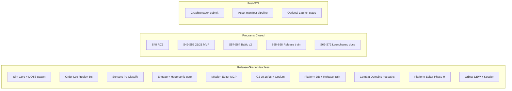

# Project Dashboard Snapshot — 2026-06-25 (pm)

Archived snapshot preserved from `docs/reports/project-dashboard.md` at generation time.

**Generated**: 2026-06-25  
**Last Updated**: 2026-06-25T18:00:00Z  
**Run Label**: pm (post–S72 commercial launch prep closeout / Release stage)  
**Stage**: **Release** — RC1 cut (S48); S49–S56 internal engineering **COMPLETE**; S57–S64 Baltic v2 **COMPLETE**; S65–S68 release train **COMPLETE**; S69–S72 commercial launch prep **COMPLETE**  
**Analysis Scope**: Full project  
**Compared to**: [dashboard-snapshots/2026-06-19-pm.md](dashboard-snapshots/2026-06-19-pm.md) (prior dashboard)

---

## Executive Summary

In six days since the last dashboard, the program advanced from **Sprint 32 kickoff (1/13)** through **Sprints 33–72**: release-train manifest and quarantine triage (S32–S33), Release enablement (S39–S48 / RC1), post-release internal engineering with **21/21 MVP program exit** (S49–S56), **Baltic v2 content expansion** (S57–S64 — 10 scenario policies + 9 v2 replay goldens), **release train ops** (S65–S68 — unified manifest, Buildkite baseline, branch protection), and **commercial launch prep** (S69–S72 — store drafts, i18n pipeline spec, launch doc pack, checklist v3).

GitNexus at indexed commit `28c582d` reports **~20,174 nodes** and **~37,840 edges** (MCP list_repos 2026-06-25; index **stale** vs HEAD `b2c9411` — re-analyze recommended). AGENTS.md baseline cites **20,193 symbols / 37,859 relationships**. **`dotnet test ProjectAegis.sln`** reports **1,232 passing** tests with **0 failures** (live verify 2026-06-25).

Production tracking is **mature at Release scale**: **80** sprint plan files, **63** epics, **176** story files, and `production/sprint-status.yaml` with **287** completed story entries. All closed programs through **S72** gate PASS; human ack recorded for S68 and S72 ("i provide the ack" 2026-06-25).

The [vertical slice gate](../production/vertical-slice/gate-2026-06-02.md) remains **PROCEED** (superseded for ops by release-train and commercial-launch boundaries). **C2 proxy** is **18/18 PASS** via headless PlayMode smoke (expanded from 16/16 at S31); live Unity Editor screenshots remain advisory polish.

Game Requirements **documentation** for 01–20 is **complete**; **MVP program exit** achieved **21/21** at S56 internal engineering gate (tracker: [implementation-tracker-2026-06-04.md](../../Game-Requirements/implementation-tracker-2026-06-04.md)).

**Current focus:** Post–S72 integration — Graphite stack submit for S66/S67/S70/S71 payloads; optional **Launch** stage decision (explicit human gate; S72 does not auto-advance stage); forward roadmap beyond S72 TBD per [`future-sprint-roadpmap-062526.md`](../future-sprint-roadpmap-062526.md).

**Blocking / open gates:**

| Source | Finding |
|--------|---------|
| Graphite / trunk | **GT submit pending** — resolve prior S66/S67 staged payload + trunk sync before `gt submit --stack` (see [smoke-sprint-72-closeout-2026-06-25.md](../../production/qa/smoke-sprint-72-closeout-2026-06-25.md)) |
| GitNexus | Index **stale** (`28c582d` indexed vs `b2c9411` HEAD) — run `node .gitnexus/run.cjs analyze` post-submit |
| Stage | **Release** (not Launch) — S72 prep-complete ack only; full Launch requires separate decision |
| Unity QA | Headless **18/18 PASS**; live Editor PNG re-capture advisory |
| Architecture | **CONCERNS** overall — refresh recommended post–S57–S72 surface (DOTS, orbital DEW, Baltic v2, release ops) |
| GitNexus watchlist | `CatalogWriteGate` **178 CRIT**; `DelegationBridge` **127 CRIT**; `PatrolCandidateEngagePolicy` **97 CRIT**; `BalticReplayHarness` **52 CRIT** |
| Assets | No `design/assets/asset-manifest.md` — pipeline **0%** (art bible exists at `design/art/art-bible.md`) |
| E7 commercial | Prep **COMPLETE** (S69–S72) — store submission / revenue launch **not in scope** until future decision |

---

## Since Last Update (vs 2026-06-19 dashboard)

Comparison anchor: [2026-06-19-pm.md](dashboard-snapshots/2026-06-19-pm.md).

| Signal | 2026-06-19 | 2026-06-25 (this run) | Delta |
|--------|------------|------------------------|-------|
| Indexed commit | `d3db76d` | `b2c9411` (index @ `28c582d`, stale) | +6 days dev |
| GitNexus nodes | 14,424 | **~20,174** (MCP) / **20,193** (AGENTS) | **+5,750–5,769 (+40%)** |
| GitNexus edges | 29,218 | **~37,840** / **37,859** | **+8,622–8,641 (+30%)** |
| Execution flows | 300 | **300** | Stable count |
| Stage | Production (S32 in flight) | **Release** (RC1 + programs closed) | S48 gate + S65–S72 |
| Sprint plans | 32 | **80** | +48 (S33–S72 + release trains) |
| Epics / stories | 49 / 132 | **63 / 176** | +14 / +44 |
| `sprint-status.yaml` done | 245 | **287** | +42 |
| C# source files (excl. tests) | 523 | **565** | **+42** |
| C# test files | 310 | **341** | **+31** |
| `dotnet test` (solution) | 1,006 passed | **1,232 passed**, 0 failed | **+226 (+22%)** |
| ReplayGolden suite | 6/6 PASS | **6/6 PASS** (incl. Baltic v2 cases) | Stable count; +9 v2 golden files on disk |
| C2 proxy smoke | 16/16 PASS WITH NOTES | **18/18 PASS** | +2 checks (HYPERSONIC, expanded matrix) |
| Baltic production hash | `17144800277401907079` | **preserved** | Invariant held |
| Current sprint | Sprint 32 (1/13) | **S72 COMPLETE** — post-program integration | Commercial launch prep closed |
| MVP tracker | 20/20 Partial | **21/21 program exit** (S56) | Internal engineering gate |
| Req 06 corpus | Full corpora off-CI | **+ unified manifest + Baltic v2 manifest** | S65–S66 release train |
| Req 09 Near Future | Partial | **DOTS spawn + MASS tier** (S53) | ADR-005 path |
| Req 10 Speculative | Partial+ | **Orbital DEW + Kessler** (S54) | 9/9 runtime tests |
| Req 20 C2 UI | Partial | **Cesium globe + HYPERSONIC_ALERT** (S55) | Production globe slice |
| Art bible | Template only | **`design/art/art-bible.md`** (S43) | Content wave 2 |
| CI | S31-12 deferred | **Buildkite baseline + branch protection** (S67) | Release train hardening |

---

## GitNexus Code Intelligence

**Index status:** **Stale** (indexed 2026-06-25 @ `28c582d`; HEAD `b2c9411` — re-run analyze after GT submit)

| Metric | Value |
|--------|-------|
| Indexed commit | `28c582d` (HEAD `b2c9411`) |
| Nodes (symbols) | ~20,174 (MCP) / 20,193 (AGENTS.md) |
| Edges (relationships) | ~37,840 / 37,859 |
| Execution flows | 300 |
| detect-changes | Use repo-scoped MCP before commits |

### Watchlist Symbol Risk (upstream impact)

| Symbol | Risk | Notes |
|--------|------|-------|
| `CatalogWriteGate` | **CRITICAL (178)** | Corpus + manifest + TL export — extend-only |
| `DelegationBridge` | **CRITICAL (127)** | **ZERO touch** — adapter-only consumers |
| `PatrolCandidateEngagePolicy` | **CRITICAL (97)** | AAR/policy seam — S57 fix retained |
| `BalticReplayHarness` | **CRITICAL (52)** | Replay goldens + hash invariant |
| `DecisionLog` | **HIGH** | Order-log evolution |
| `DelegationOrchestrator` | **HIGH** | Engage / tick integration |
| `UnifiedReleaseTrainManifest` | **HIGH** | S65–S66 release train |
| `SimTickPipeline` | LOW | Tick ordering stable per ADR-004 |

**Implication:** Prefer `ICatalogReader` / `IWriteGate` / release-train seams; avoid direct SQLite from Sim/Delegation; run `gitnexus impact` before any catalog/orchestrator edit.

---

## Sprint Status

**Status:** Sprints **1–72** delivered across MVP, Release enablement, internal engineering, Baltic v2, release train, and commercial launch prep. Stage **Release** in `production/stage.txt`.

| Metric | Value |
|--------|-------|
| Sprint plan files | 80 |
| Epics | 63 |
| Story files | 176 |
| `sprint-status.yaml` done entries | **287** |
| Current solution tests | **1,232** (Sim 279 + Delegation 247 + Data 406 + UnityAdapter 252 + Cli 43 + Excel 5) |
| ReplayGolden suite | **6/6** PASS |
| Unity C2 sign-off | **18/18 PASS** (headless PlayMode smoke) |
| Baltic v2 policies | **10** `baltic-v2-*` scenario policies |
| Baltic v2 replay goldens | **9** isolated v2 golden files (+ production 6/6 suite) |
| Regression golden files (disk) | **29** under `tests/regression/` |

### Program summary (since June 19)

| Program | Sprints | Theme | Status |
|---------|---------|-------|--------|
| Combat / catalog depth | 32–38 | Release train manifest, kill-chain, LinkCatalog, polish | **Complete** |
| Release enablement | 39–48 | Polish hardening → RC1 cut | **Complete** (S48 gate PASS 2026-06-20) |
| Internal engineering | 49–56 | Deferred MVP rows, DOTS, orbital, Cesium, corpora CI | **Complete** (21/21 MVP exit) |
| Baltic v2 content | 57–64 | AAR policy, v2 scenarios, replay goldens | **Complete** (human ack 2026-06-22) |
| Release train ops | 65–68 | Manifest, playtest index, Buildkite, gate | **Complete** (human ack 2026-06-25) |
| Commercial launch prep | 69–72 | Store drafts, i18n spec, launch pack, checklist v3 | **Complete** (human ack 2026-06-25) |

### Active backlog (post–S72)

| ID | Item | Status |
|----|------|--------|
| GT-01 | Resolve S66/S67 staged payload + trunk sync | **Pending user** |
| GT-02 | `gt submit --stack --no-interactive` (S70/S71 stacks) | Ready after GT-01 |
| GN-01 | GitNexus re-index post-submit | Recommended |
| STG-01 | Optional stage → **Launch** | Awaits explicit human decision (not S72 auto) |
| FWD-01 | Post–S72 forward program | TBD — see [`future-sprint-roadpmap-062526.md`](../future-sprint-roadpmap-062526.md) |

### Requirements implementation

From [implementation-tracker-2026-06-04.md](../../Game-Requirements/implementation-tracker-2026-06-04.md) @ S56 gate:

| Req bucket | Count |
|------------|-------|
| MVP **program exit** | **21/21** (S56 internal engineering gate) |
| Requirements **docs** complete | 01–20 |
| Rows still **Partial+** at feature depth | Most rows — multi-year full-game scope beyond Baltic ACs |

**Notable depth since June 19:** S49–S56 closed deferred tracker rows (DOTS, orbital DEW, Cesium, hypersonic UI, corpora CI, AAR sweep); S57–S64 Baltic v2 content; S65–S68 release train manifest + Buildkite; S69–S72 E7 prep artifacts under `production/release/`.

---

## Milestone Tracking

| Field | Value |
|-------|-------|
| Formal milestone (v1.0) | [vertical-slice-mvp.md](../production/milestones/vertical-slice-mvp.md) — **CLOSED** |
| RC1 / Release | [s48-release-gate-2026-06-20.md](../production/gate-checks/s48-release-gate-2026-06-20.md) |
| Baltic v2 | [s57-s64-program-closeout-2026-06-22.md](../production/qa/s57-s64-program-closeout-2026-06-22.md) |
| Release train | [s68-release-train-gate-2026-06-25.md](../production/gate-checks/s68-release-train-gate-2026-06-25.md) |
| Commercial launch prep | [s72-commercial-launch-prep-gate-2026-06-25.md](../production/gate-checks/s72-commercial-launch-prep-gate-2026-06-25.md) |
| Stage | **Release** (`production/stage.txt`) |
| Gate verdict (vertical slice) | **PROCEED** (historical; superseded by Release gates) |
| Must-ship criteria | Headless plan→fight→replay, classify FSM, sensor C2 — **met and locked** |
| Outstanding for commercial ship | Store submission, production i18n, live Editor evidence, asset pipeline, explicit Launch stage decision |

---

## Completeness Overview

### Design Documentation

- **Status:** ~**60%** systems with linked GDDs (12 / 20 in [systems-index.md](../../design/gdd/systems-index.md); index last refreshed Sprint 19)
- **GDD files:** 18 under `design/gdd/`
- **Art bible:** **`design/art/art-bible.md`** (S43 content wave 2)
- **Narrative / levels:** Still absent
- **Game Requirements:** 26 files + master index + **implementation tracker**

**Vs June 19:** Art bible added; GDD count unchanged at 18.

### Architecture Documentation

- **ADRs:** **12** accepted-style records (001–011 + Spirit1 frozen-hub ADR 2026-06-20)
- **Architecture review (2026-06-02):** **CONCERNS** — refresh recommended post–S54–S72 (DOTS, speculative, release ops)
- **Blockers C1–C4:** **Closed** (order log, combat outcomes, ROE, EMCON)
- **Master architecture:** `docs/architecture/architecture.md` — still **Draft**

### Production Management

- **Status:** ~**95%** for Release engineering track (80 sprints, 63 epics, 176 stories, gate docs S48–S72)
- **Release artifacts:** `production/release/` — store drafts, i18n spec, launch pack, checklist v3, evidence index
- **Determinism / replay:** Audits + golden replay **6/6** PASS; hash **`17144800277401907079`** pinned
- **QA:** S68 + S72 gate smokes **APPROVED**; Buildkite baseline (S67)

**Vs June 19:** Production tracking scaled from Sprint 32 to full Release + E7 prep program.

### Source Code & Tests

| Metric | 2026-06-19 | 2026-06-25 |
|--------|------------|------------|
| C# source files (excl. tests) | 523 | **565** |
| C# test files | 310 | **341** |
| Test projects | 6 | **6** |
| Solution tests passing | 1,006 | **1,232** |

**Assemblies:** `ProjectAegis.Data`, `ProjectAegis.Data.Excel`, `Sim`, `Delegation`, `Delegation.UnityAdapter`, `MissionEditor.Cli`, `Delegation.Demo`.

### MVP Systems Progress (Inferred)



---

## Asset Manifest

**Source:** `design/assets/asset-manifest.md` — **does not exist**

| Category | Needed | Done | Notes |
|----------|--------|------|-------|
| Master asset manifest | 1 | 0 | Unchanged since May 31 |
| Art Bible | 1 | **1** | `design/art/art-bible.md` (S43) |
| Game art/audio pipeline | TBD | ~0 | No `assets/` production pipeline |

**Overall asset progress:** **~5%** (art bible only; manifest + Addressables still absent)

---

## Gaps Identified

### Critical (velocity / integration)

1. **Graphite stack submit** — S66/S67 staged payload + trunk resolution blocks S70/S71 PR stacks
2. **GitNexus re-index** — stale index vs HEAD after S69–S72 doc commits
3. **No asset pipeline** — blocks visual production and Addressables work despite art bible

### Important (velocity / quality)

4. **Launch stage decision** — S72 ack is prep-complete only; no auto-advance to Launch
5. **Live Unity Editor evidence** — headless 18/18 sufficient for merge; PNG polish advisory
6. **GitNexus CRITICAL symbols** — impact analysis mandatory before orchestrator/catalog edits
7. **TR architecture gaps** — refresh `/architecture-review` after S54–S72 speculative + DOTS surface
8. **Store / i18n production** — S69–S72 produced **specs and drafts only** (no submission, no locale production)

### Resolved since June 19

9. ~~Sprint 32 in flight (1/13)~~ → **S32–S72 programs COMPLETE**
10. ~~20/20 MVP partial only~~ → **21/21 MVP program exit** (S56)
11. ~~16/16 C2 checks~~ → **18/18** headless proxy (HYPERSONIC + expanded matrix)
12. ~~1,006 tests~~ → **1,232** tests green (monotonic)
13. ~~32 sprint plans~~ → **80** sprints documented; Release + E7 prep closed
14. ~~No art bible~~ → **`design/art/art-bible.md`** published
15. ~~Release train manifest missing~~ → **S65–S66** unified manifest + Baltic v2 evidence pack
16. ~~Baltic v1 only~~ → **Baltic v2** 10 policies + 9 v2 goldens (hash preserved on production path)
17. ~~S31-12 CI hygiene deferred~~ → **S67** Buildkite baseline + branch protection

### Nice-to-have

18. Forward roadmap beyond S72 (E9 content, multiplayer — explicitly out of S69–S72 scope)
19. Refresh `production/dashboard-state.yaml` on every `/project-dashboard` run
20. Update stable alias `docs/reports/future-sprint-roadpmap.md` → `062526` snapshot if not already synced

---

## Recommended Next Steps

### Immediate Priority

1. **Resolve GT trunk + staged payload** — per [smoke-sprint-66-closeout.md](../../production/qa/smoke-sprint-66-closeout.md) + [smoke-sprint-72-closeout-2026-06-25.md](../../production/qa/smoke-sprint-72-closeout-2026-06-25.md)
2. **`gt submit --stack --no-interactive`** for S70/S71 after sync/restack + full gate re-verify
3. **`node .gitnexus/run.cjs analyze`** post-merge — refresh index to HEAD

### Short-Term

4. **Human Launch stage decision** — if desired, update `production/stage.txt` with explicit ack (separate from S72 prep ack)
5. **`/asset-spec`** — derive manifest from art bible + store asset-checklist (S70)
6. **Live Editor batch** — optional PNG re-capture on Windows/macOS host for polish evidence index

### Medium-Term

7. **Post–S72 forward program** — `/sprint-plan` for next epic bucket per user scope (E9 content, gameplay depth, etc.)
8. **`/architecture-review`** — post–S72 TR refresh for DOTS + speculative + release-train surface
9. **Commercial launch execution** — only after explicit scope expansion beyond S72 prep (store submission, locale production)

---

## Follow-Up Skills to Run

| Gap / Trigger | Skill or Command |
|---------------|------------------|
| Dashboard refresh | `/project-dashboard` |
| GT stack submit | `gt sync`, `gt restack`, `gt submit --stack --no-interactive` |
| Catalog / DB work | `sqlite-schema-management`, `provenance-audit-modeling` |
| Pre-merge safety | `node .gitnexus/run.cjs analyze` + `gitnexus impact` (repo: cmano-clone) |
| Determinism | `/replay-verify`, `/determinism-audit` |
| Stage / gate | `/gate-check`, `/milestone-review` |
| Launch decision | Human ack + update `production/stage.txt` |
| Asset pipeline | `/asset-spec` (from art bible + S70 checklist) |
| Live C2 polish | `team-qa` + Unity Editor host |

---

## Appendix: File Counts by Directory

```
design/
  gdd/              18 files
  art/               1 file (art-bible.md)
  narrative/         0 files
  levels/            0 files
  assets/            0 files (no manifest)

docs/
  architecture/     12 ADRs + architecture + traceability
  reports/           dashboard + snapshots/ + roadmaps (062526 active)

production/
  sprints/          80 files
  milestones/        2+ files
  epics/            63 EPIC.md + 176 stories
  release/          store, i18n, launch, checklist-v3 (S69-S72)
  gate-checks/      s48, s56, s68, s72 gates
  determinism/       replay + audits
  qa/                smoke + sign-offs (S27–S72)
  agentic/           sprint stacks + PI closure docs

Game-Requirements/   26+ requirements + tracker (21/21 exit)

src/
  source (.cs)       565 files (excl. Tests)
  test (.cs)         341 files

tests/regression/    29 replay golden files
data/scenarios/      10 baltic-v2-* policies
prototypes/          0
```

---

*Generated by producer agent — aggregated from production, design, architecture, GitNexus, Game Requirements tracker, sprint-status.yaml, future-sprint-roadpmap-062526.md, and live `dotnet test` verification (2026-06-25)*
