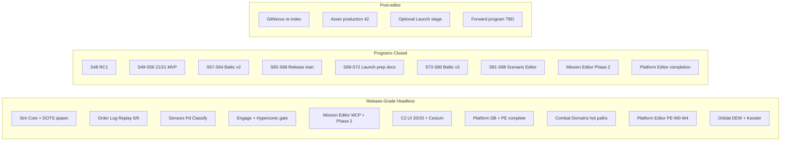

# Project Dashboard Snapshot — 2026-07-09 (am)

Archived snapshot preserved from `docs/reports/project-dashboard.md` at generation time.

**Generated**: 2026-07-09  
**Last Updated**: 2026-07-09T14:22:00Z  
**Run Label**: am (post–S80 Baltic v3 / S81–S88 scenario editor / Mission Editor Phase 2 / Platform Editor completion)  
**Stage**: **Release** — RC1 cut (S48); programs through **S88** headless scenario editor **COMPLETE**; Mission Editor Phase 2 **COMPLETE**; Platform Editor (req 21) **COMPLETE** + adversarial hardening (1599/0)  
**Analysis Scope**: Full project  
**Compared to**: [2026-06-25-pm.md](2026-06-25-pm.md) (prior dashboard)

---

## Executive Summary

In fourteen days since the last dashboard, the program advanced from **post–S72 commercial launch prep** through **S73–S80 Baltic v3 content expansion** (human ack **"Baltic v3 content-complete"**), **S81–S88 Scenario Editor** (req 11 / E11 headless + AC-8 host path), **scenario-editor-completion** (SE-W0–W3), **Mission Editor Phase 2** (ME-W0–W3; ack **"Mission editor Phase 2 complete"**), and **Platform Editor completion** (PE-W0–W4; ack **"Platform editor requirements complete"**) plus **adversarial TDD hardening** on trunk.

GitNexus at indexed commit `80001c2` reports **24,262 nodes** and **46,367 edges** (MCP list_repos 2026-07-09; index **9 commits behind** HEAD `223a5fe` — re-analyze recommended). AGENTS.md baseline cites **24,262 symbols / 46,367 relationships**. Live **`dotnet test ProjectAegis.sln`** reports **1,599 passing** tests with **0 failures** (verify 2026-07-09: Sim 311 + Delegation 260 + UnityAdapter 286 + Excel 24 + Data 616 + Cli 102).

Production tracking remains **mature at Release scale**: **131** sprint plan files, **70** epics, **264** story files, and `production/sprint-status.yaml` with **287** completed story-status entries (plus extensive program closeout blocks through S88 / PE / ME Phase 2). Stage remains **Release** — no Launch advance.

The [vertical slice gate](../../production/vertical-slice/gate-2026-06-02.md) remains **PROCEED** (historical). **C2 proxy** is **20/20 PASS** via headless PlayMode smoke (expanded from 18/18 at S72); ReplayGolden **6/6**; Baltic production hash **`17144800277401907079`** preserved (18 paths).

Game Requirements **documentation** for 01–20 is **complete**; **MVP program exit** remains **21/21** at S56; req **11** and **21** residual ACs closed via completion epics (2026-07-08/09). Tracker: [implementation-tracker-2026-07-04.md](../../../Game-Requirements/implementation-tracker-2026-07-04.md).

**Current focus:** Post–editor completion integration — GitNexus re-index to HEAD; optional forward program beyond S88 / PE / ME Phase 2; asset production from existing manifest; optional Launch stage decision (still explicit human gate).

**Blocking / open gates:**

| Source | Finding |
|--------|---------|
| GitNexus | Index **stale** (`80001c2` indexed vs `223a5fe` HEAD, 9 commits) — run `node .gitnexus/run.cjs analyze` |
| Stage | **Release** (not Launch) — S72/S80/S88/PE/ME acks do not auto-advance stage |
| Forward roadmap | S81–S88 train **closed on trunk**; next epic bucket TBD (alias still points at [`future-sprint-roadpmap-07042026.md`](../future-sprint-roadpmap-07042026.md)) |
| Unity QA | Headless **20/20 PASS**; live Editor PNG / Phase N screenshots still residual |
| Architecture | **CONCERNS** overall — refresh recommended post–editor + PE surface |
| GitNexus watchlist | `ScenarioDocumentEditor` **233 CRIT**; `CatalogWriteGate` **183 CRIT**; `DelegationBridge` **145 CRIT**; `PatrolCandidateEngagePolicy` **113 CRIT**; `BalticReplayHarness` **54 CRIT** |
| Assets | Manifest **exists** (`design/assets/asset-manifest.md`) — **42** needed / **0** done (~spec-only) |
| E7 commercial | Prep **COMPLETE** (S69–S72) — store submission / revenue launch **not in scope** |

---

## Since Last Update (vs 2026-06-25 dashboard)

Comparison anchor: [2026-06-25-pm.md](2026-06-25-pm.md). See also [2026-06-25-pm-addendum.md](2026-06-25-pm-addendum.md) (GT-01/02 resolved same day).

| Signal | 2026-06-25 | 2026-07-09 (this run) | Delta |
|--------|------------|------------------------|-------|
| Indexed commit | `28c582d` (HEAD `b2c9411`, stale) | `80001c2` (HEAD `223a5fe`, 9 behind) | +14 days; PE/SE/ME land |
| GitNexus nodes | ~20,174 / 20,193 | **24,262** | **+4,069–4,088 (~+20%)** |
| GitNexus edges | ~37,840 / 37,859 | **46,367** | **+8,508–8,527 (~+22%)** |
| Execution flows | 300 | **300** | Stable count |
| Communities / clusters | — | **432** | Indexed |
| Stage | Release (post–S72) | **Release** (post–S88 / PE / ME P2) | No Launch advance |
| Sprint plans | 80 | **131** | +51 (S73–S88 + completion waves) |
| Epics / stories | 63 / 176 | **70 / 264** | +7 / +88 |
| `sprint-status.yaml` done | 287 | **287** | Stable entry count; program blocks expanded |
| C# source files (excl. tests) | 565 | **609** | **+44** |
| C# test files | 341 | **403** | **+62** |
| `dotnet test` (solution) | 1,232 passed | **1,599 passed**, 0 failed | **+367 (+30%)** |
| ReplayGolden suite | 6/6 PASS | **6/6 PASS** | Stable |
| C2 proxy smoke | 18/18 PASS | **20/20 PASS** | +2 checks |
| Baltic production hash | preserved | **preserved** (18 paths) | Invariant held |
| Baltic v2 policies | 10 | **11** | +1 on disk |
| Baltic v3 policies / goldens | untracked / pending | **6 / 6** committed | S73–S80 landed |
| Regression golden files | 29 | **35** | +6 v3 (+ related) |
| Asset manifest | missing | **present** (42 Needed / 0 Done) | Phase B delivered |
| ADRs | 12 | **18** files (001–011, 013–017 + Spirit1) | +6 editor ADRs |
| Current program | Post–S72 GT / forward TBD | **Editors complete** — forward TBD | S73–S88 + PE + ME P2 |
| Req 11 Scenario Editor | Partial | **Headless + AC-8 COMPLETE**; Phase 2 GUI residual deferred | S81–S88 + SE epic |
| Req 21 Platform Editor | Partial+ | **Requirements COMPLETE** (PE-W0–W4 + adversarial) | 2026-07-09 ack |

---

## GitNexus Code Intelligence

**Index status:** **Stale** (indexed 2026-07-09 @ `80001c2`; HEAD `223a5fe` — 9 commits behind; re-run analyze)

| Metric | Value |
|--------|-------|
| Indexed commit | `80001c2` (HEAD `223a5fe`) |
| Nodes (symbols) | **24,262** |
| Edges (relationships) | **46,367** |
| Files | 2,882 |
| Communities | 432 |
| Execution flows | 300 |
| detect-changes | Use repo-scoped MCP before commits |

### Watchlist Symbol Risk (upstream impact)

| Symbol | Risk | Notes |
|--------|------|-------|
| `ScenarioDocumentEditor` | **CRITICAL (233)** | Scenario authoring hub — CLI/MCP + Unity editor consumers |
| `CatalogWriteGate` | **CRITICAL (183)** | Corpus + manifest + TL export — extend-only |
| `DelegationBridge` | **CRITICAL (145)** | **ZERO touch** — adapter-only consumers |
| `PatrolCandidateEngagePolicy` | **CRITICAL (113)** | AAR/policy seam |
| `BalticReplayHarness` | **CRITICAL (54)** | Replay goldens + hash invariant |
| `DecisionLog` | **HIGH** | Order-log evolution |
| `DelegationOrchestrator` | **HIGH** | Engage / tick integration |
| `SimTickPipeline` | LOW | Tick ordering stable per ADR-004 |

**Implication:** Prefer authoring/CLI seams and `ICatalogReader` / `IWriteGate`; never rewrite `CatalogWriteGate` write paths or touch `DelegationBridge` hotpath; run `gitnexus impact` before catalog/orchestrator/editor edits.

---

## Sprint Status

**Status:** Sprints **1–88** delivered across MVP, Release enablement, internal engineering, Baltic v2/v3, release train, commercial launch prep, and scenario editor. Completion epics for scenario editor, Mission Editor Phase 2, and Platform Editor closed 2026-07-08/09. Stage **Release** in `production/stage.txt`.

| Metric | Value |
|--------|-------|
| Sprint plan files | **131** |
| Epics | **70** |
| Story files | **264** |
| `sprint-status.yaml` done entries | **287** |
| Current solution tests | **1,599** (Sim 311 + Delegation 260 + Data 616 + UnityAdapter 286 + Cli 102 + Excel 24) |
| ReplayGolden suite | **6/6** PASS |
| Unity C2 sign-off | **20/20 PASS** (headless PlayMode smoke) |
| Baltic v2 policies | **11** `baltic-v2-*` |
| Baltic v3 policies / goldens | **6** / **6** isolated |
| Regression golden files (disk) | **35** under `tests/regression/` |

### Program summary (since June 25)

| Program | Sprints / Waves | Theme | Status |
|---------|-----------------|-------|--------|
| Baltic v3 content | S73–S80 | Dual-side triggers, playtest loop, C2 UX v3, content gate | **Complete** (ack 2026-06-26) |
| Scenario Editor | S81–S88 | Headless authoring, validation, CLI/MCP, AC-8 host path | **Complete** (headless; SE gate ack package) |
| Scenario editor completion | SE-W0–W3 | Doc honesty + AC-8 productionize + gate | **Complete** (ack package ready / collected at SE-W3) |
| Mission Editor Phase 2 | ME-W0–W3 | Mission Board, event graph, sides/timeline (headless) | **Complete** (ack 2026-07-09) |
| Platform Editor completion | PE-W0–W4 | Enum validation, quarantine, TRL, provenance, gate | **Complete** (ack 2026-07-09) |
| PE adversarial hardening | CROSS + W1/W2 tracks | Real bugs + 1599/0 pins | **Complete** (2026-07-09) |

### Active backlog (post–editor completion)

| ID | Item | Status |
|----|------|--------|
| GN-01 | GitNexus re-index to HEAD `223a5fe` | Recommended |
| FWD-01 | Post–S88 / PE / ME forward program | TBD — update dated roadmap when scoped |
| STG-01 | Optional stage → **Launch** | Awaits explicit human decision |
| ASSET-01 | Produce assets from manifest (42 Needed) | Spec-only; production pipeline open |
| PNG-01 | Phase N / live Editor screenshot pack | Residual (PE-W3 honesty defer) |
| ARCH-01 | `/architecture-review` post–editor + PE | Recommended |

### Requirements implementation

From [implementation-tracker-2026-07-04.md](../../../Game-Requirements/implementation-tracker-2026-07-04.md) + 2026-07-08/09 completion gates:

| Req bucket | Count |
|------------|-------|
| MVP **program exit** | **21/21** (S56; held) |
| Requirements **docs** complete | 01–20 |
| Req 11 Scenario / Mission Editor | Headless + AC-8 **COMPLETE**; Phase 2 GUI residual deferred |
| Req 21 Platform Editor | **COMPLETE** (PE-W0–W4) |
| Rows still **Partial+** at feature depth | Most other rows — multi-year full-game scope beyond Baltic ACs |

**Notable depth since June 25:** Baltic v3 content + playtest; full scenario editor train; Mission Editor Phase 2 headless; Platform Editor residual ACs + adversarial hardening; asset manifest authored; ADRs 013–017.

---

## Milestone Tracking

| Field | Value |
|-------|-------|
| Formal milestone (v1.0) | [vertical-slice-mvp.md](../../production/milestones/vertical-slice-mvp.md) — **CLOSED** |
| RC1 / Release | [s48-release-gate-2026-06-20.md](../../production/gate-checks/s48-release-gate-2026-06-20.md) |
| Baltic v2 | [s57-s64-program-closeout-2026-06-22.md](../../production/qa/s57-s64-program-closeout-2026-06-22.md) |
| Release train | [s68-release-train-gate-2026-06-25.md](../../production/gate-checks/s68-release-train-gate-2026-06-25.md) |
| Commercial launch prep | [s72-commercial-launch-prep-gate-2026-06-25.md](../../production/gate-checks/s72-commercial-launch-prep-gate-2026-06-25.md) |
| Baltic v3 | [smoke-sprint-73-80-closeout-2026-06-26.md](../../production/qa/smoke-sprint-73-80-closeout-2026-06-26.md) (S80 ack **"Baltic v3 content-complete"**) |
| Scenario Editor | [s88-scenario-editor-gate-2026-07-04.md](../../production/gate-checks/s88-scenario-editor-gate-2026-07-04.md) + [se-completion-gate-2026-07-08.md](../../production/gate-checks/se-completion-gate-2026-07-08.md) |
| Mission Editor Phase 2 | [mission-editor-phase2-gate-2026-07-09.md](../../production/qa/mission-editor-phase2-gate-2026-07-09.md) |
| Platform Editor | [platform-editor-completion-gate-2026-07-09.md](../../production/qa/platform-editor-completion-gate-2026-07-09.md) |
| Stage | **Release** (`production/stage.txt`) |
| Gate verdict (vertical slice) | **PROCEED** (historical; superseded by Release gates) |
| Must-ship criteria | Headless plan→fight→replay, classify FSM, sensor C2 — **met and locked** |
| Outstanding for commercial ship | Store submission, production i18n, live Editor evidence, asset production, explicit Launch stage decision |

---

## Completeness Overview

### Design Documentation

- **Status:** ~**60%** systems with linked GDDs (12 / 20 in [systems-index.md](../../../design/gdd/systems-index.md); index last refreshed Sprint 19)
- **GDD files:** 18 under `design/gdd/`
- **Art bible:** **`design/art/art-bible.md`**
- **Asset manifest:** **`design/assets/asset-manifest.md`** (42 Needed / 0 Done)
- **Narrative / levels:** Still absent
- **Game Requirements:** 26+ files + master index + **implementation tracker** (2026-07-04)

**Vs June 25:** Asset manifest added; GDD count unchanged at 18.

### Architecture Documentation

- **ADRs:** **18** files (001–011, 013–017 + Spirit1 frozen-hub) — editor topology, Lua scope, CMO import, event-graph caps, agent transparency
- **Architecture review (2026-06-02):** **CONCERNS** — refresh recommended post–S73–S88 / PE / ME Phase 2
- **Blockers C1–C4:** **Closed**
- **Master architecture:** `docs/architecture/architecture.md` — still **Draft**

### Production Management

- **Status:** ~**98%** for Release engineering track (131 sprints, 70 epics, 264 stories, gates through S88 / PE / ME P2)
- **Release artifacts:** `production/release/` — store drafts, i18n spec, launch pack, checklist v3
- **Determinism / replay:** Audits + golden replay **6/6** PASS; hash **`17144800277401907079`** pinned
- **QA:** S80 + S88 + SE + ME Phase 2 + PE gates **APPROVED**; adversarial PE evidence on trunk

**Vs June 25:** Baltic v3 + scenario/mission/platform editor programs closed; GT-01/02 resolved (addendum).

### Source Code & Tests

| Metric | 2026-06-25 | 2026-07-09 |
|--------|------------|------------|
| C# source files (excl. tests) | 565 | **609** |
| C# test files | 341 | **403** |
| Test projects | 6 | **6** |
| Solution tests passing | 1,232 | **1,599** |

**Assemblies:** `ProjectAegis.Data`, `ProjectAegis.Data.Excel`, `Sim`, `Delegation`, `Delegation.UnityAdapter`, `MissionEditor.Cli`, `Delegation.Demo`.

### MVP Systems Progress (Inferred)



---

## Asset Manifest

**Source:** `design/assets/asset-manifest.md` — **exists** (authored 2026-06-25 Phase B)

| Category | Needed | Done | Notes |
|----------|--------|------|-------|
| Master asset manifest | 1 | **1** | Present |
| Priority stubs (C2 / Baltic / store) | 3 | 0 | Specs only |
| Art Bible | 1 | **1** | `design/art/art-bible.md` |
| Catalogued assets | 42 | 0 | All **Needed** |
| Game art/audio pipeline | TBD | ~0 | Addressables production still open |

**Overall asset progress:** **~10%** (manifest + art bible + specs; zero produced assets)

---

## Gaps Identified

### Critical (velocity / integration)

1. **GitNexus re-index** — 9 commits behind HEAD after PE adversarial merges
2. **No produced assets** — manifest exists but 0/42 Done; blocks visual production
3. **Forward program undefined** — S81–S88 / PE / ME Phase 2 closed; next dated roadmap not yet authored

### Important (velocity / quality)

4. **Launch stage decision** — still explicit human gate; stage remains Release
5. **Live Unity Editor evidence** — headless 20/20 sufficient for merge; Phase N PNG residual
6. **GitNexus CRITICAL symbols** — impact analysis mandatory; `ScenarioDocumentEditor` now largest hub (233)
7. **TR architecture gaps** — refresh `/architecture-review` after editor + PE surface
8. **Store / i18n production** — S69–S72 specs/drafts only (unchanged)

### Resolved since June 25

9. ~~GT-01/02 Graphite trunk + staged payload~~ → **RESOLVED** (2026-06-25 addendum)
10. ~~Post–S72 forward TBD only~~ → **S73–S80 Baltic v3 COMPLETE**
11. ~~Scenario editor not started~~ → **S81–S88 + SE completion COMPLETE**
12. ~~Mission Editor Phase 2 open~~ → **COMPLETE** (ack 2026-07-09)
13. ~~Platform Editor residual ACs~~ → **COMPLETE** + adversarial hardening
14. ~~1,232 tests~~ → **1,599** tests green (monotonic)
15. ~~18/18 C2~~ → **20/20** headless proxy
16. ~~No asset manifest~~ → **`design/assets/asset-manifest.md`** published
17. ~~Baltic v3 untracked~~ → **6 policies + 6 goldens** on trunk
18. ~~GitNexus ~20k symbols~~ → **24,262** symbols / **46,367** edges

### Nice-to-have

19. Author next dated `future-sprint-roadpmap-YYYYMMDD.md` and retarget stable alias
20. Refresh `production/dashboard-state.yaml` on every `/project-dashboard` run (this run)
21. Agent/skill hygiene from [tech-stack-agent-skill-recommendations-2026-07-08.md](../tech-stack-agent-skill-recommendations-2026-07-08.md)

---

## Recommended Next Steps

### Immediate Priority

1. **`node .gitnexus/run.cjs analyze`** — refresh index to HEAD `223a5fe`
2. **Scope next forward program** — `/sprint-plan` or dated roadmap for post-editor epic bucket
3. **Keep standing invariants** — hash, Replay 6/6, C2 ≥20/20, ZERO `DelegationBridge`, Catalog extend-only

### Short-Term

4. **Human Launch stage decision** — if desired, update `production/stage.txt` with explicit ack
5. **Asset production wave** — pick ASSET-001…003 stubs from manifest
6. **Phase N Editor PNG pack** — optional polish evidence (PE residual)

### Medium-Term

7. **`/architecture-review`** — post–editor + PE TR refresh
8. **Commercial launch execution** — only after explicit scope beyond S72 prep
9. **Agent/skill doc sync** — per 2026-07-08 tech-stack recommendations (Input Manager truth, MCP routing)

---

## Follow-Up Skills to Run

| Gap / Trigger | Skill or Command |
|---------------|------------------|
| Dashboard refresh | `/project-dashboard` |
| Pre-merge safety | `node .gitnexus/run.cjs analyze` + `gitnexus impact` (repo: cmano-clone) |
| Determinism | `/replay-verify`, `/determinism-audit` |
| Stage / gate | `/gate-check`, `/milestone-review` |
| Launch decision | Human ack + update `production/stage.txt` |
| Asset production | `/asset-spec` + produce from manifest |
| Forward program | `/sprint-plan` + dated roadmap snapshot |
| Architecture | `/architecture-review` |
| Live C2 polish | `team-qa` + Unity Editor host |

---

## Appendix: File Counts by Directory

```
design/
  gdd/              18 files
  art/               1 file (art-bible.md)
  narrative/         0 files
  levels/            0 files
  assets/            manifest + specs (42 Needed / 0 Done)

docs/
  architecture/     18 ADR files + architecture + traceability
  reports/           dashboard + snapshots/ + roadmaps (07042026 active alias)

production/
  sprints/          131 files
  milestones/        4 files
  epics/            70 EPIC.md + 264 stories
  release/          store, i18n, launch, checklist-v3 (S69-S72)
  gate-checks/      s48, s56, s68, s72, s88, se-completion, …
  determinism/       replay + audits
  qa/                smoke + sign-offs (S27–S88 + PE/ME gates)
  agentic/           sprint stacks + SE/PE status truth

Game-Requirements/   26+ requirements + tracker (21/21 exit; req 11/21 completion)

src/
  source (.cs)       609 files (excl. Tests)
  test (.cs)         403 files

tests/regression/    35 replay golden files
data/scenarios/      11 baltic-v2-* + 6 baltic-v3-* policies
prototypes/          0
```

---

*Generated by producer agent — aggregated from production, design, architecture, GitNexus, Game Requirements tracker, sprint-status.yaml, future-sprint-roadpmap-07042026.md, PE/ME/SE gate packages, and live `dotnet test` verification (2026-07-09)*
