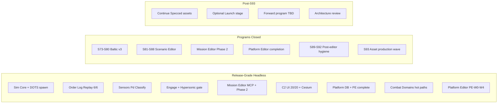

# Project Dashboard Snapshot — 2026-07-10 (pm)

Archived snapshot preserved from `docs/reports/project-dashboard.md` at generation time.

**Generated**: 2026-07-10  
**Last Updated**: 2026-07-10T19:15:00Z  
**Run Label**: pm (post–S89–S92 hygiene COMPLETE + S93 asset production wave)  
**Stage**: **Release** — RC1 cut (S48); programs through **S93** (asset production) **COMPLETE**; Launch deferred  
**Analysis Scope**: Full project  
**Compared to**: [2026-07-09-am.md](2026-07-09-am.md) (prior full dashboard; see also [2026-07-09-am-addendum.md](2026-07-09-am-addendum.md))

---

## Executive Summary

In one day since the 2026-07-09 AM dashboard, the program closed **S89–S92 Post-Editor Engineering Hygiene** (human ack **"i acknowledge"** / "post-editor hygiene program complete") and landed **S93 Asset Production Wave** — first binary assets under `production/assets/` (C2 tokens/atlas/top-bar, Baltic theater framing, store capsules/logos). Manifest moved from **0 Done** to **8 Done / 3 In Production / 27 Specced / 4 Needed**. Stage remains **Release**; Launch / commercial execution stays deferred (explicit checkpoint in `production/stage.txt`).

GitNexus re-analyzed 2026-07-10 @ HEAD `45035c6` reports **24,729 nodes** and **47,512 edges** (**427** clusters / **300** flows / **2,925** files) — index **fresh**. Standing gates from S93 closeout: build **0e/0w**, **1,599/0f**, ReplayGolden **6/6**, C2 proxy **20/20**, hash **`17144800277401907079`** preserved (**18** canonical paths), DelegationBridge **ZERO**, UA engage **3/3**.

Production tracking: **136** sprint plan files, **70** epics, **263** story files, `sprint-status.yaml` with **307** `status: done` entries. Forward roadmap alias → [`future-sprint-roadpmap-07092026.md`](../future-sprint-roadpmap-07092026.md) (S89–S92 COMPLETE; S93 documented).

**Current focus:** Post–S93 forward program TBD; continue asset production for remaining Specced children; optional `/architecture-review`; Launch only on explicit human decision.

**Blocking / open gates:**

| Source | Finding |
|--------|---------|
| Stage | **Release** (not Launch) — S92/S93 acks do not auto-advance stage |
| Forward roadmap | S89–S93 closed on working branch / closeouts; next epic bucket TBD |
| Unity QA | Headless **20/20 PASS**; live Editor PNG pack **deferred** (no Editor host; protocol published) |
| Architecture | **CONCERNS** overall — refresh recommended post–editor + PE + assets |
| GitNexus watchlist | `ScenarioDocumentEditor` **233 CRIT**; `CatalogWriteGate` **186 CRIT**; `DelegationBridge` **145 CRIT**; `PatrolCandidateEngagePolicy` **113 CRIT**; `BalticReplayHarness` **54 CRIT** |
| Assets | Manifest **8 Done / 3 In Production / 27 Specced / 4 Needed** — Addressables import still open |
| E7 commercial | Prep **COMPLETE** (S69–S72) — store submission / revenue launch **not in scope** |

---

## Since Last Update (vs 2026-07-09 AM dashboard)

Comparison anchor: [2026-07-09-am.md](2026-07-09-am.md). Mid-day resolutions also in [2026-07-09-am-addendum.md](2026-07-09-am-addendum.md).

| Signal | 2026-07-09 AM | 2026-07-10 PM (this run) | Delta |
|--------|---------------|--------------------------|-------|
| Indexed commit | `80001c2` (HEAD `223a5fe`, 9 behind) | **`45035c6`** (fresh) | Re-index + S89–S93 docs/assets |
| GitNexus nodes | 24,262 | **24,729** | **+467** |
| GitNexus edges | 46,367 | **47,512** | **+1,145** |
| Clusters | 432 | **427** | −5 (recluster) |
| Execution flows | 300 | **300** | Stable |
| Files indexed | 2,882 | **2,925** | +43 |
| Stage | Release (post–PE) | **Release** (post–S93) | No Launch advance |
| Sprint plans | 131 | **136** | +5 (S89–S93) |
| Epics / stories | 70 / 264 | **70 / 263** | Stories recount |
| `sprint-status.yaml` done | 287 | **307** | +20 |
| C# source files (excl. tests) | 609 | **624** | +15 |
| C# test files | 403 | **421** | +18 |
| `dotnet test` (solution) | 1,599 / 0f | **1,599 / 0f** | Stable floor |
| ReplayGolden / C2 | 6/6 · 20/20 | **6/6 · 20/20** | Held |
| Hash paths (canonical) | 18 | **18** | Held |
| Asset manifest | 42 Needed / 0 Done | **4 Needed / 27 Specced / 3 In Prod / 8 Done** | S91 specs + S93 binaries |
| Forward program | Editors complete; hygiene TBD | **S89–S92 COMPLETE; S93 COMPLETE** | Hygiene + first asset wave |
| CatalogWriteGate impact | 183 CRIT | **186 CRIT** | +3 |

---

## GitNexus Code Intelligence

**Index status:** **Fresh** (analyzed 2026-07-10 @ `45035c6`; branch `stack/post-editor/s93-asset-production`)

| Metric | Value |
|--------|-------|
| Indexed commit | **`45035c6`** |
| Nodes (symbols) | **24,729** |
| Edges (relationships) | **47,512** |
| Files | 2,925 |
| Communities / clusters | 427 |
| Execution flows | 300 |
| detect-changes | Use repo-scoped MCP (`repo: cmano-clone`) before commits |

### Watchlist Symbol Risk (upstream impact)

| Symbol | Risk | Notes |
|--------|------|-------|
| `ScenarioDocumentEditor` | **CRITICAL (233)** | Scenario authoring hub — CLI/MCP + Unity editor consumers |
| `CatalogWriteGate` | **CRITICAL (186)** | Corpus + manifest + TL export — extend-only |
| `DelegationBridge` | **CRITICAL (145)** | **ZERO touch** — adapter-only consumers |
| `PatrolCandidateEngagePolicy` | **CRITICAL (113)** | AAR/policy seam |
| `BalticReplayHarness` | **CRITICAL (54)** | Replay goldens + hash invariant |
| `DecisionLog` | **HIGH** | Order-log evolution |
| `DelegationOrchestrator` | **HIGH** | Engage / tick integration |
| `SimTickPipeline` | LOW | Tick ordering stable per ADR-004 |

**Implication:** Prefer authoring/CLI seams and `ICatalogReader` / `IWriteGate`; never rewrite `CatalogWriteGate` write paths or touch `DelegationBridge` hotpath; run `gitnexus impact` before catalog/orchestrator/editor edits.

---

## Sprint Status

**Status:** Sprints **1–93** delivered across MVP, Release enablement, Baltic v2/v3, release train, commercial launch prep, scenario/mission/platform editors, post-editor hygiene, and first asset production wave. Stage **Release** in `production/stage.txt`.

| Metric | Value |
|--------|-------|
| Sprint plan files | **136** |
| Epics | **70** |
| Story files | **263** |
| `sprint-status.yaml` done entries | **307** |
| Current solution tests | **1,599** (Sim 311 + Delegation 260 + Data 616 + UnityAdapter 286 + Cli 102 + Excel 24) |
| ReplayGolden suite | **6/6** PASS |
| Unity C2 sign-off | **20/20 PASS** (headless PlayMode smoke) |
| UA engage filter | **3/3** PASS |
| Baltic v2 policies | **11** `baltic-v2-*` |
| Baltic v3 policies / goldens | **6** / **6** isolated |
| Regression golden files (disk) | **35** under `tests/regression/` |

### Program summary (recent)

| Program | Sprints / Waves | Theme | Status |
|---------|-----------------|-------|--------|
| Baltic v3 content | S73–S80 | Dual-side triggers, playtest, C2 UX v3 | **Complete** (ack 2026-06-26) |
| Scenario Editor | S81–S88 | Headless authoring, validation, AC-8 | **Complete** |
| Mission Editor Phase 2 | ME-W0–W3 | Mission Board, event graph (headless) | **Complete** (ack 2026-07-09) |
| Platform Editor | PE-W0–W4 + adversarial | Residual ACs + TDD pins | **Complete** (ack 2026-07-09) |
| Post-editor hygiene | S89–S92 | Invariant floors, agent/skill P0, asset specs, gate | **Complete** (ack 2026-07-09) |
| Asset production | S93 | First binary wave (C2 / Baltic / store) | **Complete** (2026-07-09) |

### Active backlog (post–S93)

| ID | Item | Status |
|----|------|--------|
| FWD-01 | Post–S93 forward program | TBD — dated roadmap / `/sprint-plan` when scoped |
| STG-01 | Optional stage → **Launch** | Deferred — awaits explicit human decision |
| ASSET-02 | Continue Specced → Done (remaining children) | Open — 27 Specced remain |
| PNG-01 | Phase N / live Editor screenshot pack | **Deferred** — `README-s93-editor-png-pack.md` |
| ARCH-01 | `/architecture-review` post–editor + PE + assets | Recommended |
| ADDR-01 | Addressables bulk import of `production/assets/` | Out of S93 scope — future |

### Requirements implementation

| Req bucket | Count |
|------------|-------|
| MVP **program exit** | **21/21** (S56; held) |
| Requirements **docs** complete | 01–20 |
| Req 11 Scenario / Mission Editor | Headless + AC-8 **COMPLETE**; Phase 2 GUI residual deferred |
| Req 21 Platform Editor | **COMPLETE** (PE-W0–W4) |
| Rows still **Partial+** at feature depth | Most other rows — multi-year full-game scope beyond Baltic ACs |

---

## Milestone Tracking

| Field | Value |
|-------|-------|
| Formal milestone (v1.0) | [vertical-slice-mvp.md](../../../production/milestones/vertical-slice-mvp.md) — **CLOSED** |
| RC1 / Release | [s48-release-gate-2026-06-20.md](../../../production/gate-checks/s48-release-gate-2026-06-20.md) |
| Baltic v2 | [s57-s64-program-closeout-2026-06-22.md](../../../production/qa/s57-s64-program-closeout-2026-06-22.md) |
| Release train | [s68-release-train-gate-2026-06-25.md](../../../production/gate-checks/s68-release-train-gate-2026-06-25.md) |
| Commercial launch prep | [s72-commercial-launch-prep-gate-2026-06-25.md](../../../production/gate-checks/s72-commercial-launch-prep-gate-2026-06-25.md) |
| Baltic v3 | [smoke-sprint-73-80-closeout-2026-06-26.md](../../../production/qa/smoke-sprint-73-80-closeout-2026-06-26.md) |
| Scenario Editor | [s88-scenario-editor-gate-2026-07-04.md](../../../production/gate-checks/s88-scenario-editor-gate-2026-07-04.md) |
| Mission Editor Phase 2 | [mission-editor-phase2-gate-2026-07-09.md](../../../production/qa/mission-editor-phase2-gate-2026-07-09.md) |
| Platform Editor | [platform-editor-completion-gate-2026-07-09.md](../../../production/qa/platform-editor-completion-gate-2026-07-09.md) |
| Post-editor hygiene | [s92-post-editor-hygiene-gate-2026-07-09.md](../../../production/gate-checks/s92-post-editor-hygiene-gate-2026-07-09.md) |
| Asset production | [smoke-sprint-93-closeout-2026-07-09.md](../../../production/qa/smoke-sprint-93-closeout-2026-07-09.md) |
| Stage | **Release** (`production/stage.txt`) |
| Gate verdict (vertical slice) | **PROCEED** (historical) |
| Outstanding for commercial ship | Store submission, production i18n, live Editor evidence, Addressables import, explicit Launch stage decision |

---

## Completeness Overview

### Design Documentation

- **Status:** ~**60%** systems with linked GDDs (12 / 20 in [systems-index.md](../../../design/gdd/systems-index.md); index last refreshed Sprint 19)
- **GDD files:** 18 under `design/gdd/`
- **Art bible:** **`design/art/art-bible.md`**
- **Asset manifest:** **`design/assets/asset-manifest.md`** (8 Done / 3 In Production / 27 Specced / 4 Needed)
- **Narrative / levels:** Still absent
- **Game Requirements:** 37 files + master index + **implementation tracker** (2026-07-04)

### Architecture Documentation

- **ADRs:** **17** numbered ADR files (001–011, 013–017) + Spirit1 frozen-hub = **18** architecture decision docs
- **Architecture review (2026-06-02):** **CONCERNS** — refresh recommended post–S73–S93
- **Blockers C1–C4:** **Closed**
- **Master architecture:** `docs/architecture/architecture.md` — still **Draft**

### Production Management

- **Status:** ~**98%** for Release engineering track (136 sprints, 70 epics, 263 stories, gates through S93)
- **Release artifacts:** `production/release/` — store drafts, i18n spec, launch pack, checklist v3
- **Determinism / replay:** Audits + golden replay **6/6** PASS; hash **`17144800277401907079`** pinned
- **QA:** S80–S93 + SE + ME Phase 2 + PE gates **APPROVED** / closed

### Source Code & Tests

| Metric | 2026-07-09 AM | 2026-07-10 PM |
|--------|---------------|---------------|
| C# source files (excl. tests) | 609 | **624** |
| C# test files | 403 | **421** |
| Test projects | 6 | **6** |
| Solution tests passing | 1,599 | **1,599** |

**Assemblies:** `ProjectAegis.Data`, `ProjectAegis.Data.Excel`, `Sim`, `Delegation`, `Delegation.UnityAdapter`, `MissionEditor.Cli`, `Delegation.Demo`.

### MVP Systems Progress (Inferred)



---

## Asset Manifest

**Source:** `design/assets/asset-manifest.md` — **exists** (S91 specs + S93 binaries)

| Category | Count | Notes |
|----------|-------|-------|
| Total catalogued | 42 | Master inventory |
| **Done** | **8** | 004, 005, 014, 018, 019, 023, 024, 025 |
| **In Production** | **3** | Umbrellas 001–003 |
| **Specced** | **27** | Remaining priority children |
| **Needed** (deferred) | **4** | 036, 037, 040, 041 |
| Art Bible | 1 | `design/art/art-bible.md` |
| Binary roots | 3 | `production/assets/c2/`, `store/`, `baltic/` |

**Overall asset progress:** **~35%** (manifest + specs + first binary wave; Addressables import open)

---

## Gaps Identified

### Critical (velocity / integration)

1. **Forward program undefined post–S93** — next dated roadmap / sprint train not yet scoped
2. **Remaining Specced assets** — 27 children still need production; Addressables import not started
3. **GitNexus CRITICAL symbols** — impact analysis mandatory; `ScenarioDocumentEditor` largest hub (233)

### Important (velocity / quality)

4. **Launch stage decision** — deferred; stage remains Release
5. **Live Unity Editor evidence** — PNG pack deferred; headless 20/20 remains merge authority
6. **TR architecture gaps** — refresh `/architecture-review` after editor + PE + assets
7. **Store / i18n production** — S69–S72 specs/drafts only (unchanged)

### Resolved since 2026-07-09 AM

8. ~~GitNexus re-index~~ → **FRESH** @ `45035c6` (24,729 / 47,512)
9. ~~Forward program undefined (hygiene)~~ → **S89–S92 COMPLETE**
10. ~~No produced assets~~ → **S93 COMPLETE** (8 Done / 3 In Production)
11. ~~Launch decision unrecorded~~ → **Stay Release** checkpoint in `stage.txt`
12. ~~Phase N Editor PNG open~~ → **DEFERRED** with protocol README
13. ~~Agent/skill P0 drift~~ → **S90 COMPLETE**
14. ~~Invariant floor docs stale~~ → **S89 COMPLETE** (≥1599 / ≥20/20)

### Nice-to-have

15. Author next dated `future-sprint-roadpmap-YYYYMMDD.md` for post–S93
16. Import `production/assets/` into Unity Addressables (scoped sprint)
17. Refresh GDD systems-index (stale since Sprint 19)

---

## Recommended Next Steps

### Immediate Priority

1. **Scope next forward program** — `/sprint-plan` or dated roadmap for post–S93
2. **Keep standing invariants** — hash, Replay 6/6, C2 ≥20/20, ZERO `DelegationBridge`, Catalog extend-only
3. **`gt submit`** S93 stack when ready (`stack/post-editor/s93-asset-production`)

### Short-Term

4. **Continue asset production** — Specced → Done for next C2 / Baltic / store children
5. **Human Launch stage decision** — only if desired; update `production/stage.txt` with explicit ack
6. **Editor PNG pack** — when a Unity Editor host is available (protocol ready)

### Medium-Term

7. **`/architecture-review`** — post–editor + PE + asset surface
8. **Addressables import** — wire `production/assets/` into Unity content pipeline
9. **Commercial launch execution** — only after explicit scope beyond S72 prep

---

## Follow-Up Skills to Run

| Gap / Trigger | Skill or Command |
|---------------|------------------|
| Dashboard refresh | `/project-dashboard` |
| Pre-merge safety | `node .gitnexus/run.cjs analyze` + `gitnexus impact` (repo: cmano-clone) |
| Determinism | `/replay-verify`, `/determinism-audit` |
| Stage / gate | `/gate-check`, `/milestone-review` |
| Launch decision | Human ack + update `production/stage.txt` |
| Asset production | `/asset-spec` + produce from manifest |
| Forward program | `/sprint-plan` + dated roadmap snapshot |
| Architecture | `/architecture-review` |
| Live C2 polish | `team-qa` + Unity Editor host |

---

## Appendix: File Counts by Directory

```
design/
  gdd/              18 files
  art/               1 file (art-bible.md)
  narrative/         0 files
  levels/            0 files
  assets/            manifest + specs (8 Done / 3 In Prod / 27 Specced / 4 Needed)

docs/
  architecture/     17 ADR + Spirit1 + architecture + traceability
  reports/           dashboard + snapshots/ + roadmaps (07092026 active alias)

production/
  sprints/          136 files
  milestones/        4 files
  epics/            70 EPIC.md + 263 stories
  assets/           c2/ + store/ + baltic/ (S93 binaries)
  release/          store, i18n, launch, checklist-v3 (S69-S72)
  gate-checks/      s48…s92, se-completion, …
  determinism/       replay + audits
  qa/                smoke + sign-offs (through S93)
  agentic/           sprint stacks + post-editor status truth

Game-Requirements/   37 requirements + tracker (21/21 exit; req 11/21 completion)

src/
  source (.cs)       624 files (excl. Tests)
  test (.cs)         421 files

tests/regression/    35 replay golden files
data/scenarios/      11 baltic-v2-* + 6 baltic-v3-* policies
prototypes/          0
```

---

*Generated by producer agent — aggregated from production, design, architecture, GitNexus (fresh @ 45035c6), Game Requirements tracker, sprint-status.yaml, future-sprint-roadpmap-07092026.md, S89–S93 closeouts, and S93 gate evidence (2026-07-10)*
