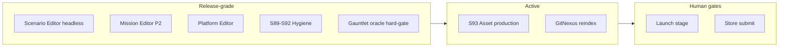

# Project Dashboard Snapshot — 2026-07-13 (pm)

Archived snapshot preserved from `docs/reports/project-dashboard.md` at generation time.

**Note:** Requested `2026-07-10-pm.md` was not present on disk (latest prior archive: [2026-07-09-am.md](2026-07-09-am.md)). This file is the **latest PM dashboard snapshot** after post-editor hygiene (S89–S92), S93 asset wave, and max-variance **QA gauntlet** smoke.

**Generated**: 2026-07-13  
**Last Updated**: 2026-07-13T22:45:00Z  
**Run Label**: pm (post–S92 hygiene / S93 assets / qa-gauntlet max-variance `gauntlet-20260713-1739`)  
**Stage**: **Release** — RC1 cut (S48); editors complete; post-editor hygiene **COMPLETE**; first asset production wave started  
**Analysis Scope**: Full project  
**Compared to**: [2026-07-09-am.md](2026-07-09-am.md) (prior dashboard)  
**HTML**: [2026-07-13-pm.html](2026-07-13-pm.html)

---

## Executive Summary

In four days since the 2026-07-09 am dashboard, the program closed **S89–S92 post-editor hygiene** (human ack), started **S93 asset production** (first **8 Done** binaries + 3 umbrellas In Production), and ran a **maximum-variance `/qa-gauntlet` inventory smoke** covering all **24** shipped `gauntlet-*.policy.json` policies × seeds **42,7,123** (72 rows) with tier tick budgets 6/10/16/24/40 (+ extras @12). Hard-gate `gauntlet_oracle_eval` is **allPassed** on every tier after oracle-envelope recalibration; one **sim-code** multi-TF fix landed (`StringSplitOptions.TrimEntries` netstandard2.1).

Git HEAD is **`d927684`**. AGENTS.md GitNexus baseline cites **25,390 symbols / 48,720 relationships / 300 flows** (index refresh still recommended vs live HEAD). Live solution tests (2026-07-13 preflight): **~1,697+** assembly pass counts (Data **641**, Sim **321**, Delegation **281**, UnityAdapter **324**, Excel **24**, Cli **106** pass); **1** pre-existing MissionEditor Phase0 smoke script fail (non-gauntlet). ReplayGolden-ish filter **17** passed in harness suite; golden files on disk **34–35**.

Production tracking remains **Release-scale**: **135** sprint plan files, **336** epic markdown files under `production/epics`, stage **Release** — no Launch advance.

**Current focus:** Keep gauntlet oracles green at tier tick budgets; continue S93 asset production (4 Needed remaining); GitNexus re-index to HEAD; optional Launch stage decision (human gate).

**Blocking / open gates:**

| Source | Finding |
|--------|---------|
| Stage | **Release** (not Launch) — explicit human gate for Launch |
| Assets | Manifest active — **8 Done / 3 In Production / 27 Specced / 4 Needed** (was 0 Done on 07-09) |
| QA gauntlet | Max-variance run **green** after expect recalibration — see [gauntlet-20260713-1739/AAR.md](../../../production/qa/gauntlet/gauntlet-20260713-1739/AAR.md) |
| GitNexus | AGENTS stats refreshed to **25,390 / 48,720**; re-analyze still recommended after gauntlet commits |
| Architecture | **CONCERNS** overall — refresh recommended post–editor + PE + gauntlet seams |
| Watchlist | `ScenarioDocumentEditor`, `CatalogWriteGate`, `DelegationBridge`, `PatrolCandidateEngagePolicy`, `BalticReplayHarness` remain CRITICAL hubs |
| Cli smoke | Phase0 script test intermittent/env fail — quarantine or fix outside gauntlet path |

---

## Since Last Update (vs 2026-07-09 am)

| Signal | 2026-07-09 am | 2026-07-13 pm (this run) | Delta |
|--------|---------------|---------------------------|-------|
| HEAD | `223a5fe` (indexed `80001c2`) | **`d927684`** | Gauntlet dual-slice + max-variance smoke |
| GitNexus symbols (AGENTS) | 24,262 | **25,390** | **+1,128** |
| GitNexus relationships | 46,367 | **48,720** | **+2,353** |
| Execution flows | 300 | **300** | Stable |
| Stage | Release (post–editors) | **Release** (post–hygiene + gauntlet) | No Launch advance |
| Sprint plan files | 131 | **135** | +4 |
| Epic md files | 70 (prior count) | **336** (filesystem under `production/epics`) | Path/layout growth — treat as inventory count |
| C# source (excl. tests) | 609 | **643** | **+34** |
| C# test files | 403 | **438** | **+35** |
| Solution tests (assembly sum) | 1,599 / 0 fail | **~1,697 pass** + 1 Cli Phase0 fail | **+~98**; Phase0 residual |
| Replay / golden | 6/6 ReplayGolden | Goldens **34–35** on disk; Replay filter green | Held |
| Gauntlet policies | (emerging) | **24** catalog-driven policies | Full ladder + theater extras |
| Gauntlet smoke | partial / phased | **72/72 rows**, all tiers **oracle allPassed** | Max-variance inventory closed |
| Asset Done | 0 | **8 Done** (+3 In Production) | S93 first binary wave |
| Forward program | S89–S92 hygiene active | **S89–S92 complete**; S93 assets in flight | Hygiene closed |

---

## GitNexus Code Intelligence

**Index status:** AGENTS.md reports **25,390 / 48,720 / 300** — treat as **stale-relative-to-HEAD** until `node .gitnexus/run.cjs analyze` re-runs post-`d927684`.

| Metric | Value |
|--------|-------|
| HEAD commit | **`d927684`** |
| Symbols (AGENTS baseline) | **25,390** |
| Relationships | **48,720** |
| Execution flows | **300** |
| detect-changes | Required before commits (repo skill) |

### Watchlist (from prior dashboard-state; re-verify after analyze)

| Symbol | Risk | Notes |
|--------|------|-------|
| `ScenarioDocumentEditor` | **CRITICAL** | Authoring hub |
| `CatalogWriteGate` | **CRITICAL** | Extend-only write gate |
| `DelegationBridge` | **CRITICAL** | ZERO hotpath touch |
| `PatrolCandidateEngagePolicy` | **CRITICAL** | AAR/policy seam |
| `BalticReplayHarness` | **CRITICAL** | Replay + gauntlet harness |
| `GauntletOracleEvaluator` | **MEDIUM (new surface)** | Fingerprint substring / True\|Launched gates |

---

## Sprint / Program Status

| Metric | Value |
|--------|-------|
| Stage | **Release** |
| Sprint plan files | **135** |
| Epic markdown files | **336** under `production/epics` |
| Solution tests (approx) | **~1,697** pass (+1 Phase0 residual fail) |
| Gauntlet policies | **24** |
| Latest gauntlet run | **`gauntlet-20260713-1739`** all tiers green |
| Asset Done | **8 / 42** |

### Programs since 2026-07-09

| Program | Status |
|---------|--------|
| S89–S92 post-editor hygiene | **Complete** (ack 2026-07-09; dashboard-state) |
| S93 asset production wave | **In progress** — 8 Done, 3 In Production |
| QA gauntlet dual-slice (ladder inject + multi-domain) | **Complete** (`917e716`) |
| Max-variance inventory smoke | **Complete** (`d927684`, AAR on disk) |
| Oracle fingerprint fail-closed | **Shipped** (`requireFingerprintSubstrings`, `requireTrueLaunchedShooters`) |

### Active backlog

| ID | Item | Status |
|----|------|--------|
| ASSET-02 | Finish S93 remaining Needed (4) + umbrellas | In flight |
| GN-01 | GitNexus re-analyze to HEAD | Recommended |
| GAU-01 | Keep expects calibrated to tier tick budgets | Ongoing |
| STG-01 | Optional stage → Launch | Human decision |
| CLI-01 | Phase0 smoke script fail | Quarantine / fix |
| ARCH-01 | Architecture review refresh | Recommended |

---

## Milestone Tracking

| Field | Value |
|-------|-------|
| Vertical slice | **PROCEED** (historical) |
| RC1 / Release train | S48 / S68 gates held |
| Editors | Scenario + Mission P2 + Platform **COMPLETE** |
| Hygiene | S89–S92 **COMPLETE** |
| Assets | S93 wave **started** (first Done binaries) |
| QA gauntlet | Inventory smoke **green** @ 2026-07-13 |
| Stage | **Release** |
| Outstanding for commercial ship | Store submission, full i18n, live Editor evidence pack, remaining assets, Launch ack |

---

## Completeness Overview

### Design
- GDD files: **18** (~60% systems linked)
- Art bible: present  
- Asset manifest: **present** with production progress  

### Architecture
- ADRs: **~17–18** files  
- Overall review: **CONCERNS** (refresh due)  

### Production
- Release engineering track mature  
- Determinism / replay goldens held  
- Gauntlet hard-gate oracle CLI on PR workflow  

### Source & tests

| Metric | 2026-07-09 | 2026-07-13 |
|--------|------------|------------|
| C# source (excl. tests) | 609 | **643** |
| C# test files | 403 | **438** |
| Assembly pass sum | 1,599 | **~1,697** |

### MVP / systems (inferred)

---

## Asset Manifest

**Source:** `design/assets/asset-manifest.md` (updated 2026-07-09 S93)

| Status | Count |
|--------|-------|
| Total | **42** |
| Needed | **4** |
| Specced | **27** |
| In Production | **3** |
| Done | **8** |
| Approved | **0** |

**Overall asset progress:** **~30%** engineering (specs + first binaries); **0** formally Approved.

---

## Gaps Identified

### Critical
1. **Launch not declared** — stage remains Release  
2. **Asset production incomplete** — 4 Needed + umbrellas still open  
3. **GitNexus re-analyze** after gauntlet commits  

### Important
4. **Architecture review stale** post–editor + gauntlet  
5. **Phase0 Cli smoke residual**  
6. **CRITICAL symbol hubs** — mandatory impact before edits  
7. **Oracle expects** must track tick-budget changes  

### Resolved since 2026-07-09
8. ~~0 assets Done~~ → **8 Done** (S93)  
9. ~~Gauntlet inventory unproven at tier ticks~~ → **72-row smoke allPassed**  
10. ~~S89–S92 open~~ → **complete**  
11. ~~Inject/multi-domain CI bar weak~~ → fingerprint fail-closed + expanded fixtures  

---

## Recommended Next Steps

1. `node .gitnexus/run.cjs analyze` → refresh AGENTS/dashboard GitNexus numbers to HEAD  
2. Continue S93: clear 4 Needed assets; move umbrellas to Done  
3. Fix or quarantine MissionEditor Phase0 smoke script  
4. Run `/architecture-review` focused on Delegation/gauntlet seams  
5. Human decision: stay Release vs declare Launch criteria  

---

## Follow-Up Skills

| Condition | Skill |
|-----------|-------|
| Asset production | `/asset-spec`, `/asset-audit` |
| Stage gate | `/gate-check` |
| Architecture | `/architecture-review` |
| Pre-merge | GitNexus `detect_changes` |
| Gauntlet regression | `/qa-gauntlet` or Demo batch + `gauntlet_oracle_eval` |

---

## Appendix: File / Run Counts

| Area | Count |
|------|-------|
| Sprint plan md | 135 |
| Epic md (`production/epics`) | 336 |
| GDD md | 18 |
| Gauntlet policies | 24 |
| Regression goldens | 34–35 |
| Source .cs (excl tests) | 643 |
| Test .cs | 438 |
| Latest gauntlet run | `gauntlet-20260713-1739` |
| Commits (dashboard window) | `917e716`, `d927684` (+ theater inject priors) |

---

## Recent commits (dashboard window)

| SHA | Summary |
|-----|---------|
| `d927684` | qa(gauntlet): max-variance smoke gauntlet-20260713-1739 |
| `917e716` | feat(gauntlet): ladder inject + multi-domain with fingerprint fail-closed |
| `fbf23bc` | fix(gauntlet): theater inject CommsStateChange + PolicyUpdate ROE |
| `d06e8a7` | feat(qa-gauntlet): oracle fail-closed + joint catalog ORBAT |

---

*Generated by producer agent — aggregated from production, design, architecture, GitNexus (AGENTS baseline), and audit/gauntlet artifacts*  
*HTML companion: [2026-07-13-pm.html](2026-07-13-pm.html)*
