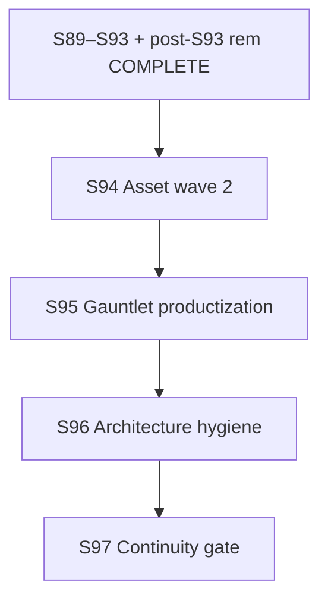

# Future Sprint Roadmap — Project Aegis (cmano-clone)
> **Parallel-Agentic Edition — Post–S93 + Gauntlet Land (S94+ Release Continuity)**

> **Status:** Living document. Authored **2026-07-14**; supersedes planning intent in [`future-sprint-roadpmap-07092026.md`](future-sprint-roadpmap-07092026.md) (2026-07-09 S89–S92 hygiene + S93 forward note, now archived as completed program).
> **Edition:** Optimized for serial sprints **S94+** (Release continuity: asset wave 2, gauntlet productization, architecture hygiene) with parallel tracks inside each sprint; stage **Release** throughout; **no Launch advance** without explicit human authorization; GitNexus mandatory; verification-before-completion on all claims.
> **Stable alias:** [`future-sprint-roadpmap.md`](future-sprint-roadpmap.md) → this file (updated 2026-07-14). Filename uses corrected spelling **roadmap**; historical snapshots retain **roadpmap**.
> **Primary authority (S94+):** This file + [`post-s93-concerns-remediation-closeout-2026-07-14.md`](../../production/gate-checks/post-s93-concerns-remediation-closeout-2026-07-14.md) + [`post-s93-project-release-hold-gate-2026-07-14.md`](../../production/gate-checks/post-s93-project-release-hold-gate-2026-07-14.md) + [`critical-hub-merge-playbook-2026-07-14.md`](../../production/agentic/critical-hub-merge-playbook-2026-07-14.md).
> **Invariants carryover:** Post-editor hygiene boundary + S93 asset boundary (superseded for S94+ *scope only*; standing engineering floors carried and raised).
> **GitNexus @ doc authoring (2026-07-14):** **25,311** symbols / **48,462** edges / **439** clusters / **300** flows (CLI `node .gitnexus/run.cjs analyze` @ **`257d9e9`**; status ✅ up-to-date). `impact --summary-only` upstream (repo=`/home/username01/cmano-clone`): **ScenarioDocumentEditor 233 CRITICAL**, **CatalogWriteGate 186 CRITICAL**, **DelegationBridge 142 CRITICAL**, **PatrolCandidateEngagePolicy 111 CRITICAL**, **BalticReplayHarness 62 CRITICAL**.
> **Verification @ doc authoring (RUN+READ evidence):** build **0e/0w**; post-gauntlet-land suite **1638/0f** (Sim **314**, Del **260**, UA **310**, Excel **24**, Data **623**, Cli **107**); ReplayGolden **6/6**; C2 proxy **≥20/20**; hash **`17144800277401907079`** preserved (18 paths); ZERO `DelegationBridge` hotpath edits; CatalogWriteGate **extend-only**.
> **Stage:** **Release** (`production/stage.txt`) — S89–S93 **COMPLETE**; post-S93 CONCERNS remediation **COMPLETE** (Tracks A–C); Launch **not** advanced (Track D not opened; no human Launch ack).
> **Closed milestones:** S39–S48 Release enablement; S49–S56 internal engineering; **S57–S64 Baltic v2**; **S65–S68 release train**; **S69–S72 E7 commercial launch prep**; **S73–S80 Baltic v3**; **S81–S88 Scenario Editor**; **ME Phase 2**; **Platform Editor (req 21)**; **S89–S92 Post-Editor Hygiene**; **S93 Asset Production Wave**; **post-S93 remediation (gauntlet land + residual assets + arch review + hub playbook)**.
> **Active program:** **S94+ Release Continuity** — proposed 4-track train (see §3); not yet user-committed as numbered sprints until `/sprint-plan` approval.

This roadmap is **direction, not a commitment**. Per `docs/COLLABORATIVE-DESIGN-PRINCIPLE.md`, each sprint is still planned via `/sprint-plan` with user approval.

**Parallel digests (2026-07-14):** gate/status · gauntlet QA · assets/architecture — assembled via `/dispatching-parallel-agents` + live GitNexus re-analyze.

---

## 0. Parallel execution model (S94+ program)

Every sprint is a **serial program** (S94 → …) with **parallel dispatch** inside each sprint. Model proven S39–S93; see [`future-sprint-roadpmap-07042026.md`](future-sprint-roadpmap-07042026.md) §0 for full protocol reference.

### 0.1 Agent environments

| Env | Capacity | Suited for | Not suited for |
|-----|----------|------------|----------------|
| **Local** | ≤6 concurrent | Closeout/merge, gate verification, human sign-off, Unity Editor PNG | Mass doc-only hygiene alone |
| **Cloud Agent** | ≤5 concurrent | Docs, tests, asset children, AGENTS sync, gauntlet expect regen | Live Unity Editor capture |
| **Combined** | 3–4 effective tracks | — | — |

**Routing:** `production/agentic/local-cloud-agent-routing.md`  
**CRITICAL hubs:** `production/agentic/critical-hub-merge-playbook-2026-07-14.md`

### 0.2 Worktree strategy

```
.worktrees/stack/sprint{N}/{track-slug}/
```

Gauntlet land used ordered **cherry-pick** from sibling worktree — prefer that pattern over whole-branch merge when dual histories diverge.

### 0.3 Merge gate protocol

1. All tracks `gt submit` their stacks.
2. Closeout track runs `gt restack` on trunk `main`.
3. Verify: `dotnet build ProjectAegis.sln && dotnet test ProjectAegis.sln -v minimal`.
4. Hard gates: **≥1638/0f** (new measured floor), Replay **6/6**, C2 **≥20/20**, hash preserved, ZERO bridge.
5. GitNexus re-index after merge (`node .gitnexus/run.cjs analyze` on absolute repo path).
6. Update sprint-status.yaml + closeout smoke.

### 0.4 Shared-resource coordination

| Resource | Rule |
|----------|------|
| `ScenarioDocumentEditor` | **CRITICAL (233)** — impact first; prefer CLI/authoring seams |
| `CatalogWriteGate` | **CRITICAL (186)** — **extend-only** |
| `DelegationBridge` | **CRITICAL (142)** — **ZERO hotpath touch** |
| `PatrolCandidateEngagePolicy` | **CRITICAL (111)** — doctrine seam; lower-bound (IPolicy fan-out) |
| `BalticReplayHarness` | **CRITICAL (62)** — replay + gauntlet consumers; read/test/verify first |
| Test baseline | **≥1638** monotonic (doc floor was ≥1599; raise after land) |

---

## 1. Where we are (post–S93 + remediation 2026-07-14)

| Dimension | State | Evidence |
|-----------|-------|----------|
| Stage | **Release** | `production/stage.txt` |
| Scenario editor | **COMPLETE** (S81–S88 + SE epic) | `s88-scenario-editor-gate-2026-07-04.md`, `se-completion-gate-2026-07-08.md` |
| Mission Editor Phase 2 | **COMPLETE** | `mission-editor-phase2-gate-2026-07-09.md` |
| Platform Editor (req 21) | **COMPLETE** | `platform-editor-completion-gate-2026-07-09.md` |
| S89–S92 hygiene | **COMPLETE** + human ack | `s92-post-editor-hygiene-gate-2026-07-09.md` |
| S93 asset wave | **COMPLETE** | `smoke-sprint-93-closeout-2026-07-09.md` |
| Post-S93 gate (Release hold) | **CONCERNS overall**; engineering **PASS** | `post-s93-project-release-hold-gate-2026-07-14.md` |
| Post-S93 remediation A–C | **COMPLETE** | `post-s93-concerns-remediation-closeout-2026-07-14.md` |
| Gauntlet hard-gate | **Landed** on Release program branch | cherry-picks through max-variance smoke; suite **1638/0f** |
| Test baseline | **1638/0f**, Replay **6/6**, C2 **≥20/20** | `gates-gauntlet-land-post-2026-07-14.log` |
| GitNexus | **25311/48462/439** @ `257d9e9` fresh | analyze 2026-07-14 |
| Asset manifest | **0 Needed / 27 Specced / 3 In Production / 12 Done / 0 Approved** | `design/assets/asset-manifest.md` |
| Architecture review | **CONCERNS** (Release hold cleared; Launch not) | `docs/architecture/architecture-review-post-s93-2026-07-14.md` |
| Launch | **NOT advanced** | commercial-launch-execution-gate-TBD.md (stub) |

**What closed since 2026-07-09 (0709 roadmap):**

- S89–S92 post-editor hygiene program (ack **"i acknowledge"**)
- S93 first binary asset wave (8 Done)
- Post-S93 Track A: gauntlet QA land (oracle fail-closed, ladder injects, multi-domain, max-variance `gauntlet-20260713-1739`)
- Post-S93 Track B: residual ASSET-036/037/040/041 → Done (manifest **Needed 0**, **Done 12**)
- Post-S93 Track C: architecture review + CRITICAL hub playbook
- Suite floor raised **1599 → 1638** (measured post-land)

**What remains open (Release continuity, not Launch):**

- Umbrellas ASSET-001…003 still **In Production**; **Approved = 0**
- Addressables / remote content design undesigned
- Editor PNG pack deferred (no Unity Editor host)
- Master `architecture.md` still Draft
- Gauntlet residual: expect-recalibration discipline, T5 discriminative strength, optional normative ADR
- Commercial Launch execution only after explicit human authorization

---

## 2. Completed program archive

### S89–S92 Post-Editor Hygiene — COMPLETE

See [`future-sprint-roadpmap-07092026.md`](future-sprint-roadpmap-07092026.md) §3–§6 + [`s92-post-editor-hygiene-gate-2026-07-09.md`](../../production/gate-checks/s92-post-editor-hygiene-gate-2026-07-09.md).

### S93 Asset Production Wave — COMPLETE

See 0709 §8 + [`smoke-sprint-93-closeout-2026-07-09.md`](../../production/qa/smoke-sprint-93-closeout-2026-07-09.md). Residual children closed in post-S93 Track B (2026-07-14).

### Post-S93 CONCERNS remediation — COMPLETE (Tracks A–C)

| Track | Theme | Result |
|-------|-------|--------|
| A | Gauntlet land | Cherry-picks landed; oracle 7/7; ladder filter 28/28; suite **1638/0f** |
| B | Residual assets | 036/037/040/041 Done stubs |
| C | Architecture + hubs | Review published; merge playbook published |
| D | Launch | **Not opened** |

Authority: [`post-s93-concerns-remediation-closeout-2026-07-14.md`](../../production/gate-checks/post-s93-concerns-remediation-closeout-2026-07-14.md).

### Prior programs — see archived roadmaps

| Program | Roadmap snapshot |
|---------|------------------|
| S81–S88 Scenario Editor | [`future-sprint-roadpmap-07042026.md`](future-sprint-roadpmap-07042026.md) |
| S73–S80 Baltic v3 | [`future-sprint-roadpmap-062526.01.md`](future-sprint-roadpmap-062526.01.md) |
| S69–S72 E7 prep | [`future-sprint-roadpmap-062526.md`](future-sprint-roadpmap-062526.md) |
| S65–S68 release train | [`future-sprint-roadpmap-062426.md`](future-sprint-roadpmap-062426.md) |

---

## 3. S94+ proposed scope — Release Continuity

**Context 2026-07-14:** Hygiene + first asset wave + gauntlet hard-gate are **closed**. Next train optimizes for **Release continuity quality** without Launch advance.

**Proposed 4-sprint shape (user must approve via `/sprint-plan` before commit):**

| Sprint | Theme | Primary deliverable |
|--------|-------|---------------------|
| **S94** | Asset wave 2 + Approved path | Move umbrella **001–003** children Specced→Done; define formal **Approved** criteria (not stubs only) |
| **S95** | Gauntlet productization | CI-gen expects at tier ticks; defect registry hygiene; optional oracle ADR; hold **≥1638** + max-variance smoke green |
| **S96** | Architecture / docs hygiene | Promote or re-matrix Draft `architecture.md`; ADR freshness vs post-editor + PE + gauntlet; hub playbook enforcement in AGENTS |
| **S97** | Release continuity gate | Program sign-off + human ack **"release continuity program complete"** — **not** Launch |

**Program exit criterion (S94–S97 proposed):** Asset Approved path started; gauntlet norms durable; architecture docs no longer blocking Release narrative; standing floors held — **not** Launch stage, **not** store submission, **not** Baltic reopen.

**Still out of scope:** Launch stage advance; E7 commercial execution; ME Phase 2 GUI; WYSIWYG platform editor; `DelegationBridge` hotpath edits; hash change w/o ADR; Addressables bulk import (design spike only if explicitly scoped).

**Program timeline:**



**Optional later (explicit human only):**

| Track | Trigger |
|-------|---------|
| Launch / commercial execution | Human Launch ack + open `commercial-launch-execution-gate-TBD.md` |
| Editor PNG pack | Unity Editor host available |
| SE Phase 2 GUI | Product prioritization + new scope boundary |
| Addressables bulk | Content pipeline ADR accepted |

---

## 4. Standing invariants (updated floor 2026-07-14)

| Invariant | Floor @ S94 start |
|-----------|-------------------|
| Solution tests | **≥1638 / 0 failed** (measured post-gauntlet land; prior doc floor 1599) |
| ReplayGolden | **6/6** |
| C2 proxy | **≥20/20** |
| Baltic production hash | **`17144800277401907079`** (18 paths) |
| DelegationBridge | **ZERO** hotpath edits |
| CatalogWriteGate | **extend-only** |
| Stage | **Release** until explicit Launch authorization |

Evidence: [`production/qa/evidence/gates-gauntlet-land-post-2026-07-14.log`](../../production/qa/evidence/gates-gauntlet-land-post-2026-07-14.log), remediation closeout.

---

## 5. GitNexus watchlist (§5) — live 2026-07-14 @ `257d9e9`

| Symbol | Impact | Risk | Delta vs 0709 |
|--------|--------|------|----------------|
| ScenarioDocumentEditor | **233** | CRITICAL | stable |
| CatalogWriteGate | **186** | CRITICAL | stable |
| DelegationBridge | **142** | CRITICAL | −3 (145→142) |
| PatrolCandidateEngagePolicy | **111** | CRITICAL | −2 (113→111) |
| BalticReplayHarness | **62** | CRITICAL | **+8** (54→62; gauntlet consumers) |

**Index:** 25,311 nodes / 48,462 edges / 439 clusters / 300 flows — **fresh** @ HEAD `257d9e9`.

**Preflight:** `impact --summary-only` (absolute repo path when dual checkouts exist) before any edit touching these symbols. Follow [`critical-hub-merge-playbook-2026-07-14.md`](../../production/agentic/critical-hub-merge-playbook-2026-07-14.md).

---

## 6. Dispatch checklist (S94 first — pending approval)

- [ ] User approves this roadmap (collaboration protocol)
- [ ] `/sprint-plan new` for **S94 only** (not S95–S97 yet)
- [ ] Publish `production/sprints/sprint-94-*.md` + scope boundary if new program named
- [ ] QA plan + parallel kickoff for S94 tracks
- [ ] GitNexus pre + gates RUN+READ before track dispatch
- [ ] Dispatch S94 tracks (asset children ∥ Approved criteria docs)
- [ ] S94 closeout smoke
- [ ] Later: S95–S97 serial with parallel tracks
- [ ] Human ack: "release continuity program complete" (program exit — **not** Launch)

**Already complete (do not re-open as open work):**

- [x] S89–S92 hygiene + human ack — 2026-07-09
- [x] S93 asset production closeout — 2026-07-09
- [x] Post-S93 gate + Tracks A–C remediation — 2026-07-14
- [x] GitNexus re-analyze @ `257d9e9` — 2026-07-14
- [x] This roadmap snapshot + alias retarget — 2026-07-14

---

## 7. QA gauntlet snapshot (landed)

| Item | State |
|------|-------|
| Skill | `/qa-gauntlet` — headless escalating tier loop |
| Canonical max-variance run | `gauntlet-20260713-1739` (24 scenarios × seeds 42,7,123; oracle allPassed) |
| Oracle | `GauntletOracleEvaluator` fail-closed fingerprint gates |
| Land | Track A cherry-picks on `stack/post-editor/s93-asset-production` |
| Residual risks | Expect recalibration drift; T5 discriminative weakness; GHA may be billing-gated; harness CRITICAL |

Authority: `production/qa/gauntlet-stack-land-plan-2026-07-14.md`, `production/qa/qa-gauntlet-effectiveness-plan-2026-07-13.md`, remediation closeout.

---

## 8. Asset pipeline snapshot

| Status | Count |
|--------|------:|
| Total | 42 |
| Needed | **0** |
| Specced | **27** |
| In Production (umbrellas 001–003) | **3** |
| Done | **12** |
| Approved | **0** |

S93 binaries + residual 036/037/040/041 under `production/assets/{c2,baltic,store,ui,audio}`. Formal **Approved** and umbrella completion are **S94+** work.

---

## 9. References

| Doc | Path |
|-----|------|
| Prior roadmap (S89–S93) | `docs/reports/future-sprint-roadpmap-07092026.md` |
| Post-S93 Release-hold gate | `production/gate-checks/post-s93-project-release-hold-gate-2026-07-14.md` |
| Remediation closeout | `production/gate-checks/post-s93-concerns-remediation-closeout-2026-07-14.md` |
| Architecture review | `docs/architecture/architecture-review-post-s93-2026-07-14.md` |
| CRITICAL hub playbook | `production/agentic/critical-hub-merge-playbook-2026-07-14.md` |
| Status truth (post-editor) | `production/agentic/post-editor-status-truth-2026-07-09.md` |
| Asset manifest | `design/assets/asset-manifest.md` |
| Dashboard 2026-07-10 pm | `docs/reports/dashboard-snapshots/2026-07-10-pm.md` |
| Gauntlet land plan | `production/qa/gauntlet-stack-land-plan-2026-07-14.md` |
| Commercial Launch (stub) | `production/gate-checks/commercial-launch-execution-gate-TBD.md` |

---

## 10. Stage rule (non-negotiable)

**Stage remains Release.**  
S92 hygiene ack, S93 closeout, post-S93 remediation, and this roadmap **do not** authorize Launch.  
Launch requires: explicit human decision + executable commercial gate + checklist package.

---

**End of future-sprint-roadmap-07142026.md (S94+ Release continuity focus).**  
Supersedes 07092026 for forward planning; archives S89–S93 as complete; carries invariants; raises suite floor to **1638**.  
Publish → update alias → await user approval before `/sprint-plan` S94.

<!-- workspace: cmano-clone/docs/reports -->
