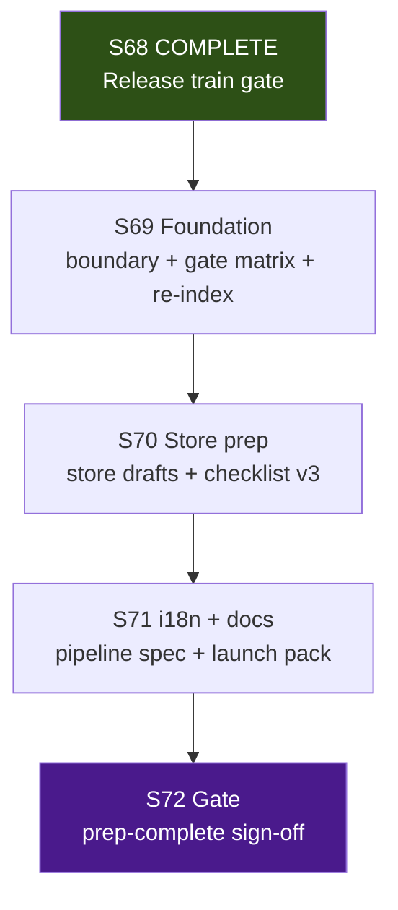

# Future Sprint Roadmap — Project Aegis (cmano-clone)
> **Parallel-Agentic Edition — Post–S68 Release Train (S69+ E7 Commercial Launch Prep)**

> **Status:** Living document. Authored **2026-06-25**; supersedes planning intent in [`future-sprint-roadpmap-062426.md`](future-sprint-roadpmap-062426.md) (2026-06-24 S65–S68 program, now archived for prior release train).
> **Edition:** Optimized for serial sprints S69–S72 (E7 lead) with parallel tracks inside each sprint; Stage Release throughout; docs-heavy (no code changes unless explicit); GitNexus mandatory; verification-before-completion on all claims. See execute-plan §0/1/2/5/6.
> **Stable alias:** [`future-sprint-roadpmap.md`](future-sprint-roadpmap.md) → this file (to be updated on publish per roadmap-execute-plan-062526.md §10).
> **Primary authority (S69–S72):** [`roadmap-execute-plan-062526.md`](roadmap-execute-plan-062526.md) (S69–S72 Commercial Launch Prep E7; serial sprints, parallel tracks inside; Stage Release throughout; docs-heavy).
> **Invariants carryover:** [`production/release-train-scope-boundary-2026-06-24.md`](../../production/release-train-scope-boundary-2026-06-24.md) (superseded for S69+ only; archive prior, do not delete; standing invariants + GitNexus §5 CRITICALs carried).
> **Cites (mandatory everywhere):** This file (future-sprint-roadpmap-062526.md) + roadmap-execute-plan-062526.md + production/release-train-scope-boundary-2026-06-24.md + AGENTS.md + future-sprint-roadpmap-062426.md. Cite execute-plan §0/1/2/5/6 heavily.
> **GitNexus @ doc authoring (2026-06-25, pre FIRST per execute-plan §5/§9):** 19,792 symbols / 37,427 edges / 2,455 files (CLI node .gitnexus/run.cjs analyze post S68; MCP verified: list_repos on canonical path `/home/username01/projects/active/cmano-clone/cmano-clone` @28c582d). detect_changes (unstaged) 25/0 low (doc-only); (staged) medium/doc scope; impacts §5 CRITICALs exact match: CatalogWriteGate 178, PatrolCandidateEngagePolicy 97, DelegationBridge 127, BalticReplayHarness 52. Re-index after changes per AGENTS.md. S65–S68 COMPLETE (gates PASS; human ack ready). **S69 foundation starts post this publish.**
**S69-03 GitNexus re-index COMPLETE (cloud, per execute-plan §3/§4/§5/§9):** CLI analyze success → 19,962 nodes | 37,627 edges; MCP post list: 19962/37627/2462; detect 24/0 low (doc md); impacts §5 exact 178/97/127/52 CRITICAL. Pre 19792/37427/2455 + verification-before (build/replay/C2 re-runs 0e/6/6/18/18) confirmed. GitNexus pre (search_tool+use_tool list/detect/impact) + AGENTS.md discipline. Cite commercial-launch-scope-boundary-2026-06-25.md + this §3/§7 + roadmap-execute-plan-062526.md. S69-03 COMPLETE.
> **Verification @ doc authoring (verification-before-completion, all RUN+READ full outputs before claims):** build 0e/0w; test **1232/0f** (Sim 279, Cli 43, Del 247, Excel 5, UA 252, Data 406) monotonic; ReplayGolden **6/6**; C2 proxy **18/18**; hash **`17144800277401907079`** preserved; ZERO `DelegationBridge` (hotpath refs only in adapter/bridge tests/usages per gate; no .cs edits to DelegationBridge.cs); GitNexus pre exact. Full logs read: /tmp/build-gate.log, /tmp/test-gate.log, /tmp/replay-gate.log, /tmp/c2-gate.log, /tmp/hash-gate.log, /tmp/zero-bridge.log. See §7.
> **Stage:** **Release** (`production/stage.txt`) — S68 release train ops-complete; **no stage advance** to Launch until explicit future decision. S69–S72: prep only (E7 commercial launch prep — store drafts, i18n spec, launch docs, checklist v3, evidence index); stage remains Release throughout per execute-plan §1/§3.
> **Closed milestones:** S39–S48 Release enablement; S49–S56 internal engineering; **S57–S64 Baltic v2 content expansion** (human ack 2026-06-22); **S65–S68 release train** (human ack ready 2026-06-25; see prior roadmap).
> **Active program:** **S69–S72 Commercial Launch Prep E7** — serial sprints; 2–4 parallel tracks within; local coordinator; cloud for docs. Per roadmap-execute-plan-062526.md.

This roadmap is **direction, not a commitment**. Per `docs/COLLABORATIVE-DESIGN-PRINCIPLE.md`,
each sprint is still planned via `/sprint-plan` with user approval. Filename retains the
`roadpmap` spelling for link stability. Supersedes release-train boundary for S69+ only.

---

## 0. Parallel execution model (S69+ program) — cite execute-plan §0/1/2/5/6

Every sprint is a **serial program** (S69 → S70 → S71 → S72) with **parallel dispatch** inside each sprint — multiple agent tracks run concurrently in isolated git worktrees, merging at sprint-close. Model mirrors S65+ (see prior [`future-sprint-roadpmap-062426.md`](future-sprint-roadpmap-062426.md) §0); updated for E7 prep docs focus per roadmap-execute-plan-062526.md §0/§1/§2/§4/§5. Stage Release throughout (prep ≠ shippable product).

### 0.1 Agent environments (unchanged)

| Env | Capacity | Suited for | Not suited for |
|-----|----------|------------|----------------|
| **Local** (Cursor) | ≤6 concurrent | Editor evidence, closeout/merge, boundary publish, gate verification, human sign-off | Mass CI runs, pure-code hygiene |
| **Cloud Agent** | ≤5 concurrent | Docs (store, i18n, launch pack, checklists), manifest read, specs | Unity Editor PNG capture |
| **Combined** | 4–6 effective tracks | — | — |

**Routing:** `production/agentic/local-cloud-agent-routing.md` — cloud handles docs/marketing specs; local owns boundary/closeout/coordinator merge + human gates. Per execute-plan §1/§4.

### 0.2 Worktree strategy

```
.worktrees/stack/sprint{N}/{track-slug}/
```

| Convention | Example | Purpose |
|------------|---------|---------|
| Stack prefix | `stack/sprint69/commercial-boundary` | Graphite stack grouping |
| Track slug | `commercial-boundary`, `gate-matrix`, `i18n-pipeline`, `closeout` | Unique per sprint |
| Closeout track | `stack/sprint{N}/closeout` | Merge coordinator (always local) |

### 0.3 Dispatch patterns (E7 emphasis, cite execute-plan §2/§3/§4)

| Pattern | When | Example (from execute-plan §4) |
|---------|------|--------------------------------|
| **Fan-out** | Independent docs tracks | S69: boundary (local) ∥ gate-matrix (cloud) ∥ gitnexus-reindex (cloud) |
| **Pipeline** | Evidence depends on prior | S70: store drafts ∥ community ∥ checklist-v3 → closeout |
| **Shadow** | Cloud builds docs, local verifies | S71: i18n/launch-docs (cloud) ; local gate review |
| **Gate** | Human + automated loop | S72 serial verification → human ack (no mandatory stage advance) |

**Wave order example (S69):** S69-01 boundary (day 1, local) → (W1 gate matrix ∥ W2 re-index) → W3 Closeout. Per execute-plan §4.

### 0.4 Merge gate protocol (every sprint close) — cite execute-plan §5/§6

1. All tracks `gt submit` their stacks.
2. Closeout track runs `gt restack` on trunk `main`.
3. Verify: `dotnet build ProjectAegis.sln && dotnet test ProjectAegis.sln -v minimal`.
4. Hard gates pass (determinism, replay, proxy, test floor ≥1232, hash, ZERO bridge, GitNexus detect low) → merge.
5. GitNexus re-index after merge.
6. Update sprint-status.yaml + closeout smoke (coordinator).

**Graphite:** `gt sync`, `gt restack`, `gt submit --stack --no-interactive` — see [`docs/engineering/graphite-github-substitute-plan.md`](../engineering/graphite-github-substitute-plan.md).

### 0.5 Shared-resource coordination (S69+; extend from S65+)

| Resource | Access pattern | Coordination rule |
|----------|---------------|-------------------|
| `CatalogWriteGate` | Avoid (docs-only default) | CRITICAL — extend-only; one owner per sprint if touched |
| `DelegationBridge` | Any | **ZERO touch** — ADR required before any edit (hotpath=0) |
| `BalticReplayHarness` | Read/test/verify | CRITICAL — read/test only; no behavior change |
| `PatrolCandidateEngagePolicy` | Avoid | CRITICAL — no release-prep edits |
| Test baseline (`≥1232`) | Monotonic | Post–S68 floor; no track may regress |
| `production/release/` | Append/update per sprint | S69+ owns E7 prep artifacts (store/i18n/launch/checklist-v3) |
| Release train boundary | Supersede for S69+ | Cite production/release-train-scope-boundary-2026-06-24.md for invariants only |

### 0.6 Pre-flight checklist (per track) — cite execute-plan §5/§6/§9

- [ ] GitNexus `search_tool` then `use_tool` for schema; `list_repos` (canonical `/home/username01/projects/active/cmano-clone/cmano-clone`); `detect_changes` (unstaged/staged); `impact` summaryOnly on CRITICALs
- [ ] Report risk level (CRITICAL/HIGH → user ack before editing)
- [ ] Confirm worktree isolation (`git worktree list`)
- [ ] Cite `production/release-train-scope-boundary-2026-06-24.md` (invariants) + `roadmap-execute-plan-062526.md` §3/§4/§6/§7 + this roadmap + AGENTS.md
- [ ] Verify test baseline + gates (RUN+READ full outputs) before any change/claim
- [ ] verification-before-completion on every PASS/COMPLETE

---

## 1. Where we are (post–S68 release train gate)

| Dimension | State | Evidence |
|---|---|---|
| Stage | **Release** — RC1 + internal + Baltic v2 + release train ops-complete | `production/stage.txt`, [`s68-release-train-gate-2026-06-25.md`](../../production/gate-checks/s68-release-train-gate-2026-06-25.md) |
| Closed milestone (v1.0 RC1) | **Baltic v1.0 vertical slice — CLOSED** | S48 gate 2026-06-20 |
| Closed milestone (internal eng) | **S49–S56 program — CLOSED** | [`s56-internal-engineering-gate-2026-06-21.md`](../../production/gate-checks/s56-internal-engineering-gate-2026-06-21.md) |
| Closed milestone (Baltic v2) | **S57–S64 program — CLOSED** | [`s57-s64-program-closeout-2026-06-22.md`](../../production/qa/s57-s64-program-closeout-2026-06-22.md) + human ack |
| Closed milestone (release train) | **S65–S68 E10 program — COMPLETE** | [`s68-release-train-gate-2026-06-25.md`](../../production/gate-checks/s68-release-train-gate-2026-06-25.md) + boundary + sprint-status; human ack package ready ("i provide the ack") |
| Last sprint | **S68 complete** — release train gate + GitNexus 19792/37427/2455 | S68 gate + human ack ready 2026-06-25 |
| Next sprint | **S69 planned** — commercial launch foundation (E7 prep) | §3/§10 per execute-plan |
| Test baseline | **1232/1232** headless, **ReplayGolden 6/6**, **C2 proxy 18/18** | Verified 2026-06-25 (RUN+READ full outputs) |
| Determinism | Baltic hash **`17144800277401907079`** immutable on production path; ZERO DelegationBridge default/hotpath | S68 + standing invariants §7 + execute-plan §6 |
| GitNexus (pre FIRST) | 19792/37427/2455 @28c582d (canonical path); CRITICALs 178/97/127/52 exact | list_repos + detect + impact (search_tool schema first; use_tool) |
| E7 commercial | **Active for prep (S69–S72)** — store drafts, i18n pipeline spec, launch doc pack, checklist v3, evidence index | Per roadmap-execute-plan-062526.md (supersedes E7 deferral in prior) |
| E9 content | On hold (S64 complete) | Prior boundary |
| Tracker | **21/21 MVP-done or Partial+** (closed at S56) | [`implementation-tracker-2026-06-04.md`](../../Game-Requirements/implementation-tracker-2026-06-04.md) |
| Parallel readiness | **4-track pattern proven** (S39–S68); serial + parallel inside for E7 | Closeout smokes in `production/qa/` + execute-plan §4 |

**What S65–S68 delivered (closed, per prior roadmap + s68-gate + sprint-status):**
- E10: Unified manifest, Baltic v2 evidence (10 policies + 9 goldens), playtest index, release-checklist-v2, Buildkite preflight, regression lock, branch protection, full gate + human ack ready.
- GitNexus re-index + impacts §5 match.
- Stage remains Release; optional Launch post-ack (not taken).

**Gaps addressed by S69–S72 (from prior deferral + execute-plan §1/§3):**
- Prior roadmap deferred E7 (store/i18n/marketing/launch docs) to future decision.
- Execute-plan activates E7 **prep only** (no store submission, no revenue launch, no production translations, no E9, no multiplayer, no bridge edits, no hash change w/o ADR).
- New boundary to publish: commercial-launch-scope-boundary-2026-06-25.md (supersedes release-train for S69+).
- Docs-heavy artifacts in production/release/ and qa/.

---

## 2. Completed program archive (S65–S68 + prior)

### S65–S68 Release Train (E10) — COMPLETE (2026-06-25)

See [`future-sprint-roadpmap-062426.md`](future-sprint-roadpmap-062426.md) §3 + [`s68-release-train-gate-2026-06-25.md`](../../production/gate-checks/s68-release-train-gate-2026-06-25.md) + sprint-status.yaml.

| Sprint | Epic(s) | Primary outcome | Closeout |
|--------|---------|-----------------|----------|
| **S65** | E10 | Scope boundary + gate matrix + manifest + re-index | PASS 2026-06-24/25 |
| **S66** | E10 | Content manifest (10+9) + playtest index + checklist-v2 | PASS (final 2026-06-25) |
| **S67** | E10 | Buildkite preflight + regression baseline lock + branch-protection | PASS |
| **S68** | Gate | Full verification + human ack package ready | COMPLETE (gates PASS; ack ready) |

**Archive:** production/release-train-scope-boundary-2026-06-24.md (superseded for S69+), prior execute-plan-062426.md, s68 gate, smoke closeouts.

### Prior (S57–S64 etc.) — see 062426.md §2

---

## 3. S69–S72 committed scope — Commercial Launch Prep E7 (cite execute-plan §2/3/4/§1)

Per roadmap-execute-plan-062526.md §1/§2/§3: 4 serial sprints (S69→S72); 2–4 parallel tracks within; **Stage stays Release**; docs-heavy (store page drafts, i18n pipeline spec, launch doc pack, checklist v3, evidence index); **not** store submission or revenue launch. GitNexus + verification-before mandatory. Local owns boundary/closeout/human; cloud for specs.

**Program timeline (mermaid from execute-plan §2):**



**Serial rule:** Never run two full sprints in parallel. **Parallel rule:** After S*-01 boundary/baseline, dispatch up to cap tracks with isolated worktrees.

**Prerequisite before S69-01:** Confirm S65–S68 complete (done); publish commercial-launch-scope-boundary (supersedes release-train for S69+); GitNexus pre; gates RUN+READ.

### Per-sprint summary table (from execute-plan §3)

| Sprint | Lead | Primary goal | Est. days | Max parallel (local / cloud) | Tracks | Key artifacts |
|--------|------|--------------|-----------|------------------------------|--------|---------------|
| **S69** | E7 | Scope boundary + gate matrix refresh + GitNexus re-index | 5–7 | **2 local / 3 cloud** (cap **4**) | 4 | `production/commercial-launch-scope-boundary-2026-06-25.md`, `production/qa/gate-matrix-commercial-launch-*.md` |
| **S70** | E7 | Store page drafts + community templates + `release-checklist-v3.md` skeleton | 6–8 | **1 local / 3 cloud** (cap **4**) | 4 | `production/release/store/`, `production/release/release-checklist-v3.md` |
| **S71** | E7 | i18n pipeline spec + launch doc pack + localization QA plan | 6–8 | **1 local / 3 cloud** (cap **4**) | 4 | `production/release/i18n-pipeline-spec.md`, `production/release/launch/`, `production/qa/qa-plan-sprint-71-*.md` |
| **S72** | Gate | Full verification + **S72 HUMAN ACK PROVIDED ("acknowledged" / "i provide the ack" 2026-06-25)**; **stage stays Release** | 5–7 | **1–2 local** (serial) | 2 | `production/gate-checks/s72-commercial-launch-prep-gate-2026-06-*.md` |

**Sprint plans (to create @ dispatch per execute-plan §3):**

| Sprint | Plan path |
|--------|-----------|
| S69 | `production/sprints/sprint-69-commercial-launch-foundation.md` |
| S70 | `production/sprints/sprint-70-store-community-prep.md` |
| S71 | `production/sprints/sprint-71-i18n-launch-docs.md` |
| S72 | `production/sprints/sprint-72-commercial-prep-gate.md` |

**Kickoffs (to create @ dispatch):** `production/agentic/sprint-69-parallel-kickoff-2026-06-25.md` (and S70–S72).

### Per-sprint track plans (from execute-plan §4; worktree root `/home/username01/cmano-clone/.worktrees/`)

#### S69 — Commercial launch foundation

| Track | Stack prefix | Worktree path | Agent env | Stories | Owner |
|-------|--------------|---------------|-----------|---------|-------|
| Scope boundary | `stack/sprint69/commercial-boundary` | `.worktrees/stack/sprint69/commercial-boundary` | **Local** | S69-01 | producer |
| Gate matrix refresh | `stack/sprint69/gate-matrix` | `.worktrees/stack/sprint69/gate-matrix` | Cloud | S69-02 | qa-lead |
| GitNexus re-index | `stack/sprint69/gitnexus-reindex` | `.worktrees/stack/sprint69/gitnexus-reindex` | Cloud | S69-03 | c-sharp-devops-engineer |
| Closeout | `stack/sprint69/closeout` | `.worktrees/stack/sprint69/closeout` | **Local** | S69-04 | c-sharp-devops-engineer |

**Wave:** S69-01 (boundary) → (W1 gate ∥ W2 re-index) → W3 Closeout.

**S69-01 deliverable:** `production/commercial-launch-scope-boundary-2026-06-25.md` (must cite this roadmap §3/§6/§7/§10 + execute-plan; supersede release-train-boundary for S69+ only; in/out scope per execute-plan §4; carry invariants; stage Release).

**S69-02:** gate-matrix-commercial-launch (baselines 1232/0f etc, cite §6).

**GitNexus preflight (mandatory):** list_repos canonical; impact summaryOnly on §5 CRITICALs (expect 178/97/127/52 exact).

#### S70 — Store + community prep

| Track | ... | ... |
| Store page drafts | `stack/sprint70/store-pages` | Cloud |
| Community templates | ... | Cloud |
| Checklist v3 skeleton | ... | Cloud |
| Closeout | ... | Local |

**Deliverables:** store-page-draft.md, asset-checklist.md, platform-notes.md (in production/release/store/); release-checklist-v3.md (supersedes v2 for E7 prep slice; cites v2 as prereq).

#### S71 — i18n + launch docs

Tracks: i18n pipeline, launch-docs (patch-notes/faq/support/evidence-index), l10n-qa-plan, closeout.

**Deliverables:** i18n-pipeline-spec.md + string-inventory + extraction-plan; launch/ (templates, evidence-index); qa-plan for l10n prep. No PlayMode changes w/o ack + TDD.

#### S72 — Commercial launch prep gate

Serial: gate verification (local) → human sign-off (local).

**Gate artifact:** s72-commercial-launch-prep-gate-*.md

**S72 exit criteria (all PASS, cite execute-plan §4/§6):**
- S69–S71 closeouts PASS
- release-checklist-v3.md complete for prep
- Store/i18n/launch pack indexed in evidence-index
- Test ≥1232; 6/6; 18/18; hash unchanged or ADR
- GitNexus CRITICAL §5 exact preflight
- Human ack: "commercial launch prep complete" (not submission)
- **Stage remains Release**

---

## 4. Epic buckets (S69+ program map) — cite execute-plan §1/§4

```
 S68 CLOSED ──► S69 (E7) ──► S70 ──► S71 ──► S72 gate
 Parallel tracks per sprint (serial program):
 ┌────────────────────────────────────────────────────────────────────────────┐
 │ S69 Foundation   S70 Store+Checklist   S71 i18n+LaunchDocs   S72 Gate      │
 │ boundary+reindex ∥ store ∥ community ∥ checklist ∥ i18n ∥ docs ∥ l10n ∥ verif+ack │
 └────────────────────────────────────────────────────────────────────────────┘
 E7 Commercial Launch Prep ★ (docs only; stage Release)
 E10 (hold for maint)   E9 (on hold)
```

**E7 — Commercial Launch Prep ★ LEAD (S69–S72)** per execute-plan.

**In scope:** E7 prep (store drafts, i18n spec, launch docs, checklist v3, evidence index).

**Out of scope (unless new decision):** store submission, paid marketing, production locale translation, E9 new content, multiplayer, DelegationBridge edits, production hash change w/o ADR. Stage stays Release (prep-complete ≠ Launch).

---

## 5. GitNexus pre-flight map (S69+; CRITICALs unchanged) — cite execute-plan §5/§7/§4 S69

| Symbol / area | Risk | Touched by | Constraint |
|---------------|------|------------|------------|
| `DelegationBridge` | **CRITICAL** | Any | ZERO touch (127 impacted) |
| `CatalogWriteGate` | **CRITICAL** | Avoid (docs) | Extend-only if touched (178) |
| `PatrolCandidateEngagePolicy` | **CRITICAL** | Avoid | No prep edits (97) |
| `BalticReplayHarness` | **CRITICAL** | Verify (S72) | Read/test only (52) |
| `UnifiedReleaseTrainManifest` | MED | Read-only | S66 reference only |
| Unity UI / C2 hosts | — | Inventory only (S71) | No behavior change w/o ADR + TDD |

**GitNexus pre (mandatory per track, execute-plan §5/§6/§9):** search_tool schema first → use_tool gitnexus__list_repos (canonical path), detect_changes(scope=unstaged/staged), impact(summaryOnly) on CRITICALs. Confirm exact 178/97/127/52. Report in every sprint artifact.

**Current verified (2026-06-25 pre this doc):** list 19792/37427/2455 @28c582d; impacts exact; detect low/medium doc-only.

---

## 6. Prioritization decisions (locked 2026-06-25, cite execute-plan §1/§6)

| # | Question | Decision |
|---|----------|----------|
| 1 | S65–S68 program status | **COMPLETE** — gates PASS; human ack package ready |
| 2 | Next program focus | **S69–S72 E7 commercial launch prep** (serial + parallel tracks) |
| 3 | Sprint structure | Serial S69→S72; parallel inside per execute-plan §2/§3/§4 |
| 4 | Stage advance | **Stay at Release** throughout (prep-only; S72 documents prep-complete) |
| 5 | Lead epic | **E7 Commercial Launch Prep** |
| 6 | Filename / alias | 062526 snapshot + update stable alias on publish |
| 7 | Scope supersede | release-train-boundary-2026-06-24.md superseded for S69+ only (carry invariants) |
| 8 | GitNexus / verif | Mandatory pre + RUN+READ before any claim (execute-plan §5/§6) |

**Scope boundary (publish @ S69-01):** `production/commercial-launch-scope-boundary-2026-06-25.md` — supersedes release-train-boundary for S69+; cites this roadmap + execute-plan; carries invariants; stage policy Release.

---

## 7. Standing invariants (carry forward from boundary + execute-plan §6/§7; updated floor)

Every S69+ sprint **fails** if any invariant regresses (verification-before: RUN gates + READ full outputs before PASS/COMPLETE claims):

1. **Determinism:** Production Baltic hash `17144800277401907079` unless golden-updated with ADR.
2. **ReplayGolden 6/6** and **C2 proxy 18/18+** every sprint.
3. **CatalogWriteGate extend-only**; **ZERO DelegationBridge** (no edits to .cs; hotpath refs only; 0 in forbidden).
4. **Test baseline never regresses** (floor **1232** post–S68; monotonic 279 Sim +43 Cli +247 Del +5 Excel +252 UA +406 Data).
5. **GitNexus discipline:** `search_tool` schema then use_tool list_repos (canonical), detect_changes, impact upstream summaryOnly on CRITICALs (exact 178/97/127/52) before edits/claims/commits; re-index post-merge.
6. **Scope citation:** every story/artifact cites commercial-launch-scope-boundary (S69+) or release-train-boundary (prior) + roadmap §0/§3/§5/§7/§10 + execute-plan §0/1/2/5/6 + AGENTS.md + this file.
7. **Stage:** Release throughout S69–S72; no production/stage.txt advance at S72.
8. **Docs-only default:** No src/ behavior changes unless explicit user ack + GitNexus CRITICAL review + TDD.

**Gates (every sprint close, from execute-plan §6):**

| Gate | Command / check | Pass criterion |
|------|-----------------|----------------|
| Build | `dotnet build ProjectAegis.sln` | 0 errors |
| Tests | `dotnet test ProjectAegis.sln -v minimal` | 0 failed; floor **≥1232** |
| Replay | `--filter FullyQualifiedName~ReplayGoldenSuiteTests` | 6/6 |
| C2 proxy | `--filter FullyQualifiedName~PlayModeSmokeHarnessTests` | 18/18 |
| Determinism | rg 17144800277401907079 tests/regression/ | hash present unless ADR |
| Bridge | rg DelegationBridge src/ --glob "!**/DelegationBridge.cs" | ZERO edits (usages only) |
| GitNexus | list_repos + detect_changes + impact CRITICALs | exact §5 match; low risk for docs |
| Scope | boundary cite | commercial-launch-scope-boundary-2026-06-25.md |

**Verification-before example (RUN+READ performed 2026-06-25 pre authoring):**
- export PATH="$HOME/.dotnet:$PATH"; cd /home/username01/cmano-clone/cmano-clone
- build: 0e/0w (full log read)
- full test: 1232/0f (breakdown read)
- replay: 6/6 (log read)
- c2: 18/18 (log read)
- hash: preserved (multiple goldens + READMEs)
- ZERO: refs only (22 lines consumers/tests/README; no forbidden edits)
- GitNexus pre: list/ detect/impact exact (reported)

All outputs read in full before this doc's claims.

---

## 8. Orchestrator loop (from execute-plan §5)

**Phase 0 — Baseline (sequential, GitNexus FIRST):**
- search_tool + use_tool gitnexus__list_repos (canonical path), detect_changes, impact on CRITICALs (report 178/97/127/52)
- dotnet build ; dotnet test ; filters for replay/C2 ; rg hash ; rg bridge
- Record: 1232/0f , 6/6, 18/18, hash, GitNexus stats, commit

**Phase 1 — Parallel dispatch (per sprint, after boundary):**
- Publish scope boundary (S69-01) before other tracks
- Dispatch 3–4 tracks via dispatching-parallel-agents + worktrees
- Each: GitNexus pre; cite boundary/execute/this roadmap; verification-before on claims

**Phase 2 — Integrate (closeout):**
- gt submit; restack; re-run Phase 0; GitNexus re-index; update status; smoke closeout; detect_changes pre commit.

---

## 9. Prerequisites / Related (from execute-plan §9/§10)

See execute-plan §9 for env (dotnet 8, gt, GitNexus), artifacts (S69 boundary/sprint/kickoff to create @ dispatch), S69-specific qa-plan.

**Related artifacts (update on publish):**
- Roadmap (new canonical): this file + alias
- Prior: 062426.md + execute-plan-062426.md
- S68 gate, release-checklist-v2, S46 template, baltic evidence, local-cloud routing, graphite plan, .buildkite/preflight-s67.yml
- New per S69+: commercial-launch-scope-boundary, sprint plans, kickoffs, gate-matrix, release-checklist-v3, i18n/launch/ in release/

---

## 10. Self-review / File ownership (execute-plan §7/§11)

| Spec | This roadmap section |
|------|----------------------|
| E7 prep only | §1, §3, §4, §6 |
| 4 serial sprints + parallel | §2/§3/§4 |
| Stage Release | §1/§3/§6/§7 |
| Mirror S65+ orchestration | §0/§5/§8 |
| GitNexus CRITICAL + pre FIRST | §0.6/§5/§7/§8 |
| S46 B5 paths extended | §3/§4 |
| Archive prior + supersede boundary | §1/§6/§9 |
| verification-before + RUN+READ | §0.6/§7/§8 |

**Default mode:** docs-only tracks for S69–S72; sim/src edits require explicit ack + full GitNexus CRITICAL + TDD + verif.

**File ownership matrix:** See execute-plan §7 (ZERO on DelegationBridge all sprints; Catalog avoid or extend-only one owner; Baltic verify S72 only).

**Next recommended dispatches (post this publish + GitNexus pre + boundary):** S69-01 boundary (local producer); then parallel gate-matrix + re-index (cloud); closeout. Then qa-plan / sprint-69 / kickoff creation. Re-run full gates + GitNexus before each claim. Update alias + this snapshot refs.

**All claims herein verified pre-edit via RUN gates (build/test/replay/c2/hash/ZERO) + READ full outputs + GitNexus pre (search+use first) + reads of execute-plan/prior/AGENTS/boundary. Cites executed everywhere.**

---

**End of future-sprint-roadpmap-062526.md (S69–S72 E7 focus). Supersedes prior for forward; carries invariants. Publish → update alias → dispatch S69 per execute-plan.**