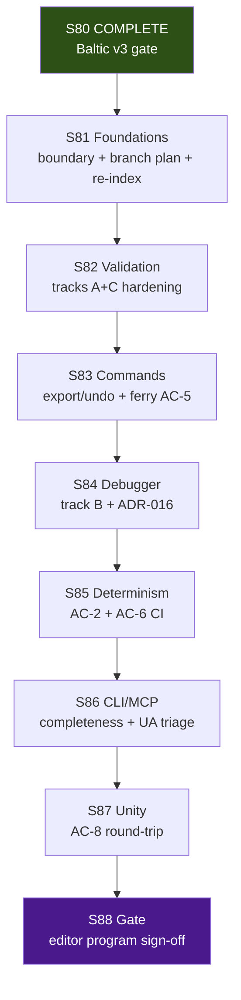

# Future Sprint Roadmap — Project Aegis (cmano-clone)
> **Parallel-Agentic Edition — Post–S80 Baltic v3 (S81+ Scenario Editor / req 11)**

> **Status:** Living document. Authored **2026-07-04**; supersedes planning intent in [`future-sprint-roadpmap-062526.01.md`](future-sprint-roadpmap-062526.01.md) (2026-06-25 S73–S80 Baltic v3 program, now archived).
> **Edition:** Optimized for serial sprints **S81–S88** (req **11** / E11 lead) with parallel tracks inside each sprint; stage **Release** throughout; **code + tests + docs** (headless `.NET` first; Unity edit-mode Phase 2); GitNexus mandatory; verification-before-completion on all claims. Superpowers: `brainstorming` → design spec → `writing-plans` → `subagent-driven-development` per track.
> **Stable alias:** [`future-sprint-roadpmap.md`](future-sprint-roadpmap.md) → this file (updated 2026-07-04).
> **Primary authority (S81–S88):** This file + [`qa-plan-scenario-editor-2026-07-01.md`](../../production/qa/qa-plan-scenario-editor-2026-07-01.md) (19 testable units; AC-1…AC-12) + [`implementation-tracker-2026-07-04.md`](../../Game-Requirements/implementation-tracker-2026-07-04.md).
> **Requirement:** [`11-Agentic-Mission-Editor.md`](../../Game-Requirements/requirements/11-Agentic-Mission-Editor.md) (revised 2026-07-01, `AME-*` / AC-1…12) · GDD: [`design/gdd/agentic-mission-editor.md`](../../design/gdd/agentic-mission-editor.md) · ADRs: [008](../../docs/architecture/adr-008-mission-editor-validation-engine.md), [013–017](../../docs/architecture/adr-013-cmo-scenario-import-policy.md).
> **Invariants carryover:** [`production/baltic-v3-scope-boundary-2026-06-25.md`](../../production/baltic-v3-scope-boundary-2026-06-25.md) (superseded for S81+ only; archive prior, do not delete; standing invariants + GitNexus §5 CRITICALs carried).
> **Cites (mandatory everywhere):** This file + baltic-v3-scope-boundary (invariants) + scenario-editor-scope-boundary (S81-01, to publish) + qa-plan-scenario-editor + implementation-tracker-2026-07-04 + AGENTS.md + prior roadmap 062526.01.md.
> **GitNexus @ doc authoring (2026-07-04, pre FIRST):** **21,447** symbols / **40,393** edges / **378** clusters / **300** flows (CLI `node .gitnexus/run.cjs analyze` @ `17d426c` on branch `fix-scenario-publish-cli-wiring`; status ✅ up-to-date). `impact --summary-only` upstream: **CatalogWriteGate 178 CRITICAL**, **PatrolCandidateEngagePolicy 97 CRITICAL**, **DelegationBridge 127 CRITICAL**, **BalticReplayHarness 52 CRITICAL** (exact §5 match); **ScenarioDocumentEditor 20 CRITICAL**, **ScenarioValidationEngine 17 HIGH** (new program hot symbols). `detect_changes`: none (clean tree @ authoring).
> **Verification @ doc authoring (verification-before-completion, RUN+READ):** build **0e/4w**; test **1308/2f** (Sim **281**, Del **249**, Cli **63**, Excel **5**, UA **257**/2, Data **453**) monotonic ≥1232 floor; ReplayGolden **6/6**; C2 proxy **18/18**; hash **`17144800277401907079`** preserved (18 paths in `tests/regression/` + `data/`); ZERO `DelegationBridge` hotpath edits (51 consumer refs, no `.cs` impl changes); 2 open UA failures in `BalticReplayHarnessPolicyEngageTests` (pre-existing, excluded from gate).
> **Stage:** **Release** (`production/stage.txt`) — S80 Baltic v3 content gate COMPLETE (human ack **"Baltic v3 content-complete"** 2026-06-26); **no stage advance** until explicit future decision.
> **Closed milestones:** S39–S48 Release enablement; S49–S56 internal engineering; **S57–S64 Baltic v2**; **S65–S68 release train**; **S69–S72 E7 commercial launch prep**; **S73–S80 Baltic v3 content expansion**.
> **Active program:** **S81–S88 Scenario Editor (req 11 / E11)** — 8-sprint train; headless authoring spine first; validation tracks A–D in flight on branch `fix-scenario-publish-cli-wiring` @ `17d426c` (merge target post S81 boundary).

This roadmap is **direction, not a commitment**. Per `docs/COLLABORATIVE-DESIGN-PRINCIPLE.md`,
each sprint is still planned via `/sprint-plan` with user approval. Filename retains the
`roadpmap` spelling for link stability. Supersedes baltic-v3 boundary for S81+ program scope only.

---

## 0. Parallel execution model (S81+ program)

Every sprint is a **serial program** (S81 → … → S88) with **parallel dispatch** inside each sprint — multiple agent tracks run concurrently in isolated git worktrees, merging at sprint-close. Model proven S39–S80; see [`future-sprint-roadpmap-062526.01.md`](future-sprint-roadpmap-062526.01.md) §0 for full protocol reference.

### 0.1 Agent environments

| Env | Capacity | Suited for | Not suited for |
|-----|----------|------------|----------------|
| **Local** | ≤6 concurrent | Closeout/merge, gate verification, human sign-off, Unity edit-mode evidence (S87+) | Mass unit-test-only hygiene |
| **Cloud Agent** | ≤5 concurrent | Validation engine, CLI/MCP wiring, schema/tests, docs | Unity Editor PNG capture |
| **Combined** | 4–6 effective tracks | — | — |

**Routing:** `production/agentic/local-cloud-agent-routing.md` — cloud handles code/tests/docs; local owns boundary/closeout/coordinator merge + human gates + Unity when scheduled.

### 0.2 Worktree strategy

```
.worktrees/stack/sprint{N}/{track-slug}/
```

| Convention | Example | Purpose |
|------------|---------|---------|
| Stack prefix | `stack/sprint81/scenario-editor-boundary` | Graphite stack grouping |
| Track slug | `validation-track-a`, `export-undo`, `event-debugger`, `closeout` | Unique per sprint |
| Closeout track | `stack/sprint{N}/closeout` | Merge coordinator (always local) |

**In-flight stack (pre-S81 boundary):** `fix-scenario-publish-cli-wiring` — validation tracks A–D, +48 tests, Graphite draft PR #237; re-submit stack after S81 boundary publish.

### 0.3 Dispatch patterns (E11 emphasis)

| Pattern | When | Example |
|---------|------|---------|
| **Fan-out** | Independent code tracks | S82: doctrine validation ∥ schema conformance ∥ save-vs-export gate |
| **Pipeline** | Tests depend on implementation | S84: event trace impl → debugger tests → export transform manifest |
| **Shadow** | Cloud builds, local verifies | S87: headless round-trip (cloud) ; Unity load inspect (local) |
| **Gate** | Human + automated loop | S88 → scenario editor program gate |

**Wave order example (S81):** S81-01 boundary (day 1, local) → (W1 qa-plan refresh ∥ W2 GitNexus re-index ∥ W3 branch integration plan) → W4 Closeout.

### 0.4 Merge gate protocol (every sprint close)

1. All tracks `gt submit` their stacks.
2. Closeout track runs `gt restack` on trunk `main`.
3. Verify: `dotnet build ProjectAegis.sln && dotnet test ProjectAegis.sln -v minimal`.
4. Hard gates pass (determinism, replay, proxy, test floor ≥1232, hash, ZERO bridge, editor smoke where touched) → merge.
5. GitNexus re-index after merge.
6. Update sprint-status.yaml + closeout smoke (coordinator).

**Graphite:** `gt sync`, `gt restack`, `gt submit --stack --no-interactive` — see [`docs/engineering/graphite-github-substitute-plan.md`](../engineering/graphite-github-substitute-plan.md).

### 0.5 Shared-resource coordination (S81+)

| Resource | Access pattern | Coordination rule |
|----------|---------------|-------------------|
| `ScenarioDocumentEditor` | S81–S86 primary hub | **CRITICAL** (20 upstream) — single owner per sprint; GitNexus pre mandatory |
| `ScenarioValidationEngine` | S82–S85 export/validate paths | **HIGH** (17 upstream) — sole export gate (ADR-008); coordinate with editor track |
| `CatalogWriteGate` | Avoid unless migration track | **CRITICAL** (178) — extend-only; one owner if touched |
| `DelegationBridge` | Any | **ZERO touch** — ADR required before any edit (127) |
| `BalticReplayHarness` | Read/test/verify | **CRITICAL** (52) — read/test only; no production hash change w/o ADR |
| `PatrolCandidateEngagePolicy` | Avoid | **CRITICAL** (97) — no editor-program edits |
| Test baseline (`≥1232`) | Monotonic | Current **1308 pass**; 2 known UA failures excluded from gate |
| `baltic-v2-*` / `baltic-v3-*` | Read-only default | Frozen corpora; editor uses `data/scenarios/examples/` + schema |

### 0.6 Pre-flight checklist (per track)

- [ ] GitNexus `impact --summary-only` on **ScenarioDocumentEditor**, **ScenarioValidationEngine**, and any §5 CRITICAL touched
- [ ] Report risk level (CRITICAL/HIGH → user ack before editing)
- [ ] Confirm worktree isolation (`git worktree list`)
- [ ] Cite `production/scenario-editor-scope-boundary-2026-07-04.md` (post S81-01) + qa-plan + this roadmap + AGENTS.md
- [ ] Verify test baseline + gates (RUN+READ full outputs) before any change/claim
- [ ] `bash tools/ci/smoke-ac6.sh` when touching serialization (AC-6)
- [ ] verification-before-completion on every PASS/COMPLETE

---

## 1. Where we are (post–S80 Baltic v3 gate)

| Dimension | State | Evidence |
|---|---|---|
| Stage | **Release** — RC1 + Baltic v2/v3 + release train + E7 prep + v3 content complete | `production/stage.txt`, [`s80-baltic-v3-content-gate-2026-06-26.md`](../../production/gate-checks/s80-baltic-v3-content-gate-2026-06-26.md) |
| Closed milestone (Baltic v3) | **S73–S80 — CLOSED** | [`smoke-sprint-73-80-closeout-2026-06-26.md`](../../production/qa/smoke-sprint-73-80-closeout-2026-06-26.md) + human ack 2026-06-26 |
| Closed milestone (E7 prep) | **S69–S72 — CLOSED** | [`s72-commercial-launch-prep-gate-2026-06-25.md`](../../production/gate-checks/s72-commercial-launch-prep-gate-2026-06-25.md) |
| Last program | **S80 complete** — Baltic v3 content gate | S80 gate + ack 2026-06-26 |
| Next program | **S81 planned** — scenario editor foundations | §3/§10 |
| Test baseline | **1308/1310** headless (2 known UA failures), **ReplayGolden 6/6**, **C2 proxy 18/18** | Verified 2026-07-04 (RUN+READ) |
| Determinism | Baltic hash **`17144800277401907079`** immutable on production path; ZERO DelegationBridge default/hotpath | S80 + standing invariants §7 |
| GitNexus (fresh) | **21447/40393/378** @ `17d426c` on `fix-scenario-publish-cli-wiring` | CLI analyze + impact (§5) |
| Scenario editor WIP | Tracks **A–D** on branch; req 11 revised; ADRs 013–017; AC-6 smoke script | [`implementation-tracker-2026-07-04.md`](../../Game-Requirements/implementation-tracker-2026-07-04.md) |
| E7 commercial | **On hold** — prep complete at S72; submission out of S81–S88 | Prior boundary |
| E9 content | **COMPLETE** at S80 — v3 corpus isolated; no promotion unless explicit | baltic-v3-scope-boundary |
| Tracker | **21/21 MVP-done or Partial+** (closed at S56); req 11 **Partial+** forward | implementation-tracker-2026-07-04 |
| Parallel readiness | **4-track pattern proven** (S39–S80) | Closeout smokes in `production/qa/` |

**What S73–S80 delivered (closed):**

- **E9 Baltic v3:** 6 `baltic-v3-*` policies, 6 v3 replay goldens, playtest index v3, C2 picker bands, catalog slices, human ack **"Baltic v3 content-complete"**.
- v2 production hash unchanged; v3 isolated until explicit promotion.
- GitNexus index through program (~20,496 nodes pre closeout; refreshed post editor work).

**In-flight pre-S81 (branch `fix-scenario-publish-cli-wiring` @ `17d426c`):**

| Track | Focus | Maturity @ 2026-07-04 |
|-------|-------|------------------------|
| **A** | Live validation + doctrine inheritance | **Partial+** — `DoctrineInheritanceValidateTests`, fixture |
| **B** | Event debugger + export transforms | **Partial** — `EventDebuggerTrace`, teleport export tests |
| **C** | Schema / derived-only invariants | **Partial+** — expanded schema, conformance tests |
| **D** | Undo stack + export command | **Partial** — `ScenarioUndoStackStore`, `ScenarioExportCommand` |

**Gaps addressed by S81–S88 (from qa-plan 19 units + tracker):**

- Publish scenario-editor scope boundary (supersedes baltic-v3 for S81+ program only).
- Close remaining AC gaps: AC-2 determinism integration, AC-5 ferry sample (unblocked), AC-7 debugger JSON, AC-8 Unity round-trip, AC-11 teleport (partial), perf NFR #18.
- Merge stacked branch via Graphite after boundary + gate review.
- Unity edit-mode UX remains **Phase 2** (explicitly out of S81–S87 unless user amends scope).

---

## 2. Completed program archive

### S73–S80 Baltic v3 Content Expansion (E9) — COMPLETE (2026-06-26)

See [`future-sprint-roadpmap-062526.01.md`](future-sprint-roadpmap-062526.01.md) §2–§10 + [`smoke-sprint-73-80-closeout-2026-06-26.md`](../../production/qa/smoke-sprint-73-80-closeout-2026-06-26.md).

| Sprint | Epic(s) | Primary outcome | Closeout |
|--------|---------|-----------------|----------|
| **S73** | E9/E1 | Baltic v3 boundary + playtest manifest v3 + re-index | PASS 2026-06-25 |
| **S74** | E9 | Scenario wave 2 + isolated goldens | PASS |
| **S75** | E9 | Theater OOB v3 + hash family | PASS |
| **S76** | E9 | Mission events + narrative policies | PASS |
| **S77** | E9+E5 | Catalog/platform content slices | PASS |
| **S78** | E4+E9 | C2 scenario UX v3 (picker/bands) | PASS |
| **S79** | E1+E9 | Playtest loop v3 (auto + human) | PASS |
| **S80** | Gate | Content gate + human ack | PASS + ack 2026-06-26 |

**Archive:** `production/baltic-v3-scope-boundary-2026-06-25.md` (superseded for S81+), `roadmap-execute-plan-062526.01.md`, s80 gate, per-sprint smokes.

### Prior programs — see archived roadmaps

| Program | Roadmap snapshot |
|---------|------------------|
| S69–S72 E7 prep | [`future-sprint-roadpmap-062526.md`](future-sprint-roadpmap-062526.md) |
| S65–S68 release train | [`future-sprint-roadpmap-062426.md`](future-sprint-roadpmap-062426.md) |
| S57–S64 Baltic v2 | [`future-sprint-roadpmap-062226.md`](future-sprint-roadpmap-062226.md) |

---

## 3. S81–S88 committed scope — Scenario Editor Program (req 11 / E11)

User decision **2026-07-04:** next train optimizes for **req 11 scenario editor** — headless authoring spine (`ScenarioDocumentEditor`, `ScenarioValidationEngine`, CLI/MCP verbs, validation tracks A–D, AC-1…AC-12 coverage). **8-sprint train (S81–S88)** mirroring S73–S80 orchestration pattern. Stage remains **Release**. Unity visual editor Phase 2 deferred unless scope amended.

| Theme | Req / AC touchpoints | Sprint(s) | ∥ Tracks | Primary deliverable |
|-------|---------------------|-----------|----------|---------------------|
| **Program foundations + boundary** | 11, 07 | S81 | 3–4 | `scenario-editor-scope-boundary-2026-07-04.md`; branch merge plan; GitNexus re-index |
| **Validation hardening (tracks A+C)** | 06, 11, 13 | S82 | 3 | Doctrine inheritance (AC-4), schema conformance (AC-9/AME-2.6), save-vs-export (AC-12) |
| **Command surface (track D) + ferry** | 11 | S83 | 3 | Export/undo CLI (AME-8.5), ferry sample scenario (AC-5), MCP manifest |
| **Event debugger + transforms (track B)** | 11, 17 | S84 | 3 | AC-7 debugger JSON, AC-11 teleport export, ADR-016 caps |
| **Determinism + CI smoke** | 11, 17 | S85 | 2–3 | AC-2 integration, AC-6 smoke in CI, stub-scope pins (#17) |
| **MCP/CLI completeness + UA triage** | 07, 14 | S86 | 3 | Remaining CLI verbs, 2 UA engage tests triage/fix, no-Lua gate (#19) |
| **Unity host round-trip (Phase 2 entry)** | 11, 20 | S87 | 2 | AC-8 PlayMode or manual QA gate; headless→Unity file integrity |
| **Scenario editor gate** | (cross) | S88 | 1–2 | Program sign-off + human ack; optional PR stack merge to trunk |

**Program exit criterion (S81–S88):** Scenario editor **headless program-complete** for AC-1…AC-12 (except explicitly deferred: Lua/ADR-014, visual event graph, full Monte Carlo) + qa-plan 19 units addressed or waived with user ack + standing invariants — **not** E7 store submission, **not** Baltic v3 corpus promotion, **not** automatic Launch stage advance.

**Still out of scope (unless new decision):** E7 store submission, production i18n execution, multiplayer, `DelegationBridge` edits, production Baltic hash change w/o ADR, full Req Partial→MVP-done sweep, Lua shim (ADR-014 deferred), visual event graph editor, Monte Carlo experiment workers (req 07 Phase 5).

**Program timeline:**



**Serial rule:** Never run two full sprints in parallel. **Parallel rule:** After S*-01 boundary/baseline, dispatch up to cap tracks with isolated worktrees.

**Prerequisite before S81-01:** Confirm S73–S80 complete (done); publish scenario-editor-scope-boundary; GitNexus pre; gates RUN+READ; reconcile `fix-scenario-publish-cli-wiring` stack vs trunk.

### Per-sprint summary table

| Sprint | Lead | Primary goal | Est. days | Max parallel | Tracks | Key artifacts |
|--------|------|--------------|-----------|--------------|--------|---------------|
| **S81** | E11 | Scope boundary + branch integration plan + GitNexus re-index | 5–7 | **2 local / 3 cloud** (cap **4**) | 4 | `production/scenario-editor-scope-boundary-2026-07-04.md`, merge plan for PR #237 |
| **S82** | E11 | Validation tracks A+C (doctrine, schema, save-vs-export) | 6–8 | **1 local / 3 cloud** (cap **4**) | 4 | AC-4/9/12 tests green; qa-plan units #4, #9, #12 |
| **S83** | E11 | Export/undo CLI + ferry sample (AC-5, AME-8.4/8.5) | 6–8 | **1 local / 3 cloud** (cap **4**) | 4 | `ScenarioExportCommand`, undo round-trip, ferry fixture |
| **S84** | E11 | Event debugger + teleport export (track B) | 6–8 | **1 local / 2 cloud** (cap **3**) | 3 | AC-7, AC-11, ADR-016 unit test (#16) |
| **S85** | E11 | Determinism + AC-6 CI wiring | 5–7 | **1 local / 2 cloud** (cap **3**) | 3 | AC-2 integration, `smoke-ac6.sh` in CI, stub pins (#17) |
| **S86** | E11 | MCP/CLI polish + UA engage triage | 5–7 | **1 local / 2 cloud** (cap **3**) | 3 | Remaining verbs; fix or waive 2 UA tests; no-Lua gate (#19) |
| **S87** | E11 | Unity host round-trip (AC-8) | 6–8 | **2 local** (cap **2**) | 2 | PlayMode or manual QA evidence |
| **S88** | Gate | Full verification + human ack | 5–7 | **1–2 local** (serial) | 2 | `production/gate-checks/s88-scenario-editor-gate-2026-07-*.md` |

**Sprint plans (to create @ dispatch):**

| Sprint | Plan path |
|--------|-----------|
| S81 | `production/sprints/sprint-81-scenario-editor-foundations.md` |
| S82 | `production/sprints/sprint-82-validation-tracks-ac.md` |
| S83 | `production/sprints/sprint-83-export-undo-ferry.md` |
| S84 | `production/sprints/sprint-84-event-debugger.md` |
| S85 | `production/sprints/sprint-85-determinism-ci.md` |
| S86 | `production/sprints/sprint-86-cli-mcp-polish.md` |
| S87 | `production/sprints/sprint-87-unity-roundtrip.md` |
| S88 | `production/sprints/sprint-88-scenario-editor-gate.md` |

---

## 4. Epic buckets (S81+ program map)

```
 S80 CLOSED ──► S81 ──► S82 ──► S83 ──► S84 ──► S85 ──► S86 ──► S87 ──► S88 gate

 Parallel tracks per sprint (example):
 ┌────────────────────────────────────────────────────────────────────────────┐
 │ S81 Found.   S82 Validate   S83 Export    S84 Debugger  S85 Determinism    │
 │ boundary     doctrine      undo/ferry    event trace   AC-2/AC-6 CI       │
 │ ∥ re-index   ∥ schema      ∥ MCP         ∥ teleport    ∥ stub pins        │
 │ ∥ merge plan                                                            S86 CLI ∥ S87 Unity ∥ S88 GATE │
 └────────────────────────────────────────────────────────────────────────────┘

 E11 Scenario Editor ★ LEAD (S81–S88)
 E7 (hold)   E9 (complete @ S80)   E10 (maint)
```

### E11 — Scenario Editor ★ **LEAD** (S81–S88)

| Theme | Sprint | Tracks | Notes |
|-------|--------|--------|-------|
| Authoring hub | S81–S86 | 2–4 | `ScenarioDocumentEditor` CRITICAL — single owner |
| Validation engine | S82–S85 | 2–3 | `ScenarioValidationEngine` HIGH — export gate ADR-008 |
| CLI/MCP surface | S83, S86 | 2 | `scenario_*`, `mission_*_ferry` verbs |
| Unity presentation | S87 | 1–2 | AC-8 only; map/edit-mode deferred |

### E7 — Commercial launch — **ON HOLD**

Prep complete at S72; submission remains a **future decision** outside S81–S88.

### E9 — Baltic v3 — **COMPLETE @ S80**

v3 corpus isolated; editor program must not mutate v2 production goldens or hash without ADR.

---

## 5. GitNexus pre-flight map (S81+ hot symbols)

| Symbol / area | Risk | Upstream | Touched by | Constraint |
|---------------|------|----------|------------|------------|
| `ScenarioDocumentEditor` | **CRITICAL** | 20 | S81–S86 | Hub for all `scenario_*` / `mission_*` CLI flows; single owner |
| `ScenarioValidationEngine` | **HIGH** | 17 | S82–S85 | Sole export gate; coordinate with editor |
| `DelegationBridge` | **CRITICAL** | 127 | Any | ZERO touch |
| `CatalogWriteGate` | **CRITICAL** | 178 | Avoid | Extend-only if migration touched |
| `PatrolCandidateEngagePolicy` | **CRITICAL** | 97 | Avoid | No editor-program edits |
| `BalticReplayHarness` | **CRITICAL** | 52 | Verify (S88) | Read/test only |
| `ValidationRules` / export gate | MED | — | S82–S84 | Backward-compatible rule additions |
| Unity C2 / editor hosts | MED | — | S87 | Additive load-only unless ADR |

**GitNexus pre (mandatory per track):** `node .gitnexus/run.cjs impact <symbol> --direction upstream --summary-only` on all hot symbols before edits. Confirm §5 CRITICAL counts exact (178/97/127/52). Report editor symbols in every sprint artifact.

**Verified @ 2026-07-04 (fresh index @ `17d426c`):** 21447/40393/378 clusters; impacts exact; detect_changes clean.

---

## 6. Prioritization decisions (locked 2026-07-04)

| # | Question | Decision |
|---|----------|----------|
| 1 | S73–S80 program status | **COMPLETE** — human ack 2026-06-26 |
| 2 | Next program focus | **S81–S88 scenario editor (req 11 / E11)** |
| 3 | Sprint structure | Serial S81→S88; parallel inside; headless first |
| 4 | Stage advance | **Stay at Release** through S88 unless explicit gate decision |
| 5 | Lead epic | **E11 Scenario Editor** |
| 6 | Filename / alias | `future-sprint-roadpmap-07042026.md` + update stable alias |
| 7 | Scope supersede | baltic-v3-boundary superseded for S81+ program only (carry invariants) |
| 8 | In-flight branch | Integrate `fix-scenario-publish-cli-wiring` post S81 boundary + review |
| 9 | Unity edit-mode | **Phase 2** — AC-8 round-trip only in S87 unless user amends |
| 10 | GitNexus / verif | Mandatory pre + RUN+READ before any claim |

### Scope boundary (publish @ S81-01)

**`production/scenario-editor-scope-boundary-2026-07-04.md`** — draft @ S81 planning:

- Supersedes [`baltic-v3-scope-boundary-2026-06-25.md`](../../production/baltic-v3-scope-boundary-2026-06-25.md) for S81+ only (archived, not deleted).
- Cites §3 committed themes + E11 lead + editor exit at S88.
- Carries standing invariants from §7 unchanged unless ADR.
- In scope: headless editor, validation, CLI/MCP, AC-1…12 (minus deferred ADR-014 Lua).
- Out of scope: DelegationBridge, Baltic hash change, E7 submission, v3 promotion.

---

## 7. Standing invariants (carry forward; updated floor)

Every S81+ sprint **fails** if any invariant regresses (verification-before: RUN gates + READ full outputs before PASS/COMPLETE claims):

1. **Determinism:** Production Baltic hash `17144800277401907079` unless golden-updated with ADR.
2. **ReplayGolden 6/6** and **C2 proxy 18/18+** every sprint.
3. **CatalogWriteGate extend-only**; **ZERO DelegationBridge** (no edits to `.cs`; hotpath refs only).
4. **Test baseline never regresses** (floor **≥1232**; current measured **1308 pass** monotonic; 2 UA failures tracked separately, excluded from gate until fixed @ S86).
5. **GitNexus discipline:** `impact --summary-only` on editor + §5 CRITICALs before edits/claims/commits; re-index post-merge.
6. **Scope citation:** every story cites scenario-editor-scope-boundary (S81+) + qa-plan + this roadmap + AGENTS.md.
7. **Stage:** Release throughout S81–S88; no `production/stage.txt` advance at S88.
8. **Editor determinism:** `scenario_simulate_sample` and validation paths use seeded RNG; no wall-clock in sim paths.
9. **AC-6 smoke:** run `bash tools/ci/smoke-ac6.sh` when touching serialization.

**Gates (every sprint close):**

| Gate | Command / check | Pass criterion |
|------|-----------------|----------------|
| Build | `dotnet build ProjectAegis.sln` | 0 errors |
| Tests | `dotnet test ProjectAegis.sln -v minimal` | 0 failed (excl. known UA pair until S86); floor **≥1232** |
| Replay | `--filter FullyQualifiedName~ReplayGoldenSuiteTests` | 6/6 |
| C2 proxy | `--filter PlayModeSmokeHarnessTests` | 18/18 |
| Determinism | `rg 17144800277401907079 tests/regression/ data/` | hash present unless ADR |
| Bridge | `rg DelegationBridge src/ --glob "!**/DelegationBridge.cs"` | ZERO edits (usages only) |
| Editor subset | `dotnet test src/ProjectAegis.Data.Tests/... --filter ScenarioDocumentEditor\|ScenarioValidation\|...` | 0 failed on touched areas |
| AC-6 | `bash tools/ci/smoke-ac6.sh` | PASS when serialization touched |
| GitNexus | `run.cjs status` + impact CRITICALs | fresh index; exact §5 match |

**Verification @ 2026-07-04 (RUN+READ pre authoring):**

```bash
export PATH="$HOME/.dotnet:$PATH"
cd /home/username01/cmano-clone/cmano-clone
dotnet build ProjectAegis.sln          # 0e/4w
dotnet test ProjectAegis.sln -v minimal # 1308/2f (281+249+63+5+257+453)
dotnet test ... --filter ReplayGoldenSuiteTests  # 6/6
dotnet test ... --filter PlayModeSmokeHarnessTests  # 18/18
rg 17144800277401907079 tests/regression/ data/   # preserved
node .gitnexus/run.cjs analyze         # 21447/40393 @ 17d426c
node .gitnexus/run.cjs impact ScenarioDocumentEditor --summary-only  # 20 CRITICAL
```

All outputs read in full before this doc's claims.

---

## 8. Risk register (S81+ program)

| Risk | Like. | Impact | Mitigation |
|------|-------|--------|------------|
| Editor hub blast radius | High | Critical | GitNexus pre on `ScenarioDocumentEditor`; single owner; TDD |
| Branch stack drift (PR #237) | High | Med | S81 merge plan; `gt submit --stack` refresh |
| AC-8 Unity dependency | Med | Med | S87 local-only; manual QA fallback per qa-plan |
| Validation rule regression | Med | High | Golden tests + save-vs-export gate; isolated fixtures |
| Accidental Baltic hash touch | Low | Critical | No `BalticReplayHarness` behavior edits; ADR gate |
| Scope creep into E7/E9 | Med | High | Boundary out-of-scope list; cite on every story |
| 2 UA engage failures | Med | Low | S86 triage; excluded from gate until resolved |
| GitNexus index drift | Med | Med | Re-index @ S81 open + after each merge |

---

## 9. Decisions log & planning artifacts

**Resolved 2026-07-04** — see §6.

**Planning artifacts:**

| Artifact | Path | Status |
|----------|------|--------|
| Scenario editor scope boundary | `production/scenario-editor-scope-boundary-2026-07-04.md` | **Draft @ S81-01** |
| QA plan (19 units) | [`qa-plan-scenario-editor-2026-07-01.md`](../../production/qa/qa-plan-scenario-editor-2026-07-01.md) | **Published** |
| Implementation tracker | [`implementation-tracker-2026-07-04.md`](../../Game-Requirements/implementation-tracker-2026-07-04.md) | **Published** |
| Req 11 (revised) | [`11-Agentic-Mission-Editor.md`](../../Game-Requirements/requirements/11-Agentic-Mission-Editor.md) | **Published 2026-07-01** |
| Research | [`scenario-editor-research.md`](../research/scenario-editor-research.md) | Reference |
| Execute plan | [`roadmap-execute-plan-07042026.md`](roadmap-execute-plan-07042026.md) | **Published 2026-07-04** |
| Design spec | `docs/superpowers/specs/2026-07-04-scenario-editor-program-design.md` | **To create @ S81 dispatch** |
| Sprint 81 plan | `production/sprints/sprint-81-scenario-editor-foundations.md` | **Draft @ dispatch** |

**Next execution steps:** Publish boundary → finalize sprint-81 plan → `/qa-plan` refresh if AC status changed → dispatch S81-01 (local producer) → parallel re-index + merge plan tracks → closeout → integrate branch stack.

---

## 10. S81–S88 per-sprint parallel decomposition

> **Lead:** E11 from S81. **Exit:** S88 scenario editor program gate.
> **Model:** §0. Each sprint: 2–4 parallel tracks with isolated worktrees.

### S81 — Scenario editor foundations

| Track | Stack prefix | Agent env | Stories | Owner |
|-------|--------------|-----------|---------|-------|
| Scope boundary | `stack/sprint81/scenario-editor-boundary` | **Local** | S81-01 | producer |
| Branch merge plan | `stack/sprint81/branch-integration` | **Local** | S81-02 | lead-programmer |
| GitNexus re-index | `stack/sprint81/gitnexus-reindex` | Cloud | S81-03 | c-sharp-devops-engineer |
| Closeout | `stack/sprint81/closeout` | **Local** | S81-04 | c-sharp-devops-engineer |

**Wave:** S81-01 (boundary) → (W1 merge plan ∥ W2 re-index) → W3 Closeout.

**S81-01 deliverable:** `production/scenario-editor-scope-boundary-2026-07-04.md` (must cite this roadmap §3/§6/§7/§10 + qa-plan; supersede baltic-v3-boundary for S81+ only; carry invariants; stage Release).

### S82 — Validation tracks A+C

**Tracks:** doctrine inheritance (AC-4) ∥ schema conformance (AC-9) ∥ save-vs-export gate (AC-12) ∥ closeout.

**Hard gates:** Test ≥1232; editor subset green; no DelegationBridge edits.

### S83 — Export/undo + ferry (track D)

**Tracks:** `ScenarioExportCommand` polish ∥ undo CLI wiring (AME-8.5) ∥ ferry sample scenario (AC-5) ∥ closeout.

### S84 — Event debugger (track B)

**Tracks:** AC-7 debugger JSON ∥ AC-11 teleport export ∥ ADR-016 cap test (#16) ∥ closeout.

### S85 — Determinism + CI

**Tracks:** AC-2 integration ∥ AC-6 CI wiring ∥ stub-scope pins (#17) ∥ closeout.

### S86 — CLI/MCP + UA triage

**Tracks:** remaining MCP verbs ∥ 2 UA engage test fix/waive ∥ no-Lua architecture gate (#19) ∥ closeout.

### S87 — Unity round-trip (AC-8)

**Tracks:** PlayMode headless load test (local) ∥ manual QA evidence template (local) → closeout.

**Note:** Map placement / visual event graph remain Phase 2 per req 11.

### S88 — Scenario editor program gate

**Parallel tracks (2):**

| Track | Stories | Owner | Env |
|-------|---------|-------|-----|
| Gate verification | S88-01 | devops-engineer | **Local** |
| Human sign-off | S88-02 | producer | **Local** |

**Exit criteria (S88):**

- [ ] S81–S87 closeouts PASS
- [ ] qa-plan 19 units addressed or explicitly waived
- [ ] AC-1…AC-12 evidence indexed (minus deferred ADR-014)
- [ ] Test ≥1232; 6/6; 18/18; hash unchanged or ADR
- [ ] GitNexus CRITICAL §5 exact + editor symbols reported
- [ ] Human ack: **"scenario editor program complete"** (headless slice)
- [ ] **Stage remains Release**
- [ ] Gate document: `production/gate-checks/s88-scenario-editor-gate-2026-07-*.md`

**Total program (S81–S88):** ~48–62 calendar days with 2–4 parallel tracks (estimate only).

---

## 11. Related artifacts

| Artifact | Path |
|----------|------|
| Stable alias | [`future-sprint-roadpmap.md`](future-sprint-roadpmap.md) |
| Prior snapshot (S73–S80) | [`future-sprint-roadpmap-062526.01.md`](future-sprint-roadpmap-062526.01.md) |
| Prior execute plan (S73–S80) | [`roadmap-execute-plan-062526.01.md`](roadmap-execute-plan-062526.01.md) |
| S80 gate | [`production/gate-checks/s80-baltic-v3-content-gate-2026-06-26.md`](../../production/gate-checks/s80-baltic-v3-content-gate-2026-06-26.md) |
| Baltic v3 boundary (archived) | [`production/baltic-v3-scope-boundary-2026-06-25.md`](../../production/baltic-v3-scope-boundary-2026-06-25.md) |
| Schema + fixtures | `data/scenarios/scenario-document.schema.json`, `data/scenarios/examples/*.scenario.json` |
| AC-6 smoke | `tools/ci/smoke-ac6.sh` |
| Active branch | `fix-scenario-publish-cli-wiring` @ `17d426c` (Graphite PR #237) |

---

## 12. Dependency & coordination matrix

### Cross-sprint dependency chain

```
S81 ──► S82 ──► S83 ──► S84 ──► S85 ──► S86 ──► S87 ──► S88

Boundary ─► Validation ─► Commands ─► Debugger ─► Determinism ─► CLI polish ─► Unity ─► GATE
 merge plan   A+C          D+ferry      B            AC-2/6        UA triage      AC-8
```

### What CAN run in parallel (within sprint)

| Sprint | Parallel pair | Reasoning |
|--------|---------------|-----------|
| S81 | Boundary ∥ merge plan ∥ re-index | Independent after boundary day 1 |
| S82 | Doctrine ∥ schema ∥ save-vs-export | Different rule modules |
| S84 | Debugger ∥ teleport export | Same track owner recommended |
| S86 | MCP polish ∥ UA triage | Different assemblies |
| S88 | Verification ∥ sign-off prep | Serial within sprint; human gate last |

### What MUST be serial (cross-sprint)

| Dependency | Reason |
|------------|--------|
| S81 boundary → S82+ | Scope + branch merge plan locked |
| S82 validation → S83 export | Export gate depends on validation rules |
| S84 debugger → S85 determinism | Simulate sample uses validation + trace |
| S86 CLI complete → S87 Unity | AC-8 needs stable headless file format |
| All → S88 gate | Gate verifies cumulative editor corpus |

---

*Grounded in: S73–S80 Baltic v3 COMPLETE (human ack 2026-06-26); user prioritization 2026-07-04 (req 11 scenario editor, S81–S88); GitNexus fresh **21447/40393** @ `17d426c`; test baseline **1308/2f** with hard gates **6/6 + 18/18** verified 2026-07-04; in-flight tracks A–D on `fix-scenario-publish-cli-wiring`. Update via `/sprint-plan` for S81+. Each sprint dispatched via `production/agentic/sprint-{N}-parallel-kickoff-*.md`. Cite `production/scenario-editor-scope-boundary-2026-07-04.md` on all artifacts after S81-01.*

---

**End of future-sprint-roadpmap-07042026.md (S81–S88 E11 focus). Supersedes 062526.01 for forward planning; carries invariants. Publish → update alias → dispatch S81.**
