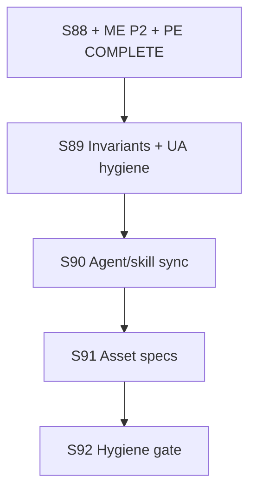

# Future Sprint Roadmap — Project Aegis (cmano-clone)
> **Parallel-Agentic Edition — Post–Editor Completion (S89+ Engineering Hygiene)**

> **Status:** Living document. Authored **2026-07-09**; supersedes planning intent in [`future-sprint-roadpmap-07042026.md`](future-sprint-roadpmap-07042026.md) (2026-07-04 S81–S88 scenario editor program, now archived).
> **Edition:** Optimized for serial sprints **S89–S92** (engineering hygiene + asset spec production) with parallel tracks inside each sprint; stage **Release** throughout; **docs + tests + asset specs** (no Launch advance); GitNexus mandatory; verification-before-completion on all claims.
> **Stable alias:** [`future-sprint-roadpmap.md`](future-sprint-roadpmap.md) → this file (updated 2026-07-09).
> **Primary authority (S89–S92):** This file + [`post-editor-hygiene-scope-boundary-2026-07-09.md`](../../production/post-editor-hygiene-scope-boundary-2026-07-09.md) + [`roadmap-execute-plan-07092026.md`](roadmap-execute-plan-07092026.md) + [`implementation-tracker-2026-07-04.md`](../../Game-Requirements/implementation-tracker-2026-07-04.md).
> **Invariants carryover:** [`production/scenario-editor-scope-boundary-2026-07-04.md`](../../production/scenario-editor-scope-boundary-2026-07-04.md) + [`production/platform-editor-completion-scope-boundary-2026-07-09.md`](../../production/platform-editor-completion-scope-boundary-2026-07-09.md) (superseded for S89+ scope only; standing invariants carried).
> **GitNexus @ doc authoring (2026-07-09):** **24,418** symbols / **47,032** edges / **424** clusters / **300** flows (CLI `node .gitnexus/run.cjs analyze` @ `223a5fe`; status ✅ up-to-date). `impact --summary-only` upstream: **ScenarioDocumentEditor 233 CRITICAL**, **CatalogWriteGate 186 CRITICAL**, **DelegationBridge 145 CRITICAL**, **PatrolCandidateEngagePolicy 113 CRITICAL**, **BalticReplayHarness 54 CRITICAL**.
> **Verification @ doc authoring (RUN+READ):** build **0e/0w**; test **1599/0f** (Sim **311**, Del **260**, UA **286**, Excel **24**, Data **616**, Cli **102**); ReplayGolden **6/6**; C2 proxy **20/20**; hash **`17144800277401907079`** preserved (18 paths); ZERO `DelegationBridge` hotpath edits; UA engage filter **3/3** green.
> **Stage:** **Release** (`production/stage.txt`) — S88 + ME Phase 2 + PE **COMPLETE** (2026-07-09); **no stage advance** until explicit future decision.
> **Closed milestones:** S39–S48 Release enablement; S49–S56 internal engineering; **S57–S64 Baltic v2**; **S65–S68 release train**; **S69–S72 E7 commercial launch prep**; **S73–S80 Baltic v3**; **S81–S88 Scenario Editor**; **ME Phase 2**; **Platform Editor (req 21)**.
> **Active program:** **S89–S92 Post-Editor Engineering Hygiene + Asset Spec Production** — 4-sprint train.

This roadmap is **direction, not a commitment**. Per `docs/COLLABORATIVE-DESIGN-PRINCIPLE.md`, each sprint is still planned via `/sprint-plan` with user approval.

---

## 0. Parallel execution model (S89+ program)

Every sprint is a **serial program** (S89 → … → S92) with **parallel dispatch** inside each sprint. Model proven S39–S88; see [`future-sprint-roadpmap-07042026.md`](future-sprint-roadpmap-07042026.md) §0 for full protocol reference.

### 0.1 Agent environments

| Env | Capacity | Suited for | Not suited for |
|-----|----------|------------|----------------|
| **Local** | ≤6 concurrent | Closeout/merge, gate verification, human sign-off | Mass doc-only hygiene |
| **Cloud Agent** | ≤5 concurrent | Docs, tests, asset specs, AGENTS sync | Unity Editor PNG capture |
| **Combined** | 3–4 effective tracks | — | — |

**Routing:** `production/agentic/local-cloud-agent-routing.md`

### 0.2 Worktree strategy

```
.worktrees/stack/sprint{N}/{track-slug}/
```

### 0.3 Merge gate protocol

1. All tracks `gt submit` their stacks.
2. Closeout track runs `gt restack` on trunk `main`.
3. Verify: `dotnet build ProjectAegis.sln && dotnet test ProjectAegis.sln -v minimal`.
4. Hard gates: **≥1599/0f**, Replay **6/6**, C2 **≥20/20**, hash preserved, ZERO bridge.
5. GitNexus re-index after merge.
6. Update sprint-status.yaml + closeout smoke.

### 0.4 Shared-resource coordination

| Resource | Rule |
|----------|------|
| `ScenarioDocumentEditor` | **CRITICAL (233)** — avoid unless S89 UA track needs read-only |
| `CatalogWriteGate` | **CRITICAL (186)** — extend-only |
| `DelegationBridge` | **ZERO touch** |
| `BalticReplayHarness` | read/test/verify only |
| Test baseline | **≥1599** monotonic |

---

## 1. Where we are (post–editor completion)

| Dimension | State | Evidence |
|-----------|-------|----------|
| Stage | **Release** | `production/stage.txt` |
| Scenario editor | **COMPLETE** (S81–S88 + SE epic) | `s88-scenario-editor-gate-2026-07-04.md`, `se-completion-gate-2026-07-08.md` |
| Mission Editor Phase 2 | **COMPLETE** | `mission-editor-phase2-gate-2026-07-09.md` |
| Platform Editor (req 21) | **COMPLETE** | `platform-editor-completion-gate-2026-07-09.md` |
| Test baseline | **1599/0f**, Replay **6/6**, C2 **20/20** | `gates-post-editor-hygiene-2026-07-09.log` |
| GitNexus | **24418/47032/424** @ `223a5fe` fresh | analyze 2026-07-09 |
| Asset manifest | **42 Needed / 0 Done** | `design/assets/asset-manifest.md` |
| Forward gap | Roadmap alias stale; agent docs drift | dashboard 2026-07-09-am |

**What closed since 2026-07-04:**

- S81–S88 headless scenario editor + AC-8 host path
- scenario-editor-completion (SE-W0–W3)
- Mission Editor Phase 2 (ME-W0–W3)
- Platform Editor PE-W0–W4 + adversarial hardening (1599/0)

---

## 2. Completed program archive

### S81–S88 Scenario Editor (req 11) — COMPLETE

See [`future-sprint-roadpmap-07042026.md`](future-sprint-roadpmap-07042026.md) §2–§10 + [`production/gate-checks/s88-scenario-editor-gate-2026-07-04.md`](../../production/gate-checks/s88-scenario-editor-gate-2026-07-04.md).

### Prior programs — see archived roadmaps

| Program | Roadmap snapshot |
|---------|------------------|
| S73–S80 Baltic v3 | [`future-sprint-roadpmap-062526.01.md`](future-sprint-roadpmap-062526.01.md) |
| S69–S72 E7 prep | [`future-sprint-roadpmap-062526.md`](future-sprint-roadpmap-062526.md) |
| S65–S68 release train | [`future-sprint-roadpmap-062426.md`](future-sprint-roadpmap-062426.md) |

---

## 3. S89–S92 committed scope — Post-Editor Hygiene

User decision **2026-07-09:** next train optimizes for **engineering hygiene + asset spec production** without Launch advance. **4-sprint train (S89–S92)**. Stage remains **Release**.

| Sprint | Theme | Primary deliverable |
|--------|-------|---------------------|
| **S89** | Invariant + UA residual | AGENTS/tracker floor **≥1599/20/20**; UA engage hygiene doc |
| **S90** | Agent/skill P0 sync | Tech-stack recs A1–A3 / B1–B3 (docs only) |
| **S91** | Asset production specs | ASSET-001…003 refined under `design/assets/specs/` |
| **S92** | Hygiene gate | Program sign-off + human ack **"post-editor hygiene program complete"** |

**Program exit criterion (S89–S92):** Invariant floors documented; agent/skill P0 drift closed; asset priority stubs produced; standing invariants held — **not** Launch stage, **not** store submission, **not** Baltic reopen.

**Still out of scope:** Launch stage advance; E7 commercial execution; ME Phase 2 GUI; WYSIWYG platform editor; `DelegationBridge` edits; hash change w/o ADR; Addressables bulk import.

**Program timeline:**



---

## 4. Standing invariants (updated floor)

| Invariant | Floor @ S89 start |
|-----------|-------------------|
| Solution tests | **≥1599 / 0 failed** |
| ReplayGolden | **6/6** |
| C2 proxy | **≥20/20** |
| Baltic production hash | **`17144800277401907079`** (18 paths) |
| DelegationBridge | **ZERO** hotpath edits |
| CatalogWriteGate | **extend-only** |

Evidence: [`production/qa/evidence/gates-post-editor-hygiene-2026-07-09.log`](../../production/qa/evidence/gates-post-editor-hygiene-2026-07-09.log)

---

## 5. GitNexus watchlist (§5)

| Symbol | Impact | Risk |
|--------|--------|------|
| ScenarioDocumentEditor | 233 | CRITICAL |
| CatalogWriteGate | 186 | CRITICAL |
| DelegationBridge | 145 | CRITICAL |
| PatrolCandidateEngagePolicy | 113 | CRITICAL |
| BalticReplayHarness | 54 | CRITICAL |

**Preflight:** `impact --summary-only` before any edit touching these symbols.

---

## 6. Dispatch checklist (S89 first)

- [x] User approves this roadmap (collaboration protocol) — **2026-07-09**
- [x] `/sprint-plan new` for **S89 only** (not S90–S92 yet)
- [x] Publish `production/sprints/sprint-89-invariant-hygiene.md`
- [x] QA plan `production/qa/qa-plan-sprint-89-post-editor-hygiene-2026-07-09.md`
- [x] Kickoff `production/agentic/sprint-89-parallel-kickoff-2026-07-09.md`
- [ ] GitNexus pre + gates RUN+READ before track dispatch (re-run at S89 kickoff)
- [x] Dispatch S89-01 + S89-02 parallel tracks — **COMPLETE 2026-07-09**
- [x] S89 closeout — [`smoke-sprint-89-closeout-2026-07-09.md`](../../production/qa/smoke-sprint-89-closeout-2026-07-09.md)
- [x] S91 closeout — [`smoke-sprint-91-closeout-2026-07-09.md`](../../production/qa/smoke-sprint-91-closeout-2026-07-09.md)
- [x] S92 verification — [`s92-post-editor-hygiene-gate-2026-07-09.md`](../../production/gate-checks/s92-post-editor-hygiene-gate-2026-07-09.md)
- [x] Human ack: "post-editor hygiene program complete" (S89–S92 program exit) — **"i acknowledge"** 2026-07-09

---

## 7. References

| Doc | Path |
|-----|------|
| Scope boundary | `production/post-editor-hygiene-scope-boundary-2026-07-09.md` |
| Execute plan | `docs/reports/roadmap-execute-plan-07092026.md` |
| Status truth | `production/agentic/post-editor-status-truth-2026-07-09.md` |
| Tech-stack recs | `docs/reports/tech-stack-agent-skill-recommendations-2026-07-08.md` |
| Asset manifest | `design/assets/asset-manifest.md` |
| Dashboard snapshot | `docs/reports/dashboard-snapshots/2026-07-09-am.md` |

**End of future-sprint-roadpmap-07092026.md (S89–S92 hygiene focus). Supersedes 07042026 for forward planning; carries invariants. Publish → update alias → dispatch S89.**
