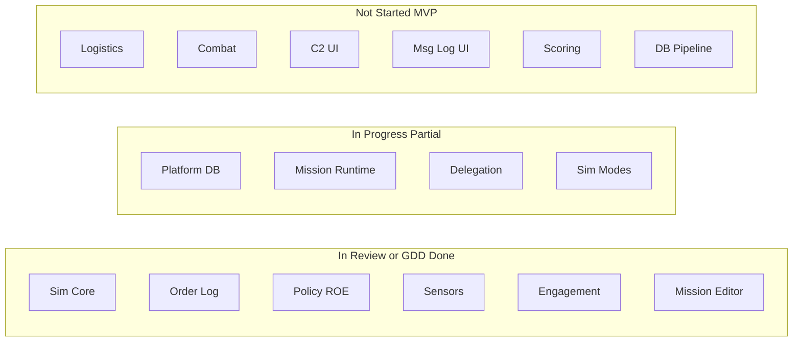

# Project Aegis — Project Dashboard

**Generated**: 2026-05-31  
**Last Updated**: 2026-06-02T09:58:00Z  
**Run Label**: sprint1-close-sprint2-prep  
**Stage**: Production (Sprint 1 complete; Sprint 2 sensor/C2)
**Analysis Scope**: Full project

---

## Executive Summary

Project Aegis has strong foundations in requirements (26 docs), accepted architecture decisions (5 ADRs), and substantial C# implementation (~96 source files, 36 test files) across Delegation, Sim, Data, and UnityAdapter assemblies. GitNexus indexes **2,815 nodes**, **5,198 edges**, and **100 execution flows** at commit `8debee4`.

Production tracking uses **epics** under `production/epics/` plus [Sprint 1](../production/sprints/sprint-1-headless-mvp.md) (**complete** on `main` @ `1f7423e`) and [Sprint 2](../production/sprints/sprint-2-sensor-c2.md) (classify FSM + C2 UI). [MVP milestone](../production/milestones/vertical-slice-mvp.md) defined. Design coverage is **6 of 20 systems** (30%); asset pipeline not started.

**Current focus:** Sprint 2 — Contact Classify/Identify FSM + Unity sensor C2 presentation (`sensor-detection-ew` GDD approved).

**Blocking issues:**

| Source | Finding |
|--------|---------|
| Determinism audit (2026-05-29) | **DET-001** fixed; `dotnet test ProjectAegis.sln` — **129 passed** on `main` @ `5a8b7d1` (2026-06-02) |
| Same audit | 2 LOW findings (DET-002, DET-003) — off hot path |
| Requirements design review | Verdict **CONCERNS** — blockers **C1–C5** (OrderLog vs DecisionLog, ROE/EMCON/WRA vs IRoeFilter, engage pipeline, mission runtime, detection tick owner) |
| Impact analysis | `DecisionLog` and `DelegationOrchestrator` **HIGH** GitNexus blast radius |
| Sprint 2 | Stories not yet filed — run `/create-stories` for classify + C2 epics |
| GitNexus index | Re-indexed 2026-06-02 @ `1f7423e` — **3,462** nodes, **197** flows |

---

## Since Last Update (GitNexus + Git)

**Baseline run** — no previous `production/dashboard-state.yaml` snapshot to compare.

| Signal | Previous | Current (2026-05-31 initial) | Delta |
|--------|----------|------------------------------|-------|
| Indexed commit | — | `8debee4` | baseline |
| GitNexus nodes | — | 2,815 | baseline |
| GitNexus edges | — | 5,198 | baseline |
| Execution flows | — | 100 | baseline |
| Changed symbols (detect-changes) | — | 2 (AGENTS.md, CLAUDE.md context) | GitNexus re-index |
| Sprint stories complete | — | N/A (no sprint) | — |
| GDD systems with docs | — | 6/20 | baseline |

---

## GitNexus Code Intelligence

**Index status:** Fresh (indexed 2026-05-31, commit `8debee4`)

| Metric | Value |
|--------|-------|
| Indexed commit | `8debee4` |
| Nodes (symbols) | 2,815 |
| Edges (relationships) | 5,198 |
| Clusters | 45 |
| Execution flows | 100 |
| detect-changes (current diff) | 2 files, 2 symbols, 0 affected processes, **LOW** risk |

### Watchlist Symbol Risk (upstream impact)

| Symbol | Risk | Direct dependents | Processes affected |
|--------|------|-------------------|-------------------|
| `IRoeFilter` | LOW | 2 | 0 |
| `DecisionLog` | **HIGH** | 15 | 3 (Tick, RunExecutingTick, …) |
| `DelegationOrchestrator` | **HIGH** | 22 | 1 (CreateWithMvpEngagement) |
| `SimTickPipeline` | LOW | — | — |

**Implication:** Order log evolution (C1) and orchestrator changes touch high-blast-radius paths. Run `gitnexus impact` before editing `DecisionLog` or `DelegationOrchestrator`.

---

## Sprint Status

**Status:** Sprint 1 plan on disk — tracking not automated.

| Metric | Value |
|--------|-------|
| Sprint plans found | 1 (`production/sprints/sprint-1-headless-mvp.md`) |
| `sprint-status.yaml` | Missing |
| Stories in sprint | N/A |
| Complete vs In Progress/Not Started | N/A (no sprint) |

### Implementation Tracking (Proxy — non-sprint)

Ad hoc task lists in `docs/superpowers/plans/`:

| Plan | Complete | Open | Notes |
|------|----------|------|-------|
| `2026-05-30-simulation-modes-decisions-followup.md` | 7 | 0 | **Complete** — DELEG-6–9 on `main` |
| `2026-05-30-phase-gate-loop-policy.md` | 5 | 2 | Full test suite + commit |
| `2026-05-28-agent-delegation-framework.md` | 0 | 58 | **Stale** — delegation largely implemented |

**Ratio (proxy):** 7 complete / 65 total checklist items ≈ **11%** (not a sprint burndown).

### Systems Index (Design Proxy)

From `design/gdd/systems-index.md` (20 systems):

| Status bucket | Count | Approx. share |
|---------------|-------|---------------|
| In Progress / Partial | 5 | 25% |
| In Review / In Design | 4 | 20% |
| Not Started | 9 | 45% |
| Draft / other | 2 | 10% |

**Recommendation:** Run `/sprint-plan new` to create `production/sprints/sprint-1.md` + `production/sprint-status.yaml`.

---

## Milestone Tracking

| Field | Value |
|-------|-------|
| Current milestone (formal) | **Undefined** — no milestone definition file |
| Inferred target | **Baltic-style Vertical Slice (MVP)** — plan → fight → replay |
| Deadline | **Not documented** |
| Sprint plans | 0 |
| Sprints remaining | **Unknown** — requires milestone scope + sprint cadence |

**Nearest milestone-adjacent artifacts:**

- `.claude/docs/templates/milestone-definition.md` — template only
- `.claude/docs/templates/vertical-slice-report.md` — gate template, no report filed
- `docs/engineering/graphite-stack-delegation-2026-05-30.md` — DELEG-1…9 PR stack (not milestone-scoped)

**Recommendation:** Define `production/milestones/vertical-slice-mvp.md`; then `/milestone-review`.

---

## Completeness Overview

### Design Documentation

- **Status:** ~30% (systems with GDDs)
- **Files in `design/gdd/`:** 10
- **Systems with GDD:** 6 / 20
- **Narrative docs:** 0 (`design/narrative/` absent)
- **Level designs:** 0 (`design/levels/` absent)
- **Art Bible / UX specs:** 0

**Key GDD gaps:** Logistics (7), Combat Domains (8), C2 UI (12), Message Log UI (13), Platform DB (4), Mission Runtime (9).

### Architecture Documentation

- **Status:** ~53% TR matrix; ~36% qualitative ADR coverage
- **ADRs:** 5 (001–005), all **Accepted** (2026-05-29)
- **Master architecture:** `docs/architecture/architecture.md` — **Draft**
- **TR coverage:** 18 / ~34 MVP TRs mapped
- **Missing:** `/architecture-review` report, control manifest, ADRs for logistics/C2/cyber/DB pipeline

| ADR | Title | Status |
|-----|-------|--------|
| ADR-001 | Sim assembly boundary | Accepted |
| ADR-002 | Policy evaluator | Accepted |
| ADR-003 | Order log schema | Accepted |
| ADR-004 | Tick pipeline order | Accepted |
| ADR-005 | DOTS sim core | Accepted |

### Production Management

- **Status:** ~5%
- **Sprint plans:** 0
- **Milestones:** 0
- **Epics / stories:** 0
- **QA plans / bugs:** 0
- **Determinism audits:** 1
- **Roadmap:** 0

### Source Code & Tests

- **C# source files (excl. tests):** 96
- **Test files:** 36 across 4 projects (`Delegation`, `Sim`, `Data`, `UnityAdapter`)
- **Top-level `tests/`:** Absent (co-located pattern)
- **Prototypes:** 0

### MVP Systems Progress (Inferred)



---

## Asset Manifest

**Source:** `design/assets/asset-manifest.md` — **does not exist**

| Category | Needed | Done | Notes |
|----------|--------|------|-------|
| Master asset manifest | 1 | 0 | File not created |
| Per-asset specs (ASSET-*) | 0 tracked | 0 | Blocked on Art Bible + approved GDDs |
| Art Bible | 1 | 0 | Template only |
| Game art/audio assets | TBD | ~0 | No `assets/` pipeline |

**Overall asset progress:** **0%** — pipeline not started.

---

## Gaps Identified

### Critical (block progress)

1. **No production tracking** — sprints, milestones, epics, stories missing; velocity unmeasurable
2. **Design-review blockers C1–C5** — OrderLog/DecisionLog, ROE/EMCON/WRA, engage pipeline, mission runtime, detection tick owner
3. **Determinism CI loop open** — DET-001 fixed but `dotnet test` confirmation pending in audit

### Important (affect quality/velocity)

4. **14 systems without GDDs** — blocks vertical-slice content and UI work
5. **Incomplete TR traceability** — 18/34 MVP TRs in architecture doc
6. **ADR implementation gaps** — policy migration (002), order log union (003), DOTS (005) incomplete

### Nice-to-Have

7. Risk register, tech-debt register, QA backlog scaffolding
8. DET-002/DET-003 low-severity determinism hygiene

---

## Recommended Next Steps

### Immediate Priority

1. **`/sprint-plan new`** — establish sprint-1 and `sprint-status.yaml`; unblocks burndown tracking
2. **Resolve C1 (Order Log)** — `/design-system order-log-replay` + `/consistency-check`; HIGH blast radius on `DecisionLog`
3. **Start DATA-2** — `stack/data/basepd` from `main`; wire catalog `basePd` into detection loop

### Short-Term

4. **Define MVP milestone** — `production/milestones/vertical-slice-mvp.md`
5. **`/create-epics`** → **`/create-stories`** — map GDD systems to implementable stories
6. **`/architecture-review`** — expand TR matrix; gate `/create-control-manifest`

### Medium-Term

7. **Author missing MVP GDDs** — logistics, combat domains, C2 UI
8. **`/art-bible`** → **`/asset-spec`** — start asset pipeline
9. **`/vertical-slice`** — when sim loop + minimal UI are ready

---

## Follow-Up Skills to Run

Based on gaps identified:

| Gap / Trigger | Skill or Command |
|---------------|------------------|
| Manual dashboard refresh | `/project-dashboard` |
| No sprint tracking | `/sprint-plan new` |
| No milestone definition | Create `production/milestones/vertical-slice-mvp.md`; `/milestone-review` |
| Pre-Production → Production gate | `/gate-check` |
| Missing epics/stories | `/create-epics` → `/create-stories [epic-slug]` |
| Incomplete architecture traceability | `/architecture-review` → `/create-control-manifest` |
| Missing GDDs | `/design-system [system-slug]` |
| Order log blocker C1 | `/design-system order-log-replay` + `/consistency-check` |
| No asset pipeline | `/art-bible` → `/asset-spec` |
| Determinism re-verification | `/determinism-audit` + `/replay-verify` |
| Stage baseline | `/project-stage-detect` |
| Vertical slice readiness | `/vertical-slice` |
| DATA stack (DATA-1) | Rebase `stack/data/p0-spec` on `main`; see `graphite-stack-backlog-2026-06.md` |
| Stale GitNexus index | `npx gitnexus analyze` |
| Pre-merge code changes | `npx gitnexus detect-changes` |
| Automation not running | [cursor.com/automations](https://cursor.com/automations) + `.cursor/automations/README.md` |

---

## Appendix: File Counts by Directory

```
design/
  gdd/              10 files
  narrative/         0 files
  levels/            0 files
  assets/            0 files

docs/
  architecture/      7 files (5 ADRs + architecture + wiring)
  reports/           1 dashboard + snapshots/

production/
  sprints/           0 files
  milestones/        0 files
  epics/             7 epics + stories (Baltic, sensor, PD, EMCON, EW, stale, world hash)
  determinism/       1 audit
  dashboard-state.yaml  1 file

Game-Requirements/   26 files

src/
  source (.cs)       96 files (excl. tests)
  test (.cs)          36 files

tests/               0 (co-located under src/*Tests/)
prototypes/          0
```

---

*Generated by producer agent — aggregated from production, design, architecture, GitNexus, and audit artifacts*
