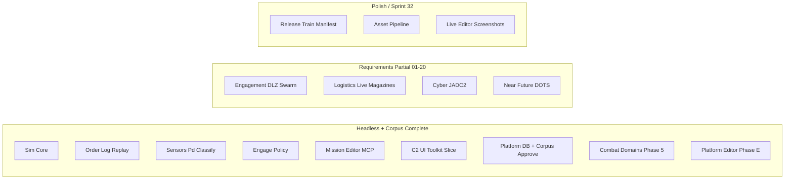

# Project Aegis — Project Dashboard

**Generated**: 2026-06-19  
**Last Updated**: 2026-06-19T12:00:00Z  
**Run Label**: pm (post-S31 closeout / Sprint 32 kickoff)  
**Stage**: Production — Baltic vertical slice **PROCEED**; Sprints **1–31** delivered; **Sprint 32** in flight  
**Analysis Scope**: Full project  
**Compared to**: [dashboard-snapshots/2026-06-04-pm.md](dashboard-snapshots/2026-06-04-pm.md) (prior dashboard)

---

## Executive Summary

In two weeks since the last dashboard, the program advanced from **requirements waves** through **Sprints 27–31**: full **CMO corpus nightly approve** (ship, sensor, weapon, aircraft, facility, submarine off-CI), **TL release-train binding** at scenario load, **ADR-009 combat domains Phase 5** (mine validator, facility hot-tick, BDA projection), and **Platform Editor Phases C–E** plus **C2 planning chrome** and **presentation evidence**.

GitNexus at `d3db76d` indexes **14,424 nodes**, **29,218 edges**, and **300 execution flows** (roughly **2.3×** symbol growth vs. the June 4 snapshot). **`dotnet test ProjectAegis.sln`** reports **1,006 passing** tests with **0 failures** (live verify 2026-06-19).

Production tracking is **mature**: **32** sprint plan files, **49** epics, **132** story files, and `production/sprint-status.yaml` with **245** completed story entries. **Sprint 30** closed **13/13**; **Sprint 31** closed **12/13** (S31-12 CI hygiene deferred); **Sprint 32** is **1/13** (S32-01 baseline done).

The [vertical slice gate](../production/vertical-slice/gate-2026-06-02.md) remains **PROCEED**. **C2 manual sign-off** is **16/16 PASS WITH NOTES** via headless proxy (S31-08); live Unity Editor screenshots remain advisory polish.

Game Requirements **documentation** for 01–20 is **complete**; **MVP gameplay** for each requirement remains **Partial** (tracker: [implementation-tracker-2026-06-04.md](../../Game-Requirements/implementation-tracker-2026-06-04.md)).

**Current focus:** Sprint 32 — unified release-train manifest, mount/loadout quarantine triage, ADR-009 Phase 6 (facility validator, ECCM), Platform Editor Phase F (damage Unity surfacing).

**Blocking / open gates:**

| Source | Finding |
|--------|---------|
| Unity QA | [c2-manual-signoff-2026-06-02.md](../production/qa/c2-manual-signoff-2026-06-02.md) — **16/16 PASS WITH NOTES** (headless proxy; live Editor re-capture advisory) |
| Sprint 32 | **1/13** stories done — release-train manifest (S32-02) on critical path |
| Architecture | **CONCERNS** overall — TR gaps persist; combat/catalog surface expanded since June review |
| GitNexus watchlist | `DecisionLog`, `DelegationOrchestrator` **HIGH**; `SqliteCatalogReader` **CRITICAL** |
| Assets | No `design/assets/asset-manifest.md` — pipeline **0%** |
| CI hygiene | S31-12 / S32-12 deferred — `verify-ci-local.ps1` baseline refresh backlog |

---

## Since Last Update (vs 2026-06-04 dashboard)

Comparison anchor: [2026-06-04-pm.md](dashboard-snapshots/2026-06-04-pm.md).

| Signal | 2026-06-04 | 2026-06-19 (this run) | Delta |
|--------|------------|------------------------|-------|
| Indexed commit | `ff49ef2` | `d3db76d` | +14 days dev |
| GitNexus nodes | 6,220 | **14,424** | **+8,204 (+132%)** |
| GitNexus edges | 15,105 | **29,218** | **+14,113 (+93%)** |
| Execution flows | 300 | **300** | Stable count |
| Sprint plans | 10 | **32** | +22 (Sprints 11–32) |
| Epics / stories | 15 / 27 | **49 / 132** | +34 / +105 |
| `sprint-status.yaml` done | 54 | **245** | +191 |
| C# source files (excl. tests) | 368 | **523** | **+155** |
| C# test files | 207 | **310** | **+103** |
| `dotnet test` (solution) | 351 passed | **1,006 passed**, 0 failed | **+655 (+187%)** |
| GDD files in `design/gdd/` | 15 | **18** | +3 |
| ADRs (Accepted) | 10 | **11** (001–011) | +1 (platform editor Excel) |
| C2 manual sign-off | 12 checks open | **16/16 PASS WITH NOTES** | Headless proxy cleared |
| Current sprint | Requirements waves | **Sprint 32** (1/13) | Release-train + combat Phase 6 |
| Req 05 Dynamic Systems | Not started | **Partial+** | OSINT connectors + Cesium spike |
| Req 06 corpus approve | P0 on main | **Full corpora off-CI** | sensor 7208, weapon 4403, ship 4844, entities |
| Req 18 combat domains | Partial | **ADR-009 Phase 5** | mine, facility hot-tick, BDA projection |
| Req 21 platform editor | Partial | **Phases C–E + planning chrome** | import UI, Begin Execution, S31 sign-off |

---

## GitNexus Code Intelligence

**Index status:** Up-to-date (re-indexed 2026-06-18, commit `d3db76d`)

| Metric | Value |
|--------|-------|
| Indexed commit | `d3db76d` |
| Nodes (symbols) | 14,424 |
| Edges (relationships) | 29,218 |
| Execution flows | 300 |
| detect-changes | Use repo-scoped MCP before commits |

### Watchlist Symbol Risk (upstream impact)

| Symbol | Risk | Notes |
|--------|------|-------|
| `IRoeFilter` | LOW | Stable policy seam |
| `DecisionLog` | **HIGH** | Order-log evolution — run `gitnexus impact` before edits |
| `DelegationOrchestrator` | **HIGH** | Engage / tick integration |
| `SimTickPipeline` | LOW | Tick ordering stable per ADR-004 |
| `SqliteCatalogReader` | **CRITICAL** | Corpus approve + TL export — test harness parity required |
| `CatalogReleaseTrainResolver` | **HIGH** | S31-03 release-train binding at load |

**Implication:** Prefer `ICatalogReader` / `IWriteGate` / `CatalogReleaseTrainResolver` seams; avoid direct SQLite from Sim/Delegation.

---

## Sprint Status

**Status:** Sprints **1–31** delivered (S31-12 deferred). **Sprint 32** in progress — **1/13** done. `current_sprint: 32` in `production/sprint-status.yaml`.

| Metric | Value |
|--------|-------|
| Sprint plan files | 32 |
| Epics | 49 |
| Story files | 132 |
| `sprint-status.yaml` done entries | **245** |
| Current solution tests | **1,006** (Sim 229 + Delegation 230 + Data 320 + UnityAdapter 189 + Cli 33 + Excel 5) |
| ReplayGolden suite | **6/6** PASS |
| Unity C2 sign-off | **16/16 PASS WITH NOTES** (headless) |

### Recent sprint summary

| Sprint | Theme | Status |
|--------|-------|--------|
| 27 | CMO corpus import + ADR-009 bounded + Phase C viewer | **Complete** |
| 28 | Corpus v2 + platform write + combat Phase 2 | **Complete** |
| 29 | TL export + corpus approve + combat Phase 3 + Phase E import UI | **Complete** |
| 30 | TL Phase 3–4 + ship approve scale + combat Phase 4 + planning chrome | **Complete** (13/13) |
| 31 | Corpus complete + TL release train + combat Phase 5 + C2 sign-off refresh | **Complete** (12/13; S31-12 deferred) |
| **32** | Release-train manifest + quarantine + combat Phase 6 + Platform Phase F | **In progress** (1/13) |

### Sprint 32 backlog (active)

| ID | Story | Status |
|----|-------|--------|
| S32-01 | Full-solution re-baseline | **Done** @ `d3db76d` |
| S32-02 | Unified release-train manifest | Ready |
| S32-03 | Mount/loadout quarantine triage | Ready (blocked on S32-02) |
| S32-04 | Facility aspect domain validator | Ready |
| S32-05 | ECCM scenario factor (bounded) | Ready |
| S32-06 | Platform Editor Phase F — damage Unity | Ready |
| S32-07–13 | Release diff, mine hazard, BDA hook, live evidence, closeout | Backlog / should-have |

### Requirements implementation (proxy burndown)

From [implementation-tracker-2026-06-04.md](../../Game-Requirements/implementation-tracker-2026-06-04.md) @ 2026-06-18:

| Req bucket | Count |
|------------|-------|
| MVP **Partial** | **20** (all requirements have headless slices; none 100% MVP-done) |
| MVP **Not started** | **0** (req 05 upgraded to Partial+) |
| Requirements **docs** complete | 01–20 |

**Notable depth since June 4:** req **06** full nightly corpora off-CI; req **18** combat Phase 5; req **21** platform editor through Phase E + S31 presentation/C2 sign-off.

---

## Milestone Tracking

| Field | Value |
|-------|-------|
| Formal milestone | [vertical-slice-mvp.md](../production/milestones/vertical-slice-mvp.md) |
| Post-MVP program | [post-mvp-requirements-program.md](../production/milestones/post-mvp-requirements-program.md) |
| Target date (proposed) | 2026-07-15 |
| Gate verdict | **PROCEED** ([gate-2026-06-02](../production/vertical-slice/gate-2026-06-02.md)) |
| Must-ship criteria | Headless plan→fight→replay, classify FSM, sensor C2 — **met** |
| Outstanding for “production polish” | Release-train ops, live Editor evidence, asset pipeline, full GDD MVP coverage |

---

## Completeness Overview

### Design Documentation

- **Status:** ~**60%** systems with linked GDDs (12 / 20 in [systems-index.md](../../design/gdd/systems-index.md))
- **GDD files:** 18 under `design/gdd/`
- **Narrative / levels / art bible:** Still absent
- **Game Requirements:** 26 files + master index + **implementation tracker**

**Vs June 4:** GDD count 15 → 18; systems-index refreshed Sprint 19 (sim-core, logistics, engage).

### Architecture Documentation

- **ADRs:** **11** (001–011), including platform editor Excel round-trip (011)
- **Architecture review (2026-06-02):** **CONCERNS** — refresh recommended post-S30/S31 catalog + combat surface
- **Blockers C1–C4:** **Closed** (order log, combat outcomes, ROE, EMCON)
- **Master architecture:** `docs/architecture/architecture.md` — still **Draft**

### Production Management

- **Status:** ~**90%** for MVP engineering track (32 sprints, 49 epics, 132 stories, QA sign-offs S30–S31)
- **Sprint plans:** 32
- **Milestones:** 2 (vertical slice + post-MVP program)
- **Epics:** 49
- **Stories:** 132
- **Determinism / replay:** Audits + golden replay **6/6** PASS
- **QA:** Sprint 30–31 sign-offs **APPROVED**; Sprint 32 baseline PASS

**Vs June 4:** Production tracking scaled from Baltic MVP stack (15 epics) to full S27–S32 program.

### Source Code & Tests

| Metric | 2026-06-04 | 2026-06-19 |
|--------|------------|------------|
| C# source files (excl. tests) | 368 | **523** |
| C# test files | 207 | **310** |
| Test projects | 5 | **6** (+ Data.Excel.Tests) |
| Solution tests passing | 351 | **1,006** |

**Assemblies:** `ProjectAegis.Data`, `ProjectAegis.Data.Excel`, `Sim`, `Delegation`, `Delegation.UnityAdapter`, `MissionEditor.Cli`, `Delegation.Demo`.

### MVP Systems Progress (Inferred)



---

## Asset Manifest

**Source:** `design/assets/asset-manifest.md` — **does not exist**

| Category | Needed | Done | Notes |
|----------|--------|------|-------|
| Master asset manifest | 1 | 0 | Unchanged since May 31 |
| Art Bible | 1 | 0 | Template only |
| Game art/audio | TBD | ~0 | No `assets/` art pipeline |

**Overall asset progress:** **0%**

---

## Gaps Identified

### Critical (velocity / next sprint)

1. **S32-02 release-train manifest** — consolidates S31 domain drops; blocks quarantine triage (S32-03)
2. **No asset pipeline** — blocks visual production and Addressables work
3. **Live Unity Editor evidence** — S31/S32 protocol PNG placeholders; headless proxy sufficient for merge, not for polish gate

### Important (velocity / quality)

4. **20/20 requirements MVP partial** — multi-year scope; continued stacked PR discipline
5. **GitNexus HIGH/CRITICAL symbols** — impact analysis mandatory before orchestrator/catalog edits
6. **TR architecture gaps** — refresh `/architecture-review` after S30–S31 combat + corpus surface
7. **CI/local gate refresh** — S31-12 / S32-12 deferred three sprints

### Resolved since June 4

8. ~~Unity C2 12 checks open~~ → **16/16 PASS WITH NOTES** (S31-08 headless proxy)
9. ~~Req 05 not started~~ → **Partial+** (OSINT + Cesium foundation)
10. ~~Corpus approve at scale missing~~ → **S30–S31** ship/sensor/weapon/entity corpora off-CI
11. ~~Combat domains Phase 4 only~~ → **Phase 5** mine/facility/BDA hot paths (S31)
12. ~~Platform import UI missing~~ → **Phase E** `PlatformImportPanelHost` + planning chrome (S29–S31)
13. ~~351 tests~~ → **1,006** tests green
14. ~~10 sprint plans~~ → **32** sprints documented; S30–31 closed

### Nice-to-have

15. Cesium production globe (spike complete; not production)
16. Formal Sprint 33 plan for DBI-3.5 cross-system validation + weapon→mount graph
17. Refresh `production/dashboard-state.yaml` on every `/project-dashboard` run (updated this run)

---

## Recommended Next Steps

### Immediate Priority

1. **S32-02 unified release-train manifest** — `RecordRelease` + scenario load resolution
2. **S32-04 facility validator + S32-05 ECCM** — parallel after S32-01 (both unblocked)
3. **`npx gitnexus impact SqliteCatalogReader`** before next catalog/schema edit

### Short-Term

4. **S32-06 Platform Editor Phase F** — damage workbook Unity surfacing
5. **S32-03 quarantine triage** — FK repair on mount/loadout child rows
6. **Live Editor batch** — `Invoke-C2PlayModeSignoffBatch.ps1 -Scenario import,begin-execution` on Windows/macOS host (S32-10/11)

### Medium-Term

7. **`/art-bible`** → **`/asset-spec`** — unblock asset pipeline (still 0%)
8. **Sprint 33 planning** — DBI-3.5, weapon→mount graph, datalink share gate on comms degrade
9. **Milestone review** @ 2026-07-15 target — assess Production → Polish gate with live evidence

---

## Follow-Up Skills to Run

| Gap / Trigger | Skill or Command |
|---------------|------------------|
| Dashboard refresh | `/project-dashboard` |
| Sprint 32 execution | `/dev-story` on S32-02+ |
| Catalog / DB work | `sqlite-schema-management`, `provenance-audit-modeling` |
| Pre-merge safety | `npx gitnexus analyze` + `gitnexus impact` (repo: cmano-clone) |
| Determinism | `/replay-verify`, `/determinism-audit` |
| Stage / gate | `/gate-check`, `/milestone-review` |
| Live C2 polish | `team-qa` + Unity Editor host |
| Asset zero | `/art-bible` |

---

## Appendix: File Counts by Directory

```
design/
  gdd/              18 files
  narrative/         0 files
  levels/            0 files
  assets/            0 files (no manifest)

docs/
  architecture/     11 ADRs + architecture + traceability
  reports/           dashboard + snapshots/

production/
  sprints/          32 files
  milestones/        2 files
  epics/            49 EPIC.md + 132 stories
  determinism/       replay + audits
  qa/                smoke + sign-offs (S27–S32)
  agentic/           sprint stacks + PI closure docs

Game-Requirements/   26+ requirements + tracker

src/
  source (.cs)       523 files (excl. Tests)
  test (.cs)         310 files

tests/               regression README (golden catalog)
prototypes/          0
```

---

*Generated by producer agent — aggregated from production, design, architecture, GitNexus, Game Requirements tracker, sprint-status.yaml, and live `dotnet test` verification (2026-06-19)*
