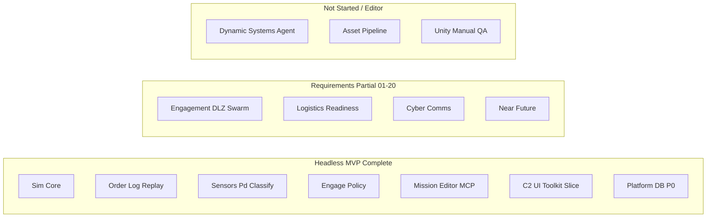

# Project Aegis — Project Dashboard

**Generated**: 2026-06-04  
**Last Updated**: 2026-06-04T19:52:00Z  
**Run Label**: pm (post-req-06 / requirements waves)  
**Stage**: Production — Baltic vertical slice **PROCEED**; Game Requirements implementation in flight  
**Analysis Scope**: Full project  
**Compared to**: [dashboard-snapshots/2026-05-31-initial.md](dashboard-snapshots/2026-05-31-initial.md) (baseline)

---

## Executive Summary

In four days the project moved from **pre-production scaffolding** to a **shipped headless MVP loop** plus active **requirements 01–20** implementation. GitNexus at `ff49ef2` indexes **6,220 nodes**, **15,105 edges**, and **300 execution flows** (roughly **2.2×** symbol growth vs. the May 31 baseline). **`dotnet test ProjectAegis.sln`** reports **351 passing** tests with **0 failures**.

Production tracking is **initialized and heavily used**: **10** sprint plan files (Sprints **1–10** headless code-complete), **15** epics, **27** story files, and `production/sprint-status.yaml` with **54** completed story/backlog entries. The [vertical slice gate](../production/vertical-slice/gate-2026-06-02.md) is **PROCEED**; architecture review blockers **C1–C4** are **closed** (C5 human-in-the-loop deferred).

Game Requirements **documentation** for 01–20 is **complete**; **MVP gameplay** for each requirement remains **Partial** (tracker: [implementation-tracker-2026-06-04.md](../../Game-Requirements/implementation-tracker-2026-06-04.md)). Recent merges include parallel requirement waves **#63–#67** and **req-06** database intelligence P0 (**#68**).

**Current focus:** Requirements stack tasks (C2 UI, live readiness, cyber spoof, platform import scale) and closing the **Unity manual C2 QA** gate.

**Blocking / open gates:**

| Source | Finding |
|--------|---------|
| Unity QA | [c2-manual-signoff-2026-06-02.md](../production/qa/c2-manual-signoff-2026-06-02.md) — **12 checks unchecked** (Editor-only) |
| Cesium spike | Editor checklist — backlog in `sprint-status.yaml` |
| Architecture | **CONCERNS** overall — **12** TR gaps, **21** partial ([architecture-review-2026-06-02.md](../architecture/architecture-review-2026-06-02.md)) |
| GitNexus watchlist | `DecisionLog`, `DelegationOrchestrator` **HIGH**; `SqliteCatalogReader` **CRITICAL** after req-06 |
| Assets | No `design/assets/asset-manifest.md` — pipeline **0%** |
| Determinism hygiene | DET-002/DET-003 **LOW** — off hot path ([determinism audit](../production/determinism/)) |

---

## Since Last Update (vs 2026-05-31 baseline)

Comparison anchor: [2026-05-31-initial.md](dashboard-snapshots/2026-05-31-initial.md). Intermediate state was captured in `production/dashboard-state.yaml` @ 2026-06-02 (`1f7423e`).

| Signal | 2026-05-31 (baseline) | 2026-06-04 (this run) | Delta |
|--------|------------------------|------------------------|-------|
| Indexed commit | `8debee4` | `ff49ef2` | +4 days dev |
| GitNexus nodes | 2,815 | **6,220** | **+3,405 (+121%)** |
| GitNexus edges | 5,198 | **15,105** | **+9,907 (+191%)** |
| Execution flows | 100 | **300** | **+200 (+200%)** |
| Clusters | 45 | **157** | +112 |
| Sprint plans | **0** | **10** | Production tracking live |
| Epics / stories | **0 / 0** | **15 / 27** | Full Baltic MVP stack |
| `sprint-status.yaml` | Missing | Present — **54** `done` entries | Automated tracking |
| C# source files (excl. tests) | 96 | **368** | **+272** |
| C# test files | 36 | **207** | **+171** |
| `dotnet test` (solution) | Not baselined | **351 passed**, 0 failed | CI-grade gate green |
| GDD files in `design/gdd/` | 10 | **15** | +5 (C2, combat, cyber, scoring, infra) |
| Systems with linked GDD | 6 / 20 (30%) | **12 / 20 (60%)** | +6 systems |
| ADRs (Accepted) | 5 | **10** (001–010) | +5 |
| Requirements docs | 26 | 26 + **implementation tracker** | Execution backlog formalized |
| Vertical slice gate | Not filed | **PROCEED** | Milestone gate passed |
| Design blockers C1–C5 | **Open** | **C1–C4 closed**, C5 deferred | Unblocks production |
| Req 06 DB intelligence | Not started | **P0 on main** (#68) | Write gate + agents + MCP |

---

## GitNexus Code Intelligence

**Index status:** Up-to-date (re-indexed 2026-06-04, commit `ff49ef2`)

| Metric | Value |
|--------|-------|
| Indexed commit | `ff49ef2` |
| Nodes (symbols) | 6,220 |
| Edges (relationships) | 15,105 |
| Clusters | 157 |
| Execution flows | 300 |
| detect-changes | N/A on clean tree (multi-repo CLI — use repo-scoped MCP when available) |

### Watchlist Symbol Risk (upstream impact)

| Symbol | Risk | Notes |
|--------|------|-------|
| `IRoeFilter` | LOW | Stable policy seam |
| `DecisionLog` | **HIGH** | Order-log evolution — run `gitnexus impact` before edits |
| `DelegationOrchestrator` | **HIGH** | Engage / tick integration |
| `SimTickPipeline` | LOW | Tick ordering stable per ADR-004 |
| `SqliteCatalogReader` | **CRITICAL** | Req-06 P0; migration 005 + provenance — test harness parity required |

**Implication:** Prefer `ICatalogReader` / `IWriteGate` seams for new catalog work; avoid direct SQLite from Sim/Delegation.

---

## Sprint Status

**Status:** Sprints **1–10** documented; headless delivery **complete** per `production/sprint-status.yaml`. No Sprint 11 plan; **Game Requirements waves** (#63–#68) run parallel to numbered sprints.

| Metric | Value |
|--------|-------|
| Sprint plan files | 10 (`sprint-1` … `sprint-10`) |
| `sprint-status.yaml` | Present — Sprints 1–9 **complete**, Sprint 7–10 code-complete |
| Completed entries (`status: done`) | **54** |
| Latest headless test count (qa_gate) | 276+ documented; current solution **351** |
| Unity manual sign-off | **Pending** — blocks “signed-off C2” |

### Sprint summary (headless)

| Sprint | Theme | Status |
|--------|-------|--------|
| 1 | Headless MVP — plan → fight → replay | **Complete** (PR #36) |
| 2 | Sensor classify + C2 presentation | **Complete** |
| 3 | C2 shell — OOB, missions, message log | **Complete** |
| 4 | C2 map prep + milestone close | **Complete** |
| 5 | Map placeholder + scoring GDD | **Complete** |
| 6 | C2 selection sync | **Complete** |
| 7 | Scoring CSV, cyber GDD, Cesium prep | **Code-complete** |
| 8 | Comms degradation + fuel readout | **Complete** |
| 9 | Batch CSV + map ghost symbology | **Complete** |
| 10 | Fuel ledger, replay SHA-256, QA prep | **Complete** (PR #55) |

### Requirements implementation (proxy burndown)

From [implementation-tracker-2026-06-04.md](../../Game-Requirements/implementation-tracker-2026-06-04.md):

| Req bucket | Count |
|------------|-------|
| MVP **Partial** | 19 |
| MVP **Not started** | 1 (req **05** — Dynamic Speculative Systems Agent) |
| Requirements **docs** complete | 01–20 |

**Recent PR train:** #63 (wave 1) → #64 (wave 2) → #65 (14/18/11) → #66 (wave 3) → #67 (wave 4) → **#68 (req-06 P0)**.

---

## Milestone Tracking

| Field | Value |
|-------|-------|
| Formal milestone | [vertical-slice-mvp.md](../production/milestones/vertical-slice-mvp.md) |
| Target date (proposed) | 2026-07-15 |
| Gate verdict | **PROCEED** ([gate-2026-06-02](../production/vertical-slice/gate-2026-06-02.md)) |
| Must-ship criteria | Headless plan→fight→replay, classify FSM, sensor C2 — **met** |
| Outstanding for “production polish” | Globe/Cesium, full GDD coverage, asset pipeline, Editor QA |

---

## Completeness Overview

### Design Documentation

- **Status:** ~**60%** systems with linked GDDs (12 / 20 in [systems-index.md](../../design/gdd/systems-index.md))
- **GDD files:** 15 under `design/gdd/`
- **Narrative / levels / art bible:** Still absent
- **Game Requirements:** 26 files + master index + **implementation tracker**

**Vs May 31:** 6/20 (30%) → 12/20 (60%); key additions include C2 UI, combat domains, cyber-comms, scoring, agentic infrastructure.

### Architecture Documentation

- **ADRs:** **10** (001–010), including Data (006), mission validation (008), combat validators (009), headless-first UI (010)
- **Architecture review (2026-06-02):** **CONCERNS** — 14 covered / 21 partial / 12 gap TRs
- **Blockers C1–C4:** **Closed** (order log, combat outcomes, ROE, EMCON)
- **Master architecture:** `docs/architecture/architecture.md` — still **Draft**

### Production Management

- **Status:** ~**75%** for MVP engineering track (epics/stories/sprints/QA artifacts present)
- **Sprint plans:** 10
- **Milestones:** 1
- **Epics:** 15 (all MVP slices documented)
- **Stories:** 27
- **Determinism / replay:** Audits + golden replay PASS
- **QA:** Headless smoke PASS; **manual C2 open**

**Vs May 31:** Production tracking went from **~5%** to fully operational for the Baltic MVP program.

### Source Code & Tests

| Metric | May 31 | 2026-06-04 |
|--------|--------|------------|
| C# source files (excl. tests) | 96 | **368** |
| C# test files | 36 | **207** |
| Test projects | 4 | **5** (+ MissionEditor.Cli.Tests) |
| Solution tests passing | Not baselined | **351** |

**Assemblies:** `ProjectAegis.Data`, `Sim`, `Delegation`, `Delegation.UnityAdapter`, `MissionEditor.Cli`, `Delegation.Demo`.

### MVP Systems Progress (Inferred)



---

## Asset Manifest

**Source:** `design/assets/asset-manifest.md` — **does not exist**

| Category | Needed | Done | Notes |
|----------|--------|------|-------|
| Master asset manifest | 1 | 0 | Unchanged since May 31 |
| Art Bible | 1 | 0 | Template only |
| Game art/audio | TBD | ~0 | No `assets/` art pipeline |

**Overall asset progress:** **0%**

---

## Gaps Identified

### Critical (block polish / sign-off)

1. **Unity manual C2 QA** — 12 checks open; headless proxy does not substitute ([c2-manual-signoff-2026-06-02.md](../production/qa/c2-manual-signoff-2026-06-02.md))
2. **No asset pipeline** — blocks visual production and Addressables work
3. **Req 05 not started** — Dynamic Speculative Systems Agent (OSINT staging) — dependency for full req-06 vision

### Important (velocity / quality)

4. **12 TR architecture gaps** — see [architecture-traceability-index.md](../architecture/architecture-traceability-index.md)
5. **19/20 requirements MVP partial** — multi-year scope; needs continued stacked PR discipline
6. **GitNexus HIGH/CRITICAL symbols** — impact analysis mandatory before orchestrator/catalog edits
7. **`sprint-status.yaml` header stale** — still says `sprint: 1`; internal sections through Sprint 10 are authoritative

### Resolved since May 31

8. ~~No production tracking~~ → **10 sprints, 15 epics, 27 stories**
9. ~~C1–C4 design blockers open~~ → **Closed** (C5 deferred)
10. ~~No sprint/milestone~~ → **Vertical slice PROCEED**
11. ~~DET-001 CRITICAL~~ → Fixed; **351** tests green
12. ~~Req-06 P0 missing~~ → **#68 merged** (write gate, agents, MCP)

### Nice-to-have

13. Refresh `production/dashboard-state.yaml` automation on every `/project-dashboard` run (this run updates it)
14. Cesium Phase B spike (Editor)
15. Formal Sprint 11 plan tying requirement tracker rows to epics

---

## Recommended Next Steps

### Immediate Priority

1. **Unity C2 manual sign-off** — run `PLAYMODE-SMOKE.md` + `baltic-patrol-classify` / `baltic-patrol-comms`
2. **Requirements wave 5** — top tracker rows: interactive attack menu (14/20), live readiness (16), cyber spoof (19)
3. **`npx gitnexus impact SqliteCatalogReader`** before next catalog/schema edit

### Short-Term

4. **Update `sprint-status.yaml`** — set `current: 11` or “requirements-wave” mode; refresh `qa_gate.tests_total` to 351
5. **`/architecture-review`** — refresh TR matrix after req-06 + waves 1–4
6. **Req 05 spike** — OSINT proposal + staging DB (unblocks full database intelligence)

### Medium-Term

7. **`/art-bible`** → **`/asset-spec`** — unblock asset pipeline (still 0% since May 31)
8. **CMO catalog import Phase 2** — full platform tables via `tools/cmano-db-crawler/`
9. **Milestone review** @ 2026-07-15 target — extend beyond Baltic to next theater

---

## Follow-Up Skills to Run

| Gap / Trigger | Skill or Command |
|---------------|------------------|
| Dashboard refresh | `/project-dashboard` |
| Unity QA gate | `team-qa` + manual sign-off doc |
| Requirements stack | `team-data` / `team-simulation` / `team-unity` per row |
| Catalog / DB work | `sqlite-schema-management`, `provenance-audit-modeling` |
| Pre-merge safety | `npx gitnexus analyze` + `gitnexus impact` (repo: cmano-clone) |
| Determinism | `/replay-verify`, `/determinism-audit` |
| Stage / gate | `/gate-check`, `/milestone-review` |
| Stale plans | Archive `agent-delegation-framework` checklist (58 open, stale) |
| Asset zero | `/art-bible` |

---

## Appendix: File Counts by Directory

```
design/
  gdd/              15 files
  narrative/         0 files
  levels/            0 files
  assets/            0 files (no manifest)

docs/
  architecture/     10+ ADRs + architecture + traceability
  reports/           dashboard + snapshots/

production/
  sprints/          10 files
  milestones/        1 file
  epics/            15 EPIC.md + 27 stories
  determinism/       replay + audits
  qa/                smoke + sign-off templates
  agentic/           PI closure docs

Game-Requirements/   26+ requirements + tracker

src/
  source (.cs)       368 files (excl. Tests)
  test (.cs)         207 files

tests/               regression README (golden catalog)
prototypes/          0
```

---

*Generated by producer agent — aggregated from production, design, architecture, GitNexus, Game Requirements tracker, and audit artifacts*