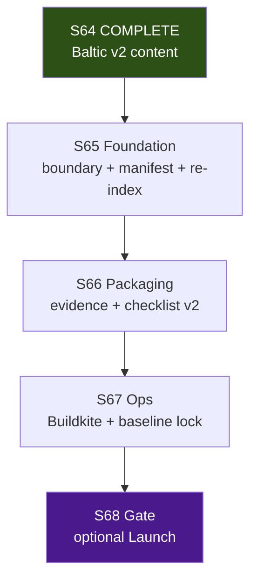

# S65–S68 Release Train — Local + Cloud Agent Execution Plan

> **For agentic workers:** REQUIRED SUB-SKILL: superpowers:subagent-driven-development or superpowers:executing-plans. Per-sprint dispatch via superpowers:dispatching-parallel-agents + using-git-worktrees. Steps use checkbox (`- [ ]`) syntax for tracking.

**Goal:** Ship release-train readiness for Baltic v2 (unified manifest, evidence bundle, CI alignment, optional Launch gate).

**Architecture:** Serial sprints S65→S68; 2–4 parallel tracks within each sprint; local coordinator owns closeout/merge; cloud agents handle code, docs, and CI config.

**Tech Stack:** .NET 8, Graphite (`gt`), GitNexus MCP, Buildkite (`.buildkite/`), headless Play Mode harness.

**Authority:** [`future-sprint-roadpmap-062426.md`](future-sprint-roadpmap-062426.md) §3/§10/§12, [`local-cloud-agent-routing.md`](../../production/agentic/local-cloud-agent-routing.md), [`graphite-github-substitute-plan.md`](../engineering/graphite-github-substitute-plan.md)

---

## 1. Executive summary

This plan coordinates **4 serial sprints (S65–S68)** using **local Cursor agents** (closeout, boundary publish, playtest review) and **Cloud Agents** (manifest hardening, docs, CI). **Sprints run serially**; **tracks within each sprint run in parallel** after baseline + boundary prereqs.

| Dimension | Value |
|-----------|-------|
| **Sprint count** | **4** (S65–S68) |
| **Program** | Release train — E10 lead |
| **Prior program** | S57–S64 Baltic v2 **COMPLETE** (human ack 2026-06-22) |
| **Test baseline @ S65 start** | **1229/1229** (ReplayGolden 6/6, C2 proxy 18/18); monotonic growth thereafter |
| **Max parallel agents per sprint** | **4–5 effective tracks** (local ≤6, cloud ≤5) |
| **Critical path** | S65 → S66 → S67 → S68 |
| **Est. calendar (S65–S68)** | **~26–34 days** (~5–7 weeks) with parallel tracks inside each sprint |
| **Stage** | **Release** until S68 explicit human decision (optional Launch advance) |

**Coordinator model:** One local **producer/coordinator** owns merge order, shared files, closeout, and human gates. Cloud agents execute isolated stack branches; local agents own boundary publish, playtest corpus review, and final merges.

**Verification @ plan authoring (2026-06-24):** build 0e/0w; test 1229/0f; ReplayGolden 6/6; C2 18/18; hash `17144800277401907079`; GitNexus 19,522/37,008 (re-index @ S65-05).

---

## 2. Program timeline



**Serial rule:** Never run two full sprints in parallel. **Parallel rule:** After S*-01 boundary/baseline, dispatch up to cap tracks with isolated worktrees.

---

## 3. Per-sprint summary table

| Sprint | Lead | Primary goal | Est. days | Max parallel (local / cloud) | Tracks | Key modules / artifacts |
|--------|------|--------------|-----------|------------------------------|--------|-------------------------|
| **S65** | E10 | Scope boundary + gate matrix + manifest hardening + GitNexus re-index | 5–7 | **2 local / 3 cloud** (cap **4**) | 5 | `UnifiedReleaseTrainManifest`, `CatalogReleaseDiffCommand`, `production/release-train-scope-boundary-*.md` |
| **S66** | E10 | Baltic v2 evidence bundle + playtest index + `release-checklist-v2.md` | 8–10 | **2 local / 3 cloud** (cap **4**) | 4 | `production/qa/evidence/`, `production/release/`, v2 scenarios/goldens |
| **S67** | E10 | Buildkite preflight + regression baseline lock + branch-protection update | 8–10 | **1 local / 3 cloud** (cap **4**) | 4 | `.buildkite/`, `docs/engineering/ci-and-branch-protection.md` |
| **S68** | Gate | Full verification + human ack; optional Launch stage | 5–7 | **1–2 local** (serial) | 2 | `production/gate-checks/s68-*.md`, `production/stage.txt` |

**Sprint plans (to create):** `production/sprints/sprint-65-release-train-foundation.md` (and S66–S68 at dispatch)  
**Kickoffs (to create):** `production/agentic/sprint-65-parallel-kickoff-2026-06-24.md`

---

## 4. Per-sprint track plans

Worktree root: `/home/username01/cmano-clone/.worktrees/`  
Stack workflow: Graphite — `gt create`, `gt submit --stack --no-interactive`, `gt sync`, `gt restack`

### S65 — Release train foundation

| Track | Stack prefix | Worktree path | Agent env | Stories | Owner |
|-------|--------------|---------------|-----------|---------|-------|
| Scope boundary | `stack/sprint65/release-boundary` | `.worktrees/stack/sprint65/release-boundary` | **Local** | S65-01 | producer |
| Gate matrix | `stack/sprint65/gate-matrix` | `.worktrees/stack/sprint65/gate-matrix` | Cloud | S65-02 | qa-lead |
| Manifest hardening | `stack/sprint65/release-manifest` | `.worktrees/stack/sprint65/release-manifest` | Cloud | S65-03, S65-04 | team-data |
| GitNexus re-index | `stack/sprint65/gitnexus-reindex` | `.worktrees/stack/sprint65/gitnexus-reindex` | Cloud | S65-05 | c-sharp-devops-engineer |
| Closeout | `stack/sprint65/closeout` | `.worktrees/stack/sprint65/closeout` | **Local** | S65-06 | c-sharp-devops-engineer |

**Wave order:** S65-01 (boundary, day 1) → (W1 gate matrix ∥ W2 manifest ∥ W3 re-index) → W4 Closeout

**S65-01 deliverable:** `production/release-train-scope-boundary-2026-06-24.md` — cite roadmap §6, supersede baltic-v2 boundary for S65+ only.

**S65-03 scope:** Extend tests/docs for:
- [`src/ProjectAegis.Data/Snapshots/UnifiedReleaseTrainManifest.cs`](../../src/ProjectAegis.Data/Snapshots/UnifiedReleaseTrainManifest.cs)
- [`src/ProjectAegis.Data/Snapshots/UnifiedReleaseTrainDiffReport.cs`](../../src/ProjectAegis.Data/Snapshots/UnifiedReleaseTrainDiffReport.cs)
- [`src/ProjectAegis.MissionEditor.Cli/CatalogReleaseDiffCommand.cs`](../../src/ProjectAegis.MissionEditor.Cli/CatalogReleaseDiffCommand.cs)

**GitNexus preflight (mandatory):** `impact` on `CatalogWriteGate` (CRITICAL 176), `UnifiedReleaseTrainManifest` (MED/LOW). **ZERO** `DelegationBridge` edits.

### S66 — Evidence packaging + checklist v2

| Track | Stack prefix | Worktree path | Agent env | Stories | Owner |
|-------|--------------|---------------|-----------|---------|-------|
| Content manifest | `stack/sprint66/content-manifest` | `.worktrees/stack/sprint66/content-manifest` | Cloud | S66-01, S66-02 | producer |
| Playtest corpus index | `stack/sprint66/playtest-index` | `.worktrees/stack/sprint66/playtest-index` | **Local** | S66-03 | qa-tester |
| Checklist v2 | `stack/sprint66/checklist-v2` | `.worktrees/stack/sprint66/checklist-v2` | Cloud | S66-04 | qa-lead |
| Closeout | `stack/sprint66/closeout` | `.worktrees/stack/sprint66/closeout` | **Local** | S66-05 | c-sharp-devops-engineer |

**Wave order:** S66-01 baseline → (W1 manifest ∥ W2 playtest index) → W3 checklist (mid-sprint, after manifest) → W4 Closeout

**Content manifest inputs:**
- `data/scenarios/baltic-v2-*.policy.json` (10 files)
- `tests/regression/replay-golden-baltic-v2-*.txt` (9 files)
- `production/playtests/` + `production/qa/s57-s64-program-closeout-2026-06-22.md`

**S66-04 deliverable:** `production/release/release-checklist-v2.md` — supersedes v1 for Baltic v2 shippable slice.

### S67 — CI / ops readiness

| Track | Stack prefix | Worktree path | Agent env | Stories | Owner |
|-------|--------------|---------------|-----------|---------|-------|
| Buildkite preflight | `stack/sprint67/buildkite-preflight` | `.worktrees/stack/sprint67/buildkite-preflight` | Cloud | S67-01, S67-02 | buildkite-ci-lead |
| Baseline lock | `stack/sprint67/baseline-lock` | `.worktrees/stack/sprint67/baseline-lock` | Cloud | S67-03 | c-sharp-devops-engineer |
| Branch protection | `stack/sprint67/branch-protection` | `.worktrees/stack/sprint67/branch-protection` | Cloud | S67-04 | devops-engineer |
| Closeout | `stack/sprint67/closeout` | `.worktrees/stack/sprint67/closeout` | **Local** | S67-05 | c-sharp-devops-engineer |

**Wave order:** S67-01 → (W1 Buildkite ∥ W2 baseline ∥ W3 branch protection) → W4 Closeout

**S67 gate commands (must match §6):**

```bash
dotnet build ProjectAegis.sln
dotnet test ProjectAegis.sln -v minimal
dotnet test src/ProjectAegis.Delegation.UnityAdapter.Tests/ProjectAegis.Delegation.UnityAdapter.Tests.csproj --filter "FullyQualifiedName~ReplayGoldenSuiteTests"
dotnet test src/ProjectAegis.Delegation.UnityAdapter.Tests/ProjectAegis.Delegation.UnityAdapter.Tests.csproj --filter "FullyQualifiedName~PlayModeSmokeHarnessTests"
```

### S68 — Release train gate

| Track | Stack prefix | Worktree path | Agent env | Stories | Owner |
|-------|--------------|---------------|-----------|---------|-------|
| Gate verification | `stack/sprint68/gate` | `.worktrees/stack/sprint68/gate` | **Local** | S68-01 | c-sharp-devops-engineer |
| Human sign-off | `stack/sprint68/signoff` | `.worktrees/stack/sprint68/signoff` | **Local** | S68-02 | producer |

**Wave order:** Serial — verification → human ack → optional `production/stage.txt` advance to Launch.

**Gate artifact:** `production/gate-checks/s68-release-train-gate-2026-06-*.md`

---

## 5. Orchestrator loop

Run at **program start** and **after each sprint closeout**.

### Phase 0 — Baseline (orchestrator, sequential)

- [ ] `node .gitnexus/run.cjs analyze` if index stale (commitsBehind > 0)
- [ ] GitNexus `list_repos` + `impact` upstream on §5 CRITICALs (read-only unless editing)
- [ ] `dotnet build ProjectAegis.sln`
- [ ] `dotnet test ProjectAegis.sln -v minimal`
- [ ] ReplayGolden 6/6 + C2 proxy 18/18 filters
- [ ] Record: test count, commit SHA, gate results

```bash
cd /home/username01/cmano-clone/cmano-clone
export PATH="$HOME/.dotnet:$PATH"
dotnet build ProjectAegis.sln
dotnet test ProjectAegis.sln -v minimal
dotnet test src/ProjectAegis.Delegation.UnityAdapter.Tests/ProjectAegis.Delegation.UnityAdapter.Tests.csproj --filter "FullyQualifiedName~ReplayGoldenSuiteTests"
dotnet test src/ProjectAegis.Delegation.UnityAdapter.Tests/ProjectAegis.Delegation.UnityAdapter.Tests.csproj --filter "FullyQualifiedName~PlayModeSmokeHarnessTests"
```

### Phase 1 — Parallel dispatch (per sprint)

- [ ] Publish scope boundary (S65-01) before code tracks
- [ ] Dispatch 3–4 tracks concurrently via `dispatching-parallel-agents` + isolated worktrees
- [ ] Each track: GitNexus `impact()` preflight, cite boundary, verification-before on claims

### Phase 2 — Integrate (closeout track)

- [ ] All tracks `gt submit --stack --no-interactive`
- [ ] Closeout: `gt sync`, `gt restack` on `main`
- [ ] Re-run Phase 0 gates
- [ ] GitNexus re-index post-merge
- [ ] Update `production/sprint-status.yaml` via `/story-done`
- [ ] Write `production/qa/smoke-sprint-{N}-closeout-2026-06-*.md`
- [ ] `detect_changes()` before commit

---

## 6. Hard gates (every sprint close)

| Gate | Command / check | Pass criterion |
|------|-----------------|----------------|
| Build | `dotnet build ProjectAegis.sln` | 0 errors |
| Tests | `dotnet test ProjectAegis.sln -v minimal` | 0 failed; floor ≥1229 |
| Replay | `--filter FullyQualifiedName~ReplayGoldenSuiteTests` | 6/6 |
| C2 proxy | `--filter FullyQualifiedName~PlayModeSmokeHarnessTests` | 18/18 |
| Determinism | grep production goldens | hash `17144800277401907079` unless ADR |
| Bridge | no `DelegationBridge.cs` edits | ZERO touch |
| GitNexus | `detect_changes()` pre-commit | expected scope only |

---

## 7. File ownership matrix (CRITICAL symbols)

| Symbol | S65 | S66 | S67 | S68 | Rule |
|--------|-----|-----|-----|-----|------|
| `DelegationBridge` | — | — | — | — | **ZERO touch** all sprints |
| `CatalogWriteGate` | manifest track if needed | — | — | — | extend-only; max one owner |
| `PatrolCandidateEngagePolicy` | — | — | — | — | no edits unless hotfix ADR |
| `BalticReplayHarness` | — | read/test only | — | verify | no behavior change |
| `UnifiedReleaseTrainManifest` | **owner** | read | — | verify | S65 single owner |

---

## 8. S65 orchestrator — Agent prompt stubs

### Agent A — Scope boundary (Local)

```
Publish production/release-train-scope-boundary-2026-06-24.md for S65–S68 release train.

SCOPE:
- Cite docs/reports/future-sprint-roadpmap-062426.md §3/§6/§7
- Supersede production/baltic-v2-scope-boundary-2026-06-22.md for S65+ only (archive, don't delete)
- List in/out of scope: E10 in; E7 commercial out; E9 content on hold
- Carry standing invariants (1229 floor, hash, ZERO bridge, extend-only catalog)

REQUIRED: No code changes. Docs only. verification-before on any gate claims.

RETURN: Path to boundary doc + summary for other tracks.
```

### Agent B — Gate matrix (Cloud)

```
Refresh post-S64 gate matrix in production/qa/ (new dated file).

SCOPE:
- Baseline: 1229 tests, 6/6 replay, 18/18 C2, hash 17144800277401907079
- Cite release-train-scope-boundary (after Agent A lands) + roadmap-062426 §7
- Include exact dotnet commands from execute plan §6

REQUIRED: Run gates fresh; READ full output before claims. Docs only unless test harness fix needed (TDD + user ack for CRITICAL symbols).

RETURN: Gate matrix path + PASS/FAIL table.
```

### Agent C — Manifest hardening (Cloud)

```
Harden UnifiedReleaseTrainManifest + CatalogReleaseDiffCommand for Baltic v2 corpus.

SCOPE:
- src/ProjectAegis.Data/Snapshots/UnifiedReleaseTrainManifest.cs
- src/ProjectAegis.Data/Snapshots/UnifiedReleaseTrainDiffReport.cs
- src/ProjectAegis.MissionEditor.Cli/CatalogReleaseDiffCommand.cs
- src/ProjectAegis.Data.Tests/Snapshots/UnifiedReleaseTrainManifestTests.cs

REQUIRED:
1. gitnexus impact on CatalogWriteGate + UnifiedReleaseTrainManifest BEFORE edits
2. TDD: extend tests for v2 golden/scenario domain hashes if gaps found
3. Extend-only CatalogWriteGate; ZERO DelegationBridge
4. dotnet test on affected projects only, then full sln

RETURN: Tests added, files changed, GitNexus detect summary.
```

### Agent D — GitNexus re-index (Cloud)

```
Re-index GitNexus @ HEAD and update indexed_commit note.

COMMANDS:
node .gitnexus/run.cjs analyze
# MCP: list_repos, detect_changes scope=compare base_ref=main
# impact summaryOnly on PatrolCandidateEngagePolicy, DelegationBridge, CatalogWriteGate, BalticReplayHarness

UPDATE (additive): production/sprint-status.yaml indexed_commit field if policy allows; else note in closeout qa doc.

RETURN: nodes/edges stats, staleness cleared, impact §5 table.
```

---

## 9. Prerequisites checklist — before first S65 agent dispatch

### Environment & tooling

- [ ] `.NET SDK 8.0.400` (`dotnet --version`)
- [ ] Cloud Agent VM: `.cursor/cloud-install.sh` green
- [ ] Graphite CLI (`gt`) available; trunk `main` synced (`gt sync`)
- [ ] GitNexus index current — `node .gitnexus/run.cjs analyze` if stale
- [ ] Hindsight optional — GitNexus-only fallback acceptable

### Program artifacts

- [x] S57–S64 COMPLETE — [`s57-s64-program-closeout-2026-06-22.md`](../../production/qa/s57-s64-program-closeout-2026-06-22.md)
- [x] Roadmap — [`future-sprint-roadpmap-062426.md`](future-sprint-roadpmap-062426.md)
- [x] This execute plan — `docs/reports/roadmap-execute-plan-062426.md`
- [ ] Scope boundary — `production/release-train-scope-boundary-2026-06-24.md` (@ S65-01)
- [ ] Sprint plan S65 — `production/sprints/sprint-65-release-train-foundation.md`
- [ ] Kickoff S65 — `production/agentic/sprint-65-parallel-kickoff-2026-06-24.md`
- [x] Local/cloud routing — [`local-cloud-agent-routing.md`](../../production/agentic/local-cloud-agent-routing.md)

### S65-specific (before S65-03 dispatch)

- [ ] `/qa-plan sprint 65` → `production/qa/qa-plan-sprint-65-*.md`
- [ ] S65-01 boundary published
- [ ] Worktrees bootstrapped for S65 tracks (5 worktrees per §4)
- [ ] Baseline PASS (≥1229, Replay 6/6, proxy 18/18)

### Standing exclusions (never commit)

- `.cursor/hooks/`, `.pi/settings.json`, `.polly/`

---

## 10. Related artifacts

| Artifact | Path |
|----------|------|
| Roadmap (canonical) | [`future-sprint-roadpmap-062426.md`](future-sprint-roadpmap-062426.md) |
| Roadmap alias | [`future-sprint-roadpmap.md`](future-sprint-roadpmap.md) |
| This plan | `docs/reports/roadmap-execute-plan-062426.md` |
| Baltic v2 closeout | `production/qa/s57-s64-program-closeout-2026-06-22.md` |
| Release checklist v1 | `production/release/release-checklist-v1.md` |
| Prior stub | `production/sprints/sprint-65-stub-release-train-or-next.md` |
| Local/cloud routing | `production/agentic/local-cloud-agent-routing.md` |
| Graphite guide | `docs/engineering/graphite-github-substitute-plan.md` |
| Buildkite skills | `docs/engineering/buildkite-agent-skills.md` |
| S40–S48 template | `docs/reports/s40-s48-local-cloud-agent-execution-plan-2026-06-20.md` |

---

## 11. Execution handoff

**Plan complete and saved to `docs/reports/roadmap-execute-plan-062426.md`. Two execution options:**

1. **Subagent-Driven (recommended)** — dispatch a fresh subagent per S65 track (§8), review between tracks, fast iteration. REQUIRED SUB-SKILL: `superpowers:subagent-driven-development`.

2. **Inline Execution** — execute S65 tasks in-session with checkpoints. REQUIRED SUB-SKILL: `superpowers:executing-plans`.

**Do not dispatch S65 code tracks until:**
- User approves this plan + [`future-sprint-roadpmap-062426.md`](future-sprint-roadpmap-062426.md)
- S65-01 boundary is published

---

*Generated 2026-06-24. S57–S64 COMPLETE; S65 executable after boundary publish. Do not commit from agent sessions unless user requests.*
