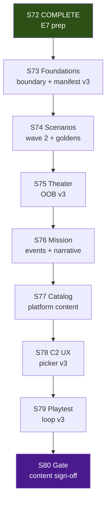

# S73–S80 Baltic v3 Content Expansion — Local + Cloud Agent Execution Plan

> **For agentic workers:** REQUIRED SUB-SKILL: superpowers:subagent-driven-development or superpowers:executing-plans. Per-sprint dispatch via superpowers:dispatching-parallel-agents + using-git-worktrees. Steps use checkbox (`- [ ]`) syntax for tracking.

**Goal:** Ship **Baltic v3 content expansion** — new scenario family, theater OOB, mission narrative, catalog slices, C2 UX v3, playtest loop v3, and S80 content gate — while preserving v2 shippable baseline and standing invariants.

**Architecture:** Serial sprints S73→S80; 2–4 parallel tracks within each sprint; local coordinator owns closeout/merge and human playtest gates; cloud agents handle scenario content, replay goldens, catalog, and additive C2 UI. **Stage stays Release** for the full program unless explicit S80 decision.

**Tech Stack:** .NET 8, Graphite (`gt`), GitNexus MCP, Buildkite (`.buildkite/preflight-s67.yml` parity), headless Play Mode harness, scenario policy JSON, replay goldens.

**Authority:** [`future-sprint-roadpmap-062526.01.md`](future-sprint-roadpmap-062526.01.md) §3/§10/§12, [`2026-06-25-baltic-v3-content-expansion-design.md`](../superpowers/specs/2026-06-25-baltic-v3-content-expansion-design.md), [`local-cloud-agent-routing.md`](../../production/agentic/local-cloud-agent-routing.md), [`graphite-github-substitute-plan.md`](../engineering/graphite-github-substitute-plan.md), prior pattern [`future-sprint-roadpmap-062226.md`](future-sprint-roadpmap-062226.md) §10

---

## 1. Executive summary

This plan coordinates **8 serial sprints (S73–S80)** using **local Cursor agents** (boundary, closeout, playtest capture, gate verification) and **Cloud Agents** (scenarios, goldens, catalog, C2 UI). **Sprints run serially**; **tracks within each sprint run in parallel** after boundary + baseline prereqs.

| Dimension | Value |
|-----------|-------|
| **Sprint count** | **8** (S73–S80) |
| **Program** | Baltic v3 content expansion — **E9 lead** |
| **Prior program** | S69–S72 E7 prep **COMPLETE** (human ack 2026-06-25); S65–S68 release train COMPLETE; S57–S64 Baltic v2 COMPLETE |
| **Test baseline @ S73 start** | **1232/1232** (ReplayGolden 6/6, C2 proxy 18/18); monotonic growth expected |
| **Max parallel agents per sprint** | **4–5 effective tracks** (local ≤6, cloud ≤5) |
| **Critical path** | S73 → S74 → S75 → S76 → S77 → S78 → S79 → S80 |
| **Est. calendar (S73–S80)** | **~52–68 days** (~10–14 weeks) with parallel tracks inside each sprint |
| **Stage** | **Release** throughout — no mandatory `production/stage.txt` advance at S80 |

**Coordinator model:** One local **producer/coordinator** owns merge order, shared files, closeout, and human gates. Cloud agents execute isolated stack branches; local agents own boundary publish, human playtest sessions, and final merges.

**Verification @ plan authoring (2026-06-25):** build 0e/0w; test 1232/0f; ReplayGolden 6/6; C2 18/18; hash `17144800277401907079`; GitNexus **20,193 / 37,859 / 2,487** (pre); post S73-03 re-index COMPLETE: **20,322 / 38,055 / 2,491** @ HEAD `b2c9411` (CLI + MCP). S73-03 COMPLETE.

**Relationship to prior plans:** [`roadmap-execute-plan-062526.md`](roadmap-execute-plan-062526.md) (E7 prep COMPLETE). v2 corpus and [`release-checklist-v2.md`](../../production/release/release-checklist-v2.md) remain authoritative for shippable Baltic ops-complete.

---

## 2. Program timeline



**Serial rule:** Never run two full sprints in parallel. **Parallel rule:** After S*-01 boundary/baseline, dispatch up to cap tracks with isolated worktrees.

**Prerequisite before S73-01:** S69–S72 closeouts PASS; resolve pending gt trunk integration if blocking (see [`smoke-sprint-72-closeout-2026-06-25.md`](../../production/qa/smoke-sprint-72-closeout-2026-06-25.md)).

---

## 3. Per-sprint summary table

| Sprint | Lead | Primary goal | Est. days | Max parallel | Tracks | Key artifacts |
|--------|------|--------------|-----------|--------------|--------|---------------|
| **S73** | E9/E1 | Baltic v3 boundary + playtest manifest v3 + GitNexus re-index | 5–7 | 2 local / 2 cloud | 4 | `production/baltic-v3-scope-boundary-2026-06-25.md`, `production/playtests/baltic-v3-scenario-manifest.yaml` |
| **S74** | E9 | Scenario wave 2 + isolated replay goldens | 8–10 | 1 local / 3 cloud | 4 | `data/scenarios/baltic-v3-*.policy.json`, `tests/regression/replay-golden-baltic-v3-*.txt` |
| **S75** | E9 | Theater OOB v3 + optional regional slice | 8–10 | 1 local / 2 cloud | 3 | Theater packages, isolated hash family |
| **S76** | E9 | Mission events + narrative arcs | 8–10 | 1 local / 2 cloud | 3 | Mission-event policies, briefing stubs |
| **S77** | E9+E5 | Catalog slices + Platform Editor path | 8–10 | 1 local / 2 cloud | 3 | Catalog content, Excel round-trip |
| **S78** | E4+E9 | C2 scenario picker v3 + difficulty UX | 6–8 | 1 local / 2 cloud | 3 | Additive C2 UI, band labels |
| **S79** | E1+E9 | Playtest loop v3 (auto + human) | 8–10 | 2 local / 2 cloud | 3 | Batch runner, human session template |
| **S80** | Gate | Full verification + human ack | 5–7 | 1–2 local | 2 | `production/gate-checks/s80-baltic-v3-content-gate-2026-06-*.md` |

**Sprint plans (to create @ dispatch):**

| Sprint | Plan path |
|--------|-----------|
| S73 | `production/sprints/sprint-73-baltic-v3-foundations.md` |
| S74 | `production/sprints/sprint-74-scenario-wave-v3.md` |
| S75 | `production/sprints/sprint-75-theater-v3.md` |
| S76 | `production/sprints/sprint-76-mission-narrative-v3.md` |
| S77 | `production/sprints/sprint-77-catalog-platform-v3.md` |
| S78 | `production/sprints/sprint-78-c2-scenario-ux-v3.md` |
| S79 | `production/sprints/sprint-79-playtest-loop-v3.md` |
| S80 | `production/sprints/sprint-80-baltic-v3-gate.md` |

**Kickoffs (to create @ dispatch):** `production/agentic/sprint-73-parallel-kickoff-2026-06-25.md` (and S74–S80)

---

## 4. Per-sprint track plans

Worktree root: `/home/username01/cmano-clone/.worktrees/`  
Stack workflow: Graphite — `gt create`, `gt submit --stack --no-interactive`, `gt sync`, `gt restack`

### S73 — Baltic v3 foundations

| Track | Stack prefix | Worktree path | Agent env | Stories | Owner |
|-------|--------------|---------------|-----------|---------|-------|
| Scope boundary | `stack/sprint73/baltic-v3-boundary` | `.worktrees/stack/sprint73/baltic-v3-boundary` | **Local** | S73-01 | producer |
| Playtest manifest v3 | `stack/sprint73/playtest-manifest` | `.worktrees/stack/sprint73/playtest-manifest` | Cloud | S73-02 | qa-lead |
| GitNexus re-index | `stack/sprint73/gitnexus-reindex` | `.worktrees/stack/sprint73/gitnexus-reindex` | Cloud | S73-03 | c-sharp-devops-engineer |
| Closeout | `stack/sprint73/closeout` | `.worktrees/stack/sprint73/closeout` | **Local** | S73-04 | c-sharp-devops-engineer |

**Wave order:** S73-01 (boundary, day 1) → (W1 manifest ∥ W2 re-index) → W3 Closeout

**S73-01 deliverable:** `production/baltic-v3-scope-boundary-2026-06-25.md`

Must include:

- Cite [`future-sprint-roadpmap-062526.01.md`](future-sprint-roadpmap-062526.01.md) §3/§6/§7/§10 + this execute plan
- Supersede [`production/commercial-launch-scope-boundary-2026-06-25.md`](../../production/commercial-launch-scope-boundary-2026-06-25.md) for **S73+ only** (archive prior, do not delete)
- **In scope:** E9 v3 content (§3 themes); **Out:** E7 submission, multiplayer, bridge edits, hash change w/o ADR
- Carry standing invariants (1232 floor, hash, ZERO bridge, extend-only catalog)
- **Stage policy:** Release throughout S73–S80

**S73-02 deliverable:** `production/playtests/baltic-v3-scenario-manifest.yaml` — extends v2 manifest structure; defines v3 slots and difficulty bands.

**GitNexus preflight (mandatory):** `list_repos` canonical path; `node .gitnexus/run.cjs analyze` if stale; `impact` summaryOnly on CRITICALs (expect 178/97/127/52).

### S74 — Scenario content wave 2

| Track | Stack prefix | Worktree path | Agent env | Stories | Owner |
|-------|--------------|---------------|-----------|---------|-------|
| Patrol/mission variants v3 | `stack/sprint74/scenarios` | `.worktrees/stack/sprint74/scenarios` | Cloud | S74-01, S74-02 | team-simulation |
| Difficulty Band B/C fixtures | `stack/sprint74/difficulty-fixtures` | `.worktrees/stack/sprint74/difficulty-fixtures` | Cloud | S74-03 | game-designer |
| Isolated replay goldens | `stack/sprint74/replay-goldens` | `.worktrees/stack/sprint74/replay-goldens` | Cloud | S74-04 | c-sharp-test-engineer |
| Closeout | `stack/sprint74/closeout` | `.worktrees/stack/sprint74/closeout` | **Local** | S74-05 | c-sharp-devops-engineer |

**Wave order:** Scenarios ∥ Band fixtures (day 1) → goldens trail mid-sprint → closeout

**Scope:** 3–5 new `baltic-v3-*` policies per [`design/difficulty-curve.md`](../../design/difficulty-curve.md); comms-challenged and mission variants. Goldens in `tests/regression/replay-golden-baltic-v3-*.txt` only.

**Hard gates:** ReplayGolden 6/6 minimum (+ new isolated goldens), production hash immutable, ZERO bridge.

### S75 — Theater package expansion v3

| Track | Stack prefix | Worktree path | Agent env | Stories | Owner |
|-------|--------------|---------------|-----------|---------|-------|
| Extended OOB | `stack/sprint75/theater-oob` | `.worktrees/stack/sprint75/theater-oob` | Cloud | S75-01, S75-02 | team-data |
| Theater hash family | `stack/sprint75/theater-hash` | `.worktrees/stack/sprint75/theater-hash` | Cloud | S75-03 | team-simulation |
| Closeout | `stack/sprint75/closeout` | `.worktrees/stack/sprint75/closeout` | **Local** | S75-04 | c-sharp-devops-engineer |

**Scope:** Extended Baltic OOB for v3 scenarios; optional regional slice spike (defer full second theater to S80 decision).

### S76 — Mission events & narrative

| Track | Stack prefix | Worktree path | Agent env | Stories | Owner |
|-------|--------------|---------------|-----------|---------|-------|
| Contact-window arcs | `stack/sprint76/mission-events` | `.worktrees/stack/sprint76/mission-events` | Cloud | S76-01, S76-02 | team-simulation |
| Briefing stubs | `stack/sprint76/briefings` | `.worktrees/stack/sprint76/briefings` | Cloud | S76-03 | narrative-director |
| Closeout | `stack/sprint76/closeout` | `.worktrees/stack/sprint76/closeout` | **Local** | S76-04 | c-sharp-devops-engineer |

**Scope:** Extend v2 narrative-arc patterns to v3 policies; mission transitions in replay/order log evidence.

### S77 — Catalog & platform content

| Track | Stack prefix | Worktree path | Agent env | Stories | Owner |
|-------|--------------|---------------|-----------|---------|-------|
| Catalog slices | `stack/sprint77/catalog-slices` | `.worktrees/stack/sprint77/catalog-slices` | Cloud | S77-01, S77-02 | team-data |
| Platform Editor path | `stack/sprint77/platform-editor` | `.worktrees/stack/sprint77/platform-editor` | **Local** | S77-03 | unity-engineer |
| Closeout | `stack/sprint77/closeout` | `.worktrees/stack/sprint77/closeout` | **Local** | S77-04 | c-sharp-devops-engineer |

**Scope:** Catalog unit/loadout slices matching S75 OOB; Excel round-trip for authors. **Single owner** for `CatalogWriteGate`.

### S78 — C2 scenario UX v3

| Track | Stack prefix | Worktree path | Agent env | Stories | Owner |
|-------|--------------|---------------|-----------|---------|-------|
| Scenario picker v3 | `stack/sprint78/scenario-picker` | `.worktrees/stack/sprint78/scenario-picker` | Cloud | S78-01, S78-02 | unity-ui-specialist |
| Difficulty bands + tooltips | `stack/sprint78/difficulty-ux` | `.worktrees/stack/sprint78/difficulty-ux` | Cloud | S78-03 | ux-designer |
| Closeout | `stack/sprint78/closeout` | `.worktrees/stack/sprint78/closeout` | **Local** | S78-04 | c-sharp-devops-engineer |

**Scope:** Additive UI only; picker reads v3 manifest; C2 proxy ≥18 must not regress.

### S79 — Playtest loop v3

| Track | Stack prefix | Worktree path | Agent env | Stories | Owner |
|-------|--------------|---------------|-----------|---------|-------|
| Automated playtest batch | `stack/sprint79/auto-playtest` | `.worktrees/stack/sprint79/auto-playtest` | Cloud | S79-01, S79-02 | qa-lead |
| Human session template | `stack/sprint79/human-playtest` | `.worktrees/stack/sprint79/human-playtest` | **Local** | S79-03 | qa-tester |
| Closeout | `stack/sprint79/closeout` | `.worktrees/stack/sprint79/closeout` | **Local** | S79-04 | c-sharp-devops-engineer |

**Scope:** Batch against full v3 manifest; human template + ≥1 session per difficulty band; artifacts in `production/playtests/human/`.

### S80 — Baltic v3 content gate

| Track | Stack prefix | Worktree path | Agent env | Stories | Owner |
|-------|--------------|---------------|-----------|---------|-------|
| Gate verification | `stack/sprint80/gate` | `.worktrees/stack/sprint80/gate` | **Local** | S80-01 | c-sharp-devops-engineer |
| Human sign-off | `stack/sprint80/signoff` | `.worktrees/stack/sprint80/signoff` | **Local** | S80-02 | producer |

**Wave order:** Serial — verification → human ack → optional v3 promotion decision (separate from stage advance).

**Gate artifact:** `production/gate-checks/s80-baltic-v3-content-gate-2026-06-*.md`

**S80 exit criteria:**

- [ ] S73–S79 closeouts PASS
- [ ] v3 manifest + goldens indexed in `production/qa/evidence/baltic-v3-playtest-index.md`
- [ ] Playtest sign-off (automated + human per band)
- [ ] Test baseline ≥1232; ReplayGolden 6/6+; C2 proxy ≥18
- [ ] Production Baltic hash unchanged OR golden ADR documented
- [ ] GitNexus CRITICAL §5 exact match
- [ ] Human ack: **"Baltic v3 content-complete"**
- [ ] Optional: promote v3 corpus to production (explicit decision only)
- [ ] Stage: default **stay Release**

---

## 5. Orchestrator loop

Run at **program start** and **after each sprint closeout**.

### Phase 0 — Baseline (orchestrator, sequential)

- [ ] GitNexus `list_repos` — canonical `/home/username01/projects/active/cmano-clone/cmano-clone`
- [ ] `node .gitnexus/run.cjs analyze` if index stale
- [ ] GitNexus `impact` upstream summaryOnly on CRITICALs
- [ ] `dotnet build ProjectAegis.sln`
- [ ] `dotnet test ProjectAegis.sln -v minimal`
- [ ] ReplayGolden 6/6 + C2 proxy 18/18 filters
- [ ] Record: test count, commit SHA, gate results

```bash
cd /home/username01/cmano-clone/cmano-clone
export PATH="$HOME/.dotnet:$PATH"
dotnet build ProjectAegis.sln
dotnet test ProjectAegis.sln -v minimal
dotnet test src/ProjectAegis.Delegation.UnityAdapter.Tests/ProjectAegis.Delegation.UnityAdapter.Tests.csproj --filter "FullyQualifiedName~ReplayGoldenSuiteTests"
dotnet test src/ProjectAegis.Delegation.UnityAdapter.Tests/ProjectAegis.Delegation.UnityAdapter.Tests.csproj --filter "FullyQualifiedName~PlayModeSmokeHarnessTests"
rg "17144800277401907079" tests/regression/ -n
```

### Phase 1 — Parallel dispatch (per sprint)

- [ ] Publish scope boundary (S73-01) before content tracks
- [ ] Dispatch 3–4 tracks via `dispatching-parallel-agents` + isolated worktrees
- [ ] Each track: GitNexus `impact()` preflight on symbols in ownership matrix; cite boundary; verification-before on claims

### Phase 2 — Integrate (closeout track)

- [ ] All tracks `gt submit --stack --no-interactive`
- [ ] Closeout: `gt sync`, `gt restack` on `main`
- [ ] Re-run Phase 0 gates
- [ ] GitNexus re-index post-merge
- [ ] Update `production/sprint-status.yaml`
- [ ] Write `production/qa/smoke-sprint-{N}-closeout-2026-06-*.md`
- [ ] `detect_changes()` before commit

---

## 6. Hard gates (every sprint close)

| Gate | Command / check | Pass criterion |
|------|-----------------|----------------|
| Build | `dotnet build ProjectAegis.sln` | 0 errors |
| Tests | `dotnet test ProjectAegis.sln -v minimal` | 0 failed; floor **≥1232** |
| Replay | `--filter FullyQualifiedName~ReplayGoldenSuiteTests` | 6/6 minimum |
| C2 proxy | `--filter FullyQualifiedName~PlayModeSmokeHarnessTests` | 18/18 |
| Determinism | grep production goldens | hash `17144800277401907079` unless ADR |
| Bridge | no `DelegationBridge.cs` edits | ZERO touch |
| GitNexus | `detect_changes()` pre-commit | expected scope only |
| Scope | boundary cite | `baltic-v3-scope-boundary-2026-06-25.md` |

---

## 7. File ownership matrix (CRITICAL symbols)

| Symbol | S73 | S74 | S75 | S76 | S77 | S78 | S79 | S80 | Rule |
|--------|-----|-----|-----|-----|-----|-----|-----|-----|------|
| `DelegationBridge` | — | — | — | — | — | — | — | — | **ZERO touch** |
| `PatrolCandidateEngagePolicy` | optional E1 | — | — | — | — | — | — | verify | single owner if touched |
| `CatalogWriteGate` | — | — | — | — | **owner** | — | — | verify | extend-only |
| `BalticReplayHarness` | — | goldens | hash | goldens | — | — | batch | verify | isolated fixtures first |
| `UnifiedReleaseTrainManifest` | read | read | read | read | read | read | read | promotion | S80 decision only |
| C2 UI hosts | — | — | — | — | — | **owner** | — | verify | additive only |

---

## 8. S73 orchestrator — Agent prompt stubs

### Agent A — Scope boundary (Local)

```
Publish production/baltic-v3-scope-boundary-2026-06-25.md for S73–S80 Baltic v3 E9.

SCOPE:
- Cite future-sprint-roadpmap-062526.01.md §3/§6/§7/§10 + roadmap-execute-plan-062526.01.md
- Supersede commercial-launch-scope-boundary-2026-06-25.md for S73+ only (archive, don't delete)
- List in/out of scope per design spec §1
- Carry standing invariants (1232 floor, hash, ZERO bridge, extend-only catalog, baltic-v3-* prefix)
- Stage policy: Release throughout S73–S80

REQUIRED: Docs only for boundary track. verification-before on gate claims if any.

RETURN: Path to boundary doc + summary for other tracks.
```

### Agent B — Playtest manifest v3 (Cloud)

```
Create production/playtests/baltic-v3-scenario-manifest.yaml.

SCOPE:
- Extend baltic-v2-scenario-manifest.yaml structure
- Define v3_slots, difficulty bands, policy naming baltic-v3-*
- Cite baltic-v3-scope-boundary (after Agent A) + v2 manifest + difficulty-curve.md

REQUIRED: YAML only unless schema validation tests needed (TDD + user ack).

RETURN: Manifest path + slot count summary.
```

### Agent C — GitNexus re-index (Cloud)

```
Re-index GitNexus @ HEAD and update indexed_commit note.

COMMANDS:
node .gitnexus/run.cjs analyze
# MCP: list_repos canonical, detect_changes, impact summaryOnly on CRITICALs

UPDATE: production/sprint-status.yaml indexed_commit if policy allows; else closeout qa doc.

RETURN: nodes/edges stats; expect CRITICAL 178/97/127/52 exact.
```

---

## 9. Prerequisites checklist — before first S73 agent dispatch

### Environment & tooling

- [ ] `.NET SDK 8.0.400` (`dotnet --version`)
- [ ] Graphite CLI (`gt`) available; trunk `main` synced
- [ ] GitNexus index current — analyze if stale
- [ ] Resolve gt trunk if S66/S67/S69–S72 stacks pending (see smoke-72 closeout)

### Program artifacts

- [x] S69–S72 COMPLETE — [`s72-commercial-launch-prep-gate-2026-06-25.md`](../../production/gate-checks/s72-commercial-launch-prep-gate-2026-06-25.md)
- [x] Roadmap — [`future-sprint-roadpmap-062526.01.md`](future-sprint-roadpmap-062526.01.md)
- [x] Design spec — [`2026-06-25-baltic-v3-content-expansion-design.md`](../superpowers/specs/2026-06-25-baltic-v3-content-expansion-design.md)
- [x] This execute plan — `docs/reports/roadmap-execute-plan-062526.01.md`
- [ ] Scope boundary — `production/baltic-v3-scope-boundary-2026-06-25.md` (@ S73-01)
- [ ] Sprint plan S73 — `production/sprints/sprint-73-baltic-v3-foundations.md`
- [ ] Kickoff S73 — `production/agentic/sprint-73-parallel-kickoff-2026-06-25.md`
- [x] v2 reference — [`baltic-v2-scenario-manifest.yaml`](../../production/playtests/baltic-v2-scenario-manifest.yaml)

### Standing exclusions (never commit)

- `.cursor/hooks/`, `.pi/settings.json`, `.polly/`

---

## 10. Related artifacts

| Artifact | Path |
|----------|------|
| Roadmap (canonical) | [`future-sprint-roadpmap-062526.01.md`](future-sprint-roadpmap-062526.01.md) |
| Roadmap alias | [`future-sprint-roadpmap.md`](future-sprint-roadpmap.md) |
| Design spec | [`2026-06-25-baltic-v3-content-expansion-design.md`](../superpowers/specs/2026-06-25-baltic-v3-content-expansion-design.md) |
| Prior execute plan (E7) | [`roadmap-execute-plan-062526.md`](roadmap-execute-plan-062526.md) |
| v2 roadmap pattern | [`future-sprint-roadpmap-062226.md`](future-sprint-roadpmap-062226.md) |
| v2 boundary (reference) | [`production/baltic-v2-scope-boundary-2026-06-22.md`](../../production/baltic-v2-scope-boundary-2026-06-22.md) |
| S72 gate | [`production/gate-checks/s72-commercial-launch-prep-gate-2026-06-25.md`](../../production/gate-checks/s72-commercial-launch-prep-gate-2026-06-25.md) |
| Local/cloud routing | [`production/agentic/local-cloud-agent-routing.md`](../../production/agentic/local-cloud-agent-routing.md) |

---

## 11. Self-review (plan vs spec)

| Spec requirement | Plan section |
|------------------|--------------|
| 8-sprint S73–S80 | §1, §2, §3 |
| E9 lead, v3 prefix isolation | §4 S74+, §7 |
| Stage Release | §1, S80 exit |
| GitNexus CRITICAL map | §4 S73, §7, §8 Agent C |
| Playtest loop S79 | §4 S79 |
| E7 out of scope | §4 S73 boundary stub |
| v2 baseline preserved | §1, §4 S74 hard gates |

**Placeholder scan:** Sprint plans/kickoffs marked create @ dispatch (intentional).

---

## 12. Execution handoff

**Plan complete and saved to `docs/reports/roadmap-execute-plan-062526.01.md`. Two execution options:**

1. **Subagent-Driven (recommended)** — dispatch a fresh subagent per S73 track (§8), review between tracks. REQUIRED SUB-SKILL: `superpowers:subagent-driven-development`.

2. **Inline Execution** — execute S73 tasks in-session with checkpoints. REQUIRED SUB-SKILL: `superpowers:executing-plans`.

**Do not dispatch S73 content tracks until:**

- User approves this plan + design spec + roadmap 062526.01
- S73-01 boundary is published

---

*Generated 2026-06-25. S69–S72 COMPLETE; S73 executable after boundary publish. Do not commit from agent sessions unless user requests.*
