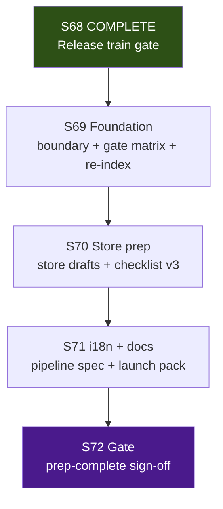

# S69–S72 Commercial Launch Prep — Local + Cloud Agent Execution Plan

> **For agentic workers:** REQUIRED SUB-SKILL: superpowers:subagent-driven-development or superpowers:executing-plans. Per-sprint dispatch via superpowers:dispatching-parallel-agents + using-git-worktrees. Steps use checkbox (`- [ ]`) syntax for tracking.

**Goal:** Ship **commercial launch prep** for Baltic v2 (store page drafts, i18n pipeline spec, launch doc pack, checklist v3, evidence index) — **not** store submission or revenue launch.

**Architecture:** Serial sprints S69→S72; 2–4 parallel tracks within each sprint; local coordinator owns closeout/merge and human gates; cloud agents handle docs, marketing copy, and localization specs. **Stage stays Release** for the full program (prep ≠ shippable product).

**Tech Stack:** Markdown docs, Graphite (`gt`), GitNexus MCP, headless .NET gates (no sim changes expected), optional Buildkite doc parity check in S71.

**Authority:** [`future-sprint-roadpmap-062526.md`](future-sprint-roadpmap-062526.md) §3/§10/§12 (when published), [`local-cloud-agent-routing.md`](../../production/agentic/local-cloud-agent-routing.md), [`graphite-github-substitute-plan.md`](../engineering/graphite-github-substitute-plan.md), prior S46 B5 template [`sprint-46-launch-artifacts.md`](../../production/sprints/sprint-46-launch-artifacts.md)

---

## 1. Executive summary

This plan coordinates **4 serial sprints (S69–S72)** using **local Cursor agents** (boundary publish, closeout, gate verification, human sign-off) and **Cloud Agents** (store copy, i18n specs, launch docs). **Sprints run serially**; **tracks within each sprint run in parallel** after boundary + baseline prereqs.

| Dimension | Value |
|-----------|-------|
| **Sprint count** | **4** (S69–S72) |
| **Program** | E7 commercial launch **prep** — E7 lead |
| **Prior program** | S65–S68 release train **COMPLETE** (S68 gate verification PASS + human ack 2026-06-25); S69–S72 E7 commercial launch prep **COMPLETE** (S72 gate + **S72 HUMAN ACK PROVIDED ("acknowledged" / "i provide the ack" 2026-06-25)**) |
| **Test baseline @ S69 start** | **1232/1232** (ReplayGolden 6/6, C2 proxy 18/18); monotonic growth only if code touched |
| **Max parallel agents per sprint** | **4–5 effective tracks** (local ≤6, cloud ≤5) |
| **Critical path** | S69 → S70 → S71 → S72 |
| **Est. calendar (S69–S72)** | **~22–30 days** (~4–6 weeks) with parallel tracks inside each sprint |
| **Stage** | **Release** throughout — no `production/stage.txt` advance at S72 (prep-only exit) |

**Coordinator model:** One local **producer/coordinator** owns merge order, shared files, closeout, and human gates. Cloud agents execute isolated stack branches; local agents own boundary publish, evidence review, gate verification, and final merges.

**Verification @ plan authoring (2026-06-25):** build 0e/0w; test 1232/0f; ReplayGolden 6/6; C2 18/18; hash `17144800277401907079`; GitNexus **19,792 / 37,427 / 2,455** @ HEAD `28c582d` (MCP list_repos canonical path `/home/username01/projects/active/cmano-clone/cmano-clone`).

**Relationship to 062426 plan:** [`roadmap-execute-plan-062426.md`](roadmap-execute-plan-062426.md) delivered E10 release-train ops (manifest, evidence, CI). This plan **supersedes forward execution** only; S65–S68 artifacts remain authoritative for Baltic v2 corpus and checklist v2.

---

## 2. Program timeline



**Serial rule:** Never run two full sprints in parallel. **Parallel rule:** After S*-01 boundary/baseline, dispatch up to cap tracks with isolated worktrees.

**Prerequisite before S69-01:** Confirm S65–S68 closeouts PASS and S68 human ack on release-train ops-complete (recommended but not blocking prep boundary publish if user explicitly scopes E7).

---

## 3. Per-sprint summary table

| Sprint | Lead | Primary goal | Est. days | Max parallel (local / cloud) | Tracks | Key artifacts |
|--------|------|--------------|-----------|------------------------------|--------|---------------|
| **S69** | E7 | Scope boundary + gate matrix refresh + GitNexus re-index | 5–7 | **2 local / 3 cloud** (cap **4**) | 4 | `production/commercial-launch-scope-boundary-2026-06-25.md`, `production/qa/gate-matrix-commercial-launch-*.md` |
| **S70** | E7 | Store page drafts + community templates + `release-checklist-v3.md` skeleton | 6–8 | **1 local / 3 cloud** (cap **4**) | 4 | `production/release/store/`, `production/release/release-checklist-v3.md` |
| **S71** | E7 | i18n pipeline spec + launch doc pack + localization QA plan | 6–8 | **1 local / 3 cloud** (cap **4**) | 4 | `production/release/i18n-pipeline-spec.md`, `production/release/launch/`, `production/qa/qa-plan-sprint-71-*.md` |
| **S72** | Gate | Full verification + human ack; **stage stays Release** | 5–7 | **1–2 local** (serial) | 2 | `production/gate-checks/s72-commercial-launch-prep-gate-2026-06-*.md` |

**Sprint plans (to create @ dispatch):**

| Sprint | Plan path |
|--------|-----------|
| S69 | `production/sprints/sprint-69-commercial-launch-foundation.md` |
| S70 | `production/sprints/sprint-70-store-community-prep.md` |
| S71 | `production/sprints/sprint-71-i18n-launch-docs.md` |
| S72 | `production/sprints/sprint-72-commercial-prep-gate.md` |

**Kickoffs (to create @ dispatch):** `production/agentic/sprint-69-parallel-kickoff-2026-06-25.md` (and S70–S72 at dispatch)

---

## 4. Per-sprint track plans

Worktree root: `/home/username01/cmano-clone/.worktrees/`  
Stack workflow: Graphite — `gt create`, `gt submit --stack --no-interactive`, `gt sync`, `gt restack`

### S69 — Commercial launch foundation

| Track | Stack prefix | Worktree path | Agent env | Stories | Owner |
|-------|--------------|---------------|-----------|---------|-------|
| Scope boundary | `stack/sprint69/commercial-boundary` | `.worktrees/stack/sprint69/commercial-boundary` | **Local** | S69-01 | producer |
| Gate matrix refresh | `stack/sprint69/gate-matrix` | `.worktrees/stack/sprint69/gate-matrix` | Cloud | S69-02 | qa-lead |
| GitNexus re-index | `stack/sprint69/gitnexus-reindex` | `.worktrees/stack/sprint69/gitnexus-reindex` | Cloud | S69-03 | c-sharp-devops-engineer |
| Closeout | `stack/sprint69/closeout` | `.worktrees/stack/sprint69/closeout` | **Local** | S69-04 | c-sharp-devops-engineer |

**Wave order:** S69-01 (boundary, day 1) → (W1 gate matrix ∥ W2 re-index) → W3 Closeout

**S69-01 deliverable:** `production/commercial-launch-scope-boundary-2026-06-25.md`

Must include:

- Cite [`future-sprint-roadpmap-062526.md`](future-sprint-roadpmap-062526.md) §3/§6/§7/§10
- Supersede [`production/release-train-scope-boundary-2026-06-24.md`](../../production/release-train-scope-boundary-2026-06-24.md) for **S69+ only** (archive prior, do not delete)
- **In scope:** E7 launch prep (store drafts, i18n spec, launch docs, checklist v3, evidence index)
- **Out of scope:** store submission, paid marketing, production locale translation, E9 new content, multiplayer, `DelegationBridge` edits, production hash change without ADR
- Carry standing invariants from S65–S68 (1232 floor, hash, ZERO bridge, extend-only catalog, GitNexus discipline)
- **Stage policy:** Release throughout S69–S72; S72 documents prep-complete, not Launch stage advance

**S69-02 deliverable:** `production/qa/gate-matrix-commercial-launch-2026-06-25.md` — refresh baselines to 1232/0f, cite boundary + execute plan §6.

**GitNexus preflight (mandatory):** `list_repos` on canonical path; `impact` summaryOnly on §5 CRITICALs (read-only unless editing). Expected: **CatalogWriteGate 178, Patrol 97, Bridge 127, Baltic 52** exact match.

### S70 — Store + community prep

| Track | Stack prefix | Worktree path | Agent env | Stories | Owner |
|-------|--------------|---------------|-----------|---------|-------|
| Store page drafts | `stack/sprint70/store-pages` | `.worktrees/stack/sprint70/store-pages` | Cloud | S70-01, S70-02 | community-manager |
| Community templates | `stack/sprint70/community-templates` | `.worktrees/stack/sprint70/community-templates` | Cloud | S70-03 | community-manager |
| Checklist v3 skeleton | `stack/sprint70/checklist-v3` | `.worktrees/stack/sprint70/checklist-v3` | Cloud | S70-04 | release-manager |
| Closeout | `stack/sprint70/closeout` | `.worktrees/stack/sprint70/closeout` | **Local** | S70-05 | c-sharp-devops-engineer |

**Wave order:** S70 baseline (coordinator) → (W1 store pages ∥ W2 community ∥ W3 checklist skeleton) → W4 Closeout

**S70-01/02 deliverables** (extends S46 B5 paths; v2 corpus aware):

| Artifact | Path | Notes |
|----------|------|-------|
| Store copy (draft) | `production/release/store/store-page-draft.md` | Steam-style sections: short/long description, features, tags |
| Asset manifest | `production/release/store/asset-checklist.md` | Capsule, screenshots, trailer placeholder list |
| Platform notes | `production/release/store/platform-notes.md` | Internal-only submission checklist (not executed in this program) |

**S70-04 deliverable:** `production/release/release-checklist-v3.md` — supersedes v2 for **E7 prep** slice; cites v2 Baltic ops-complete items as prerequisites; adds commercial prep sections (store, i18n, launch docs) as unchecked until S71/S72.

**Inputs from prior programs:**

- [`production/release/release-checklist-v2.md`](../../production/release/release-checklist-v2.md) (S66 E10)
- [`production/qa/evidence/baltic-v2-playtest-index.md`](../../production/qa/evidence/baltic-v2-playtest-index.md)
- [`production/playtests/baltic-v2-scenario-manifest.yaml`](../../production/playtests/baltic-v2-scenario-manifest.yaml)

### S71 — i18n + launch docs

| Track | Stack prefix | Worktree path | Agent env | Stories | Owner |
|-------|--------------|---------------|-----------|---------|-------|
| i18n pipeline spec | `stack/sprint71/i18n-pipeline` | `.worktrees/stack/sprint71/i18n-pipeline` | Cloud | S71-01, S71-02 | localization-lead |
| Launch doc pack | `stack/sprint71/launch-docs` | `.worktrees/stack/sprint71/launch-docs` | Cloud | S71-03, S71-04 | technical-writer |
| Localization QA plan | `stack/sprint71/l10n-qa-plan` | `.worktrees/stack/sprint71/l10n-qa-plan` | Cloud | S71-05 | qa-lead |
| Closeout | `stack/sprint71/closeout` | `.worktrees/stack/sprint71/closeout` | **Local** | S71-06 | c-sharp-devops-engineer |

**Wave order:** (W1 i18n ∥ W2 launch docs) → W3 l10n QA plan (after string inventory) → W4 Closeout

**S71-01/02 deliverables:**

| Artifact | Path | Content |
|----------|------|---------|
| i18n pipeline spec | `production/release/i18n-pipeline-spec.md` | Extraction workflow, locale tiers (P0 en-US only for prep), Unity UI Toolkit vs UGUI inventory strategy |
| String inventory (draft) | `production/release/i18n-string-inventory.md` | C2/HUD/menu string sources with file paths; no production translation |
| Extraction plan | `production/release/i18n-extraction-plan.md` | Phased extraction steps; cites `Game-Requirements/requirements/` where UI strings originate |

**S71-03/04 deliverables** (`production/release/launch/`):

| File | Purpose |
|------|---------|
| `patch-notes-template.md` | Versioned patch notes skeleton |
| `faq-draft.md` | Player-facing FAQ draft |
| `support-runbook-draft.md` | Internal support triage outline |
| `evidence-index.md` | Links S57–S68 + S69–S71 prep artifacts |

**S71-05 deliverable:** `production/qa/qa-plan-sprint-71-l10n-prep-2026-06-*.md` — locale smoke strategy for post-prep future work; no PlayMode changes in S71 unless user ack + TDD.

**Optional S71 CI parity (docs-only):** Verify `.buildkite/preflight-s67.yml` gate commands still documented in [`docs/engineering/ci-and-branch-protection.md`](../engineering/ci-and-branch-protection.md) — no pipeline edits unless drift found.

### S72 — Commercial launch prep gate

| Track | Stack prefix | Worktree path | Agent env | Stories | Owner |
|-------|--------------|---------------|-----------|---------|-------|
| Gate verification | `stack/sprint72/gate` | `.worktrees/stack/sprint72/gate` | **Local** | S72-01 | c-sharp-devops-engineer |
| Human sign-off | `stack/sprint72/signoff` | `.worktrees/stack/sprint72/signoff` | **Local** | S72-02 | producer |

**Wave order:** Serial — verification → human ack → **no** mandatory stage advance.

**Gate artifact:** `production/gate-checks/s72-commercial-launch-prep-gate-2026-06-*.md`

**S72 exit criteria (all must PASS):**

- [ ] S69–S71 closeouts PASS
- [ ] `release-checklist-v3.md` complete for prep scope
- [ ] Store drafts + i18n spec + launch pack indexed in `production/release/launch/evidence-index.md`
- [ ] Test baseline ≥1232; ReplayGolden 6/6; C2 proxy ≥18
- [ ] Production Baltic hash unchanged OR golden ADR documented
- [ ] GitNexus CRITICAL §5 exact match on preflight
- [ ] Human ack: **"commercial launch prep complete"** (not store submission)
- [ ] **Stage:** remains **Release** (document optional future Launch decision separately)

---

## 5. Orchestrator loop

Run at **program start** and **after each sprint closeout**.

### Phase 0 — Baseline (orchestrator, sequential)

- [ ] GitNexus `list_repos` — use canonical path `/home/username01/projects/active/cmano-clone/cmano-clone` (disambiguate duplicate `cmano-clone` registrations)
- [ ] `node .gitnexus/run.cjs analyze` if index stale (commitsBehind > 0)
- [ ] GitNexus `impact` upstream summaryOnly on §7 CRITICALs (read-only unless editing)
- [ ] `dotnet build ProjectAegis.sln`
- [ ] `dotnet test ProjectAegis.sln -v minimal`
- [ ] ReplayGolden 6/6 + C2 proxy 18/18 filters
- [ ] Record: test count, commit SHA, gate results

```bash
cd /home/username01/cmano-clone/cmano-clone
export PATH="$HOME/.dotnet:$PATH"
dotnet build ProjectAegis.sln
dotnet test ProjectAegis.sln -v minimal
dotnet test src/ProjectAegis.Delegation.UnityAdapter.Tests/ProjectAegis.Delegation.UnityAdapter.Tests.csproj --filter "FullyQualifiedName~ReplayGoldenSuiteTests"
dotnet test src/ProjectAegis.Delegation.UnityAdapter.Tests/ProjectAegis.Delegation.UnityAdapter.Tests.csproj --filter "FullyQualifiedName~PlayModeSmokeHarnessTests"
rg "17144800277401907079" tests/regression/ -n
rg "DelegationBridge" src/ --glob "!**/DelegationBridge.cs" -l || true
```

### Phase 1 — Parallel dispatch (per sprint)

- [ ] Publish scope boundary (S69-01) before artifact tracks
- [ ] Dispatch 3–4 tracks concurrently via `dispatching-parallel-agents` + isolated worktrees
- [ ] Each track: GitNexus `impact()` preflight if touching symbols; cite boundary; **verification-before** on all PASS claims

### Phase 2 — Integrate (closeout track)

- [ ] All tracks `gt submit --stack --no-interactive`
- [ ] Closeout: `gt sync`, `gt restack` on `main`
- [ ] Re-run Phase 0 gates
- [ ] GitNexus re-index post-merge
- [ ] Update `production/sprint-status.yaml` (coordinator-only)
- [ ] Write `production/qa/smoke-sprint-{N}-closeout-2026-06-*.md`
- [ ] `detect_changes()` before commit

---

## 6. Hard gates (every sprint close)

| Gate | Command / check | Pass criterion |
|------|-----------------|----------------|
| Build | `dotnet build ProjectAegis.sln` | 0 errors |
| Tests | `dotnet test ProjectAegis.sln -v minimal` | 0 failed; floor **≥1232** |
| Replay | `--filter FullyQualifiedName~ReplayGoldenSuiteTests` | 6/6 |
| C2 proxy | `--filter FullyQualifiedName~PlayModeSmokeHarnessTests` | 18/18 |
| Determinism | grep production goldens | hash `17144800277401907079` unless ADR |
| Bridge | no `DelegationBridge.cs` edits | ZERO touch |
| GitNexus | `detect_changes()` pre-commit | expected scope only (doc-only expected for E7) |
| Scope | boundary cite on every artifact | `commercial-launch-scope-boundary-2026-06-25.md` |

---

## 7. File ownership matrix (CRITICAL symbols)

| Symbol | S69 | S70 | S71 | S72 | Rule |
|--------|-----|-----|-----|-----|------|
| `DelegationBridge` | — | — | — | — | **ZERO touch** all sprints |
| `CatalogWriteGate` | — | — | i18n track **avoid** | — | extend-only if string extraction touches catalog; max one owner |
| `PatrolCandidateEngagePolicy` | — | — | — | — | no edits |
| `BalticReplayHarness` | — | — | — | verify | read/test only |
| `UnifiedReleaseTrainManifest` | read | read | read | verify | S66 corpus reference only |
| Unity UI / C2 hosts | — | — | **inventory only** | — | no behavior change without ADR + TDD |

**Default program mode:** docs-only tracks; sim/src edits require explicit user ack + GitNexus CRITICAL review.

---

## 8. S69 orchestrator — Agent prompt stubs

### Agent A — Scope boundary (Local)

```
Publish production/commercial-launch-scope-boundary-2026-06-25.md for S69–S72 E7 commercial launch PREP.

SCOPE:
- Cite docs/reports/future-sprint-roadpmap-062526.md §3/§6/§7/§10
- Supersede production/release-train-scope-boundary-2026-06-24.md for S69+ only (archive, don't delete)
- List in/out of scope: E7 prep IN; store submission OUT; E9 content OUT; E10 maintenance read-only
- Carry standing invariants (1232 floor, hash, ZERO bridge, extend-only catalog)
- Stage policy: Release throughout; S72 prep-complete ≠ Launch stage

REQUIRED: No code changes. Docs only. verification-before on any gate claims.

RETURN: Path to boundary doc + summary for other tracks.
```

### Agent B — Gate matrix (Cloud)

```
Create production/qa/gate-matrix-commercial-launch-2026-06-25.md (post-S68 baseline).

SCOPE:
- Baseline: 1232 tests, 6/6 replay, 18/18 C2, hash 17144800277401907079
- Cite commercial-launch-scope-boundary (after Agent A lands) + roadmap-062526 §7
- Include exact dotnet commands from execute plan §6
- Note S65–S68 release train COMPLETE as prerequisite evidence

REQUIRED: Run gates fresh; READ full output before claims. Docs only.

RETURN: Gate matrix path + PASS/FAIL table.
```

### Agent C — GitNexus re-index (Cloud)

```
Re-index GitNexus @ HEAD and update indexed_commit note.

COMMANDS:
node .gitnexus/run.cjs analyze
# MCP: list_repos (canonical path), detect_changes scope=compare base_ref=main
# impact summaryOnly: CatalogWriteGate, PatrolCandidateEngagePolicy, DelegationBridge, BalticReplayHarness

UPDATE (additive): production/sprint-status.yaml indexed_commit if policy allows; else closeout qa doc.

RETURN: nodes/edges stats, staleness cleared, impact §5 table (expect 178/97/127/52).
```

**S69-03 COMPLETE (independent cloud track):** CLI run: "Repository indexed successfully (26.3s) 19,962 nodes | 37,627 edges | 366 clusters | 300 flows". MCP list_repos (canonical /home/username01/projects/active/cmano-clone/cmano-clone): 19962/37627/2462 files. GitNexus pre (search_tool first + use_tool): detect_changes unstaged 24 changed/0 affected/low risk (doc md only, exact pre-verif match); impacts CatalogWriteGate=178 CRITICAL, Patrol=97 CRITICAL, DelegationBridge=127 CRITICAL (exact), BalticReplayHarness=52 CRITICAL (exact). Verification-before: build 0e/0w, replay 6/6, C2 18/18 re-ran + READ full before claim. Pre baseline 19792/37427/2455 @28c582d cited. Per §3/§4/§5/§9 + AGENTS.md + commercial-launch-scope-boundary-2026-06-25.md + future-sprint-roadpmap-062526.md §3/§6/§7/§10. Low risk only (docs). S69-03 COMPLETE.

---

## 9. Prerequisites checklist — before first S69 agent dispatch

### Environment & tooling

- [ ] `.NET SDK 8.0.400` (`dotnet --version`)
- [ ] Cloud Agent VM: `.cursor/cloud-install.sh` green
- [ ] Graphite CLI (`gt`) available; trunk `main` synced (`gt sync`)
- [ ] GitNexus index current — `node .gitnexus/run.cjs analyze` if stale
- [ ] Resolve any pending S66/S67 gt trunk integration (see [`smoke-sprint-66-closeout.md`](../../production/qa/smoke-sprint-66-closeout.md))

### Program artifacts

- [x] S65–S68 COMPLETE — [`s68-release-train-gate-2026-06-25.md`](../../production/gate-checks/s68-release-train-gate-2026-06-25.md)
- [ ] Roadmap — [`future-sprint-roadpmap-062526.md`](future-sprint-roadpmap-062526.md) (publish with or before this plan)
- [x] Prior execute plan (archived program) — [`roadmap-execute-plan-062426.md`](roadmap-execute-plan-062426.md)
- [x] This execute plan — `docs/reports/roadmap-execute-plan-062526.md`
- [ ] Scope boundary — `production/commercial-launch-scope-boundary-2026-06-25.md` (@ S69-01)
- [ ] Sprint plan S69 — `production/sprints/sprint-69-commercial-launch-foundation.md`
- [ ] Kickoff S69 — `production/agentic/sprint-69-parallel-kickoff-2026-06-25.md`
- [x] Local/cloud routing — [`local-cloud-agent-routing.md`](../../production/agentic/local-cloud-agent-routing.md)
- [x] S46 B5 template — [`sprint-46-launch-artifacts.md`](../../production/sprints/sprint-46-launch-artifacts.md)

### S69-specific (before S70 dispatch)

- [ ] `/qa-plan sprint 69` → `production/qa/qa-plan-sprint-69-*.md`
- [ ] S69-01 boundary published
- [ ] Worktrees bootstrapped for S69 tracks (4 worktrees per §4)
- [ ] Baseline PASS (≥1232, Replay 6/6, proxy 18/18)

### Standing exclusions (never commit)

- `.cursor/hooks/`, `.pi/settings.json`, `.polly/`

---

## 10. Related artifacts

| Artifact | Path |
|----------|------|
| Roadmap (canonical, S69+) | [`future-sprint-roadpmap-062526.md`](future-sprint-roadpmap-062526.md) |
| Roadmap alias | [`future-sprint-roadpmap.md`](future-sprint-roadpmap.md) |
| Prior roadmap (archived) | [`future-sprint-roadpmap-062426.md`](future-sprint-roadpmap-062426.md) |
| Prior execute plan (archived) | [`roadmap-execute-plan-062426.md`](roadmap-execute-plan-062426.md) |
| Release train gate | [`production/gate-checks/s68-release-train-gate-2026-06-25.md`](../../production/gate-checks/s68-release-train-gate-2026-06-25.md) |
| Release checklist v2 | [`production/release/release-checklist-v2.md`](../../production/release/release-checklist-v2.md) |
| S46 launch artifacts plan | [`production/sprints/sprint-46-launch-artifacts.md`](../../production/sprints/sprint-46-launch-artifacts.md) |
| Baltic v2 evidence index | [`production/qa/evidence/baltic-v2-playtest-index.md`](../../production/qa/evidence/baltic-v2-playtest-index.md) |
| Local/cloud routing | [`production/agentic/local-cloud-agent-routing.md`](../../production/agentic/local-cloud-agent-routing.md) |
| Graphite guide | [`docs/engineering/graphite-github-substitute-plan.md`](../engineering/graphite-github-substitute-plan.md) |
| Buildkite baseline | [`.buildkite/preflight-s67.yml`](../../.buildkite/preflight-s67.yml) |

---

## 11. Self-review (plan vs spec)

| Spec requirement | Plan section |
|------------------|--------------|
| E7 prep only (no store submission) | §1, §4 S72 exit, boundary stub §8 Agent A |
| 4-sprint S69–S72 train | §2, §3 |
| Stage stays Release | §1, §3, S72 exit |
| Mirror S65–S68 orchestration | §5, §6, §8 |
| GitNexus CRITICAL map | §4 S69, §7 |
| S46 B5 artifact paths extended | §4 S70–S71 tables |
| Archive S65–S68 as prior program | §1, §9, §10 |

**Placeholder scan:** No TBD task IDs; sprint plan/kickoff paths marked "to create @ dispatch" intentionally (same pattern as 062426).

---

## 12. Execution handoff

**Plan complete and saved to `docs/reports/roadmap-execute-plan-062526.md`. Two execution options:**

1. **Subagent-Driven (recommended)** — dispatch a fresh subagent per S69 track (§8), review between tracks, fast iteration. REQUIRED SUB-SKILL: `superpowers:subagent-driven-development`.

2. **Inline Execution** — execute S69 tasks in-session with checkpoints. REQUIRED SUB-SKILL: `superpowers:executing-plans`.

**Do not dispatch S69 artifact tracks until:**

- User approves this plan + [`future-sprint-roadpmap-062526.md`](future-sprint-roadpmap-062526.md)
- S69-01 boundary is published

**Recommended next docs (not blocking this plan):**

- Design spec: `docs/superpowers/specs/2026-06-25-e7-commercial-launch-prep-design.md`
- Update stable alias [`future-sprint-roadpmap.md`](future-sprint-roadpmap.md) → 062526 snapshot

---

*Generated 2026-06-25. S65–S68 COMPLETE; S69 executable after boundary publish. Do not commit from agent sessions unless user requests.*
