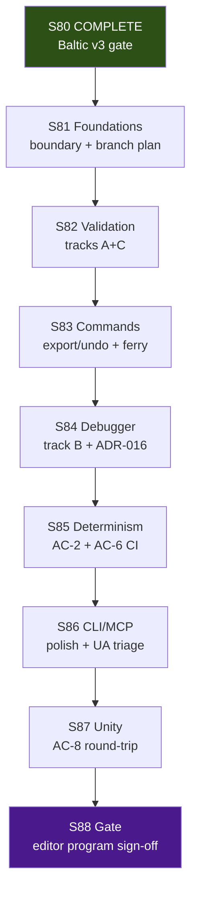

# S81–S88 Scenario Editor Program — Local + Cloud Agent Execution Plan

> **For agentic workers:** REQUIRED SUB-SKILL: superpowers:subagent-driven-development or superpowers:executing-plans. Per-sprint dispatch via superpowers:dispatching-parallel-agents + using-git-worktrees. Steps use checkbox (`- [ ]`) syntax for tracking. Code tracks: superpowers:test-driven-development (RED → GREEN).

**Goal:** Ship **req 11 scenario editor headless program** — validation tracks A–D completion, AC-1…AC-12 coverage (minus deferred ADR-014 Lua), CLI/MCP surface, determinism/CI smoke, Unity AC-8 round-trip, and S88 program gate — while preserving Baltic v2/v3 frozen corpora and standing invariants.

**Architecture:** Serial sprints S81→S88; 2–4 parallel tracks within each sprint; local coordinator owns boundary, closeout, merge, Unity evidence (S87+), and human gates; cloud agents handle validation engine, CLI/MCP, schema/tests, and docs. **Stage stays Release** for the full program unless explicit S88 decision. In-flight work on `fix-scenario-publish-cli-wiring` merges post S81 boundary.

**Tech Stack:** .NET 8, Graphite (`gt`), GitNexus CLI (`node .gitnexus/run.cjs`), headless Play Mode harness, `ScenarioDocumentEditor` / `ScenarioValidationEngine`, scenario JSON schema, `tools/ci/smoke-ac6.sh`.

**Authority:** [`future-sprint-roadpmap-07042026.md`](future-sprint-roadpmap-07042026.md) §3/§10/§12, [`qa-plan-scenario-editor-2026-07-01.md`](../../production/qa/qa-plan-scenario-editor-2026-07-01.md), [`implementation-tracker-2026-07-04.md`](../../Game-Requirements/implementation-tracker-2026-07-04.md), [`11-Agentic-Mission-Editor.md`](../../Game-Requirements/requirements/11-Agentic-Mission-Editor.md), [`local-cloud-agent-routing.md`](../../production/agentic/local-cloud-agent-routing.md), [`graphite-github-substitute-plan.md`](../engineering/graphite-github-substitute-plan.md), prior pattern [`roadmap-execute-plan-062526.01.md`](roadmap-execute-plan-062526.01.md)

---

## 1. Executive summary

This plan coordinates **8 serial sprints (S81–S88)** using **local Cursor agents** (boundary, closeout, branch merge, Unity AC-8, gate verification) and **Cloud Agents** (validation, CLI/MCP, schema, tests). **Sprints run serially**; **tracks within each sprint run in parallel** after boundary + baseline prereqs.

| Dimension | Value |
|-----------|-------|
| **Sprint count** | **8** (S81–S88) |
| **Program** | Scenario Editor — **E11 / req 11 lead** |
| **Prior program** | S73–S80 Baltic v3 **COMPLETE** (human ack 2026-06-26); S69–S72 E7 prep COMPLETE |
| **Test baseline @ S81 start** | **1308 pass / 2 known UA failures** (ReplayGolden 6/6, C2 proxy 18/18); floor **≥1232** monotonic |
| **Max parallel agents per sprint** | **4 effective tracks** (local ≤6, cloud ≤5) |
| **Critical path** | S81 → S82 → S83 → S84 → S85 → S86 → S87 → S88 |
| **Est. calendar (S81–S88)** | **~48–62 days** (~10–12 weeks) with parallel tracks inside each sprint |
| **Stage** | **Release** throughout — no mandatory `production/stage.txt` advance at S88 |

**Coordinator model:** One local **producer/coordinator** owns merge order, `ScenarioDocumentEditor` contention, closeout, and human gates. Cloud agents execute isolated stack branches; local agents own boundary publish, branch integration plan (PR #237), Unity load evidence, and final merges.

**In-flight branch (pre-S81):** `fix-scenario-publish-cli-wiring` @ `17d426c` — tracks A–D partial (+48 tests); Graphite draft PR #237 (+9 commits ahead of remote at tracker publish). S81-02 produces merge/integration plan; stack submit after boundary + user ack.

**Verification @ plan authoring (2026-07-04):** build 0e/4w; test 1308/2f (281 Sim +249 Del +63 Cli +5 Excel +257 UA +453 Data); ReplayGolden 6/6; C2 18/18; hash `17144800277401907079`; GitNexus **21,447 / 40,393 / 378 clusters** @ `17d426c` (fresh). Impacts: CatalogWriteGate **178**, Patrol **97**, Bridge **127**, Baltic **52** (exact §5); ScenarioDocumentEditor **20 CRITICAL**, ScenarioValidationEngine **17 HIGH**.

**Relationship to prior plans:** [`roadmap-execute-plan-062526.01.md`](roadmap-execute-plan-062526.01.md) (Baltic v3 COMPLETE). Baltic corpora and production hash remain frozen; editor uses `data/scenarios/examples/` + schema only.

---

## 2. Program timeline



**Serial rule:** Never run two full sprints in parallel. **Parallel rule:** After S*-01 boundary/baseline, dispatch up to cap tracks with isolated worktrees.

**Prerequisite before S81-01:** S73–S80 closeouts PASS; `fix-scenario-publish-cli-wiring` stack reviewed; GitNexus index fresh; gates RUN+READ (see §5 Phase 0).

---

## 3. Per-sprint summary table

| Sprint | Lead | Primary goal | Est. days | Max parallel | Tracks | Key artifacts | QA units (primary) |
|--------|------|--------------|-----------|--------------|--------|---------------|-------------------|
| **S81** | E11 | Scenario editor boundary + branch merge plan + GitNexus re-index | 5–7 | 2 local / 2 cloud | 4 | `production/scenario-editor-scope-boundary-2026-07-04.md`, merge plan doc | — |
| **S82** | E11 | Validation tracks A+C hardening | 6–8 | 1 local / 3 cloud | 4 | AC-4/9/12 green | #4, #9, #12, #15 |
| **S83** | E11 | Export/undo CLI + ferry sample (track D) | 6–8 | 1 local / 3 cloud | 4 | Ferry fixture, undo round-trip | #5, #13, #14 |
| **S84** | E11 | Event debugger + teleport export (track B) | 6–8 | 1 local / 2 cloud | 3 | AC-7 JSON, AC-11 export | #7, #11, #16 |
| **S85** | E11 | Determinism + AC-6 CI + stub pins | 5–7 | 1 local / 2 cloud | 3 | AC-2 integration, CI smoke | #2, #6, #17 |
| **S86** | E11 | MCP/CLI polish + UA engage triage | 5–7 | 1 local / 2 cloud | 3 | no-Lua gate, UA fix/waive | #19, UA pair |
| **S87** | E11 | Unity host round-trip (AC-8) | 6–8 | 2 local | 2 | PlayMode or manual QA pack | #8 |
| **S88** | Gate | Full verification + human ack | 5–7 | 1–2 local | 2 | `production/gate-checks/s88-scenario-editor-gate-2026-07-*.md` | all 19 |

**Sprint plans (to create @ dispatch):**

| Sprint | Plan path |
|--------|-----------|
| S81 | `production/sprints/sprint-81-scenario-editor-foundations.md` |
| S82 | `production/sprints/sprint-82-validation-tracks-ac.md` |
| S83 | `production/sprints/sprint-83-export-undo-ferry.md` |
| S84 | `production/sprints/sprint-84-event-debugger.md` |
| S85 | `production/sprints/sprint-85-determinism-ci.md` |
| S86 | `production/sprints/sprint-86-cli-mcp-polish.md` |
| S87 | `production/sprints/sprint-87-unity-roundtrip.md` |
| S88 | `production/sprints/sprint-88-scenario-editor-gate.md` |

**Kickoffs (to create @ dispatch):** `production/agentic/sprint-81-parallel-kickoff-2026-07-04.md` (and S82–S88)

---

## 4. Per-sprint track plans

Worktree root: `/home/username01/cmano-clone/.worktrees/`  
Stack workflow: Graphite — `gt create`, `gt submit --stack --no-interactive`, `gt sync`, `gt restack`

### S81 — Scenario editor foundations

| Track | Stack prefix | Worktree path | Agent env | Stories | Owner |
|-------|--------------|---------------|-----------|---------|-------|
| Scope boundary | `stack/sprint81/scenario-editor-boundary` | `.worktrees/stack/sprint81/scenario-editor-boundary` | **Local** | S81-01 | producer |
| Branch integration plan | `stack/sprint81/branch-integration` | `.worktrees/stack/sprint81/branch-integration` | **Local** | S81-02 | lead-programmer |
| GitNexus re-index | `stack/sprint81/gitnexus-reindex` | `.worktrees/stack/sprint81/gitnexus-reindex` | Cloud | S81-03 | c-sharp-devops-engineer |
| Closeout | `stack/sprint81/closeout` | `.worktrees/stack/sprint81/closeout` | **Local** | S81-04 | c-sharp-devops-engineer |

**Wave order:** S81-01 (boundary, day 1) → (W1 branch plan ∥ W2 re-index) → W3 Closeout

**S81-01 deliverable:** `production/scenario-editor-scope-boundary-2026-07-04.md`

Must include:

- Cite [`future-sprint-roadpmap-07042026.md`](future-sprint-roadpmap-07042026.md) §3/§6/§7/§10 + this execute plan + qa-plan
- Supersede [`production/baltic-v3-scope-boundary-2026-06-25.md`](../../production/baltic-v3-scope-boundary-2026-06-25.md) for **S81+ only** (archive prior, do not delete)
- **In scope:** E11 headless editor (§3 themes); validation tracks A–D; AC-1…12 minus ADR-014 Lua deferral
- **Out:** E7 submission, E9 v3 promotion, multiplayer, `DelegationBridge` edits, production hash change w/o ADR, Unity map/edit-mode (Phase 2 except AC-8 @ S87)
- Carry standing invariants (≥1232 floor, hash, ZERO bridge, extend-only catalog)
- **Stage policy:** Release throughout S81–S88
- File ownership: single owner per sprint for `ScenarioDocumentEditor`

**S81-02 deliverable:** `production/agentic/scenario-editor-branch-integration-plan-2026-07-04.md`

Must include:

- Inventory of `fix-scenario-publish-cli-wiring` commits (tracks A–D @ `7b0f376`…`17d426c`)
- Graphite PR #237 stack map; `gt submit --stack --no-interactive` steps post boundary ack
- Risk: 2 UA failures (`BalticReplayHarnessPolicyEngageTests`) — triage owner @ S86
- Merge order vs trunk; re-verification block (§5 Phase 0) before/after merge

**GitNexus preflight (mandatory):** `node .gitnexus/run.cjs status`; analyze if stale; `impact --summary-only` on CRITICALs + editor symbols.

### S82 — Validation tracks A+C

| Track | Stack prefix | Worktree path | Agent env | Stories | Owner |
|-------|--------------|---------------|-----------|---------|-------|
| Doctrine inheritance (AC-4) | `stack/sprint82/doctrine-validation` | `.worktrees/stack/sprint82/doctrine-validation` | Cloud | S82-01 | team-data |
| Schema conformance (AC-9/AME-2.6) | `stack/sprint82/schema-conformance` | `.worktrees/stack/sprint82/schema-conformance` | Cloud | S82-02 | team-data |
| Save-vs-export gate (AC-12) | `stack/sprint82/save-export-gate` | `.worktrees/stack/sprint82/save-export-gate` | Cloud | S82-03 | c-sharp-test-engineer |
| Closeout | `stack/sprint82/closeout` | `.worktrees/stack/sprint82/closeout` | **Local** | S82-04 | c-sharp-devops-engineer |

**Wave order:** All three validation tracks ∥ (day 1) → closeout

**Primary files (extend/harden existing):**

| File | QA unit | TDD note |
|------|---------|----------|
| `src/ProjectAegis.Data.Tests/Validation/DoctrineInheritanceValidateTests.cs` | #4 | Extend if AC-4 gaps remain |
| `data/scenarios/validation/doctrine-inheritance.json` | #4 | Fixture |
| `src/ProjectAegis.Data.Tests/Scenario/ScenarioDocumentSchemaConformanceTests.cs` | #15 | All 3 examples + live editor output |
| `src/ProjectAegis.Data.Tests/Scenario/DerivedOnlyInvariantTests.cs` | #9 | `editorState` derived-only |
| `data/scenarios/scenario-document.schema.json` | #15 | Schema source |
| `src/ProjectAegis.Data.Tests/Validation/SaveVsExportGateTests.cs` | #12 | Save ok / export blocked |
| `src/ProjectAegis.Data/Validation/ScenarioValidationExportGate.cs` | #12 | Export gate (read/test) |

**Hard gates:** Editor subset filter green; test floor ≥1232; no `DelegationBridge` edits.

```bash
dotnet test src/ProjectAegis.Data.Tests/ProjectAegis.Data.Tests.csproj \
  --filter "DoctrineInheritance|DerivedOnly|SaveVsExport|SchemaConformance"
```

### S83 — Export/undo + ferry (track D)

| Track | Stack prefix | Worktree path | Agent env | Stories | Owner |
|-------|--------------|---------------|-----------|---------|-------|
| Export command polish | `stack/sprint83/scenario-export` | `.worktrees/stack/sprint83/scenario-export` | Cloud | S83-01 | team-data |
| Undo CLI wiring (AME-8.5) | `stack/sprint83/scenario-undo` | `.worktrees/stack/sprint83/scenario-undo` | Cloud | S83-02 | team-data |
| Ferry sample + AC-5 fixture | `stack/sprint83/ferry-sample` | `.worktrees/stack/sprint83/ferry-sample` | Cloud | S83-03 | game-designer |
| Closeout | `stack/sprint83/closeout` | `.worktrees/stack/sprint83/closeout` | **Local** | S83-04 | c-sharp-devops-engineer |

**Primary files:**

| File | QA unit |
|------|---------|
| `src/ProjectAegis.Data/Scenario/Authoring/ScenarioExportCommand.cs` | track D |
| `src/ProjectAegis.MissionEditor.Cli/ScenarioExportCommand.cs` (CLI wrapper if split) | track D |
| `src/ProjectAegis.Data/Scenario/Authoring/ScenarioUndoStackStore.cs` | #14 |
| `src/ProjectAegis.MissionEditor.Cli/ScenarioUndoCommand.cs` | #14 |
| `src/ProjectAegis.MissionEditor.Cli.Tests/ScenarioUndoCliTests.cs` | #14 |
| `src/ProjectAegis.MissionEditor.Cli/MissionAddFerryCommand.cs` | #13 |
| `src/ProjectAegis.MissionEditor.Cli/MissionUpdateFerryCommand.cs` | #13 |
| `src/ProjectAegis.MissionEditor.Cli.Tests/MissionAddFerryCommandTests.cs` | #13, #5 |
| `src/ProjectAegis.MissionEditor.Cli.Tests/ScenarioSimulateSampleCliTests.cs` | #5 (Strike+Patrol+Support+Ferry) |

**AME-8.5 design lock:** Confirm snapshot persistence (disk vs in-process) before S83-02 TDD — document decision in boundary or ADR addendum if changed from in-memory stub. (S83 delivered: disk confirmed via sidecar; cites added to boundary + code.)

### S84 — Event debugger (track B)

| Track | Stack prefix | Worktree path | Agent env | Stories | Owner |
|-------|--------------|---------------|-----------|---------|-------|
| Event debugger JSON (AC-7) | `stack/sprint84/event-debugger` | `.worktrees/stack/sprint84/event-debugger` | Cloud | S84-01 | team-simulation |
| Teleport export transform (AC-11) | `stack/sprint84/teleport-export` | `.worktrees/stack/sprint84/teleport-export` | Cloud | S84-02 | team-simulation |
| ADR-016 complexity caps | `stack/sprint84/event-graph-caps` | `.worktrees/stack/sprint84/event-graph-caps` | Cloud | S84-03 | c-sharp-test-engineer |
| Closeout | `stack/sprint84/closeout` | `.worktrees/stack/sprint84/closeout` | **Local** | S84-04 | c-sharp-devops-engineer |

**Primary files:**

| File | QA unit |
|------|---------|
| `src/ProjectAegis.Data/Scenario/Authoring/EventDebuggerTrace.cs` | #7 |
| `src/ProjectAegis.Data.Tests/Scenario/EventDebuggerTests.cs` | #7 |
| `src/ProjectAegis.MissionEditor.Cli/ScenarioEventTraceCommand.cs` (or equivalent) | #7 |
| Teleport export tests (e.g. `TeleportUnitExportTests.cs`) | #11 |
| `src/ProjectAegis.Data.Tests/Validation/EventGraphComplexityTests.cs` | #16 (create if missing) |
| `src/ProjectAegis.Data/Validation/ValidationRules.cs` | #16 |

**Wave order:** Debugger + teleport ∥ caps (single owner on `ValidationRules` if both touch) → closeout

### S85 — Determinism + CI smoke

| Track | Stack prefix | Worktree path | Agent env | Stories | Owner |
|-------|--------------|---------------|-----------|---------|-------|
| AC-2 determinism integration | `stack/sprint85/determinism` | `.worktrees/stack/sprint85/determinism` | Cloud | S85-01 | determinism-engineer |
| AC-6 CI wiring | `stack/sprint85/ac6-ci` | `.worktrees/stack/sprint85/ac6-ci` | Cloud | S85-02 | c-sharp-devops-engineer |
| Stub-scope pins (#17) | `stack/sprint85/stub-pins` | `.worktrees/stack/sprint85/stub-pins` | Cloud | S85-03 | c-sharp-test-engineer |
| Closeout | `stack/sprint85/closeout` | `.worktrees/stack/sprint85/closeout` | **Local** | S85-04 | c-sharp-devops-engineer |

**Primary files:**

| File | QA unit |
|------|---------|
| `src/ProjectAegis.MissionEditor.Cli/ScenarioSimulateSampleCommand.cs` | #2 |
| `src/ProjectAegis.MissionEditor.Cli.Tests/ScenarioSimulateSampleCliTests.cs` | #2 |
| `tools/ci/smoke-ac6.sh` | #6 |
| `.buildkite/pipeline.yml` or CI step referencing smoke-ac6 | #6 |
| `src/ProjectAegis.Data.Tests/Scenario/StubScopePinTests.cs` | #17 |

**AC-2 assertions:** byte-identical `fire_order`; world-state hash excluding `editorState`; `SEED=` / `HASH=` stdout contract.

### S86 — CLI/MCP polish + UA triage

| Track | Stack prefix | Worktree path | Agent env | Stories | Owner |
|-------|--------------|---------------|-----------|---------|-------|
| MCP manifest + verb polish | `stack/sprint86/mcp-polish` | `.worktrees/stack/sprint86/mcp-polish` | Cloud | S86-01 | team-data |
| UA engage test triage | `stack/sprint86/ua-engage-fix` | `.worktrees/stack/sprint86/ua-engage-fix` | Cloud | S86-02 | team-simulation |
| No-Lua architecture gate | `stack/sprint86/no-lua-gate` | `.worktrees/stack/sprint86/no-lua-gate` | Cloud | S86-03 | security-engineer |
| Closeout | `stack/sprint86/closeout` | `.worktrees/stack/sprint86/closeout` | **Local** | S86-04 | c-sharp-devops-engineer |

**UA failures (open @ S81 start):**

- `Friendly_weapons_tight_surfaces_policy_abort_in_engagement_log`
- `Restricted_engagement_scenario_fingerprint_is_deterministic`

Location: `BalticReplayHarnessPolicyEngageTests` in UnityAdapter.Tests. **Fix, waive with user ack, or document exclusion** before S88 gate.

**Primary files:**

| File | QA unit |
|------|---------|
| `tools/mission-editor/mcp-tools.json` | MCP |
| `src/ProjectAegis.MissionEditor.Cli.Tests/McpToolsManifestTests.cs` | MCP |
| `src/ProjectAegis.Data.Tests/Architecture/NoDynamicExecutionGateTests.cs` | #19 |

### S87 — Unity host round-trip (AC-8)

| Track | Stack prefix | Worktree path | Agent env | Stories | Owner |
|-------|--------------|---------------|-----------|---------|-------|
| PlayMode headless load | `stack/sprint87/playmode-roundtrip` | `.worktrees/stack/sprint87/playmode-roundtrip` | **Local** | S87-01 | unity-ui-specialist |
| Manual QA evidence pack | `stack/sprint87/manual-qa-ac8` | `.worktrees/stack/sprint87/manual-qa-ac8` | **Local** | S87-02 | qa-tester |
| Closeout | `stack/sprint87/closeout` | `.worktrees/stack/sprint87/closeout` | **Local** | S87-03 | c-sharp-devops-engineer |

**Scope:** Extend `PlayModeSmokeHarnessTests` to load a headless-authored `data/scenarios/examples/*.scenario.json` and assert ORBAT/missions/events + default `editorState` intact — **or** produce manual Editor load checklist per qa-plan #8 fallback.

**Out of scope @ S87:** Map placement (AME-4.x), visual event graph — Phase 2.

### S88 — Scenario editor program gate

| Track | Stack prefix | Worktree path | Agent env | Stories | Owner |
|-------|--------------|---------------|-----------|---------|-------|
| Gate verification | `stack/sprint88/gate` | `.worktrees/stack/sprint88/gate` | **Local** | S88-01 | c-sharp-devops-engineer |
| Human sign-off | `stack/sprint88/signoff` | `.worktrees/stack/sprint88/signoff` | **Local** | S88-02 | producer |

**Wave order:** Serial — verification → human ack

**Gate artifact:** `production/gate-checks/s88-scenario-editor-gate-2026-07-*.md`

**S88 exit criteria:**

- [ ] S81–S87 closeouts PASS
- [ ] qa-plan 19 units addressed or waived with user ack (indexed in gate doc)
- [ ] AC-1…AC-12 evidence table in gate doc (minus ADR-014 Lua deferral)
- [ ] Test baseline ≥1232; **0 failed** (UA pair resolved or waived); ReplayGolden 6/6; C2 proxy ≥18
- [ ] Production Baltic hash unchanged OR golden ADR documented
- [ ] GitNexus CRITICAL §5 exact (178/97/127/52) + editor symbols reported
- [ ] `bash tools/ci/smoke-ac6.sh` PASS in CI
- [ ] Human ack: **"scenario editor program complete"** (headless slice)
- [ ] Stage: default **stay Release**
- [ ] Optional: merge `fix-scenario-publish-cli-wiring` to trunk (explicit decision)

---

## 5. Orchestrator loop

Run at **program start** and **after each sprint closeout**.

### Phase 0 — Baseline (orchestrator, sequential)

- [ ] GitNexus `node .gitnexus/run.cjs status` — analyze if stale
- [ ] `impact --summary-only` on CatalogWriteGate, PatrolCandidateEngagePolicy, DelegationBridge, BalticReplayHarness, ScenarioDocumentEditor, ScenarioValidationEngine
- [ ] `dotnet build ProjectAegis.sln`
- [ ] `dotnet test ProjectAegis.sln -v minimal`
- [ ] ReplayGolden 6/6 + C2 proxy 18/18 filters
- [ ] Editor subset (when editor sprint):
- [ ] `bash tools/ci/smoke-ac6.sh` (when serialization touched)
- [ ] Record: test count, commit SHA, gate results, GitNexus stats

```bash
cd /home/username01/cmano-clone/cmano-clone
export PATH="$HOME/.dotnet:$PATH"

node .gitnexus/run.cjs status
node .gitnexus/run.cjs impact ScenarioDocumentEditor --direction upstream --summary-only
node .gitnexus/run.cjs impact ScenarioValidationEngine --direction upstream --summary-only
node .gitnexus/run.cjs impact CatalogWriteGate --direction upstream --summary-only
node .gitnexus/run.cjs impact DelegationBridge --direction upstream --summary-only

dotnet build ProjectAegis.sln
dotnet test ProjectAegis.sln -v minimal
dotnet test src/ProjectAegis.Delegation.UnityAdapter.Tests/ProjectAegis.Delegation.UnityAdapter.Tests.csproj \
  --filter "FullyQualifiedName~ReplayGoldenSuiteTests"
dotnet test src/ProjectAegis.Delegation.UnityAdapter.Tests/ProjectAegis.Delegation.UnityAdapter.Tests.csproj \
  --filter PlayModeSmokeHarnessTests
dotnet test src/ProjectAegis.Data.Tests/ProjectAegis.Data.Tests.csproj \
  --filter "ScenarioDocumentEditor|ScenarioValidation|SaveVsExport|DoctrineInheritance|EventDebugger|SchemaConformance|StubScope|DerivedOnly"
rg "17144800277401907079" tests/regression/ data/ -l
bash tools/ci/smoke-ac6.sh   # when AC-6 path touched
```

### Phase 1 — Parallel dispatch (per sprint)

- [ ] Publish scope boundary (S81-01) before code tracks (S82+)
- [ ] Dispatch 2–4 tracks via `dispatching-parallel-agents` + isolated worktrees
- [ ] Each track: GitNexus `impact` preflight on symbols in ownership matrix (§7); cite boundary; TDD for code; verification-before on claims

### Phase 2 — Integrate (closeout track)

- [ ] All tracks `gt submit --stack --no-interactive`
- [ ] Closeout: `gt sync`, `gt restack` on `main`
- [ ] Re-run Phase 0 gates
- [ ] GitNexus re-index post-merge
- [ ] Update `production/sprint-status.yaml`
- [ ] Write `production/qa/smoke-sprint-{N}-closeout-2026-07-*.md`
- [ ] `node .gitnexus/run.cjs detect-changes` before commit

---

## 6. Hard gates (every sprint close)

| Gate | Command / check | Pass criterion |
|------|-----------------|----------------|
| Build | `dotnet build ProjectAegis.sln` | 0 errors |
| Tests | `dotnet test ProjectAegis.sln -v minimal` | 0 failed (excl. known UA pair until S86 resolution); floor **≥1232** |
| Replay | `--filter FullyQualifiedName~ReplayGoldenSuiteTests` | 6/6 |
| C2 proxy | `--filter PlayModeSmokeHarnessTests` | 18/18 |
| Determinism | grep production goldens | hash `17144800277401907079` unless ADR |
| Bridge | no `DelegationBridge.cs` edits | ZERO touch |
| Editor subset | Data.Tests filter (see Phase 0) | 0 failed on touched areas |
| AC-6 | `bash tools/ci/smoke-ac6.sh` | PASS when serialization touched |
| GitNexus | status + impact CRITICALs | fresh index; §5 exact match |
| Scope | boundary cite | `scenario-editor-scope-boundary-2026-07-04.md` |

---

## 7. File ownership matrix (hot symbols)

| Symbol / area | S81 | S82 | S83 | S84 | S85 | S86 | S87 | S88 | Rule |
|---------------|-----|-----|-----|-----|-----|-----|-----|-----|------|
| `DelegationBridge` | — | — | — | — | — | — | — | — | **ZERO touch** |
| `PatrolCandidateEngagePolicy` | — | — | — | — | — | triage only | — | verify | no editor edits |
| `CatalogWriteGate` | — | — | — | — | — | — | — | verify | extend-only; avoid |
| `BalticReplayHarness` | — | — | — | — | read | **UA owner** | — | verify | no hash change w/o ADR |
| `ScenarioDocumentEditor` | read | **owner** | **owner** | read | read | read | load-only | verify | **one owner per sprint** |
| `ScenarioValidationEngine` | — | **owner** | read | **owner** | **owner** | read | — | verify | coordinate w/ editor track |
| `ValidationRules` | — | read | — | **owner** | read | — | — | verify | single owner if edited |
| `ScenarioUndoStackStore` | — | — | **owner** | — | — | — | — | verify | track D |
| Unity C2 / editor hosts | — | — | — | — | — | — | **owner** | verify | AC-8 additive load |

---

## 8. S81 orchestrator — Agent prompt stubs

### Agent A — Scope boundary (Local)

```
Publish production/scenario-editor-scope-boundary-2026-07-04.md for S81–S88 Scenario Editor E11.

SCOPE:
- Cite future-sprint-roadpmap-07042026.md §3/§6/§7/§10 + roadmap-execute-plan-07042026.md + qa-plan-scenario-editor-2026-07-01.md
- Supersede baltic-v3-scope-boundary-2026-06-25.md for S81+ only (archive, don't delete)
- List in/out of scope per roadmap §3 (headless AC-1…12; Unity AC-8 @ S87 only; Lua deferred ADR-014)
- Carry standing invariants (≥1232 floor, hash, ZERO bridge, extend-only catalog)
- Stage policy: Release throughout S81–S88
- File ownership: ScenarioDocumentEditor single owner per sprint

REQUIRED: Docs only for boundary track. verification-before on gate claims if any.

RETURN: Path to boundary doc + summary for other tracks.
```

### Agent B — Branch integration plan (Local)

```
Write production/agentic/scenario-editor-branch-integration-plan-2026-07-04.md.

SCOPE:
- Branch fix-scenario-publish-cli-wiring @ 17d426c; Graphite PR #237
- Map commits to tracks A–D (implementation-tracker-2026-07-04.md timeline)
- gt submit --stack steps; merge order; Phase 0 re-verification before/after
- Flag 2 UA failures for S86; do not fix in this track

REQUIRED: Docs only. Cite boundary (after Agent A) + execute plan §4 S81.

RETURN: Merge plan path + recommended gt commands (user-run).
```

### Agent C — GitNexus re-index (Cloud)

```
Re-index GitNexus @ HEAD and record stats.

COMMANDS:
node .gitnexus/run.cjs analyze
node .gitnexus/run.cjs status
node .gitnexus/run.cjs impact CatalogWriteGate --direction upstream --summary-only
node .gitnexus/run.cjs impact DelegationBridge --direction upstream --summary-only
node .gitnexus/run.cjs impact ScenarioDocumentEditor --direction upstream --summary-only
node .gitnexus/run.cjs impact ScenarioValidationEngine --direction upstream --summary-only

UPDATE: production/sprint-status.yaml indexed_commit if policy allows; else closeout qa doc.

RETURN: nodes/edges stats; expect CRITICAL 178/97/127/52 exact; editor 20/17.
```

---

## 9. Prerequisites checklist — before first S81 agent dispatch

### Environment & tooling

- [ ] `.NET SDK 8.0.400` (`dotnet --version`)
- [ ] Graphite CLI (`gt`) available; trunk `main` synced
- [ ] GitNexus index current — `node .gitnexus/run.cjs status`
- [ ] Review `fix-scenario-publish-cli-wiring` / PR #237 vs trunk

### Program artifacts

- [x] S73–S80 COMPLETE — [`s80-baltic-v3-content-gate-2026-06-26.md`](../../production/gate-checks/s80-baltic-v3-content-gate-2026-06-26.md)
- [x] Roadmap — [`future-sprint-roadpmap-07042026.md`](future-sprint-roadpmap-07042026.md)
- [x] QA plan — [`qa-plan-scenario-editor-2026-07-01.md`](../../production/qa/qa-plan-scenario-editor-2026-07-01.md)
- [x] Implementation tracker — [`implementation-tracker-2026-07-04.md`](../../Game-Requirements/implementation-tracker-2026-07-04.md)
- [x] This execute plan — `docs/reports/roadmap-execute-plan-07042026.md`
- [ ] Scope boundary — `production/scenario-editor-scope-boundary-2026-07-04.md` (@ S81-01)
- [ ] Design spec — `docs/superpowers/specs/2026-07-04-scenario-editor-program-design.md` (optional @ S81; recommended before S82 code)
- [ ] Sprint plan S81 — `production/sprints/sprint-81-scenario-editor-foundations.md`
- [ ] Kickoff S81 — `production/agentic/sprint-81-parallel-kickoff-2026-07-04.md`
- [x] Schema + fixtures — `data/scenarios/scenario-document.schema.json`, `data/scenarios/examples/*.scenario.json`
- [x] AC-6 smoke script — `tools/ci/smoke-ac6.sh`

### Standing exclusions (never commit)

- `.cursor/hooks/`, `.pi/settings.json`, `.polly/`

---

## 10. Related artifacts

| Artifact | Path |
|----------|------|
| Roadmap (canonical) | [`future-sprint-roadpmap-07042026.md`](future-sprint-roadpmap-07042026.md) |
| Roadmap alias | [`future-sprint-roadpmap.md`](future-sprint-roadpmap.md) |
| QA plan | [`qa-plan-scenario-editor-2026-07-01.md`](../../production/qa/qa-plan-scenario-editor-2026-07-01.md) |
| Implementation tracker | [`implementation-tracker-2026-07-04.md`](../../Game-Requirements/implementation-tracker-2026-07-04.md) |
| Req 11 | [`11-Agentic-Mission-Editor.md`](../../Game-Requirements/requirements/11-Agentic-Mission-Editor.md) |
| Prior execute plan (Baltic v3) | [`roadmap-execute-plan-062526.01.md`](roadmap-execute-plan-062526.01.md) |
| Baltic v3 boundary (archived) | [`production/baltic-v3-scope-boundary-2026-06-25.md`](../../production/baltic-v3-scope-boundary-2026-06-25.md) |
| S80 gate | [`production/gate-checks/s80-baltic-v3-content-gate-2026-06-26.md`](../../production/gate-checks/s80-baltic-v3-content-gate-2026-06-26.md) |
| Active branch | `fix-scenario-publish-cli-wiring` @ `17d426c` (Graphite PR #237) |
| Local/cloud routing | [`production/agentic/local-cloud-agent-routing.md`](../../production/agentic/local-cloud-agent-routing.md) |

---

## 11. Self-review (plan vs roadmap + qa-plan)

| Spec requirement | Plan section |
|------------------|--------------|
| 8-sprint S81–S88 | §1, §2, §3 |
| E11 lead, headless first | §4 all sprints |
| Tracks A–D mapping | §4 S82–S85 |
| qa-plan 19 units | §3 table, §4 per-sprint files |
| Stage Release | §1, S88 exit |
| GitNexus editor + §5 CRITICALs | §1, §4 S81, §7 |
| In-flight branch PR #237 | §1, §4 S81-02 |
| Unity AC-8 @ S87 only | §4 S87 |
| E7/E9 out of scope | §4 S81 boundary stub |
| Baltic hash frozen | §1, §6 |
| 2 UA failures @ S86 | §4 S86, §6 |

**Placeholder scan:** Sprint plans/kickoffs + design spec marked create @ dispatch (intentional). AME-8.5 persistence flagged as design lock @ S83 (documented, not TBD).

**Gap note:** qa-plan #1 (AC-1 fuel reachability) and #18 (5k ORBAT perf NFR) not assigned a dedicated sprint — address opportunistically in S82/S85 or waive @ S88 with user ack. #1 may already be covered by `ReachabilityCalculatorTests` / validation golden tests.

---

## 12. Execution handoff

**Plan complete and saved to `docs/reports/roadmap-execute-plan-07042026.md`. Two execution options:**

1. **Subagent-Driven (recommended)** — dispatch a fresh subagent per S81 track (§8), review between tracks. REQUIRED SUB-SKILL: `superpowers:subagent-driven-development`.

2. **Inline Execution** — execute S81 tasks in-session with checkpoints. REQUIRED SUB-SKILL: `superpowers:executing-plans`.

**Do not dispatch S82+ code tracks until:**

- User approves this plan + roadmap 07042026 + qa-plan
- S81-01 boundary is published
- Branch integration plan reviewed (S81-02)

**Recommended first dispatch order:**

1. S81-01 boundary (local producer) — §8 Agent A  
2. Parallel: S81-02 branch plan (local) + S81-03 re-index (cloud) — §8 Agents B/C  
3. S81-04 closeout (local) — Phase 2 integrate  
4. User ack → `gt submit` for `fix-scenario-publish-cli-wiring` stack per merge plan  
5. `/sprint-plan` for S82 → dispatch validation tracks

---

*Generated 2026-07-04. S73–S80 COMPLETE; S81 executable after boundary publish. GitNexus 21447/40393 @ 17d426c verified pre-authoring. Do not commit from agent sessions unless user requests.*
