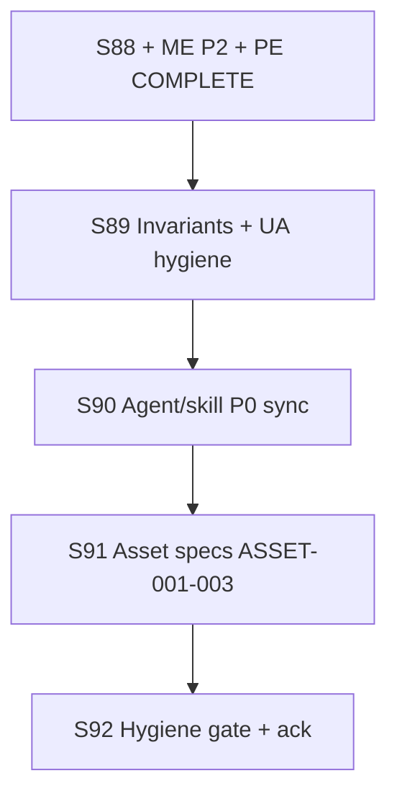

# S89–S92 Post-Editor Hygiene — Local + Cloud Agent Execution Plan

> **For agentic workers:** REQUIRED SUB-SKILL: superpowers:subagent-driven-development or superpowers:executing-plans. Per-sprint dispatch via superpowers:dispatching-parallel-agents + using-git-worktrees. Steps use checkbox (`- [ ]`) syntax for tracking. Code tracks: superpowers:test-driven-development (RED → GREEN) when tests change.

**Goal:** Close post-editor dashboard gaps — invariant floor honesty (1599/20/20), agent/skill P0 doc sync, asset spec production (ASSET-001…003), UA engage hygiene — while preserving Baltic frozen corpora and standing invariants. **Stage stays Release.**

**Architecture:** Serial sprints S89→S92; 2–3 parallel tracks within each sprint; local coordinator owns boundary, closeout, merge, and human gates; cloud agents handle docs/tests/hygiene tracks.

**Tech Stack:** .NET 8, Graphite (`gt`), GitNexus CLI (`node .gitnexus/run.cjs`), headless Play Mode harness.

**Authority:** [`future-sprint-roadpmap-07092026.md`](future-sprint-roadpmap-07092026.md) §3/§10, [`post-editor-hygiene-scope-boundary-2026-07-09.md`](../../production/post-editor-hygiene-scope-boundary-2026-07-09.md), [`tech-stack-agent-skill-recommendations-2026-07-08.md`](tech-stack-agent-skill-recommendations-2026-07-08.md), [`design/assets/asset-manifest.md`](../../design/assets/asset-manifest.md), [`local-cloud-agent-routing.md`](../../production/agentic/local-cloud-agent-routing.md), [`graphite-github-substitute-plan.md`](../engineering/graphite-github-substitute-plan.md)

---

## 1. Executive summary

| Dimension | Value |
|-----------|-------|
| **Sprint count** | **4** (S89–S92) |
| **Program** | Post-editor engineering hygiene + asset spec production |
| **Prior programs** | S81–S88 scenario editor **COMPLETE**; ME Phase 2 **COMPLETE**; PE **COMPLETE** (2026-07-09) |
| **Test baseline @ S89 start** | **1599 pass / 0 failed** (ReplayGolden 6/6, C2 20/20); floor **≥1599** monotonic |
| **Max parallel agents per sprint** | **3 effective tracks** |
| **Critical path** | S89 → S90 → S91 → S92 |
| **Stage** | **Release** throughout — no mandatory stage advance at S92 |

**Verification @ plan authoring (2026-07-09):** build 0e/0w; test **1599/0f** (311 Sim + 260 Del + 286 UA + 24 Excel + 616 Data + 102 Cli); ReplayGolden 6/6; C2 20/20; hash `17144800277401907079` (18 paths); GitNexus **24,418 / 47,032 / 424** @ `223a5fe` (fresh). Impacts: ScenarioDocumentEditor **233**, CatalogWriteGate **186**, DelegationBridge **145**, Patrol **113**, Baltic **54**.

---

## 2. Program timeline



**Serial rule:** Never run two full sprints in parallel. **Parallel rule:** After S*-01 boundary/baseline, dispatch up to cap tracks with isolated worktrees.

**Prerequisite before S89-01:** GitNexus index fresh @ HEAD; gates RUN+READ (see Phase 0 — **COMPLETE** 2026-07-09).

---

## 3. Per-sprint summary table

| Sprint | Lead | Primary goal | Est. days | Tracks | Key artifacts |
|--------|------|--------------|-----------|--------|---------------|
| **S89** | Hygiene | Invariant floor docs + UA engage hygiene | 3–5 | 3 | AGENTS/tracker floor bump; UA engage doc/waive |
| **S90** | Docs | Agent/skill P0 sync (tech-stack recs) | 3–5 | 2 | Input Manager truth, VERSION.md, Claude-Agent-Setup |
| **S91** | Assets | ASSET-001…003 spec production | 4–6 | 2 | Refined specs under `design/assets/specs/` |
| **S92** | Gate | Program verification + human ack | 3–5 | 2 | `production/gate-checks/s92-post-editor-hygiene-gate-2026-07-*.md` |

**Sprint plans (to create @ dispatch via `/sprint-plan new`):**

| Sprint | Plan path |
|--------|-----------|
| S89 | `production/sprints/sprint-89-invariant-hygiene.md` |
| S90 | `production/sprints/sprint-90-agent-skill-sync.md` |
| S91 | `production/sprints/sprint-91-asset-spec-production.md` |
| S92 | `production/sprints/sprint-92-post-editor-hygiene-gate.md` |

---

## 4. Per-sprint track plans

Worktree root: `/home/username01/cmano-clone/.worktrees/`  
Stack workflow: Graphite — `gt create`, `gt submit --stack --no-interactive`, `gt sync`, `gt restack`

### S89 — Invariant + UA hygiene

| Track | Stack prefix | Agent env | Stories |
|-------|--------------|-----------|---------|
| Floor doc sync | `stack/sprint89/floor-docs` | Cloud | S89-01 |
| UA engage hygiene | `stack/sprint89/ua-engage` | Cloud | S89-02 |
| Closeout | `stack/sprint89/closeout` | **Local** | S89-03 |

### S90 — Agent/skill P0 sync

| Track | Stack prefix | Agent env | Stories |
|-------|--------------|-----------|---------|
| Agent YAML fixes (A1–A3) | `stack/sprint90/agents` | Cloud | S90-01 |
| Skill/doc fixes (B1–B3) | `stack/sprint90/skills` | Cloud | S90-02 |
| Closeout | `stack/sprint90/closeout` | **Local** | S90-03 |

### S91 — Asset spec production

| Track | Stack prefix | Agent env | Stories |
|-------|--------------|-----------|---------|
| C2 + Baltic specs | `stack/sprint91/asset-c2-baltic` | Cloud | S91-01 |
| Store capsule spec | `stack/sprint91/asset-store` | Cloud | S91-02 |
| Closeout | `stack/sprint91/closeout` | **Local** | S91-03 |

### S92 — Hygiene gate

| Track | Stack prefix | Agent env | Stories |
|-------|--------------|-----------|---------|
| Gate verification | `stack/sprint92/gate` | **Local** | S92-01 |
| Human ack package | `stack/sprint92/closeout` | **Local** | S92-02 |

---

## 5. Phase 0 — Prereqs (COMPLETE 2026-07-09)

- [x] GitNexus `node .gitnexus/run.cjs analyze` @ `223a5fe` — fresh
- [x] Gates RUN+READ — log [`production/qa/evidence/gates-post-editor-hygiene-2026-07-09.log`](../../production/qa/evidence/gates-post-editor-hygiene-2026-07-09.log)
- [x] Boundary published — [`post-editor-hygiene-scope-boundary-2026-07-09.md`](../../production/post-editor-hygiene-scope-boundary-2026-07-09.md)

---

## 6. Merge gate protocol (every sprint close)

1. All tracks `gt submit` their stacks (docs-only default).
2. Closeout track runs `gt restack` on trunk `main`.
3. Verify: `dotnet build ProjectAegis.sln && dotnet test ProjectAegis.sln -v minimal`.
4. Hard gates pass (≥1599/0f, Replay 6/6, C2 ≥20/20, hash, ZERO bridge) → merge.
5. GitNexus re-index after merge.
6. Update sprint-status.yaml + closeout smoke.

---

## 7. Human ack (S92 template)

```
I provide the ack for "post-editor hygiene program complete" (S89–S92).
Stage remains Release. Launch / commercial execution remains deferred.
```
