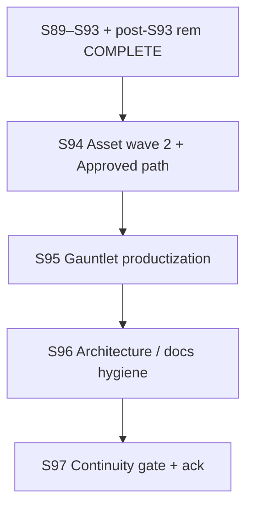

# S94–S97 Release Continuity — Local + Cloud Agent Execution Plan

> **For agentic workers:** REQUIRED SUB-SKILL: superpowers:subagent-driven-development or superpowers:executing-plans. Per-sprint dispatch via superpowers:dispatching-parallel-agents + using-git-worktrees. Steps use checkbox (`- [ ]`) syntax for tracking. Code tracks: superpowers:test-driven-development (RED → GREEN) when tests change. GitNexus: skill `gitnexus-cli` / `gitnexus-impact-analysis` before CRITICAL hub edits.

**Goal:** Execute the **S94+ Release Continuity** program proposed in the 0714 roadmap — asset wave 2 + Approved path, gauntlet productization, architecture/docs hygiene, program continuity gate — while holding standing engineering floors and **stage Release**. **No Launch advance** without explicit human authorization.

**Architecture:** Serial sprints **S94 → S95 → S96 → S97**; 2–3 parallel tracks within each sprint; local coordinator owns boundary, closeout, merge, and human gates; cloud agents handle docs/assets/gauntlet-expect tracks.

**Tech Stack:** .NET 8, Graphite (`gt`), GitNexus CLI (`node .gitnexus/run.cjs` with `--repo /home/username01/cmano-clone` when multi-repo indexed), headless Play Mode harness, `/qa-gauntlet` oracle path.

**Naming note:** This file uses OBJECTIVE basename `roadmap-execution-plan-071426.md` (date token `071426`). Historical series uses `roadmap-execute-plan-MMDDYYYY.md` (e.g. `roadmap-execute-plan-07092026.md`). Do not mass-rename historical files.

**Primary authority:** [`future-sprint-roadmap-07142026.md`](future-sprint-roadmap-07142026.md) (§0–§10).  
**Supporting authority:**  
[`post-s93-concerns-remediation-closeout-2026-07-14.md`](../../production/gate-checks/post-s93-concerns-remediation-closeout-2026-07-14.md) ·  
[`post-s93-project-release-hold-gate-2026-07-14.md`](../../production/gate-checks/post-s93-project-release-hold-gate-2026-07-14.md) ·  
[`critical-hub-merge-playbook-2026-07-14.md`](../../production/agentic/critical-hub-merge-playbook-2026-07-14.md) ·  
[`architecture-review-post-s93-2026-07-14.md`](../architecture/architecture-review-post-s93-2026-07-14.md) ·  
[`design/assets/asset-manifest.md`](../../design/assets/asset-manifest.md) ·  
[`local-cloud-agent-routing.md`](../../production/agentic/local-cloud-agent-routing.md)

---

## 1. Executive summary

| Dimension | Value |
|-----------|-------|
| **Sprint count** | **4** (S94–S97) proposed |
| **Program** | Release continuity (post–S93 + gauntlet land) |
| **Prior programs (closed)** | S89–S92 hygiene **COMPLETE**; S93 asset wave **COMPLETE**; post-S93 Tracks A–C **COMPLETE**; Launch Track D **not opened** |
| **Test baseline @ S94 start** | **≥1638 pass / 0 failed** (last gate evidence post-gauntlet land); ReplayGolden **6/6**, C2 **≥20/20** |
| **Max parallel agents per sprint** | **3 effective tracks** |
| **Critical path** | S94 → S95 → S96 → S97 |
| **Stage** | **Release** throughout — S97 ack is **not** Launch |

**Verification inputs @ plan authoring (from 0714 roadmap / last gate evidence — not re-run here):**

| Gate | Value |
|------|-------|
| Build | **0e/0w** (last gate family) |
| Full suite | **1638/0f** (Sim 314 + Del 260 + UA 310 + Excel 24 + Data 623 + Cli 107) |
| ReplayGolden | **6/6** |
| C2 proxy | **≥20/20** |
| Hash | **`17144800277401907079`** (18 paths) |
| DelegationBridge | **ZERO** hotpath |
| CatalogWriteGate | **extend-only** |
| GitNexus (2026-07-14) | **25,311 / 48,462 / 439 / 300** @ `257d9e9` fresh |
| CRITICAL hubs | ScenarioDocumentEditor **233**, CatalogWriteGate **186**, DelegationBridge **142**, PatrolCandidateEngagePolicy **111**, BalticReplayHarness **62** |

Evidence pointers: `production/qa/evidence/gates-gauntlet-land-post-2026-07-14.log`, remediation closeout, roadmap §4–§5.

---

## 2. Program timeline



**Serial rule:** Never run two full sprints in parallel.  
**Parallel rule:** After S*-01 boundary/baseline, dispatch up to cap tracks with isolated worktrees.  
**Prerequisite before S94-01:** User/roadmap approval; GitNexus index fresh @ HEAD; gates RUN+READ at or above §4 floors.

**Program exit criterion (S94–S97):** Asset **Approved** path started; gauntlet norms durable; architecture docs no longer blocking Release narrative; standing floors held — **not** Launch stage, **not** store submission, **not** Baltic reopen.

---

## 3. Per-sprint summary table

| Sprint | Lead | Primary goal | Est. days | Tracks | Key artifacts |
|--------|------|--------------|-----------|--------|---------------|
| **S94** | Assets | Umbrella 001–003 children Specced→Done; formal **Approved** criteria | 4–6 | 3 | Manifest progress; Approved criteria doc; production binaries/stubs as scoped |
| **S95** | QA / Gauntlet | CI-gen expects; defect registry hygiene; optional oracle ADR; max-variance green | 4–6 | 3 | Expect regen tooling/docs; defect registry; optional ADR; smoke evidence |
| **S96** | Architecture | Promote/re-matrix Draft `architecture.md`; ADR freshness; hub playbook in AGENTS | 3–5 | 2 | Updated architecture.md or re-matrix report; AGENTS hub enforcement |
| **S97** | Gate | Program verification + human ack **"release continuity program complete"** | 3–5 | 2 | `production/gate-checks/s97-release-continuity-gate-*.md` |

**Sprint plans (create @ dispatch via `/sprint-plan new` — not pre-created by this execute plan):**

| Sprint | Plan path (target) |
|--------|--------------------|
| S94 | `production/sprints/sprint-94-asset-wave-2.md` |
| S95 | `production/sprints/sprint-95-gauntlet-productization.md` |
| S96 | `production/sprints/sprint-96-architecture-hygiene.md` |
| S97 | `production/sprints/sprint-97-release-continuity-gate.md` |

Optional scope boundary if program is named formally:  
`production/release-continuity-scope-boundary-2026-07-14.md` (create at S94 kickoff if user wants a boundary file).

---

## 4. Standing invariants (hard gates every closeout)

| Invariant | Floor |
|-----------|-------|
| Solution tests | **≥1638 / 0 failed** (monotonic) |
| ReplayGolden | **6/6** |
| C2 proxy | **≥20/20** |
| Baltic production hash | **`17144800277401907079`** (18 paths) |
| DelegationBridge | **ZERO** hotpath edits |
| CatalogWriteGate | **extend-only** |
| Stage | **Release** until explicit Launch authorization |

---

## 5. GitNexus watchlist + preflight

| Symbol | Impact | Risk | Rule |
|--------|--------|------|------|
| `ScenarioDocumentEditor` | **233** | CRITICAL | impact first; prefer CLI/authoring seams |
| `CatalogWriteGate` | **186** | CRITICAL | **extend-only** |
| `DelegationBridge` | **142** | CRITICAL | **ZERO hotpath** |
| `PatrolCandidateEngagePolicy` | **111** | CRITICAL | doctrine seam; lower-bound |
| `BalticReplayHarness` | **62** | CRITICAL | replay + gauntlet; read/test first |

**Before any CRITICAL-symbol edit:**

```bash
cd /home/username01/cmano-clone
node .gitnexus/run.cjs status
# if stale:
node .gitnexus/run.cjs analyze
node .gitnexus/run.cjs impact <Symbol> --direction upstream --summary-only --repo /home/username01/cmano-clone
```

Playbook: [`critical-hub-merge-playbook-2026-07-14.md`](../../production/agentic/critical-hub-merge-playbook-2026-07-14.md).

---

## 6. Per-sprint track plans

Worktree root: `/home/username01/cmano-clone/.worktrees/`  
Stack workflow: Graphite — `gt create`, `gt submit --stack --no-interactive`, `gt sync`, `gt restack`  
Prefer ordered **cherry-pick** over whole-branch merge when dual histories diverge (gauntlet land pattern).

### S94 — Asset wave 2 + Approved path

| Track | Stack prefix | Agent env | Stories |
|-------|--------------|-----------|---------|
| C2 umbrella children (001) | `stack/sprint94/asset-c2` | Cloud | S94-01 |
| Baltic + store children (002–003) | `stack/sprint94/asset-baltic-store` | Cloud | S94-02 |
| Approved criteria + closeout | `stack/sprint94/closeout` | **Local** | S94-03 |

**Primary deliverables:** Move Specced children under umbrellas toward **Done**; publish formal **Approved** criteria (not stub-only Done); update `design/assets/asset-manifest.md`.  
**Out of S94:** Addressables bulk import; store upload; Unity Editor PNG pack (no host).

### S95 — Gauntlet productization

| Track | Stack prefix | Agent env | Stories |
|-------|--------------|-----------|---------|
| Expect regen / CI discipline | `stack/sprint95/gauntlet-expects` | Cloud | S95-01 |
| Defect registry + residual risks | `stack/sprint95/gauntlet-defects` | Cloud | S95-02 |
| Closeout + max-variance smoke | `stack/sprint95/closeout` | **Local** | S95-03 |

**Primary deliverables:** CI-gen expects at tier ticks (reduce recalibration drift); registry hygiene (`gauntlet-defect-registry.json`); optional oracle fingerprint ADR; hold **≥1638** + max-variance family green.  
**Hub caution:** `BalticReplayHarness` **62 CRITICAL** — impact before harness edits.

### S96 — Architecture / docs hygiene

| Track | Stack prefix | Agent env | Stories |
|-------|--------------|-----------|---------|
| Architecture promote / re-matrix | `stack/sprint96/arch-docs` | Cloud | S96-01 |
| AGENTS hub playbook + closeout | `stack/sprint96/closeout` | **Local** | S96-02 |

**Primary deliverables:** Advance Draft `architecture.md` (or published re-matrix vs post-editor + PE + gauntlet); ADR freshness notes; enforce CRITICAL hub playbook references in AGENTS/control docs.  
**Not S96:** Full Launch packaging; commercial store checklist.

### S97 — Release continuity gate

| Track | Stack prefix | Agent env | Stories |
|-------|--------------|-----------|---------|
| Gate verification | `stack/sprint97/gate` | **Local** | S97-01 |
| Human ack package | `stack/sprint97/closeout` | **Local** | S97-02 |

**Primary deliverables:** Program gate doc; RUN+READ floors; GitNexus fresh; human ack template; stage remains **Release**.

---

## 7. Phase 0 — Prereqs (prior complete / before S94)

### Already complete (do not re-open)

- [x] S89–S92 post-editor hygiene + human ack — 2026-07-09
- [x] S93 asset production closeout — 2026-07-09
- [x] Post-S93 Release-hold gate + Tracks A–C remediation — 2026-07-14
- [x] Gauntlet land on Release program branch; suite floor **1638/0f**
- [x] GitNexus re-analyze @ `257d9e9` — 2026-07-14
- [x] Roadmap snapshot [`future-sprint-roadmap-07142026.md`](future-sprint-roadmap-07142026.md) + alias Current

### Before first S94 track dispatch

- [x] User approves 0714 roadmap / this execute plan (collaboration protocol) — **2026-07-14**
- [x] `/sprint-plan new` for **S94 only** (not S95–S97 yet) — `sprint-94-asset-wave-2.md`
- [x] Publish `production/sprints/sprint-94-asset-wave-2.md` (+ optional scope boundary)
- [x] QA plan `production/qa/qa-plan-sprint-94-*.md` + parallel kickoff
- [x] GitNexus pre: skipped (assets/docs only; no CRITICAL C# touch) — note 2026-07-14
- [x] Gates RUN+READ: assets-only; cite last gate evidence **≥1638/0f** (gates-gauntlet-land-post-2026-07-14.log)
- [x] Dispatch S94-01 ∥ S94-02; then S94-03 closeout — 2026-07-14

---

## 8. Merge gate protocol (every sprint close)

1. All tracks `gt submit` their stacks.
2. Closeout track runs `gt restack` on trunk `main`.
3. Verify: `dotnet build ProjectAegis.sln && dotnet test ProjectAegis.sln -v minimal`.
4. Hard gates pass (**≥1638/0f**, Replay **6/6**, C2 **≥20/20**, hash preserved, ZERO bridge, CatalogWriteGate extend-only) → merge.
5. GitNexus re-index after merge (`node .gitnexus/run.cjs analyze` on absolute repo path).
6. Update `sprint-status.yaml` + closeout smoke (`production/qa/smoke-sprint-N-closeout-*.md`).

---

## 9. Detailed checkbox dispatch (S94 first)

### S94-01 — C2 umbrella children (Cloud)

- [x] Worktree: `.worktrees/stack/sprint94/asset-c2` (same-tree parallel OK)
- [x] Read `design/assets/specs/c2-ui-assets.md` + manifest rows for ASSET-001 children still Specced
- [x] Produce next-wave Done artifacts under `production/assets/c2/` as scoped in sprint plan (placeholders OK if quality bar documented)
- [x] Update manifest Specced→Done for completed children only (honest status)
- [x] No Addressables bulk; no C# hotpath; no Launch docs
- [x] `gt submit` stack — deferred (local same-tree land; optional Graphite later)

### S94-02 — Baltic + store umbrella children (Cloud)

- [x] Worktree: `.worktrees/stack/sprint94/asset-baltic-store` (same-tree parallel OK)
- [x] Read `baltic-patrol-assets.md` + `store-capsule-assets.md` + manifest ASSET-002/003 children
- [x] Produce scoped Done artifacts under `production/assets/baltic/` and `production/assets/store/`
- [x] Update manifest honestly
- [x] No store upload / commercial submit
- [x] `gt submit` stack — deferred (local same-tree land; optional Graphite later)

### S94-03 — Approved criteria + closeout (Local)

- [x] Define formal **Approved** criteria doc (e.g. `design/assets/approved-criteria-2026-07-14.md` or sprint-owned path): what elevates Done→Approved
- [x] Restack / merge S94 tracks after gates — same-tree parallel land
- [x] RUN+READ floors ≥1638 family cited (assets-only; no C#); GitNexus re-index not required for stubs
- [x] Smoke closeout `production/qa/smoke-sprint-94-closeout-*.md`
- [x] Sprint-status.yaml S94 complete

### S95–S97 (high-level checkboxes — expand at sprint-plan time)

**S95**

- [x] `/sprint-plan new` for S95 only after S94 closeout — `sprint-95-gauntlet-productization.md`
- [x] Expect regen / CI discipline track — `gauntlet-expect-ci-discipline-2026-07-14.md` + `tools/qa-gauntlet/README-expect-regen.md`
- [x] Defect registry hygiene track — residuals watched; closed IDs retained
- [x] Max-variance / oracle smoke on closeout; suite **≥1638/0f** — cited last-gate + max-variance family green
- [ ] Optional oracle ADR only if product asks — **deferred** (not requested this run)

**S96**

- [x] `/sprint-plan new` for S96 after S95 — `sprint-96-architecture-hygiene.md`
- [x] Architecture.md promote or re-matrix vs post-S93 review — Living draft 2026-07-15 + `architecture-re-matrix-post-s93-s96-2026-07-15.md`
- [x] AGENTS / control docs cite hub playbook — CRITICAL hub merge playbook subsection
- [x] Closeout with floors held — smoke-sprint-96-closeout-2026-07-15.md; ≥1638 cited

**S97**

- [x] Gate verification RUN+READ + GitNexus fresh — floors **≥1638** cited; GitNexus ✅ up-to-date @ `257d9e9` (2026-07-15)
- [x] Gate doc under `production/gate-checks/s97-release-continuity-gate-*.md` — `s97-release-continuity-gate-2026-07-15.md`
- [x] Human ack package — `production/agentic/s97-human-ack-package-2026-07-15.md` (**HUMAN ACK PROVIDED** **"i acknowledge"** 2026-07-16; program **"release continuity program complete"**; stage Release; Launch No)
- [x] Stage still **Release** — no Launch advance

---

## 10. Human ack (S97 template)

```
I provide the ack for "release continuity program complete" (S94–S97).
Stage remains Release. Launch / commercial execution remains deferred.
```

**Recorded:** **HUMAN ACK PROVIDED** — phrase **"i acknowledge"** on **2026-07-16**, bound to **"release continuity program complete"** (S94–S97). Stage remains **Release**. Launch authorized: **No**.

**Not this ack:** Launch stage advance; E7 store submission; commercial-launch-execution-gate execution.

---

## 11. Explicit non-goals / out of scope

Matches 0714 roadmap §3 / §10:

| Out of scope | Notes |
|--------------|--------|
| Launch stage advance | Requires separate human decision + commercial gate |
| E7 commercial / store submission | Stub gate only until authorized |
| ME Phase 2 GUI / WYSIWYG platform editor | Deferred product tracks |
| `DelegationBridge` hotpath rewrites | ZERO touch |
| Hash change without ADR | Forbidden |
| Addressables bulk import | Design spike only if explicitly scoped |
| Baltic corpus reopen | Frozen hash held |
| Editor PNG pack | Deferred until Unity Editor host available |

---

## 12. References

| Doc | Path |
|-----|------|
| Forward roadmap (primary) | `docs/reports/future-sprint-roadmap-07142026.md` |
| Prior execute plan (pattern) | `docs/reports/roadmap-execute-plan-07092026.md` |
| Post-S93 remediation closeout | `production/gate-checks/post-s93-concerns-remediation-closeout-2026-07-14.md` |
| Post-S93 Release-hold gate | `production/gate-checks/post-s93-project-release-hold-gate-2026-07-14.md` |
| CRITICAL hub playbook | `production/agentic/critical-hub-merge-playbook-2026-07-14.md` |
| Architecture review | `docs/architecture/architecture-review-post-s93-2026-07-14.md` |
| Asset manifest | `design/assets/asset-manifest.md` |
| Gauntlet land plan | `production/qa/gauntlet-stack-land-plan-2026-07-14.md` |
| Commercial Launch (stub) | `production/gate-checks/commercial-launch-execution-gate-TBD.md` |

---

## 13. Stage rule (non-negotiable)

**Stage remains Release.**  
This execution plan, the 0714 roadmap, S93 closeout, and post-S93 remediation **do not** authorize Launch.  
Launch requires: explicit human decision + executable commercial gate + checklist package.

---

**End of roadmap-execution-plan-071426.md.**  
Authority: `future-sprint-roadmap-07142026.md`. Serial S94→S97; floors **≥1638**; hubs CRITICAL; stage **Release**.  
Next human action: approve plan → `/sprint-plan new` for **S94 only**.

<!-- workspace: cmano-clone/docs/reports (harness tree) -->
