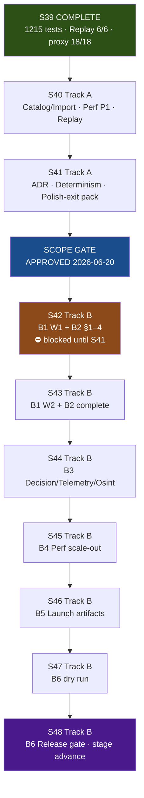

# S40–S48 Local + Cloud Agent Execution Plan — Project Aegis

**Date:** 2026-06-20  
**Repo:** `/home/username01/cmano-clone/cmano-clone`  
**Program:** 9 sprints (S40–S48) on the 10-sprint release train (S39 COMPLETE)  
**Authority:** [`future-sprint-roadpmap.md`](future-sprint-roadpmap.md) §9, [`s39-s48-program-execution-guide.md`](../production/agentic/s39-s48-program-execution-guide.md), [`local-cloud-agent-routing.md`](../production/agentic/local-cloud-agent-routing.md), [`s39-s48-worktree-manifest.md`](../production/agentic/s39-s48-worktree-manifest.md)

---

## 1. Executive summary

This plan coordinates **9 serial sprints (S40–S48)** using **local Cursor agents** (Editor evidence, Catalog lead, closeout) and **Cloud Agents** (headless .NET 8 build/test, hygiene, perf, replay, docs). **Sprints run serially**; **tracks within each sprint run in parallel waves** after baseline + QA prereqs.

| Dimension | Value |
|-----------|-------|
| **Sprint count** | **9** (S40–S48) |
| **Track A (Polish)** | S40–S41 — in-boundary; cites `polish-scope-boundary-2026-06-19.md` |
| **Track B (Release Enablement)** | S42–S48 — cites `release-enablement-scope-boundary-2026-06-20.md` |
| **Scope gate** | **APPROVED** 2026-06-20 — [`scope-expansion-decision-2026-06-20.md`](../production/gate-checks/scope-expansion-decision-2026-06-20.md) |
| **S42 blocker** | **S41 closeout PASS** (Polish-exit pack + S41 ADR) — gate approved but dispatch blocked |
| **Test baseline @ S40 start** | **1215/1215** (S39 closeout); monotonic growth thereafter |
| **Max parallel agents per sprint** | **4–6 effective tracks** (local ≤6, cloud ≤5; combined cap per routing matrix) |
| **Critical path to S48** | S40 → S41 → S42 → S43 → S44 → S45 → S46 → S47 → S48 |
| **Est. calendar (S40–S48)** | **~72–94 days** (~14–19 weeks) with parallel tracks inside each sprint |

**Coordinator model:** One local **producer/coordinator** owns merge order, shared files, closeout, and human gates. Cloud agents execute isolated stack branches; local agents own Catalog cluster, Editor PNG evidence, and final merges.

---

## 2. Program timeline



**Serial rule:** Never run two full sprints in parallel. **Parallel rule:** After S*-01 + S*-02, dispatch up to cap tracks with isolated worktrees.

---

## 3. Per-sprint summary table

| Sprint | Track | Primary goal | Est. days | Max parallel (local / cloud) | Tracks | Key modules / artifacts |
|--------|-------|--------------|-----------|------------------------------|--------|-------------------------|
| **S40** | A | Catalog/Import read-model surfacing; perf P1 burn-down; replay maint | 8–10 | **2 local / 3 cloud** (cap **4**) | 6 | `Catalog`, `Projection`, `Import`; perf baseline appendix |
| **S41** | A | Structural-debt ADR (read-only); determinism audit; Polish-exit pack; gap analysis | 8–10 | **2 local / 4 cloud** (cap **4**) | 5 | `Decision`, `Telemetry`, `Osint` (ADR only); gate-checks packet |
| **S42** | B | B1 wave 1 (Req 02,06,12,13,16,21); art bible §1–4; gate matrix | 10–12 | **2 local / 4 cloud** (cap **5**) | 5 | `Catalog`, `Platform`, `Scenario`; `design/art/art-bible.md` |
| **S43** | B | B1 wave 2 (Req 03,04,14–19); art bible §5–9 + asset specs | 10–12 | **2 local / 4 cloud** (cap **5**) | 5 | `Engage`, `Sensors`, C2 UI; full art bible |
| **S44** | B | B3 Decision/Telemetry refactor; Osint audit; replay gate | 10–14 | **2 local / 3 cloud** (cap **4**) | 5 | `Decision`, `Telemetry`, `Osint` |
| **S45** | B | B4 Runtime/Sensors/Engage scale-out; perf budgets; DOTS pilot | 10–14 | **2 local / 4 cloud** (cap **5**) | 5 | `Runtime`, `Sensors`, `Engage`, `ProjectAegis.Sim` |
| **S46** | B | B5 release checklist, store pages, i18n pipeline, launch docs | 8–10 | **1 local / 4 cloud** (cap **5**) | 5 | `production/release/` (new) |
| **S47** | B | B6 prep: full test sweep, gate-check draft, CI preflight, Go/No-Go | 5–7 | **2 local / 2 cloud** (cap **4**) | 5 | `production/gate-checks/`, Buildkite |
| **S48** | B | B6 `/gate-check` Polish→Release; stage advance; program retro | 3–5 | **1–2 local** (serial) | 2 | `production/stage.txt`, final gate-check |

**Sprint plans:** `production/sprints/sprint-NN-*.md`  
**Kickoffs:** `production/agentic/sprint-NN-parallel-kickoff-2026-06-20.md`

---

## 4. Per-sprint track plans

Worktree root: `/home/username01/cmano-clone/.worktrees/`  
Stack workflow: Graphite — `gt create`, `gt submit --stack --no-interactive`, `gt sync`, `gt restack`

### S40 — Deeper Polish (Track A)

| Track | Stack prefix | Worktree path | Agent env | Stories | Owner |
|-------|--------------|---------------|-----------|---------|-------|
| Catalog/Import surfacing | `stack/sprint40/catalog-import-projection` | `.worktrees/sprint40-catalog-import` | **Local lead (1 agent only)** | S40-03 | team-data |
| Perf P1 burn-down | `stack/sprint40/perf-p1` | `.worktrees/sprint40-perf-p1` | Cloud | S40-04 | team-simulation |
| Replay maint | `stack/sprint40/replay-maint` | `.worktrees/sprint40-replay-maint` | Cloud | S40-05 | team-simulation |
| Evidence / playtest 12 | `stack/sprint40/evidence` | `.worktrees/sprint40-evidence` | **Local** | S40-07 | team-qa + team-unity |
| Hygiene / coord | `stack/sprint40/hygiene` | `.worktrees/sprint40-hygiene` | Cloud | S40-08 | coordinator |
| Closeout | `stack/sprint40/closeout` | `.worktrees/sprint40-closeout` | **Local** | S40-06 | c-sharp-devops-engineer |

**Wave order:** S40-01 → S40-02 → (W1 Catalog ∥ W2 Perf ∥ W3 Replay) → W4 Evidence ∥ W5 Hygiene → W6 Closeout

### S41 — Polish exit (Track A)

| Track | Stack prefix | Worktree path | Agent env | Stories | Owner |
|-------|--------------|---------------|-----------|---------|-------|
| ADR (read-only) | `stack/sprint41/adr-decision-telemetry` | `.worktrees/sprint41-adr-decision-telemetry` | Cloud | S41-03 | c-sharp-architect |
| Determinism audit | `stack/sprint41/determinism-audit` | `.worktrees/sprint41-determinism-audit` | Cloud | S41-04 | determinism-engineer |
| Evidence pack | `stack/sprint41/evidence-pack` | `.worktrees/sprint41-evidence-pack` | Local + Cloud | S41-05 | team-qa |
| Gap analysis | `stack/sprint41/gap-analysis` | `.worktrees/sprint41-gap-analysis` | Cloud | S41-07 | requirements-analyst |
| Closeout + scope packet | `stack/sprint41/closeout` | `.worktrees/sprint41-closeout` | **Local** | S41-06, S41-08 | coordinator |

**Wave order:** S41-01 → S41-02 → (W1 ADR ∥ W2 Determinism ∥ W3 Evidence ∥ W4 Gap) → W5 Closeout

### S42 — Release kickoff (Track B) ⛔ after S41 closeout

| Track | Stack prefix | Worktree path | Agent env | Stories | Owner |
|-------|--------------|---------------|-----------|---------|-------|
| Content Catalog/Platform | `stack/sprint42/content-catalog-platform` | `.worktrees/sprint42-content-catalog-platform` | **Local lead** | S42-03 | team-data |
| Content Scenario | `stack/sprint42/content-scenario` | `.worktrees/sprint42-content-scenario` | Cloud | S42-04 | team-simulation |
| Art bible §1–4 | `stack/sprint42/art-bible-1-4` | `.worktrees/sprint42-art-bible-1-4` | Cloud | S42-05 | art-director |
| Baseline + QA | `stack/sprint42/baseline-qa` | `.worktrees/sprint42-baseline-qa` | Cloud | S42-01, S42-02 | c-sharp-devops + team-qa |
| Closeout | `stack/sprint42/closeout` | `.worktrees/sprint42-closeout` | **Local** | S42-06 | c-sharp-devops-engineer |

### S43 — Content wave 2 + art bible complete (Track B)

| Track | Stack prefix | Worktree path | Agent env | Stories | Owner |
|-------|--------------|---------------|-----------|---------|-------|
| Content Engage | `stack/sprint43/content-engage` | `.worktrees/sprint43-content-engage` | Cloud + determinism | S43-03 | gameplay-programmer |
| Content remainder | `stack/sprint43/content-remainder` | `.worktrees/sprint43-content-remainder` | Cloud | S43-04 | team-data |
| Art bible §5–9 | `stack/sprint43/art-bible-complete` | `.worktrees/sprint43-art-bible-complete` | Cloud | S43-05 | art-director |
| Evidence | `stack/sprint43/evidence` | `.worktrees/sprint43-evidence` | **Local** | S43-07 | team-qa |
| Closeout | `stack/sprint43/closeout` | `.worktrees/sprint43-closeout` | **Local** | S43-06 | c-sharp-devops-engineer |

### S44 — Structural debt (Track B)

| Track | Stack prefix | Worktree path | Agent env | Stories | Owner |
|-------|--------------|---------------|-----------|---------|-------|
| Decision refactor | `stack/sprint44/decision-refactor` | `.worktrees/sprint44-decision-refactor` | **Local lead** | S44-02 | c-sharp-engineer |
| Telemetry refactor | `stack/sprint44/telemetry-refactor` | `.worktrees/sprint44-telemetry-refactor` | Local/Cloud | S44-03 | c-sharp-engineer |
| Osint audit | `stack/sprint44/osint-audit` | `.worktrees/sprint44-osint-audit` | Cloud | S44-04 | team-data |
| Replay gate | `stack/sprint44/replay-gate` | `.worktrees/sprint44-replay-gate` | Cloud | S44-05 | determinism-engineer |
| Closeout | `stack/sprint44/closeout` | `.worktrees/sprint44-closeout` | **Local** | S44-06 | c-sharp-devops-engineer |

### S45 — Performance scale-out (Track B)

| Track | Stack prefix | Worktree path | Agent env | Stories | Owner |
|-------|--------------|---------------|-----------|---------|-------|
| Runtime/Sensors | `stack/sprint45/runtime-sensors` | `.worktrees/sprint45-runtime-sensors` | **Local lead** | S45-02 | unity-dots-specialist |
| Engage scale | `stack/sprint45/engage-scale` | `.worktrees/sprint45-engage-scale` | Cloud + determinism | S45-03 | gameplay-programmer |
| Perf profile | `stack/sprint45/perf-profile` | `.worktrees/sprint45-perf-profile` | Cloud | S45-04 | performance-analyst |
| Replay | `stack/sprint45/replay` | `.worktrees/sprint45-replay` | Cloud | S45-05 | determinism-engineer |
| Closeout | `stack/sprint45/closeout` | `.worktrees/sprint45-closeout` | **Local** | S45-06 | c-sharp-devops-engineer |

### S46 — Launch artifacts (Track B)

| Track | Stack prefix | Worktree path | Agent env | Stories | Owner |
|-------|--------------|---------------|-----------|---------|-------|
| Release checklist | `stack/sprint46/release-checklist` | `.worktrees/sprint46-release-checklist` | Cloud | S46-02 | release-manager |
| Store pages | `stack/sprint46/store-pages` | `.worktrees/sprint46-store-pages` | Cloud | S46-03 | community-manager |
| i18n pipeline | `stack/sprint46/i18n-pipeline` | `.worktrees/sprint46-i18n-pipeline` | Cloud | S46-04 | localization-lead |
| Launch docs | `stack/sprint46/launch-docs` | `.worktrees/sprint46-launch-docs` | Cloud | S46-05 | technical-writer |
| Closeout | `stack/sprint46/closeout` | `.worktrees/sprint46-closeout` | **Local** | S46-06 | coordinator |

### S47 — Release dry run (Track B)

| Track | Stack prefix | Worktree path | Agent env | Stories | Owner |
|-------|--------------|---------------|-----------|---------|-------|
| Test + smoke | `stack/sprint47/test-smoke` | `.worktrees/sprint47-test-smoke` | Cloud | S47-01 | c-sharp-devops-engineer |
| Gate-check draft | `stack/sprint47/gate-check` | `.worktrees/sprint47-gate-check` | **Local** | S47-02 | coordinator |
| CI preflight | `stack/sprint47/ci-preflight` | `.worktrees/sprint47-ci-preflight` | Cloud | S47-03 | buildkite-ci-lead |
| Evidence | `stack/sprint47/evidence` | `.worktrees/sprint47-evidence` | **Local** | S47-04 | team-qa |
| Closeout | `stack/sprint47/closeout` | `.worktrees/sprint47-closeout` | **Local** | S47-05 | release-manager |

### S48 — Release gate (Track B) — serial

| Step | Stack prefix | Worktree path | Agent env | Stories | Owner |
|------|--------------|---------------|-----------|---------|-------|
| Verification | `stack/sprint48/verification` | `.worktrees/sprint48-verification` | Cloud OK | S48-01, S48-03 | c-sharp-devops-engineer |
| Gate-check | `stack/sprint48/gate-check` | `.worktrees/sprint48-gate-check` | **Local** | S48-02 | coordinator + technical-director |
| Closeout | `stack/sprint48/closeout` | `.worktrees/sprint48-closeout` | **Local** | S48-04, S48-05 | producer + coordinator |

---

## 5. Orchestration model

### Phase diagram

```
Prereqs (serial)  →  Parallel waves  →  Merge stack  →  Closeout (local)
     S*-01              S*-03..N         gt restack         S*-06
     S*-02 (QA)         isolated WT      baseline first     smoke/retro
```

### Coordinator playbook (every sprint)

1. **Confirm prereqs:** Sprint plan + kickoff exist; prior sprint closeout smoke PASS.
2. **Serial day-1:** Dispatch S*-01 (baseline) — blocks all. Verify `dotnet build`, `dotnet test ProjectAegis.sln`, ReplayGolden 6/6, PlayModeSmokeHarnessTests 18/18+.
3. **Serial W0:** Dispatch S*-02 (QA plan) — blocks feature waves. QA plan must cite correct boundary doc.
4. **Bootstrap worktrees:** One worktree + `stack/sprintNN/<slug>` branch per track ([`s39-s48-worktree-manifest.md`](../production/agentic/s39-s48-worktree-manifest.md)).
5. **Assign routing:** Local vs cloud per [`local-cloud-agent-routing.md`](../production/agentic/local-cloud-agent-routing.md) and §6 below.
6. **Dispatch waves:** One agent per track; paste kickoff + file-ownership matrix into agent context; cite boundary + story IDs.
7. **Per-track verify before merge:**
   ```bash
   dotnet build ProjectAegis.sln
   dotnet test ProjectAegis.sln -v minimal
   dotnet test src/ProjectAegis.Delegation.UnityAdapter.Tests/ProjectAegis.Delegation.UnityAdapter.Tests.csproj --filter ReplayGoldenSuiteTests
   dotnet test src/ProjectAegis.Delegation.UnityAdapter.Tests/ProjectAegis.Delegation.UnityAdapter.Tests.csproj --filter PlayModeSmokeHarnessTests
   ```
8. **GitNexus:** `impact()` before symbol edits; `detect_changes()` before commit; block merge on HIGH/CRITICAL without TD review.
9. **Merge order:** baseline/QA → code tracks by dependency (Catalog before Platform overlap) → hygiene → closeout last.
10. **Closeout (local):** smoke doc, retro, `sprint-status.yaml` (coordinator-only), Hindsight retain `[OUTCOME:]` to `dev-cmano-clone`.
11. **Track B pre-flight:** Run [`sprint-42-48-readiness-checklist.md`](../production/agentic/sprint-42-48-readiness-checklist.md) before S42–S48 dispatch.

### Human gates

| Gate | When | Authority |
|------|------|-----------|
| Scope expansion | **DONE** — APPROVED 2026-06-20 | User / creative-director |
| S42 dispatch unblock | After S41 closeout PASS | Coordinator verifies S41 ADR + polish-exit pack |
| S47 Go/No-Go | Before S48 | release-manager + user |
| S48 release verdict | `/gate-check` Polish→Release | **User + technical-director mandatory** |

---

## 6. Local vs cloud matrix

### Track-type defaults (from routing doc)

| Track type | Local | Cloud | Notes |
|------------|-------|-------|-------|
| Baseline + CI + closeout | Primary | OK | Headless .NET 8 on Cloud VMs |
| C2/Platform code + proxy tests | Primary | Primary | Headless proxy is gate |
| Hygiene / docs / coordination | Primary | Primary | No Editor required |
| Perf / replay / determinism | Either | **Primary** | `dotnet test` + `/replay-verify` |
| Live Editor PNG evidence | **Local only** | Defer/proxy | Cloud lacks Unity Editor 6.3 |
| Art bible / UX docs | Either | **Primary** | Markdown/design files |
| Catalog/Import (S40, S42) | **Local lead** | **Careful** | Single owner per Catalog cluster |
| B3 refactor (S44) | **Primary** | Parallel sub-tracks | Split Decision vs Telemetry |
| B4 DOTS/ECS (S45) | **Primary** | Limited | determinism-engineer on sim tracks |
| B5 launch artifacts (S46) | Either | **Primary** | Docs/checklists |
| Release gate (S47–S48) | **Coordinator local** | CI verify | Human sign-off |

### Per-sprint local / cloud split

| Sprint | Local-only tracks | Cloud-eligible tracks | Combined cap |
|--------|-------------------|----------------------|--------------|
| S40 | Catalog (1), Evidence, Closeout | Perf, Replay, Hygiene | **4** |
| S41 | Closeout, Evidence (partial) | ADR, Determinism, Gap analysis | **4** |
| S42 | Catalog/Platform lead, Closeout | Scenario, Art bible, Baseline/QA | **5** |
| S43 | Evidence, Closeout | Engage, Remainder, Art bible | **5** |
| S44 | Decision lead, Closeout | Telemetry*, Osint, Replay | **4** |
| S45 | Runtime/Sensors lead, Closeout | Engage, Perf profile, Replay | **5** |
| S46 | Closeout | Checklist, Store, i18n, Launch docs | **5** |
| S47 | Gate-check, Evidence, Closeout | Test/smoke, CI preflight | **4** |
| S48 | Gate-check, Closeout | Verification (optional) | **1–2 serial** |

\*Telemetry cloud only if zero shared files with Decision track.

### Dispatch rules (enforced)

1. **Editor evidence** → always local (S40-07, S43-07, S47-04).
2. **Catalog symbol cluster** → one local lead; no cloud split (S40-03, S42-03).
3. **Closeout** → local coordinator merges stacks, writes smoke/retro/sprint-status.
4. **Cloud-eligible** → hygiene, perf, replay, ADR/docs, store/i18n (S41, S46).
5. **S42–S48** → scope gate APPROVED; still blocked until S41 closeout PASS.

---

## 7. File ownership / conflict avoidance

### Shared files — coordinator merge ONLY (never parallel)

| Path | Rule |
|------|------|
| `production/sprint-status.yaml` | Closeout or hygiene track only |
| `production/perf/perf-profile-polish-baseline-*.md` | Perf track append-only |
| `src/ProjectAegis.Delegation.UnityAdapter/Presentation/C2PresentationController.cs` | Single owner per sprint; often frozen |
| `src/ProjectAegis.Delegation/Projection/PlatformCatalogFilterProjection.cs` | Catalog track only when touched |

### Hot paths by sprint

| Sprint | Hot path / owner | Conflict rule |
|--------|------------------|---------------|
| **S40** | `Projection/*Catalog*`, `PlatformCatalogFilterProjection` | **Catalog track only**; mandatory `impact()` |
| **S41** | `docs/adr/*`, `production/gate-checks/*` | **No production `src/**` code** |
| **S42** | `Catalog*`, `Platform*` projections, `data/scenarios/*`, `design/art/art-bible.md` | Catalog = local single agent |
| **S43** | `Engage*`, `data/**`, `art-bible.md`, C2 top bar (Req 03/04) | Engage vs remainder split; expand proxy matrix |
| **S44** | `**/Decision/**`, `**/Telemetry/**`, `**/Osint/**` | **Zero shared files** Decision ↔ Telemetry |
| **S45** | `ProjectAegis.Sim/**`, `Engage*`, `production/perf/*` | determinism-engineer on all sim touches |
| **S46** | `production/release/**` (new tree) | Docs-only; no code overlap |
| **S47** | `production/gate-checks/*`, `.buildkite/**` | CI read-only unless fix approved |
| **S48** | `production/stage.txt`, final gate-check | Serial local coordinator |

### Standing code invariants (all sprints)

- **ZERO** `DelegationBridge.cs` (ADR required if Req 04 badges need bridge)
- **Extend-only** `CatalogWriteGate` (ADR may revoke for specific B1 rows)
- Baltic hash **`17144800277401907079`** immutable unless golden ADR

---

## 8. Standing gates — Polish vs Release boundary

| Gate | S40–S41 (Track A) | S42–S48 (Track B) |
|------|-------------------|-------------------|
| **Boundary doc** | `production/polish-scope-boundary-2026-06-19.md` | `production/release-enablement-scope-boundary-2026-06-20.md` |
| **Scope gate** | N/A (in-boundary) | **APPROVED** — [`scope-expansion-decision-2026-06-20.md`](../production/gate-checks/scope-expansion-decision-2026-06-20.md) |
| **Headless tests** | ≥1215 @ S40 start; no regression | Monotonic; floor = post-S41 closeout baseline |
| **ReplayGolden** | 6/6 | 6/6; **after every B3 merge (S44+)** |
| **C2 proxy** | 18/18+ | 18/18+; expand for Req 03/04 (`DelegationBadge`, `SimulationMode`) |
| **Baltic hash** | Immutable | Immutable unless golden ADR + Producer + TD sign-off |
| **DelegationBridge** | ZERO touch | ZERO default; ADR if Req 04 touches bridge |
| **CatalogWriteGate** | Extend-only | Extend-only unless B1 row + ADR |
| **GitNexus** | `impact()` + `detect_changes()` | HIGH/CRITICAL blocks merge without TD review |
| **Feature scope** | No new features; polish only | 13 committed tracker rows (B1); B2–B6 per boundary |
| **S42 dispatch** | — | Blocked until **S41 closeout PASS** |

**Expanded gate matrix:** S42-01 produces `production/qa/gate-matrix-track-b-2026-06-20.md` (or dated at S42 start).

---

## 9. Risk register (post-approval state)

| ID | Risk | L | I | Mitigation | Owner |
|----|------|---|---|------------|-------|
| R1 | S41 incomplete → S42 blocked indefinitely | Med | Critical | S41 closeout checklist; scope gate already approved | coordinator |
| R2 | Catalog blast radius (S40, S42) | High | Critical | Single local agent; mandatory `impact()`; projection-side | team-data |
| R3 | Decision/Telemetry refactor collision (S44) | Med | High | Zero shared files; GitNexus `rename`; replay after each merge | c-sharp-engineer |
| R4 | Sim perf work breaks determinism (S45) | Med | Critical | determinism-engineer on every sim track; `/replay-verify` | determinism-engineer |
| R5 | Scope creep into deferred Req 05/07/09/10/11/20 | Med | High | Boundary cite + 13-row cap; new decision required | producer |
| R6 | Cloud agent lacks Editor for PNG evidence | Low | Med | Local evidence tracks; proxy-only fallback | team-qa |
| R7 | Merge conflicts on shared coordinator files | Med | Med | Closeout-only edits; merge order enforced | coordinator |
| R8 | GitNexus index stale hides blast radius | Med | Med | Re-index S41-04, S45 closeout, S48-03 | c-sharp-devops |
| R9 | S47 dry run surfaces blockers late | Med | High | Full test sweep + Go/No-Go before S48 | release-manager |
| R10 | Premature Release gate (S48) without human verdict | Low | Critical | Serial S48; user + TD sign-off mandatory | coordinator |
| R11 | B1 not locked before B4 (S45) | Med | High | S43 closeout = B1+B2 exit; checklist gate | producer |
| R12 | DelegationBridge touched for Req 04 badges | Med | High | ADR before edit; presentation via projection first | technical-director |

**Resolved (2026-06-20):** Scope-expansion decision deferred → **APPROVED**. Track B boundary published.

---

## 10. Execution order — week-by-week dispatch sequence

Assumes **~5-day work weeks**, parallel waves inside sprints, start **2026-06-20** (`current_sprint: 40`).

| Week | Dates (approx) | Sprint | Dispatch focus |
|------|----------------|--------|----------------|
| W1 | 2026-06-20 – 06-27 | **S40** | S40-01/02 serial → dispatch Catalog (local), Perf, Replay (cloud) |
| W2 | 2026-06-27 – 07-04 | **S40** | Evidence (local), Hygiene (cloud) → S40-06 closeout smoke |
| W3 | 2026-07-04 – 07-11 | **S41** | S41-01/02 → ADR, Determinism, Evidence, Gap (cloud-heavy) |
| W4 | 2026-07-11 – 07-18 | **S41** | Polish-exit pack + scope packet reconcile → **S41 closeout PASS** |
| W5 | 2026-07-18 – 07-25 | **S42** | **Unblock Track B** — baseline + gate matrix; Catalog/Platform (local), Scenario, Art §1–4 |
| W6 | 2026-07-25 – 08-01 | **S42** | Complete B1 W1 rows; S42 closeout |
| W7 | 2026-08-01 – 08-08 | **S43** | Engage batch + remainder + art bible §5–9 |
| W8 | 2026-08-08 – 08-15 | **S43** | Evidence (local); **B1+B2 exit**; S43 closeout |
| W9 | 2026-08-15 – 08-22 | **S44** | Decision (local), Telemetry, Osint; replay gate ongoing |
| W10 | 2026-08-22 – 08-29 | **S44** | Complete B3 cohesion targets; S44 closeout |
| W11 | 2026-08-29 – 09-05 | **S45** | Runtime/Sensors (local), Engage scale, perf profile |
| W12 | 2026-09-05 – 09-12 | **S45** | Replay verification; GitNexus re-index; S45 closeout |
| W13 | 2026-09-12 – 09-19 | **S46** | Release checklist, store, i18n, launch docs (cloud-heavy) |
| W14 | 2026-09-19 – 09-26 | **S46** | S46 closeout; verify B5 exit |
| W15 | 2026-09-26 – 10-03 | **S47** | Full test sweep, gate-check draft, Buildkite preflight |
| W16 | 2026-10-03 – 10-10 | **S47** | Evidence bundle; **Go/No-Go** (human) |
| W17 | 2026-10-10 – 10-17 | **S48** | Serial: verification → `/gate-check` → stage advance → program retro |

**Target S48 completion:** ~2026-10-17 (±2 weeks buffer on S44–S45).

### Critical path (cannot parallelize across sprints)

```
S40 closeout → S41 closeout (+ ADR) → S42 dispatch unlock → S43 (B1 lock) → S44 (ADR) → S45 (B1 lock) → S46 (B1+B2) → S47 Go → S48 verdict
```

**Longest pole:** S44 (10–14d) + S45 (10–14d) + S43 content (Engage/replay-gated).

---

## 11. Prerequisites checklist — before first S40 agent dispatch

Run this **once** before S40-01; re-verify items marked ⟳ at each sprint boundary.

### Environment & tooling

- [ ] `.NET SDK 8.0.400` on coordinator machine (`dotnet --version`)
- [ ] Cloud Agent VM: `.cursor/cloud-install.sh` green; headless test path verified
- [ ] Graphite CLI (`gt`) available; trunk `main` synced (`gt sync`)
- [ ] GitNexus index @ HEAD — run `node .gitnexus/run.cjs analyze` if stale ⟳
- [ ] Hindsight server optional — `tools/hindsight/Test-HindsightServer.ps1` or GitNexus-only fallback

### Program artifacts (verify exist)

- [x] S39 COMPLETE — smoke [`smoke-sprint-39-closeout-2026-06-20.md`](../production/qa/smoke-sprint-39-closeout-2026-06-20.md)
- [x] Sprint plans S40–S48 under `production/sprints/`
- [x] Parallel kickoffs S40–S48 under `production/agentic/`
- [x] Worktree manifest — [`s39-s48-worktree-manifest.md`](../production/agentic/s39-s48-worktree-manifest.md)
- [x] Local/cloud routing — [`local-cloud-agent-routing.md`](../production/agentic/local-cloud-agent-routing.md)
- [x] Program guide — [`s39-s48-program-execution-guide.md`](../production/agentic/s39-s48-program-execution-guide.md)
- [x] Scope gate APPROVED — [`scope-expansion-decision-2026-06-20.md`](../production/gate-checks/scope-expansion-decision-2026-06-20.md)
- [x] Track B boundary — [`release-enablement-scope-boundary-2026-06-20.md`](../production/release-enablement-scope-boundary-2026-06-20.md)
- [x] Track B readiness checklist — [`sprint-42-48-readiness-checklist.md`](../production/agentic/sprint-42-48-readiness-checklist.md)
- [x] `production/sprint-status.yaml` — `current_sprint: 40`

### S40-specific (before S40-03 dispatch)

- [ ] `/qa-plan sprint 40` → `production/qa/qa-plan-sprint-40-*.md`
- [ ] S40-01 baseline PASS (≥1215 tests, Replay 6/6, proxy 18/18+)
- [ ] Worktrees bootstrapped for S40 tracks (6 worktrees per manifest)
- [ ] Catalog track agent assigned **local single owner**
- [ ] Kickoff pasted to agents: [`sprint-40-parallel-kickoff-2026-06-20.md`](../production/agentic/sprint-40-parallel-kickoff-2026-06-20.md)

### Standing exclusions (never commit)

- `.cursor/hooks/`, `.pi/settings.json`, `.polly/` — local agent tooling only

---

## Related artifacts

| Artifact | Path |
|----------|------|
| Roadmap §9 | [`future-sprint-roadpmap.md`](future-sprint-roadpmap.md) |
| This plan | `docs/reports/s40-s48-local-cloud-agent-execution-plan-2026-06-20.md` |
| Program guide | `production/agentic/s39-s48-program-execution-guide.md` |
| Worktree manifest | `production/agentic/s39-s48-worktree-manifest.md` |
| Local/cloud routing | `production/agentic/local-cloud-agent-routing.md` |
| Track B readiness | `production/agentic/sprint-42-48-readiness-checklist.md` |
| Polish boundary (S40–S41) | `production/polish-scope-boundary-2026-06-19.md` |
| Release boundary (S42–S48) | `production/release-enablement-scope-boundary-2026-06-20.md` |
| Scope decision | `production/gate-checks/scope-expansion-decision-2026-06-20.md` |

---

*Generated 2026-06-20. S39 COMPLETE; S40 executable now; S42–S48 ready after S41 closeout. Do not commit from agent sessions unless user requests.*
