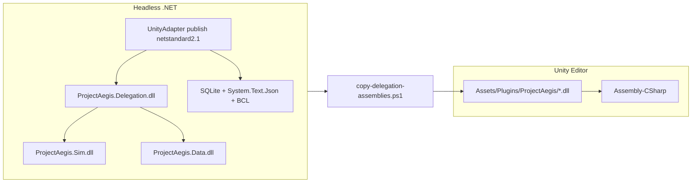

# Fix Unity ProjectAegis.Delegation Compile Errors

> **For agentic workers:** REQUIRED SUB-SKILL: Use superpowers:subagent-driven-development (recommended) or superpowers:executing-plans. Apply superpowers:test-driven-development for guardrail script; verification-before-completion before claiming done. **Orchestration:** spawn `hindsight-dev-memory-lead` per `.claude/skills/hindsight/hindsight-gitnexus/SKILL.md`.

**Goal:** Unity `Assets/Scripts/Runtime/*.cs` compiles with zero errors after plugin assemblies are present; warnings reduced; clone/setup docs match the actual publish path.

**Architecture:** Unity Runtime scripts compile into default `Assembly-CSharp` and reference prebuilt .NET plugin DLLs under `unity/ProjectAegis/Assets/Plugins/ProjectAegis/`. Those DLLs are **gitignored** and must be produced via `tools/copy-delegation-assemblies.ps1`, which `dotnet publish`s `ProjectAegis.Delegation.UnityAdapter` for **netstandard2.1** and copies **all** transitive publish-output DLLs (Delegation, Sim, Data, SQLite, System.Text.Json, etc.).

**Tech Stack:** .NET 8 SDK (build), netstandard2.1 publish output, Unity 6.3 LTS (6000.3.x), UI Toolkit USS/UXML.

---

## GitNexus + Hindsight review (plan iteration)

### GitNexus orient

| Check | Result |
|-------|--------|
| Repo / branch | `main` @ `f7cc82b` (PR #53 merged: netstandard2.1 Unity scaffolding) |
| `gitnexus query` Unity plugin wiring | Hits: `copy-delegation-assemblies.ps1`, `init-unity-project.ps1`, `DelegationBridgeHost`, `SimplePlayModeSimHost`, `PLAYMODE-SMOKE.md` |
| `gitnexus context DelegationBridgeHost` | Outgoing: `DelegationBridge.Session`, `.Phase`; entry `Awake` process |
| `gitnexus impact DelegationBridge` | **HIGH** (40 symbols, 14 direct) — relevant only if editing bridge code; **this plan does not change bridge logic** |
| Index health | FTS indexes missing — run `npx gitnexus analyze --force` if queries degrade |

**Blast radius of planned edits:**

| Symbol / file | Risk | Notes |
|---------------|------|-------|
| `copy-delegation-assemblies.ps1` | LOW | Script not indexed; callers: `init-unity-project.ps1`, `Invoke-DelegationSmokeSceneSetup.ps1` |
| `GlobalUsings.cs` / `csc.rsp` | LOW | Unity Runtime only; no .NET test callers |
| USS files | LOW | Visual only |
| New `Test-UnityPluginAssemblies.ps1` | LOW | New tooling |

### Hindsight recall (session memory)

**Hindsight server:** offline (`localhost:8888` unreachable). Used agent transcript + merged PR instead.

Prior session [Unity Editor setup](f2b9208c-5b28-4a28-85e5-a20ecb30b54e) already debugged this exact error chain:

| Attempt | Outcome |
|---------|---------|
| Copy net8.0 DLLs to Plugins | **FAILED** — Unity CS1705 (net8 vs netstandard2.1 runtime mismatch) |
| Multi-target `netstandard2.1` on Data/Sim/Delegation/UnityAdapter | **SUCCESS** — merged in PR #53 |
| Copy only 4 core DLLs (no transitive deps) | **FAILED** — incomplete dependency chain |
| `dotnet publish` → copy all publish-output DLLs | **Current script** — correct approach |
| `ToolbarToggle` in `C2LeftDrawerPanelHost` | **FAILED** → fixed to `Toggle?` (already on `main`) |
| `ListView.itemsSource` with `IReadOnlyList` | **FAILED** → fixed with `.ToList()` (already on `main`) |
| `GlobalUsings.cs` for `Array.Empty` / collections | **On main** |
| `Assets/csc.rsp` with `-langversion:10` | **On main** — enables nullable `?` without `#nullable` in each file |
| `com.unity.ui` in manifest | **On main** |
| Unity batchmode two-pass import (`Invoke-DelegationSmokeSceneSetup.ps1`) | **Partial** — PR #53 noted plugin chain still needed follow-up |

**Implication for this plan:** User's error list includes `ToolbarToggle` and missing `Delegation` namespaces — likely **stale Console output and/or missing local DLLs after clone**, not missing code fixes. Primary fix remains **restore publish-output DLLs**; do **not** re-litigate netstandard2.1 multi-targeting (already shipped).

### Pre-flight (before Task 1)

- [ ] Confirm branch: `main` includes `f7cc82b` (PR #53)
- [ ] `gitnexus_impact` only if editing `DelegationBridge` or adapter bridge types (not expected here)
- [ ] Hindsight: after completion, `retain` to `dev-cmano-clone` with `[OUTCOME:]` (server must be up)

---

## Root cause (confirmed + refined)

| Symptom | Cause |
|---------|-------|
| CS0234 `ProjectAegis.Delegation` / `Sim` | No `.dll` files in `Assets/Plugins/ProjectAegis/` — only stub `.meta` files (gitignored binaries) |
| CS0246 bridge/projection types | Cascade from missing plugin assemblies |
| CS0246 `ToolbarToggle` | **Already fixed on main** (`Toggle?`); re-run copy + reimport if still shown |
| CS8632 nullable warnings | Unity lacks nullable context; fix via `csc.rsp` (see Task 3) |
| USS `unity-font-style` | Invalid property; use `-unity-font-style` |

**Not the cause:** missing `.asmdef` files; net8.0 TFM (fixed in PR #53).



---

## Task 1: Restore plugin DLLs (primary fix)

**Files:**
- Output: `unity/ProjectAegis/Assets/Plugins/ProjectAegis/*.dll` (gitignored)
- Script: [`tools/copy-delegation-assemblies.ps1`](../../tools/copy-delegation-assemblies.ps1)

- [ ] **Step 1:** Publish and copy (copies **all** transitive DLLs, not just four core assemblies):

```powershell
./tools/copy-delegation-assemblies.ps1
```

- [ ] **Step 2:** Verify DLL count (expect ~15–20 DLLs, not just 4):

```powershell
(Get-ChildItem unity/ProjectAegis/Assets/Plugins/ProjectAegis/*.dll).Count
Get-ChildItem unity/ProjectAegis/Assets/Plugins/ProjectAegis/ProjectAegis*.dll | Select-Object Name
```

Required core names: `ProjectAegis.Data.dll`, `ProjectAegis.Sim.dll`, `ProjectAegis.Delegation.dll`, `ProjectAegis.Delegation.UnityAdapter.dll`.

- [ ] **Step 3:** Unity reimport — open project or **Assets → Refresh**. If plugins still fail to load, delete `unity/ProjectAegis/Library/` once and reopen (last resort).

**If publish fails:** `dotnet build ProjectAegis.sln -c Release` then retry. Do **not** copy `net8.0` bin outputs.

---

## Task 2: Automated Unity compile gate (preferred over manual Console check)

**Files:** [`tools/unity/Invoke-DelegationSmokeSceneSetup.ps1`](../../tools/unity/Invoke-DelegationSmokeSceneSetup.ps1)

Uses two-pass batchmode: (1) import/compile, (2) build `DelegationSmoke.unity`.

- [ ] **Step 1:** Run headless compile + scene scaffold:

```powershell
./tools/unity/Invoke-DelegationSmokeSceneSetup.ps1
```

- [ ] **Step 2:** Expect `SUCCESS: .../Assets/Scenes/DelegationSmoke.unity`. On failure, inspect:
  - `unity-delegation-smoke-setup.log.import` — compile errors
  - `unity-delegation-smoke-setup.log` — scene builder errors

**Requires:** Unity 6000.3.14f1 at `C:\Program Files\Unity\Hub\Editor\6000.3.14f1\Editor\Unity.exe`.

---

## Task 3: Verify headless .NET gate

- [ ] Run from repo root:

```powershell
dotnet build ProjectAegis.sln -c Release
dotnet test ProjectAegis.sln -v minimal
./tools/unity/Invoke-ManualQaHeadlessGate.ps1
```

Proves adapter/delegation/sim wiring independent of Unity Editor.

---

## Task 4: Fix nullable CS8632 warnings (correct approach for Unity)

**Do not** add `#nullable enable` to `GlobalUsings.cs` alone — project already uses [`Assets/csc.rsp`](../../unity/ProjectAegis/Assets/csc.rsp) with `-langversion:10`.

**Files:**
- Modify: [`unity/ProjectAegis/Assets/csc.rsp`](../../unity/ProjectAegis/Assets/csc.rsp)

- [ ] **Step 1:** Add nullable compiler option alongside existing langversion:

```
-langversion:10
-nullable:enable
```

- [ ] **Step 2:** Recompile in Unity — CS8632 on `string?`, `VisualTreeAsset?`, etc. should clear.

Keep [`GlobalUsings.cs`](../../unity/ProjectAegis/Assets/Scripts/Runtime/GlobalUsings.cs) as-is (provides `System.Collections.Generic` for `Array.Empty` / LINQ).

---

## Task 5: Fix USS `unity-font-style` warnings

**Files (5):** `OobTreePanel.uss`, `UnitDetailPanel.uss`, `MapPlaceholderPanel.uss`, `MissionListPanel.uss`, `C2TopBarPanel.uss`

- [ ] Replace `unity-font-style: bold;` → `-unity-font-style: bold;`

---

## Task 6: Pre-flight guardrail script (hardening)

**Files:**
- Create: `tools/Test-UnityPluginAssemblies.ps1`
- Modify: `tools/init-unity-project.ps1`, `tools/unity/Invoke-DelegationSmokeSceneSetup.ps1`, `tools/unity/Invoke-ManualQaHeadlessGate.ps1`
- Modify: [`unity/ProjectAegis/README.md`](../../unity/ProjectAegis/README.md), [`PLAYMODE-SMOKE.md`](../../unity/ProjectAegis/PLAYMODE-SMOKE.md)

**TDD approach:**
- [ ] **RED:** Script exits 1 when `ProjectAegis.Delegation.dll` missing
- [ ] **GREEN:** Script checks core DLLs **and** parses publish `deps.json` for transitive names (SQLite, System.Text.Json, etc.)
- [ ] Wire as first step in all three scripts above (fail fast with message: run `./tools/copy-delegation-assemblies.ps1`)

**Optional CI:** Add copy + guardrail step to [`.github/workflows/unity-ci.yml`](../../.github/workflows/unity-ci.yml) before `game-ci/unity-test-runner` (when `UNITY_LICENSE` secret set).

---

## Task 7: Documentation TFM correction

- [ ] Update README: Unity path is **`dotnet publish` netstandard2.1** via copy script, not manual `net8.0` bin paths
- [ ] PLAYMODE-SMOKE "One-time setup" block:

```powershell
./tools/Test-UnityPluginAssemblies.ps1   # after guardrail exists
./tools/copy-delegation-assemblies.ps1   # if guardrail fails
./tools/unity/Invoke-DelegationSmokeSceneSetup.ps1   # optional automated compile gate
```

- [ ] Cross-link [`docs/architecture/wiring-delegation-sim-2026-05-29.md`](../../docs/architecture/wiring-delegation-sim-2026-05-29.md) Unity scaffold bullet

---

## Task 8: Post-implementation memory + GitNexus verify

- [ ] `npx gitnexus detect_changes --repo cmano-clone` before commit
- [ ] Hindsight `retain` to `dev-cmano-clone`:

```text
[OUTCOME: success|partial|failed] [AREA: Unity]
Symbols: copy-delegation-assemblies.ps1, csc.rsp, Test-UnityPluginAssemblies.ps1
Change: restored netstandard2.1 plugin DLLs; fixed CS8632/USS warnings; added guardrail
Tests: Invoke-ManualQaHeadlessGate.ps1 → pass; Invoke-DelegationSmokeSceneSetup.ps1 → pass/fail
GitNexus risk was: LOW
```

- [ ] **Do not commit** gitignored `.dll` files

---

## Final verification checklist

- [ ] `Test-UnityPluginAssemblies.ps1` passes
- [ ] Unity Console / batchmode import log: **0 CS0234/CS0246**
- [ ] CS8632 cleared; USS warnings cleared
- [ ] `Invoke-ManualQaHeadlessGate.ps1` passes
- [ ] Optional: Play Mode on `DelegationSmoke.unity` per PLAYMODE-SMOKE.md

---

## Risk notes

| Risk | Mitigation |
|------|------------|
| Fresh clone missing DLLs | Guardrail + docs (Tasks 6–7) |
| Copying net8.0 or only 4 DLLs | Publish-all-DLLs script; guardrail checks transitive deps |
| Stale ToolbarToggle errors | Already fixed on main; refresh after DLL restore |
| Hindsight offline | Continue with GitNexus + transcript context; retain when server up |
| Stub `.meta` without PluginImporter | Unity regenerates on first real import; reimport if load fails |

---

## Todos

- [ ] restore-dlls — Run copy script; verify ~15–20 DLLs in Plugins
- [ ] unity-batchmode-verify — Run Invoke-DelegationSmokeSceneSetup.ps1
- [ ] verify-dotnet — build + test + Invoke-ManualQaHeadlessGate.ps1
- [ ] fix-nullable — Add `-nullable:enable` to Assets/csc.rsp (not GlobalUsings)
- [ ] fix-uss — Fix 5 USS files
- [ ] guardrail-script — Test-UnityPluginAssemblies.ps1 + wire into tooling
- [ ] fix-docs — README + PLAYMODE-SMOKE + optional unity-ci.yml
- [ ] memory-verify — gitnexus_detect_changes + hindsight retain
