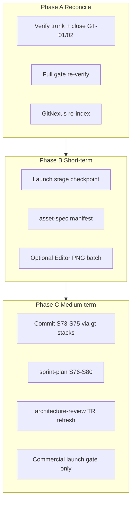

# Post–S72 Dashboard Next Steps Implementation Plan

> **For agentic workers:** REQUIRED SUB-SKILL: Use `superpowers:subagent-driven-development` (recommended) or `superpowers:executing-plans` to implement task-by-task. Steps use checkbox (`- [ ]`) syntax for tracking.

**Goal:** Close out post–S72 integration hygiene from [`docs/reports/dashboard-snapshots/2026-06-25-pm.md`](docs/reports/dashboard-snapshots/2026-06-25-pm.md), refresh tooling/index state, and launch the forward program on Baltic v3 (E9) without retroactive Graphite surgery.

**Architecture:** Three serial phases — **Reconcile & verify** (adapt dashboard items 1–3 to current git reality), **Short-term polish** (stage decision, asset manifest, optional Editor evidence), **Medium-term program** (Baltic v3 commit/submit train, architecture review, commercial launch gate). Graphite-first for all *new* integration; GitNexus + verification-before on every gate.

**Tech Stack:** .NET 8 (`ProjectAegis.sln`), Graphite (`gt`), GitNexus MCP/CLI, Unity headless PlayMode smoke, Superpowers skills (`verification-before-completion`, `using-git-worktrees`, `asset-spec`, `sprint-plan`, `architecture-review`).

---

## Repo-state delta (read before executing)

The dashboard snapshot assumes **GT-01 blocked** (main ahead ~20, S66/S67 payload staged). **Current workspace differs:**

| Dashboard assumption | Current state (2026-06-25 verify) |
|---------------------|-----------------------------------|
| main ahead of origin ~20 | **0 ahead** — synced with `origin/main` |
| S66/S67 ~23 files staged | **No staged payload** — S66/S67/S69–S72 already committed (`869a6e2`, `45e0155`, `b2c9411`) |
| `gt submit` for S70/S71 stacks | **`gt log short` shows only `main`** — S70/S71 docs landed via direct commits, not stack branches |
| GitNexus index @ `28c582d` vs HEAD `b2c9411` | Still stale; plus **untracked S73–S75 Baltic v3 work** on disk |

**Expert direction (no user retroactive stacks):**
- **Close GT-01/02 as resolved** — update status docs; do not recreate S66–S71 Graphite history.
- **Next GT integration target:** Baltic v3 (`stack/sprint73/*` … `stack/sprint75/*`) per [`docs/reports/future-sprint-roadpmap-062526.01.md`](docs/reports/future-sprint-roadpmap-062526.01.md).
- **Forward program:** E9 Baltic v3 (S73–S80), not commercial launch execution (item 9 stays gated).



---

## Standing invariants (every phase)

Run before/after any commit or `gt` operation ([`production/commercial-launch-scope-boundary-2026-06-25.md`](production/commercial-launch-scope-boundary-2026-06-25.md) + [`production/baltic-v3-scope-boundary-2026-06-25.md`](production/baltic-v3-scope-boundary-2026-06-25.md)):

```bash
cd /home/username01/cmano-clone/cmano-clone
export PATH="$HOME/.dotnet:$PATH"

# GitNexus pre (MCP: search_tool schemas, then list_repos + detect_changes + impact on CRITICALs)
# CatalogWriteGate, PatrolCandidateEngagePolicy, DelegationBridge, BalticReplayHarness

dotnet build ProjectAegis.sln --no-restore -v minimal
dotnet test ProjectAegis.sln -v minimal --no-build --no-restore
dotnet test src/ProjectAegis.Delegation.UnityAdapter.Tests/ProjectAegis.Delegation.UnityAdapter.Tests.csproj \
  --no-build -v minimal --filter "FullyQualifiedName~ReplayGoldenSuiteTests"
dotnet test src/ProjectAegis.Delegation.UnityAdapter.Tests/ProjectAegis.Delegation.UnityAdapter.Tests.csproj \
  --no-build -v minimal --filter "FullyQualifiedName~PlayModeSmokeHarnessTests"
grep -r "17144800277401907079" tests/regression/replay-golden-baltic-v2-*.txt | head -3
grep -r "DelegationBridge" --include="*.cs" . | grep -vE 'adapter|UnityAdapter|Bridge' | wc -l
```

**Pass criteria:** 0e build; ≥1232/0f tests; ReplayGolden 6/6; C2 18/18; production Baltic hash preserved; ZERO hotpath DelegationBridge; GitNexus impacts 178/97/127/52 exact.

**Never commit:** `.cursor/hooks/`, `.pi/settings.json`, `.polly/`, `*.log`, stray `re` file.

---

## Phase A — Immediate priority (dashboard items 1–3, adapted)

### Task A1: Close GT-01/02 reconciliation

**Files:**
- Modify: [`production/sprint-status.yaml`](production/sprint-status.yaml) — add `gt_integration:` block marking GT-01/02 **RESOLVED** (trunk synced, S66–S72 on main)
- Modify: [`production/qa/smoke-sprint-66-closeout.md`](production/qa/smoke-sprint-66-closeout.md) — append "RESOLVED 2026-06-25" note (trunk synced; no staged payload)
- Modify: [`production/qa/smoke-sprint-72-closeout-2026-06-25.md`](production/qa/smoke-sprint-72-closeout-2026-06-25.md) — same resolution note
- Modify: [`docs/reports/dashboard-snapshots/2026-06-25-pm.md`](docs/reports/dashboard-snapshots/2026-06-25-pm.md) — **do not edit snapshot body**; optional addendum file `2026-06-25-pm-addendum.md` if live status doc needed

- [ ] **Step 1:** Run `git status`, `gt status`, `gt log short` — capture evidence main == origin, no staged S66 payload
- [ ] **Step 2:** GitNexus pre (list/detect/impact) — document in closeout addendum
- [ ] **Step 3:** Update sprint-status + closeout footers with resolution text citing HEAD `b2c9411`
- [ ] **Step 4:** User approval before commit (collaborative protocol)

**Do NOT:** Recreate `stack/sprint70/*` or `stack/sprint71/*` branches for already-merged docs.

### Task A2: Full gate re-verify (verification-before-completion)

**Skill:** `superpowers:verification-before-completion`

- [ ] **Step 1:** Run full standing-invariant command block; save outputs to `production/qa/evidence/gates-post-s72-integration-2026-06-25.log`
- [ ] **Step 2:** READ every line before any PASS claim in status updates
- [ ] **Step 3:** If any gate fails, invoke `superpowers:systematic-debugging` before proceeding

### Task A3: GitNexus re-index (dashboard item 3 / GN-01)

**Files:** `.gitnexus/` index refresh at HEAD

- [ ] **Step 1:** `node .gitnexus/run.cjs analyze` from repo root (fallback: `npx gitnexus analyze`)
- [ ] **Step 2:** MCP `list_repos` — confirm nodes/edges match HEAD (target: no staleness vs `b2c9411+`)
- [ ] **Step 3:** `detect_changes(scope=unstaged)` — expect medium/high once S73–S75 files exist; cite in status
- [ ] **Step 4:** Update [`AGENTS.md`](AGENTS.md) symbol counts only if user approves (optional hygiene)

---

## Phase B — Short-term (dashboard items 4–6)

### Task B1: Launch stage decision (item 4 / STG-01)

**Default recommendation:** **Stay Release** — S72 ack was prep-complete only ([`production/stage.txt`](production/stage.txt) lines 20–38).

**Files:**
- Modify: [`production/stage.txt`](production/stage.txt) — append decision record (not auto-advance)
- Create (if Launch chosen): `production/gate-checks/launch-stage-decision-2026-06-25.md`

- [ ] **Step 1:** Present user checkpoint: **Stay Release** vs **Advance to Launch**
- [ ] **Step 2a (default):** Append to stage.txt: `"Launch stage decision: deferred; remains Release post-S72 prep ack"`
- [ ] **Step 2b (if user chooses Launch):** Human ack `"i provide the ack"` + update first line of stage.txt to `Launch` + gate doc
- [ ] **Step 3:** Run `/gate-check` or `/milestone-review` skill if advancing

### Task B2: Asset manifest via `/asset-spec` (item 5)

**Skill:** [`.claude/skills/asset-spec/SKILL.md`](.claude/skills/asset-spec/SKILL.md)

**Inputs:**
- [`design/art/art-bible.md`](design/art/art-bible.md)
- [`production/release/store/asset-checklist.md`](production/release/store/asset-checklist.md)
- GDD corpus under `design/gdd/`

**Outputs (expected):**
- `design/assets/entity-inventory.md` (Phase 0b if missing)
- `design/assets/asset-manifest.md` (master manifest — currently **missing**, dashboard gap)
- Per-asset spec stubs under `design/assets/specs/` as skill dictates

- [ ] **Step 1:** Read art bible + asset-checklist + systems-index
- [ ] **Step 2:** Run asset-spec Phase 0b inventory flow with user collaboration (`AskUserQuestion`)
- [ ] **Step 3:** Generate manifest; cross-link S70 capsule/screenshot placeholders
- [ ] **Step 4:** Update [`production/release/release-checklist-v3.md`](production/release/release-checklist-v3.md) asset section with manifest path
- [ ] **Step 5:** GitNexus detect (docs-only; expect low risk) before commit

### Task B3: Live Editor PNG batch (item 6 — optional)

**Skill:** `team-qa` + Unity Editor on Windows/macOS host (not Cloud VM)

- [ ] **Step 1:** Read [`production/release/launch/evidence-index.md`](production/release/launch/evidence-index.md) for capture list
- [ ] **Step 2:** On Editor host: `./tools/init-unity-project.ps1` if needed; capture 5–8 screenshots per asset-checklist
- [ ] **Step 3:** Store under `production/assets/screenshots/` or path in evidence-index; headless 18/18 remains merge authority
- [ ] **Step 4:** Skip entirely if no Editor host — document "advisory deferred" in evidence-index

---

## Phase C — Medium-term (dashboard items 7–9)

### Task C1: Baltic v3 forward program — commit S73–S75 (item 7 primary)

**Authority:**
- [`docs/reports/future-sprint-roadpmap-062526.01.md`](docs/reports/future-sprint-roadpmap-062526.01.md)
- [`docs/reports/roadmap-execute-plan-062526.01.md`](docs/reports/roadmap-execute-plan-062526.01.md)
- [`production/baltic-v3-scope-boundary-2026-06-25.md`](production/baltic-v3-scope-boundary-2026-06-25.md)
- Closeouts: `production/qa/smoke-sprint-73/74/75-closeout-2026-06-25.md`

**Skill:** `superpowers:using-git-worktrees` + `superpowers:dispatching-parallel-agents`

**Untracked work already on disk (organize into stacks, do not commit as one blob):**

| Track | Key paths |
|-------|-----------|
| S73 foundations | boundary refs, manifest prep, re-index notes in closeouts |
| S74 scenarios | `data/scenarios/baltic-v3-*.policy.json`, v3 goldens in `tests/regression/replay-golden-baltic-v3-*` |
| S75 theater | `data/catalog/sensors_baltic.json`, `production/playtests/baltic-v3-scenario-manifest.yaml` |

- [ ] **Step 1:** Invoke `/sprint-plan` **update** mode for S76–S80 skeleton (after S75 lands)
- [ ] **Step 2:** Create worktrees per execute-plan:
  ```bash
  # Example pattern (adjust per sprint-73/74/75 kickoff docs)
  gt create stack/sprint74/scenario-wave
  gt create stack/sprint75/theater-oob
  ```
- [ ] **Step 3:** Stage **scoped payloads only** per closeout lists; exclude logs and tooling config
- [ ] **Step 4:** Per stack: gates RUN+READ → `gt submit --stack --no-interactive`
- [ ] **Step 5:** Closeout track: `gt sync` → `gt restack` → full gates → merge coordinator commit
- [ ] **Step 6:** Re-run Task A3 GitNexus analyze post-merge
- [ ] **Step 7:** Update stable alias [`docs/reports/future-sprint-roadpmap.md`](docs/reports/future-sprint-roadpmap.md) → `062526.01` if not synced

**Hash note:** Production hash `17144800277401907079` stays on v2 path; v3 goldens use `baltic-v3-*` isolated fixtures until S80 promotion ADR.

### Task C2: Architecture review TR refresh (item 8)

**Skill:** [`.claude/skills/architecture-review/SKILL.md`](.claude/skills/architecture-review/SKILL.md) with focus `full` or `rtm`

**Scope surfaces (post S54–S72 + v3):**
- DOTS spawn / MASS tier (S53, ADR-005 path)
- Orbital DEW + Kessler (S54)
- Release-train / Buildkite ops (S67)
- Baltic v2/v3 replay harness seams

**Outputs:**
- New dated review under `docs/architecture/architecture-review-2026-06-25-*.md`
- Update [`docs/architecture/architecture.md`](docs/architecture/architecture.md) status if CONCERNS resolved
- Optional RTM: `docs/architecture/requirements-traceability.md`

- [ ] **Step 1:** Load all ADRs 001–011 + Spirit1 hub ADR
- [ ] **Step 2:** Run traceability matrix vs GDDs + Game Requirements tracker
- [ ] **Step 3:** Produce PASS/CONCERNS/FAIL verdict; file ADR stubs only for blocking gaps
- [ ] **Step 4:** Cross-reference dashboard watchlist symbols (no edits to CRITICAL behavior without impact ack)

### Task C3: Commercial launch execution gate (item 9 — explicitly deferred)

**Do not execute** store submission, locale production, or revenue launch until user expands scope beyond S72 prep ([`production/commercial-launch-scope-boundary-2026-06-25.md`](production/commercial-launch-scope-boundary-2026-06-25.md)).

- [ ] **Step 1:** Create lightweight gate stub `production/gate-checks/commercial-launch-execution-gate-TBD.md` listing prerequisites (Launch stage, asset pipeline >5%, i18n production, store accounts)
- [ ] **Step 2:** Link from [`production/release/release-checklist-v3.md`](production/release/release-checklist-v3.md) as future phase
- [ ] **Step 3:** Stop — await explicit user scope expansion

---

## Execution orchestration (Superpowers)

| Phase | Recommended skill | Parallelism |
|-------|-------------------|-------------|
| A | `executing-plans` | Serial (user ack on doc updates) |
| B2 asset-spec | `asset-spec` + collaborative approval | Serial with user |
| B3 Editor | Local human + `team-qa` | Optional |
| C1 Baltic v3 | `subagent-driven-development` + `using-git-worktrees` | 4–6 tracks per sprint |
| C2 arch review | `architecture-review` | Single technical-director pass |
| All gates | `verification-before-completion` | Before every claim/commit |

**Save this plan to:** [`docs/superpowers/plans/2026-06-25-dashboard-next-steps.md`](docs/superpowers/plans/2026-06-25-dashboard-next-steps.md) on execution start.

**After Phase A completes:** Run `/project-dashboard` to refresh live dashboard and archive new snapshot.

---

## Success criteria

- GT-01/02 documented **RESOLVED**; no phantom "staged S66 payload" blockers
- GitNexus index fresh at HEAD; MCP list_repos shows no staleness
- Full gates PASS with logged evidence
- `design/assets/asset-manifest.md` exists (asset pipeline unblocked)
- Stage decision recorded (default: Release)
- S73–S75 Baltic v3 work committed via Graphite stacks (not loose untracked files on main)
- Architecture review refreshed with dated verdict
- Commercial launch execution remains gated with documented prerequisites
