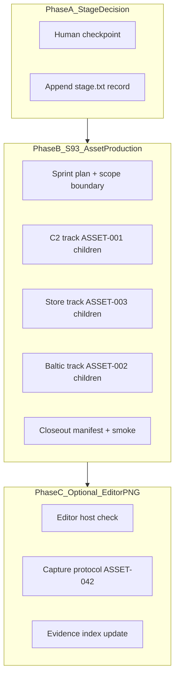

# Short-Term Dashboard Wave Implementation Plan

> **For agentic workers:** REQUIRED SUB-SKILL: Use `superpowers:subagent-driven-development` (recommended) or `superpowers:executing-plans` to implement task-by-task. Steps use checkbox (`- [ ]`) syntax for tracking.

**Goal:** Close dashboard short-term items 4–6 from [`docs/reports/dashboard-snapshots/2026-07-09-am.md`](docs/reports/dashboard-snapshots/2026-07-09-am.md) after S89–S92 completion.

**Architecture:** Three serial phases with human gates — **Stage decision** (docs-only, default defer), **S93 asset production** (parallel worktrees, binary outputs + manifest status), **Editor PNG pack** (optional local Unity track, independent of S93 closeout). Graphite-first for S93 stacks; GitNexus + verification-before on every gate.

**Tech Stack:** .NET 8, Graphite (`gt`), GitNexus MCP/CLI, Unity 6.3 LTS Editor (PNG track only), Superpowers (`brainstorming`, `writing-plans`, `asset-spec`, `using-git-worktrees`, `dispatching-parallel-agents`, `verification-before-completion`).

---

## Repo-state delta (read before executing)

| Dashboard item | Assumption in snapshot | Current truth (2026-07-09) |
|----------------|------------------------|----------------------------|
| Item 5 — asset stubs | ASSET-001…003 are stubs to pick | **S91 COMPLETE** — all three umbrellas **Specced**; manifest **38 Specced / 0 In Production / 0 Done** ([`design/assets/asset-manifest.md`](design/assets/asset-manifest.md)) |
| Item 4 — Launch decision | Optional post-S72 | **Still deferred** — S92 ack was *"post-editor hygiene program complete"*, not Launch ([`production/stage.txt`](production/stage.txt) L123–131) |
| Item 6 — Editor PNG | PE residual | **Explicitly deferred** at PE-W3 ([`production/epics/platform-editor-completion/story-pe-004-w3-presentation.md`](production/epics/platform-editor-completion/story-pe-004-w3-presentation.md)); headless **20/20** remains authority |

**User decision (this session):** Asset wave = **full S93 sprint** (not dashboard text-only closeout).



---

## Standing invariants (every phase)

```bash
cd /home/username01/cmano-clone
export PATH="$HOME/.dotnet:$PATH"

# GitNexus pre: list_repos + detect_changes + impact (summaryOnly) on CRITICALs
# ScenarioDocumentEditor, CatalogWriteGate, DelegationBridge, PatrolCandidateEngagePolicy, BalticReplayHarness

dotnet build ProjectAegis.sln -v minimal
dotnet test ProjectAegis.sln -v minimal
dotnet test src/ProjectAegis.Delegation.UnityAdapter.Tests/ProjectAegis.Delegation.UnityAdapter.Tests.csproj \
  --filter "FullyQualifiedName~ReplayGoldenSuiteTests"
dotnet test src/ProjectAegis.Delegation.UnityAdapter.Tests/ProjectAegis.Delegation.UnityAdapter.Tests.csproj \
  --filter "FullyQualifiedName~PlayModeSmokeHarnessTests"
grep -r "17144800277401907079" tests/ data/ | head -3
```

**Pass criteria:** 0e build; **≥1599/0f**; Replay **6/6**; C2 **≥20/20**; hash preserved; ZERO `DelegationBridge` hotpath; `CatalogWriteGate` extend-only.

**Never commit:** `.cursor/hooks/`, `.pi/settings.json`, `.polly/`, `*.log`.

---

## Phase A — Human Launch stage decision (dashboard item 4)

**Default recommendation:** **Stay Release** — consistent with [`post-editor-hygiene-scope-boundary-2026-07-09.md`](production/post-editor-hygiene-scope-boundary-2026-07-09.md), S68/S72/S92 precedents, and prior B1 pattern in [`docs/superpowers/plans/2026-06-25-dashboard-next-steps.md`](docs/superpowers/plans/2026-06-25-dashboard-next-steps.md).

### Task A1: Human checkpoint

**Files:** none until user decides

- [ ] **Step 1:** Present binary choice to user:
  - **A — Stay Release (recommended):** Record explicit deferral; no stage line change
  - **B — Advance to Launch:** Requires human ack phrase **`"i provide the ack"`** + gate doc + first line of `stage.txt` → `Launch`
- [ ] **Step 2:** Cite boundaries: [`production/commercial-launch-scope-boundary-2026-06-25.md`](production/commercial-launch-scope-boundary-2026-06-25.md) (prep ≠ submission), [`future-sprint-roadpmap-07092026.md`](docs/reports/future-sprint-roadpmap-07092026.md) §3 (Launch NOT in S89–S92 scope)

### Task A2a: Stay Release path (default)

**Files:**
- Modify: [`production/stage.txt`](production/stage.txt) — append decision block
- Modify: [`docs/reports/project-dashboard.md`](docs/reports/project-dashboard.md) — mark item 4 resolved (optional hygiene)

- [ ] **Step 1:** Append to `production/stage.txt`:

```text
# Launch stage decision (2026-07-09 dashboard short-term — explicit checkpoint)
Launch stage decision: deferred; remains Release post-S92 hygiene ack (2026-07-09).
S92 ack was "post-editor hygiene program complete" — not Launch / commercial execution.
Explicit user instruction to advance to Launch: none.
Cites: post-editor-hygiene-scope-boundary-2026-07-09.md + commercial-launch-scope-boundary-2026-06-25.md + stage.txt S92 rows + future-sprint-roadpmap-07092026.md.
STAGE REMAINS Release (launch decision deferred 2026-07-09).
```

- [ ] **Step 2:** GitNexus `detect_changes` — expect **low** (docs-only)
- [ ] **Step 3:** User approval before commit (collaborative protocol)

### Task A2b: Advance to Launch path (only if user chooses B)

**Files:**
- Modify: [`production/stage.txt`](production/stage.txt) — first line `Launch` + ack block
- Create: `production/gate-checks/launch-stage-decision-2026-07-09.md`

- [ ] **Step 1:** Run full standing-invariant block; save log to `production/qa/evidence/gates-launch-stage-decision-2026-07-09.log`
- [ ] **Step 2:** Record human ack **`"i provide the ack"`** in gate doc with RUN+READ evidence table
- [ ] **Step 3:** Invoke `/gate-check` or `/milestone-review` skill
- [ ] **Step 4:** Update `production/sprint-status.yaml` with `launch_stage_decision` block
- [ ] **Step 5:** User approval before commit

**Out of scope even on Launch:** E7 store submission, locale production, multiplayer — internal Baltic slice only per S68/S72 boundaries.

---

## Phase B — S93 Asset Production Wave (dashboard item 5 — full sprint)

S91 delivered **specs**; S93 delivers **first binary wave** for ASSET-001…003 umbrellas. Model after [`production/sprints/sprint-91-asset-spec-production.md`](production/sprints/sprint-91-asset-spec-production.md).

### Task B0: Scope + sprint scaffolding

**Files:**
- Create: `production/s93-asset-production-scope-boundary-2026-07-09.md`
- Create: `production/sprints/sprint-93-asset-production-wave.md`
- Create: `production/qa/qa-plan-sprint-93-asset-production-2026-07-09.md`
- Create: `production/agentic/sprint-93-parallel-kickoff-2026-07-09.md`
- Create: `docs/reports/future-sprint-roadpmap-20260709-s93.md` (or append §8 to [`future-sprint-roadpmap-07092026.md`](docs/reports/future-sprint-roadpmap-07092026.md))
- Retarget alias: [`docs/reports/future-sprint-roadpmap.md`](docs/reports/future-sprint-roadpmap.md)

**S93 scope boundary (in / out):**

| In scope | Out of scope |
|----------|--------------|
| Binary/placeholder production for ASSET-001…003 **priority children** | Addressables bulk import |
| Manifest status **Specced → In Production → Done** (per produced asset) | Store upload / E7 execution |
| `production/assets/` tree (screenshots, capsules, tokens) | `DelegationBridge` / sim hotpath edits |
| USS/UXML token files where spec says UXML+USS | Baltic reopen / hash change |
| Generation-prompt execution for store capsules (023–025) | Full 38-asset wave (only umbrella priorities + P0 children) |

**Priority production set (MVP for S93):**

| Umbrella | P0 children to produce | Output location |
|----------|------------------------|-----------------|
| ASSET-001 C2 suite | ASSET-004 APP-6 atlas stub, ASSET-014 `AegisTokens.uss`, ASSET-005 top bar USS fragment | `unity/ProjectAegis/Assets/UI/` or `production/assets/c2/` per spec naming |
| ASSET-002 Baltic theater | ASSET-018 map framing reference PNG (placeholder), ASSET-019 band-B contact overlay spec sheet | `production/assets/baltic/` |
| ASSET-003 Store pack | ASSET-023 main capsule, ASSET-024 small capsule, ASSET-025 logo/header variants | `production/assets/store/` |

Defer ASSET-027–035 screenshot **captures** to Phase C (Editor PNG); S93 may produce **placeholder** capsule art from generation prompts in [`design/assets/specs/store-capsule-assets.md`](design/assets/specs/store-capsule-assets.md).

- [ ] **Step 1:** Invoke `/sprint-plan new` for S93 only; user approves plan write
- [ ] **Step 2:** Publish scope boundary citing S91 closeout + post-editor boundary carryover
- [ ] **Step 3:** GitNexus pre + gates RUN+READ before track dispatch

### Task B1: Parallel tracks (worktrees)

**Skill:** `superpowers:using-git-worktrees` + `superpowers:dispatching-parallel-agents`

| Track | Stack | Worktree | Env | Owner |
|-------|-------|----------|-----|-------|
| C2 + tokens | `stack/sprint93/asset-c2` | `.worktrees/stack/sprint93/asset-c2` | Cloud | technical-artist |
| Store capsules | `stack/sprint93/asset-store` | `.worktrees/stack/sprint93/asset-store` | Cloud | art-director |
| Baltic refs | `stack/sprint93/asset-baltic` | `.worktrees/stack/sprint93/asset-baltic` | Cloud | art-director |
| Closeout | `stack/sprint93/closeout` | `.worktrees/stack/sprint93/closeout` | Local | producer |

```bash
gt create stack/sprint93/asset-c2
gt create stack/sprint93/asset-store
gt create stack/sprint93/asset-baltic
```

**S93-01 (C2 track) acceptance:**
- [ ] `AegisTokens.uss` (or equivalent) matches art bible §8 semantic colors
- [ ] APP-6 atlas placeholder PNG/SVG at spec dimensions in [`design/assets/specs/c2-ui-assets.md`](design/assets/specs/c2-ui-assets.md)
- [ ] ASSET-001 children produced: **004, 014** minimum; manifest rows → **In Production** or **Done**
- [ ] No C# hotpath changes; UI files only

**S93-02 (Store track) acceptance:**
- [ ] `ProjectAegis_BalticMainCapsule_v1.png` (616×353) + small capsule (231×87) per [`production/release/store/asset-checklist.md`](production/release/store/asset-checklist.md)
- [ ] Logo/header variants per ASSET-025 naming
- [ ] ASSET-003 + 023–025 manifest → **Done** (placeholders acceptable; not store-uploaded)
- [ ] Cite commercial-launch boundary — E7 prep only

**S93-03 (Baltic track) acceptance:**
- [ ] Reference framing asset for ASSET-018 (placeholder theater board)
- [ ] Band-B contact presentation sheet for ASSET-019
- [ ] Manifest bumps for ASSET-002 children produced

### Task B2: Manifest + closeout

**Files:**
- Modify: [`design/assets/asset-manifest.md`](design/assets/asset-manifest.md) — progress table + per-row status
- Create: `production/qa/smoke-sprint-93-closeout-2026-07-09.md`
- Modify: [`production/sprint-status.yaml`](production/sprint-status.yaml) — `s93_status` + `s93_complete`
- Modify: [`production/agentic/post-editor-status-truth-2026-07-09.md`](production/agentic/post-editor-status-truth-2026-07-09.md) — S93 row
- Modify: [`docs/reports/project-dashboard.md`](docs/reports/project-dashboard.md) — close item 5

- [ ] **Step 1:** Merge stacks via `gt submit --stack --no-interactive` per track; closeout `gt restack`
- [ ] **Step 2:** Re-run standing invariants; log to `production/qa/evidence/gates-sprint-93-closeout-2026-07-09.log`
- [ ] **Step 3:** Update manifest summary — target: **≥6 assets Done**, **≥3 In Production**, umbrellas ASSET-001…003 show production progress
- [ ] **Step 4:** `node .gitnexus/run.cjs analyze` post-merge
- [ ] **Step 5:** User approval before commit

**S93 exit criterion:** First binary asset wave landed for all three umbrellas; manifest honest; gates held; stage **Release**.

---

## Phase C — Phase N Editor PNG pack (dashboard item 6 — optional)

**Authority:** PE-W3 defer ([`production/platform-editor-completion-scope-boundary-2026-07-09.md`](production/platform-editor-completion-scope-boundary-2026-07-09.md)), ASSET-042 protocol ([`design/assets/specs/c2-ui-assets.md`](design/assets/specs/c2-ui-assets.md) L287–302), [`production/release/launch/evidence-index.md`](production/release/launch/evidence-index.md) L78.

**Environment:** **Local Unity Editor host only** (Windows/macOS). Cloud VM cannot capture — per [`docs/reports/future-sprint-roadpmap-07092026.md`](docs/reports/future-sprint-roadpmap-07092026.md) §0.1.

### Task C1: Host readiness gate

- [ ] **Step 1:** Confirm Unity 6.3 LTS + `./tools/init-unity-project.ps1` if needed ([`unity/ProjectAegis/PLAYMODE-SMOKE.md`](unity/ProjectAegis/PLAYMODE-SMOKE.md))
- [ ] **Step 2:** If **no Editor host** → append deferral to evidence-index and **skip C2–C4** (valid PASS WITH NOTES)

### Task C2: Capture protocol (if host available)

**Skill:** `team-qa` + local coordinator per [`production/agentic/local-cloud-agent-routing.md`](production/agentic/local-cloud-agent-routing.md)

**Minimum capture set (aligns ASSET-027–034 + PE residual):**

| Capture | Scenario / context | Naming |
|---------|-------------------|--------|
| C2 map patrol | Baltic band B | `baltic-band-b-map-s93.png` |
| Platform catalog panel | Platform Editor proxy scene | `platform-catalog-s93.png` |
| Platform import staging | Staging diff visible | `platform-staging-s93.png` |
| C2 top bar + policy | mission-roe policy | `c2-policy-panel-s93.png` |

- [ ] **Step 1:** Open scenes per PlayMode smoke harness routes
- [ ] **Step 2:** Capture **1920×1080** PNGs → `production/qa/evidence/` (ASSET-042 naming)
- [ ] **Step 3:** Optional store screenshots → `production/assets/screenshots/` (feeds ASSET-027+)
- [ ] **Step 4:** Headless **20/20** remains merge authority — PNGs are advisory evidence only

### Task C3: Evidence index + dashboard closeout

**Files:**
- Modify: [`production/release/launch/evidence-index.md`](production/release/launch/evidence-index.md)
- Create: `production/qa/evidence/README-s93-editor-png-pack.md` (scene list, filters, dates)
- Modify: [`docs/reports/project-dashboard.md`](docs/reports/project-dashboard.md) — item 6 resolved or deferred-with-date

- [ ] **Step 1:** Update evidence-index § Asset manifest with S93 PNG paths or explicit defer
- [ ] **Step 2:** Cross-ref PE epic story-pe-004 residual row in doc 21 if captures land
- [ ] **Step 3:** GitNexus detect — low risk (binary PNGs + docs)
- [ ] **Step 4:** User approval before commit

---

## Dashboard hygiene (after all phases)

- [ ] Update [`docs/reports/project-dashboard.md`](docs/reports/project-dashboard.md) short-term section — items 4–6 marked complete/deferred with dates
- [ ] Optional: refresh [`docs/reports/dashboard-snapshots/2026-07-09-am.md`](docs/reports/dashboard-snapshots/2026-07-09-am.md) addendum (do not rewrite snapshot body)
- [ ] Refresh [`production/dashboard-state.yaml`](production/dashboard-state.yaml) on next `/project-dashboard` run

---

## Risk register

| Risk | Mitigation |
|------|------------|
| Dashboard item 5 confused with S91 specs | S93 scope boundary explicitly says **binary wave post-Specced** |
| Launch conflated with S92 ack | Phase A human gate; default Stay Release |
| Editor PNG blocks S93 | Phase C independent; S93 uses placeholder capsules |
| CRITICAL symbol accidental edit | GitNexus impact pre; UI/assets paths only |
| Manifest over-claims Done | Only bump rows with files on disk at spec paths |

---

## Execution order summary

1. **Phase A** — 15 min human gate + `stage.txt` append (parallel with B0 planning)
2. **Phase B0** — S93 plan + boundary (user approval required before dispatch)
3. **Phase B1–B2** — 3–5 day parallel asset tracks + closeout
4. **Phase C** — optional; local Editor when available (may trail S93)

**Plan artifact path:** `docs/superpowers/plans/2026-07-09-short-term-dashboard-wave.md`
