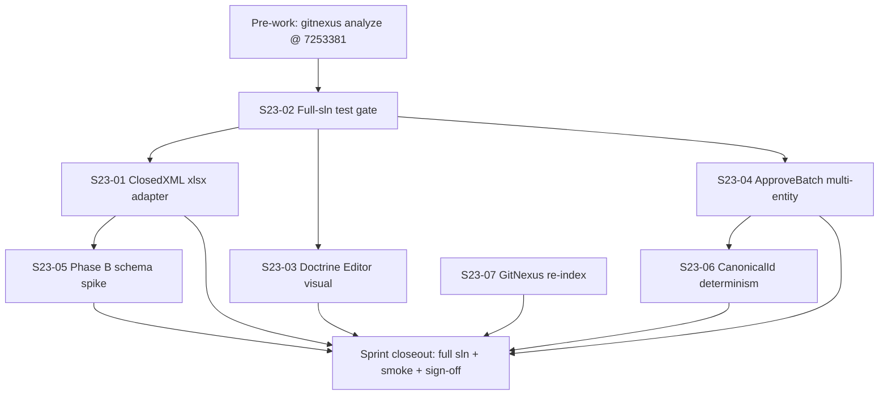

# Sprint 23 Implementation Plan — Platform Phase B I/O + Doctrine Polish + Full-Solution Gate

**Sprint:** 23  
**Goal:** Close Sprint 22 deferred quality gates by wiring ClosedXML binary `.xlsx` round-trip I/O (Req 21), establishing a green full-solution `ProjectAegis.sln` test baseline, and delivering Unity Editor visual sign-off for the Doctrine Inheritance Panel (Req 13) toward MVP polish.  
**Dates:** 2026-07-08 → 2026-07-22  
**Trunk:** `main` @ `7253381`  
**Predecessor:** Sprint 22 (complete, pushed 2026-06-17)  
**Source:** `production/sprints/sprint-23-platform-phase-b-doctrine-polish.md`

## GitNexus Mandatory Rules (from kickoff)

**Before ANY symbol edit:**
- `npx gitnexus impact CatalogWriteGate --direction upstream` (CRITICAL — extend-only on S23-04)
- `npx gitnexus impact IPlatformWorkbookIo --direction upstream` (HIGH — S23-01)
- `npx gitnexus impact PlatformWorkbookImporter --direction upstream`
- `npx gitnexus impact PlatformWorkbookExporter --direction upstream`
- `npx gitnexus impact DelegationBridge --direction upstream` (CRITICAL — ZERO touch, S23-03)
- After edits: `npx gitnexus detect_changes --repo cmano-clone` before commit

**Worktree strategy:**
- `stack/sprint23/full-sln-gate` → S23-02 (day 1, main)
- `stack/sprint23/closedxml-xlsx-io` → S23-01
- `stack/sprint23/doctrine-editor-visual` → S23-03
- `stack/sprint23/approve-batch-multi` → S23-04

## Story DAG



**Critical path:** `S23-02 → S23-01 → closeout` (data I/O) parallel with `S23-02 → S23-03 → closeout` (Unity polish).

**Recommended execution order:**
1. **Day 1:** S23-02 (baseline) — blocks nothing else until triaged
2. **Days 2–4:** S23-01 + S23-03 in parallel (independent worktrees)
3. **Days 5–7:** S23-04 (if capacity); else defer
4. **Days 7–8:** S23-05 spike OR S23-06 determinism (pick one if behind)
5. **Closeout:** S23-07 + full sln re-run + `/smoke-check sprint`

## Stories

### Must Have

**S23-01: ClosedXML `.xlsx` adapter wiring + integration tests**
- Priority: must-have | Estimate: 2.5 days | Blocker: S23-02 green
- Files: `ClosedXmlPlatformWorkbookIo.cs`, `PlatformExportXlsxCommand.cs`, `PlatformImportXlsxCommand.cs`, new `ClosedXmlPlatformWorkbookIoTests.cs`
- Task: Wire `ClosedXmlPlatformWorkbookIo` as production I/O behind CLI flag or default; prove PLE-2.1 empty-diff on binary `.xlsx`
- **Verify:**
  ```powershell
  dotnet restore src/ProjectAegis.Data.Excel/ProjectAegis.Data.Excel.csproj
  dotnet test src/ProjectAegis.Data.Tests/ProjectAegis.Data.Tests.csproj --filter "Platform|ClosedXml" -v minimal
  dotnet test src/ProjectAegis.MissionEditor.Cli.Tests/ProjectAegis.MissionEditor.Cli.Tests.csproj --filter "Mcp|Platform" -v minimal
  dotnet run --project src/ProjectAegis.MissionEditor.Cli -- platform_export_xlsx --help
  ```

**S23-02: Full-solution test gate baseline**
- Priority: must-have | Estimate: 1 day | Blocker: none (day 1)
- Task: `dotnet build/test ProjectAegis.sln`; triage failures; record evidence
- **Verify:**
  ```powershell
  dotnet build ProjectAegis.sln -v minimal
  dotnet test ProjectAegis.sln -v minimal
  # Record: total passed, indexed commit 7253381 → production/qa/smoke-sprint-23-*.md
  ```

**S23-03: Unity Doctrine Inheritance Panel Editor visual sign-off**
- Priority: must-have | Estimate: 2.5 days | Blocker: S23-02 green
- Files: `DoctrineInheritancePanelHost.cs`, PlayMode harness, manual evidence doc
- Task: Editor PlayMode + manual sign-off; WRA/ROE/EMCON visible; ZERO touch `DelegationBridge`
- **Verify:**
  ```powershell
  dotnet test src/ProjectAegis.Delegation.UnityAdapter.Tests/ProjectAegis.Delegation.UnityAdapter.Tests.csproj --filter "Doctrine|PlayModeSmoke" -v minimal
  dotnet test src/ProjectAegis.Delegation.Tests/ProjectAegis.Delegation.Tests.csproj --filter "Doctrine" -v minimal
  rg "DelegationBridge" unity/ProjectAegis/Assets/Scripts/Runtime/DoctrineInheritancePanelHost.cs  # indirect only via host seam
  # Manual: production/qa/sprint-23-doctrine-editor-signoff-*.md
  ```

### Should Have

**S23-04: ApproveBatch multi-entity commit path**
- Priority: should-have | Estimate: 2.5 days | Blocker: S23-02
- Files: `CatalogWriteGate.cs` (`LoadStagingRows`, `ApproveBatch`, upsert helpers)
- Task: Commit platform/weapon/mount/loadout/magazine/comms staged rows; sensor path unchanged
- **Verify:**
  ```powershell
  dotnet test src/ProjectAegis.Data.Tests/ProjectAegis.Data.Tests.csproj --filter "WriteGate|Platform|CmoMarkdown" -v minimal
  npx gitnexus impact CatalogWriteGate --direction upstream
  ```

**S23-05: Phase B schema foundation spike (export-only)**
- Priority: should-have | Estimate: 2 days | Blocker: S23-01
- Task: Migration + catalog types + exporter sheet stubs for Signatures/Mobility/EMCON
- **Verify:**
  ```powershell
  dotnet test src/ProjectAegis.Data.Tests/ProjectAegis.Data.Tests.csproj --filter "Platform" -v minimal
  ```

### Nice to Have

**S23-06: CanonicalId determinism on Catalog* types**
- Priority: nice-to-have | Estimate: 1 day | Blocker: S23-04 (or parallel)
- **Verify:**
  ```powershell
  dotnet test src/ProjectAegis.Data.Tests/ProjectAegis.Data.Tests.csproj --filter "WriteGate|Platform" -v minimal
  ```

**S23-07: GitNexus re-index @ 7253381**
- Priority: nice-to-have | Estimate: 0.5 days | Blocker: sprint closeout
- **Verify:**
  ```powershell
  npx gitnexus analyze --force
  npx gitnexus detect_changes --repo cmano-clone
  ```

## Execution Workflow

1. **Pre-work:** GitNexus analyze; read kickoff + Sprint 22 retro C2–C4
2. **Day 1:** S23-02 only — establish or triage full-sln baseline
3. **Parallel dispatch:** S23-01 (data) + S23-03 (Unity) after S23-02 green
4. **Sequential:** S23-04 after S23-02 (if capacity); S23-05 after S23-01
5. **Two-stage review per story:** Spec compliance → code quality
6. **Closeout:** Full sln re-run, scoped filters, `/smoke-check sprint`, update `sprint-status.yaml`

## Parallel Dispatch Groups

| Group | Stories | When |
|-------|---------|------|
| Gate | S23-02 | Day 1 |
| Data I/O | S23-01 → S23-05 | Days 2–6 |
| Unity polish | S23-03 | Days 2–5 (parallel with S23-01) |
| Write-gate | S23-04 → S23-06 | Days 5–8 (if capacity) |
| Closeout | S23-07 + full sln | Final 0.5–1 day |

## Definition of Done (per kickoff)

- All Must ACs met + tests green
- Full `dotnet test ProjectAegis.sln` — 0 failures at closeout
- GitNexus impacts/detect documented
- Evidence in `production/qa/`
- Tracker rows 13 + 21 updated
- No bypass of write-gate or DelegationBridge

## Related

- Kickoff: `production/sprints/sprint-23-platform-phase-b-doctrine-polish.md`
- Sprint 22 retro: `production/retrospectives/retro-sprint-22-2026-06-17.md`
- ADR-011: `docs/architecture/adr-011-platform-editor-excel-roundtrip.md`
- Req 13 / 21: `Game-Requirements/requirements/`