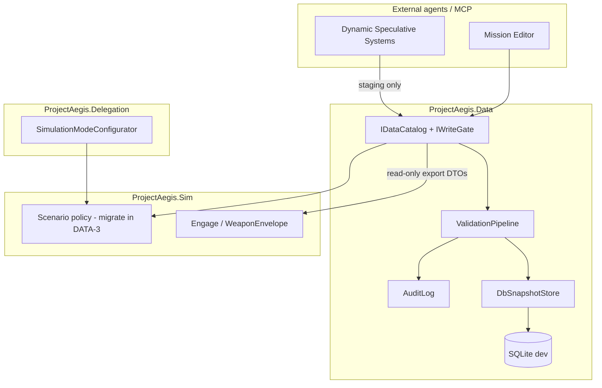

# Database Intelligence Layer (P0) — Design Spec

**Date:** 2026-05-30  
**Project:** Project Aegis (`cmano-clone`)  
**Status:** Approved for implementation planning (P0 slice)  
**Source requirement:** `Game-Requirements/requirements/06-Database-Intelligence.md`  
**Related requirements:** 05 (Dynamic Systems staging), 08 (Agentic Architecture), 11 (Mission Editor DB binding P0)  
**Architecture:** `docs/architecture/architecture.md` — `ProjectAegis.Data` layer  
**GitNexus:** Re-run `npx gitnexus impact` on moved symbols after DATA-3; index under-reports C# callers today.

---

## 1. Scope decision (brainstorming lock-in)

Doc 06 describes five “intelligence agents” plus full balance drift. **This spec covers only the P0 unblock path** so mission editor and sim can bind to a versioned platform catalog. Deferred to later specs: normalization agents, balance drift, ML prediction, cloud sync, modder public API.

| In P0 | Deferred |
|-------|----------|
| `ProjectAegis.Data` assembly + SQLite (dev) | Automated re-indexing agent |
| Canonical platform schema (aircraft, ship, sub, facility, sensor, weapon) | Consistency/normalization agent |
| Read API + staged write gate | Cross-system physics validation (beyond referential + range sanity) |
| DB snapshot versioning + audit log | Balance drift detection |
| Scenario package `dbSnapshotId` binding | Full MCP “normalize week of speculative systems” |
| Schema + referential validation | Branching DBs (“Current Tech” vs “Future Combat”) |
| Minimal CMO import path (subset → SQLite) | Moving entire cmano-db markdown corpus |

---

## 2. Approaches considered

### A — P0 foundation + version binding (recommended)

New `ProjectAegis.Data` assembly: SQLite catalog, immutable snapshot IDs, JSON scenario packages reference snapshots, validators at write time. Intelligence behaviors are **deterministic services** (no LLM in the loop). Agents/MCP call the same APIs as code.

**Pros:** Unblocks doc 11 P0; matches existing Sim/Delegation .NET patterns; smallest blast radius.  
**Cons:** Does not deliver doc 06 “self-maintaining” vision yet.

### B — Monolithic “full doc 06” in one assembly

Ship all five agents, graph indexes, normalization, and balance hooks in the first PR series.

**Pros:** Single mental model.  
**Cons:** Months of coupling before mission editor can bind DB; high risk with active delegation stack.

### C — Reference-only (markdown / JSON files, no SQLite)

Keep using `docs/reference/cmano-db` and ad-hoc JSON; add validation scripts only.

**Pros:** Fastest docs-only path.  
**Cons:** No snapshot versioning, no staged agent writes, fails doc 11 P0 and doc 06 audit requirements.

**Recommendation:** **A**. Stack PRs bottom-up (see `docs/superpowers/plans/2026-05-30-database-intelligence-graphite-stack.md`).

---

## 3. Architecture

### 3.1 Layer placement



**Rules (align with ADR-001):**

- No `UnityEngine` in `ProjectAegis.Data`.
- Sim and Delegation may reference Data; Data references neither.
- All catalog writes go through `IWriteGate` (staging → validate → commit → snapshot).

### 3.2 Core concepts

| Concept | Purpose |
|---------|---------|
| **Catalog record** | Typed row: platform, weapon, sensor, etc., with stable `CatalogId` (string slug or ULID; map CMO numeric id in `externalRefs`) |
| **DbSnapshot** | Immutable content hash + monotonic `snapshotId` (e.g. `db-20260530-001`) |
| **Scenario package** | JSON manifest: `scenarioId`, `dbSnapshotId`, OOB refs, policy template id |
| **Staging batch** | Proposed writes from agents; never visible to sim until approved commit |
| **Audit entry** | Who/when/why + before/after JSON patch |

### 3.3 Version binding (doc 11 / CMO parity)

- Every scenario package stores `dbSnapshotId`.
- **Shallow rebuild:** Re-resolve catalog IDs to current snapshot; keep scenario structure.
- **Deep rebuild:** Re-run validation against new snapshot; surface breaking changes list (P0: report only; auto-fix deferred).
- Mismatch (scenario references missing id) → hard fail at load with `CatalogResolveException`.

### 3.4 Write gate (agent safety)

```
Propose(batch) → Staging
Approve(batchId, actor) → Validate → Commit → New snapshot (optional tag)
Reject(batchId) → discard
```

Dynamic Speculative Systems (doc 05) **must not** bypass staging. Human approval is required for P0 (locks open question #1 from doc 06).

### 3.5 Runtime export seam (DOTS-friendly)

P0: **read-only DTO batches** (`PlatformRuntimeDto`, `WeaponEnvelopeDto`) built from SQLite via `ICatalogExporter`.  
Unity/DOTS BlobAssets built in `ProjectAegis.Unity` or future `Sim.DataBridge` — not in Data assembly (keeps Data testable headless).

Engage path: replace hardcoded envelopes in `SimulationSession` / `DelegationBridge` with `ICatalogReader.TryGetWeaponEnvelope(weaponId)` (DATA-4).

### 3.6 Validation (P0 rules only)

1. JSON/schema validation per record type.
2. Referential integrity (weapon→platform loadouts, sensor mounts).
3. Unit dimension enums (range in nm, speed in knots/Mach) — **detect** only, do not auto-normalize.
4. Optional sanity bounds (max range > 0, Mach ≤ 25) with explainable `ValidationFinding` codes.

Cross-system “impossible combo” rules (doc 06 §3) → P1 rule pack.

---

## 4. Resolved open questions (P0)

| Doc 06 question | P0 decision |
|-----------------|-------------|
| Auto vs human normalization | **Human confirmation** for any commit affecting >N records (default N=10) or any field tagged `balanceCritical` |
| Balance drift tolerance | **Out of scope** P0; hook interface `IBalanceTelemetrySink` no-op. Post-P0 advisory accumulator now implemented — see [`docs/engineering/balance-drift-telemetry.md`](../../engineering/balance-drift-telemetry.md). |
| Branching databases | **Out of scope** P0; single `main` catalog + tagged snapshots; design reserve `branch` column on snapshot metadata |

---

## 5. Data layout (repository)

```
data/
  scenarios/           # existing *.policy.json (migrate loader to Data in DATA-3)
  catalog/             # optional seed JSON (dev fixtures)
src/ProjectAegis.Data/
  Catalog/             # entities, IDs
  Storage/             # SQLite, migrations
  Snapshots/           # snapshot + binding
  Validation/          # rules, findings
  WriteGate/             # staging, approve
  Audit/               # append-only log
  Import/              # CMO subset importer (DATA-5)
  Scenario/            # package loader (moved from Sim)
src/ProjectAegis.Data.Tests/
```

SQLite file default: `data/catalog/aegis-catalog.dev.sqlite` (gitignored; committed seed script generates it in CI).

---

## 6. GitNexus / impact notes

| Symbol / area | Expected risk when touched |
|---------------|----------------------------|
| `ScenarioPolicyRepository` (move Sim → Data) | **MEDIUM** — `SimulationModeConfigurator`, tests |
| `WeaponEnvelope` / `EngageContext` consumers | **MEDIUM** — `SimulationSession`, `DelegationBridge`, engage tests |
| New `IPlatformCatalog` | **LOW** initially (no upstream until DATA-4 wiring) |

Before each merge: `npx gitnexus impact <Symbol> --repo cmano-clone` and `npx gitnexus detect_changes --repo cmano-clone`.

---

## 7. Testing strategy

- **EditMode / net8 tests** in `ProjectAegis.Data.Tests`: validation, snapshot immutability, write gate, scenario binding.
- **Regression:** scenario policy tests move with repository (paths unchanged under `data/scenarios`).
- **Import smoke:** import ≥10 representative CMO records from `docs/reference/cmano-db` subset.
- **Determinism:** exporter sort order fixed; no `DateTime.Now` in commit paths (use injectable `IClock`).

---

## 8. Agent & team routing (Cursor)

| Slice | Lead agent | Supporting |
|-------|------------|------------|
| DATA-0–1 | `database-architect` | `c-sharp-architect` |
| DATA-2 | `database-modeler` | `database-engineer` |
| DATA-3–4 | `database-engineer` | `c-sharp-engineer`, `sim-data-specialist` |
| DATA-5 | `database-engineer` | `tools-programmer` |
| Review gates | `c-sharp-reviewer`, `determinism-engineer` | `gitnexus` impact pre-merge |

Skills: `database-layer-architecture`, `database-branching-release-train`, `sqlite-schema-management`, `provenance-audit-modeling`, `deterministic-data-access`, Graphite `graphite-stack` / `graphite-submit`.

Team manifest: `.claude/teams/database-intelligence-team.yaml`

---

## 9. Traceability

| Requirement | P0 coverage |
|-------------|-------------|
| doc 06 §1 Re-indexing | Partial — materialized views in SQLite + rebuild on commit (not separate agent) |
| doc 06 §2 Normalization | Detect-only; no auto apply |
| doc 06 §3 Cross-validate | Referential + sanity only |
| doc 06 §4 Version/audit | **Yes** |
| doc 06 §5 Balance drift | Deferred |
| doc 11 DB binding | **Yes** (`dbSnapshotId`) |

---

## 10. Next artifact

Implementation plan: `docs/superpowers/plans/2026-05-30-database-intelligence-p0.md`  
Graphite runbook: `docs/superpowers/plans/2026-05-30-database-intelligence-graphite-stack.md`
