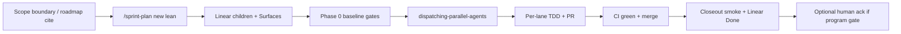
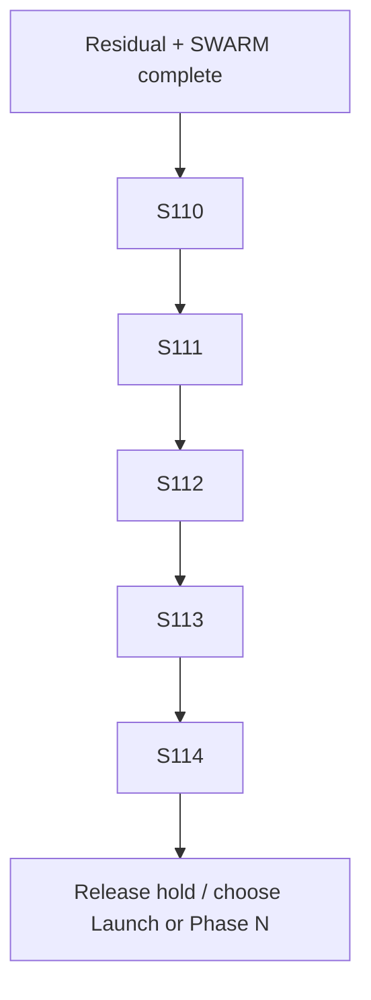

# Agentic workflow + unfinished/future sprint series (2026-08-09)

**Skills:** `sprint-plan` (lean) · `writing-plans` · `dispatching-parallel-agents` · `using-git-worktrees` · `verification-before-completion` · `test-driven-development` (code tracks)  
**Stage:** **Release** (`production/stage.txt`) — **not Launch**  
**Review mode:** `lean` (`production/review-mode.txt`)  
**HEAD baseline @ plan authoring:** `d10f0dc2` (post residual-wave #445)  
**Linear project:** [cmano-clone](https://linear.app/drgamtd-workspace/project/cmano-clone-7f6a00e4c1c9)

---

## 0. Executive picture

| Band | State | Implication |
|------|-------|-------------|
| S89–S97 programs | **COMPLETE** + human acks | Do not reopen |
| S98–S109 residual / H1 / Epic A | Plans + closeouts exist; product land through S109 | Treat as **closed train** unless smoke gaps reopen |
| SWARM Phase A–C + PE | **COMPLETE** (DRG-83 Done; #412–#436) | No more swarm MVP lanes |
| Residual wave 2026-08-09 | **COMPLETE** (#442 S93 assets, #444 PDA, Phase N Linear) | Waterline engineering queue cleared |
| **In Progress (Linear)** | **0** | Ready for a new planned series |
| Phase N (DRG-111…117) | Backlog / deferred | **Not dispatchable** until product re-opens |
| Launch / commercial | Deferred | Explicit human ack only |

**Truth gap:** `production/sprint-status.yaml` is a historical mega-blob (S1–S70 era narrative). **Do not** treat it as live story SoT. Live SoT = Linear + latest `production/agentic/*closeout*` + open PRs.

---

## 1. Unfinished inventory (actionable vs deferred)

### 1.1 Cleared this week (do not re-queue)

| Item | Evidence |
|------|----------|
| S93 thin assets | [#442](https://github.com/drgaciw/cmano-clone/pull/442) |
| PDA core position / MCP / clock | [#444](https://github.com/drgaciw/cmano-clone/pull/444) |
| Phase N Linear umbrella | DRG-111…117; [#443](https://github.com/drgaciw/cmano-clone/pull/443) |
| DRG-50 fuel delta | #437 (prior) |
| Waterline stale In Progress | 2026-08-09 wave |
| Gauntlet t4/t5 coverage map | #367 |

### 1.2 Linear Backlog — **dispatchable** (product Release train)

| ID | Priority | Theme | Surface (est.) | Notes |
|----|----------|-------|----------------|-------|
| **DRG-10** | Medium | IR/visual detection model | `Sim/Sensors/**` | Real unbuilt feature (playbook) |
| **DRG-14** | Medium | Sim-clock accel / pause | `Sim/Core/**`, session clock | Re-scoped from agent pause |
| **DRG-61** | Medium | 3 tier-3 policies missing `gauntlet.tier` | `tools/qa-gauntlet/**`, policies JSON | CI correctness |
| **DRG-63** | Medium | `verify_axis` no production caller | gauntlet / batch runner | Wire or document as manual |
| **DRG-62** | Low | `stressAxes` absent from coverage-map cells | coverage-map JSON + tests | Drift can't fail |
| **DRG-64** | Low | `_infer_stress_axes` over-reports | gauntlet infer | Quality |
| **DRG-65** | Low | EW moderate differential proof | gauntlet / EW | Research |
| **DRG-19/20/21** | Low | S31/S34 CI smoke leftovers | CI scripts | Likely stale — **triage close or re-scope** first |
| **DRG-22…28** | Low | S36 UX/a11y/art polish pack | `design/**`, Unity notes | Human/art heavy; bundle as **S-UX** or close as Won't |

### 1.3 Linear Backlog — **not dispatchable** (Phase N)

DRG-111 umbrella + DRG-112…117 (SWARM-27…30, REQ-09/10 design matrix). See [DRG-47 decision](drg-47-phase-n-scoping-decision-2026-08-09.md).

### 1.4 Human-only / product gates (no agent auto-start)

| Candidate | Trigger |
|-----------|---------|
| H2 art **Approved** promotions | Human phrase `asset approved: ASSET-NNN` only |
| H3 store package / commercial | Explicit commercial push + Launch path |
| H4 SE Phase 2 GUI | New scope boundary |
| H5 Addressables bulk | Content pipeline ADR |
| H6 multiplayer / save-load | Out of single-player deploy model |
| Launch stage flip | Explicit human authorization |
| Editor PNG pack | Unity Editor host available |
| Play Mode human smoke for S108/S109 | Local Unity checklists still open in smoke docs |

### 1.5 Asset / product residual (Release continuity)

| Item | State |
|------|-------|
| ASSET-001…003 umbrellas | Still **In Production** |
| ASSET-007…013 / 015…017 Specced C2 children | Specced — next Done wave candidate |
| Approved count | **4** (004/005/006/021) |
| Suite floor | **≥1638/0f** (live often ~2300+ post H1) |
| Baltic hash | `17144800277401907079` immutable without ADR |

---

## 2. Agentic workflow (standing operating procedure)

### 2.1 Roles

| Role | Who | Owns |
|------|-----|------|
| **Orchestrator** | Local / this agent | Scope boundary, Linear hygiene, surface-disjoint wave design, merge order, closeout |
| **Implementer lanes** | Parallel subagents (worktrees) | One Surface each; TDD for C#; no shared CRITICAL hub co-edit |
| **Integrator** | Orchestrator after lanes green | Restack/merge serial if shared trunk; gates RUN+READ; smoke doc |
| **Human** | Danny | Launch, asset Approved phrases, Phase N re-open, commercial |

### 2.2 Per-sprint lifecycle (serial sprints)

1. **Cite authority** — boundary + roadmap + invariants.  
2. **`/sprint-plan new` (lean)** — write `production/sprints/sprint-N-*.md` + thin `sprint-status` story block (or Linear-only if preferred).  
3. **QA plan** — `production/qa/qa-plan-sprint-N-*.md` before implementation (skill Phase 5).  
4. **Linear** — one issue per lane; **`Surface:`** line mandatory; never co-dispatch intersecting Surfaces.  
5. **Kickoff** — `production/agentic/sprint-N-parallel-kickoff-YYYY-MM-DD.md`.  
6. **Baseline** — build/test/replay floors; GitNexus impact on CRITICALs if code.  
7. **Parallel implement** — worktrees `.worktrees/stack/sprint{N}/{track}/`.  
8. **Merge** — Graphite/gh; serial if hub collision (see critical-hub-merge-playbook).  
9. **Closeout** — smoke + Linear Done + residual list.  
10. **Do not** advance Launch or invent Approved.

### 2.3 Superpowers skill stack (mandatory)

| When | Skill |
|------|-------|
| Multi-lane same turn | `dispatching-parallel-agents` |
| Isolation | `using-git-worktrees` |
| C# behavior | `test-driven-development` |
| Before any "done" claim | `verification-before-completion` |
| CRITICAL hub | impact first; `CatalogWriteGate` extend-only; `DelegationBridge` ZERO hotpath |
| Sprint packaging | `sprint-plan` lean |

### 2.4 Surface discipline (copy from playbook)

**Never dispatch two issues whose Surfaces intersect on `src/` or `unity/`.**  
Known hot hubs: `CatalogWriteGate`, `DelegationBridge`, `SimulationSession` / tick pipeline, `ScenarioDocumentEditor`, `PatrolCandidateEngagePolicy`, `BalticReplayHarness`.

### 2.5 Definition of Done (every sprint)

- [ ] Must-haves merged to `main` with green CI  
- [ ] Suite floor held (**≥1638/0f**; prefer live measured)  
- [ ] ReplayGolden **6/6**; hash preserved unless ADR  
- [ ] ZERO DelegationBridge hotpath  
- [ ] CatalogWriteGate extend-only  
- [ ] Stage remains **Release**  
- [ ] Linear issues Done with evidence PR links  
- [ ] Smoke closeout under `production/qa/` or `production/agentic/`  
- [ ] Residual list explicit (or "cleared")

---

## 3. Proposed future sprint series (S110+)

**Program name:** Release Product Progress (post-swarm / post-residual)  
**Not:** Launch, Phase N fiction, commercial store  
**User must approve** via roadmap protocol or per-sprint `/sprint-plan` before dispatch.

### Series shape

| Sprint | Theme | Must-have intent | Parallel lanes (max 3) | Est. days |
|--------|-------|------------------|------------------------|-----------|
| **S110** | **Gauntlet correctness wave** | DRG-61 tier tags + DRG-63 verify_axis production path + residual retest dual | gauntlet-policy ∥ verify-wire ∥ closeout | 3–4 |
| **S111** | **Sensor depth — IR/EO spine** | DRG-10 minimal IR/visual detection (deterministic, catalog-extend) | sim-sensor ∥ catalog-seed ∥ tests/closeout | 4–6 |
| **S112** | **Sim clock control** | DRG-14 time accel + pause (session-level, replay-safe) | sim-clock ∥ C2 projection line ∥ tests | 3–5 |
| **S113** | **Asset Specced→Done wave 3** | ≥2 Specced C2 children (e.g. 007/008 or 011/012) Done stubs + manifest honesty | asset-c2-a ∥ asset-c2-b ∥ closeout | 3–4 |
| **S114** | **Release progress gate** | Aggregate S110–S113; floors; human ack **"release product progress program complete"** | gate ∥ closeout | 2–3 |

Optional later (explicit pick, not auto-queued):

| Optional | Theme |
|----------|-------|
| S-UX | DRG-22…28 a11y/art/difficulty pack (docs + design) |
| S-triage | Close DRG-19/20/21 or re-scope as real CI debt |
| Phase N | Only after product re-opens DRG-111 |

### S110 draft (first dispatch candidate) — not written until approved

**Goal:** Make gauntlet tier coverage mechanically honest so residual drift fails CI, not humans.

| ID | Task | Surface | AC |
|----|------|---------|-----|
| S110-01 | Tag 3 missing tier-3 policies `gauntlet.tier` | policy JSON under gauntlet corpus | DRG-61 Done; corpus lists them |
| S110-02 | Production caller or fail-closed skip for `verify_axis` | gauntlet runner / batch | DRG-63 Done or Won't with doc |
| S110-03 | Dual residual retest SYN-T12 + MD-001 | tools/qa-gauntlet | PASS documented |
| S110-04 | Closeout | docs | smoke + Linear |

**Out of scope S110:** IR sensors, sim clock, Launch, Phase N, DelegationBridge.

---

## 4. Feasibility (lean producer self-check)

| Check | Verdict |
|-------|---------|
| Capacity 3–4 effective tracks | OK |
| Critical path serial | S110→…→S114 OK |
| Hub collision risk | S111/S112 touch Sim — **serialize** if same symbols; else parallel with disjoint folders |
| Human blockers | Approved/Launch still human |
| Carryover | Residual queue **cleared**; backlog is feature quality not cleanup |
| Realistic? | **Yes** if S111 scoped to spine not full EO suite |

**PR-SPRINT skipped — Lean mode.**

---

## 5. What is *not* unfinished

Do not plan "finish SWARM", "re-open S93 corpus", or "backfill Linear S1–S107". Those trains are closed or intentionally historical.

---

## 6. Immediate next actions (after user pick)

1. **Approve S110–S114 program** (or subset) — reply with approval phrase.  
2. Orchestrator runs `/sprint-plan new` for **S110 only** → writes `production/sprints/sprint-110-*.md` + QA plan.  
3. Create/refresh Linear children under a short-lived umbrella if useful.  
4. `dispatching-parallel-agents` S110 lanes.  
5. Repeat serial for S111+.

---

## 7. References

- [future-sprint-roadmap-07142026.md](../../docs/reports/future-sprint-roadmap-07142026.md)  
- [roadmap-execution-plan-071426.md](../../docs/reports/roadmap-execution-plan-071426.md)  
- [linear-parallel-dispatch-playbook.md](linear-parallel-dispatch-playbook.md)  
- [critical-hub-merge-playbook-2026-07-14.md](critical-hub-merge-playbook-2026-07-14.md)  
- [residual-wave-closeout-2026-08-09.md](residual-wave-closeout-2026-08-09.md)  
- [swarm-program-closeout-2026-08-09.md](swarm-program-closeout-2026-08-09.md)  
- [drg-47-phase-n-scoping-decision-2026-08-09.md](drg-47-phase-n-scoping-decision-2026-08-09.md)  
- [sprint-plan skill](../../../artifacts/cmano-clone/.claude/skills/sprint-plan/SKILL.md) (template authority)

---

*Authored 2026-08-09 under /plan agentic + /sprint-planning (lean). S110+ plans not committed until user approval.*
