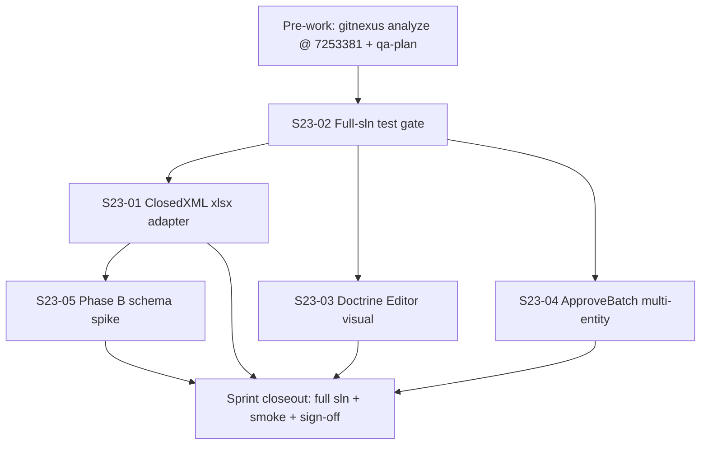

# Sprint 23 — Parallel kickoff (integrated tracks)

**Date:** 2026-06-17  
**Coordinator:** Program agent (cmano-clone)  
**Skills:** `executing-plans`, `dispatching-parallel-agents`, `using-git-worktrees`, `qa-plan`, `team-data`, `team-unity`, `team-csharp`, `hindsight-gitnexus`  
**Sprint:** [sprint-23-platform-phase-b-doctrine-polish.md](../sprints/sprint-23-platform-phase-b-doctrine-polish.md)  
**Implementation plan:** [sprint-23-implementation.md](../../docs/superpowers/plans/sprint-23-implementation.md)

## Verdict

**PLANNING READY**

| Field | Value |
|-------|-------|
| **Trunk** | `main` @ `7253381` |
| **Sprint dates** | 2026-07-08 → 2026-07-22 |
| **Predecessor** | Sprint 22 SHIPPED (pushed 2026-06-17) |
| **Effective dev-days** | 8 (10-day sprint, 20% buffer = 2 days) |
| **ADR-011** | Accepted 2026-06-17 — ClosedXML wiring unblocked |
| **MVP overlap** | Milestone review 2026-07-15 — prioritize S23-02 baseline week 1 |

---

## Sprint goal (integrated)

Close Sprint 22 deferred quality gates by wiring **ClosedXML binary `.xlsx` round-trip I/O** (Req 21), establishing a green **full-solution `ProjectAegis.sln` test baseline**, and delivering **Unity Editor visual sign-off** for the Doctrine Inheritance Panel (Req 13) toward MVP polish.

---

## Planning tension resolution

| Topic | Data track (`sprint-23-plan-data`) | Program orchestrator | **Integrated decision** |
|-------|-----------------------------------|----------------------|-------------------------|
| **Priority #1** | S23-D01 `ApproveBatch` multi-entity commit (must-have, 4d) | S23-01 ClosedXML `.xlsx` adapter (must-have, 2.5d) | **ClosedXML-first** per program constraint and ADR-011 Accepted boundary |
| **ApproveBatch** | Must-have D01 — blocks CmoMarkdown E2E commit loop | Should-have S23-04 — defer if must-haves consume buffer | **S23-04 should-have**; clean defer to Sprint 24 if S23-01/03 run long |
| **Full-sln gate** | Nice-to-have D08 | Must-have S23-02 day 1 | **S23-02 must-have** — retro action #7; blocks parallel feature work until triaged |
| **CanonicalId determinism** | Must-have D03 (1.5d) | Nice-to-have S23-06 | **S23-D03 should-have** mid-sprint if capacity; not on critical path |
| **Unity Cesium / C2 batch** | Out of scope | S23-03 covers doctrine only | **S23-U01 ≡ S23-03 must-have**; S23-U02/U03 should-have if buffer allows |

> **Key decision:** Program constraint wins on must-have ordering — **ClosedXML (S23-01) before ApproveBatch (S23-04)**. Staging-only path from Sprint 22 remains valid if S23-04 slips. ApproveBatch is the highest-value should-have and the primary Sprint 24 carryover candidate.

---

## Integrated must-have map

| Program ID | Data ID | Unity ID | Task | Owner | Est. | Program tier |
|------------|---------|----------|------|-------|------|--------------|
| **S23-02** | S23-D08 | — | Full-solution `dotnet build/test ProjectAegis.sln` baseline + evidence | c-sharp-devops-engineer | 1d | **Must-have** (day 1) |
| **S23-01** | S23-D02 (+D06 harness) | — | ClosedXML `.xlsx` adapter wired to CLI; empty-diff golden; `Data.Excel` in sln | team-data | 2.5d | **Must-have** |
| **S23-03** | — | S23-U01 (+U03 regression) | Doctrine Inheritance Panel UXML/USS + `DelegationSmoke` wiring + Editor sign-off | team-unity | 2.5d | **Must-have** |

### Should-have (capacity-dependent)

| Program ID | Data ID | Unity ID | Task | Est. |
|------------|---------|----------|------|------|
| S23-04 | S23-D01 | — | `ApproveBatch` multi-entity commit (extend-only `CatalogWriteGate`) | 2.5d |
| S23-05 | S23-D04 | — | Phase B schema migration + exporter sheet stubs (export-only) | 2d |
| — | S23-D03 | — | Canonical sort-key determinism golden tests | 1.5d |
| — | S23-D05 | — | Wire `BalanceTelemetrySinkFactory` to batch runner (advisory) | 1.5d |
| — | S23-D06 | — | Platform workbook binary verification harness | 1d |
| — | — | S23-U02 | Cesium globe production polish (depth/occlusion evidence) | 1.5d |
| — | — | S23-U03 | Post-S22 PlayMode smoke + C2 batch regression | 1d |
| — | — | S23-U05 | C2 manual sign-off refresh (check 14 doctrine) | 1d |

### Nice-to-have

| Program ID | Data ID | Unity ID | Task |
|------------|---------|----------|------|
| S23-06 | S23-D03 overlap | — | CanonicalId determinism (if not done as should-have) |
| S23-07 | — | — | GitNexus re-index @ `7253381` + `detect_changes` baseline |
| — | S23-D07 | — | Excel UX: data-validation dropdowns + sheet protection |
| — | — | S23-U04 | APP-6 symbology Phase C spike |
| — | — | S23-U06 | `useGlobeMap` integration variant in DelegationSmoke |
| — | — | S23-U07 | Doctrine panel keyboard / motion-prefs parity |

---

## Parallel worktree layout

```
main  @ 7253381
 ├── stack/sprint23/full-sln-gate              (S23-02 — day 1, on main)
 ├── stack/sprint23/closedxml-xlsx-io          (S23-01 / S23-D02 + S23-D06)
 ├── stack/sprint23/doctrine-editor-visual     (S23-03 / S23-U01 + S23-U03)
 ├── stack/sprint23/approve-batch-multi        (S23-04 / S23-D01 — should-have)
 ├── stack/sprint23/canonical-determinism      (S23-D03 — should-have)
 └── stack/sprint23/phase-b-schema             (S23-05 / S23-D04 — should-have)
```

| Worktree path | Branch | Owner track | Blocks |
|---------------|--------|-------------|--------|
| `.worktrees/sprint23-full-sln-gate` | `stack/sprint23/full-sln-gate` | devops / coordinator | All feature branches until baseline recorded |
| `.worktrees/sprint23-closedxml` | `stack/sprint23/closedxml-xlsx-io` | team-data | S23-05 Phase B spike |
| `.worktrees/sprint23-doctrine` | `stack/sprint23/doctrine-editor-visual` | team-unity | — (parallel with ClosedXML after S23-02) |
| `.worktrees/sprint23-approve-batch` | `stack/sprint23/approve-batch-multi` | team-data | S23-D05 telemetry wiring |
| `.worktrees/sprint23-determinism` | `stack/sprint23/canonical-determinism` | team-data | — (parallel) |
| `.worktrees/sprint23-phase-b` | `stack/sprint23/phase-b-schema` | team-data | — (after S23-01 lands) |

**Merge order (implementation phase):**

1. `stack/sprint23/full-sln-gate` → `main` (day 1 — baseline evidence only; triage fixes if needed)
2. `stack/sprint23/closedxml-xlsx-io` + `stack/sprint23/doctrine-editor-visual` → `main` (parallel, days 2–5)
3. `stack/sprint23/approve-batch-multi` → `main` (if capacity, days 5–8)
4. `stack/sprint23/canonical-determinism` + `stack/sprint23/phase-b-schema` → `main` (should-have, last)
5. Closeout: full sln re-run + `/smoke-check sprint` + `/team-qa sprint`

---

## Day-1 actions (mandatory before feature dispatch)

| # | Action | Owner | Skill / command | Output |
|---|--------|-------|-----------------|--------|
| 1 | **S23-02 baseline gate** | c-sharp-devops-engineer | `dotnet build ProjectAegis.sln` + `dotnet test ProjectAegis.sln -v minimal` | `production/qa/smoke-sprint-23-*.md` + `sprint-status.yaml` baseline count |
| 2 | **GitNexus analyze** | coordinator | `npx gitnexus analyze .` @ `7253381` | Fresh index before any symbol edit |
| 3 | **Impact pre-check** | coordinator | `gitnexus impact CatalogWriteGate`, `IPlatformWorkbookIo`, `DoctrineInheritancePanelHost`, `DelegationBridge` (ZERO touch) | Document CRITICAL/HIGH blast radius |
| 4 | **QA plan** | qa-lead | `/qa-plan sprint` | `production/qa/qa-plan-sprint-23-2026-07-08.md` |
| 5 | **Retro pre-work** | implementer | Commit S22 stack + `git pull --rebase origin main` per retro #1–2 | Clean trunk @ `7253381` confirmed |

**Day-1 gate:** Feature worktrees (S23-01, S23-03) open only after S23-02 baseline is **recorded** (green or triaged with owner assignments).

---

## Agent dispatch map (implementation phase)

| Group | When | Stories | Agent / skill | Worktree |
|-------|------|---------|---------------|----------|
| **Gate** | Day 1 | S23-02 | `c-sharp-devops-engineer` + `smoke-check` | `full-sln-gate` |
| **Data I/O** | Days 2–4 | S23-01, S23-D06 | `team-data` → `c-sharp-engineer` + `c-sharp-test-engineer` | `closedxml-xlsx-io` |
| **Unity polish** | Days 2–5 | S23-03, S23-U03 | `team-unity` → `c-sharp-engineer` | `doctrine-editor-visual` |
| **Write-gate** | Days 5–8 | S23-04 | `team-data` + `gitnexus impact` (CRITICAL extend-only) | `approve-batch-multi` |
| **Determinism** | Days 5–7 | S23-D03 | `team-data` + `deterministic-data-access` | `canonical-determinism` |
| **Phase B spike** | Days 6–8 | S23-05 | `team-data` + `sqlite-schema-management` | `phase-b-schema` |
| **Cesium (opt.)** | Buffer | S23-U02 | `team-unity` | main or `doctrine-editor-visual` |
| **Closeout** | Final 0.5–1d | S23-07 + full sln | `c-sharp-devops-engineer` + `/team-qa sprint` | main |

### GitNexus gates (all implementation agents)

| Symbol | Risk | Rule |
|--------|------|------|
| `CatalogWriteGate` | **CRITICAL** | Extend-only on S23-04; `gitnexus impact --direction upstream` before edit |
| `DelegationBridge` | **CRITICAL** | **ZERO touch** — all Unity doctrine writes via `DelegationBridgeHost` seam (ADR-010) |
| `IPlatformWorkbookIo` | HIGH | Impact before S23-01 wiring |
| `PlatformWorkbookImporter` / `Exporter` | HIGH | Impact before sheet changes |
| `DoctrineInheritancePanelHost` | LOW | Impact before UXML wiring |

After every story: `npx gitnexus detect_changes --repo cmano-clone` before commit.

---

## Evidence paths

| Story | Automated test path | Manual / QA evidence |
|-------|---------------------|----------------------|
| S23-02 | `dotnet test ProjectAegis.sln` | `production/qa/smoke-sprint-23-*.md` |
| S23-01 | `src/ProjectAegis.Data.Excel.Tests/ClosedXmlRoundTripTests.cs`; `src/ProjectAegis.Data.Tests/Platform/ClosedXmlPlatformWorkbookIoTests.cs` | CLI smoke: `platform_export_xlsx --out /tmp/s23-smoke.xlsx` |
| S23-03 | `ProjectAegis.Delegation.UnityAdapter.Tests` filter `Doctrine\|PlayModeSmoke` | `production/qa/sprint-23-doctrine-editor-signoff-*.md`; `production/qa/doctrine-inheritance-s23-editor-evidence.md` |
| S23-04 | `src/ProjectAegis.Data.Tests/WriteGate/CatalogWriteGatePlatformApproveTests.cs` | GitNexus CRITICAL impact doc in PR |
| S23-05 | `src/ProjectAegis.Data.Tests/Platform/PlatformWorkbookPhaseBSheetTests.cs` | Migration `008_platform_editor_phase_b.sql` applies cleanly |
| S23-D03 | `src/ProjectAegis.Data.Tests/Catalog/CatalogSortKeyDeterminismTests.cs` | — |
| S23-U02 | `PlayModeSmokeHarnessTests` regression | `production/qa/cesium-s23-production-polish-evidence.md` |
| S23-U03 | `Invoke-C2PlayModeSignoffBatch.ps1` comms + classify | `production/qa/sprint-23-c2-playmode-regression-2026-06-17.md` |
| S23-U05 | Headless proxy where applicable | `production/qa/c2-manual-signoff-2026-06-02.md` (check 14) |
| S23-07 | — | `production/qa/sprint-23-gitnexus-*.md` |
| Closeout | `/smoke-check sprint` | `production/qa/sprint-23-signoff-*.md`; tracker rows 13 + 21 |

---

## Pre-work checklist

- [ ] Read [sprint-23-platform-phase-b-doctrine-polish.md](../sprints/sprint-23-platform-phase-b-doctrine-polish.md)
- [ ] Read [sprint-23-plan-data-2026-06-17.md](./sprint-23-plan-data-2026-06-17.md)
- [ ] Read [sprint-23-plan-unity-2026-06-17.md](./sprint-23-plan-unity-2026-06-17.md)
- [ ] Read [sprint-23-implementation.md](../../docs/superpowers/plans/sprint-23-implementation.md)
- [ ] Read [retro-sprint-22-2026-06-17.md](../retrospectives/retro-sprint-22-2026-06-17.md) — actions #1–2 (commit/rebase), #6 (doctrine visual), #7 (full sln gate)
- [ ] Read Sprint 22 sign-off conditions C2–C4: `production/agentic/sprint-22-pr-description-2026-06-17.md`
- [ ] Confirm ADR-011 **Accepted**: `docs/architecture/adr-011-platform-editor-excel-roundtrip.md`
- [ ] Confirm trunk @ `7253381` on `origin/main`
- [ ] Run `npx gitnexus analyze .` — refresh index
- [ ] Run S23-02 baseline: `dotnet build` + `dotnet test ProjectAegis.sln`
- [ ] Generate QA plan: `/qa-plan sprint` → `production/qa/qa-plan-sprint-23-2026-07-08.md`
- [ ] Create worktrees per layout above (after day-1 gate)
- [ ] Record integrated priority decision: **ClosedXML must-have; ApproveBatch should-have S23-04**

---

## Carryover from Sprint 22

| Item | S22 ID | S23 placement |
|------|--------|---------------|
| ClosedXML `.xlsx` binary adapter | 22-2 / sign-off C2 | **S23-01 must-have** |
| Full `dotnet test ProjectAegis.sln` closeout | kickoff DoD | **S23-02 must-have** |
| Unity Editor doctrine panel visual | 22-5 / retro #6 | **S23-03 must-have** |
| `ApproveBatch` commit for platform/weapon staged rows | 22-4 | **S23-04 should-have** (defer S24 if buffer consumed) |
| Phase B signatures/mobility/EMCON schema | ADR-011 / tracker row 21 | **S23-05 should-have spike** |
| CanonicalId determinism on new `Catalog*` types | qa-plan note | **S23-D03 should-have** |

---

## Risks (integrated top 5)

| # | Risk | Mitigation |
|---|------|------------|
| R1 | `CatalogWriteGate` CRITICAL regression on ApproveBatch extend | Impact-check first; sensor path regression mandatory; defer S23-04 if behind |
| R2 | ClosedXML NuGet / CI restore friction | Land `Data.Excel` in sln early; keep `CanonicalTextWorkbookIo` fallback flag |
| R3 | Full-sln test reveals latent failures post-S22 | S23-02 day 1; block feature until triaged |
| R4 | Must-haves consume buffer → ApproveBatch slips | **Accepted** — staging path valid; document S24 carryover |
| R5 | Doctrine UXML element name drift vs host constants | Copy names verbatim from `DoctrineInheritancePanelHost.cs`; ZERO touch `DelegationBridge` |

---

## Story DAG (critical path)



**Critical path:** `S23-02 → S23-01 → closeout` (data I/O) **parallel with** `S23-02 → S23-03 → closeout` (Unity polish).

---

## Quality gates (sprint-wide)

```bash
export PATH="/home/username01/.dotnet:$PATH"
cd /home/username01/cmano-clone/cmano-clone

# Must — full solution (S23-02 baseline; re-run at closeout)
dotnet build ProjectAegis.sln
dotnet test ProjectAegis.sln -v minimal

# Scoped — data
dotnet test src/ProjectAegis.Data.Tests/ProjectAegis.Data.Tests.csproj \
  --filter "Platform|WriteGate|ClosedXml|CmoMarkdown|CatalogSortKey" -v minimal
dotnet test src/ProjectAegis.Data.Excel.Tests/ProjectAegis.Data.Excel.Tests.csproj -v minimal
dotnet test src/ProjectAegis.MissionEditor.Cli.Tests/ProjectAegis.MissionEditor.Cli.Tests.csproj \
  --filter "Mcp|Platform" -v minimal

# Scoped — Unity / delegation
dotnet test src/ProjectAegis.Delegation.UnityAdapter.Tests/ProjectAegis.Delegation.UnityAdapter.Tests.csproj \
  --filter "Doctrine|PlayModeSmoke" -v minimal
dotnet test src/ProjectAegis.Delegation.Tests/ProjectAegis.Delegation.Tests.csproj \
  --filter "Doctrine" -v minimal

# Unity Editor (S23-03) — local only
pwsh tools/unity/Invoke-C2PlayModeSignoffBatch.ps1 -Scenario comms
pwsh tools/unity/Invoke-C2PlayModeSignoffBatch.ps1 -Scenario classify
```

---

## Definition of Done

- [ ] All must-have tasks completed (S23-01, S23-02, S23-03)
- [ ] QA plan exists: `production/qa/qa-plan-sprint-23-2026-07-08.md`
- [ ] Full-solution gate green at closeout (`dotnet test ProjectAegis.sln` — 0 failures)
- [ ] Scoped story filters green per Quality Gates above
- [ ] `/smoke-check sprint` PASS
- [ ] `/team-qa sprint` → APPROVED or APPROVED WITH CONDITIONS
- [ ] Tracker rows 13 + 21 updated (doctrine visual + xlsx I/O)
- [ ] GitNexus impacts/detect documented per story
- [ ] No S1 or S2 bugs in delivered features

---

## References

| Document | Path |
|----------|------|
| Program kickoff | `production/sprints/sprint-23-platform-phase-b-doctrine-polish.md` |
| Data track plan | `production/agentic/sprint-23-plan-data-2026-06-17.md` |
| Unity track plan | `production/agentic/sprint-23-plan-unity-2026-06-17.md` |
| Implementation plan | `docs/superpowers/plans/sprint-23-implementation.md` |
| Sprint 22 retro | `production/retrospectives/retro-sprint-22-2026-06-17.md` |
| ADR-010 (headless-first UI) | `docs/architecture/adr-010-headless-first-command-driven-ui.md` |
| ADR-011 (Excel round-trip) | `docs/architecture/adr-011-platform-editor-excel-roundtrip.md` |
| Req 13 / 21 | `Game-Requirements/requirements/13-Doctrine-ROE-EMCON-WRA.md`, `21-Platform-Editor.md` |
| MVP milestone | `production/milestones/vertical-slice-mvp.md` |

---

## Status

**Sprint 23 parallel kickoff: PLANNING READY** — integrated tracks aligned; implementation dispatch opens after day-1 gate (S23-02 + GitNexus + qa-plan).

*Generated by Sprint 23 Program Orchestrator — 2026-06-17.*